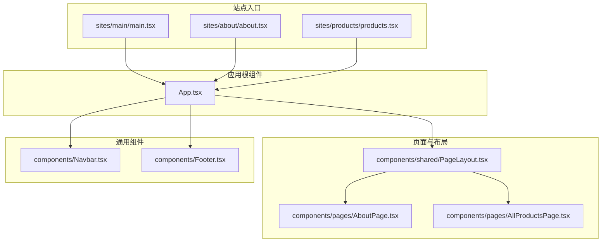
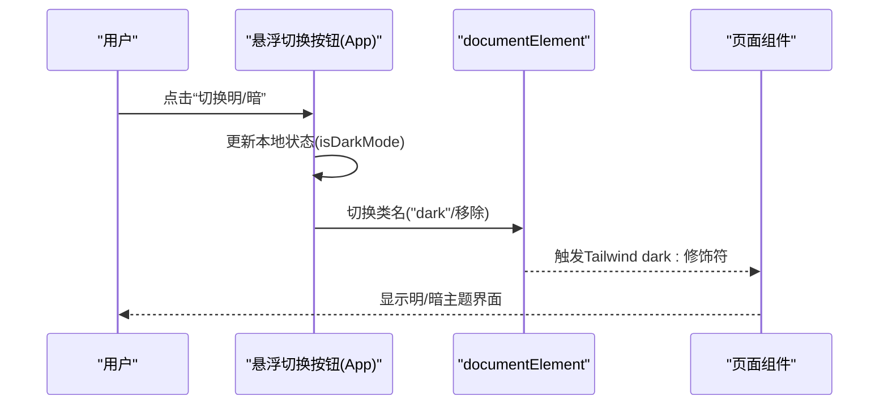
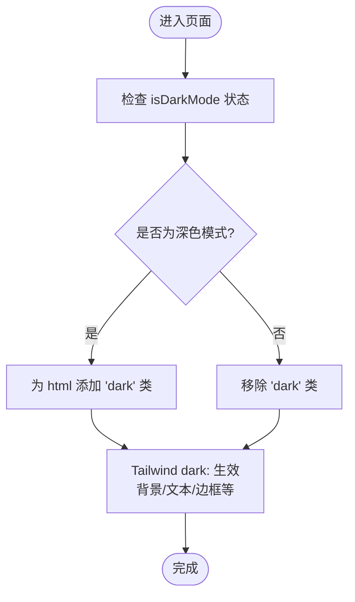
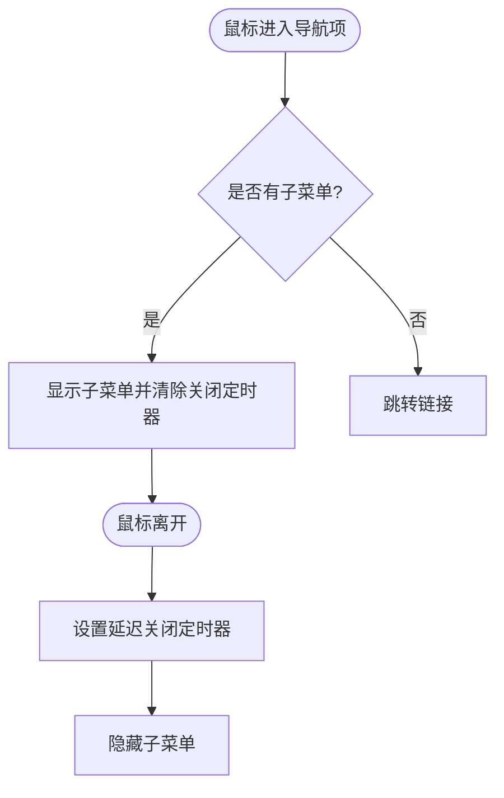
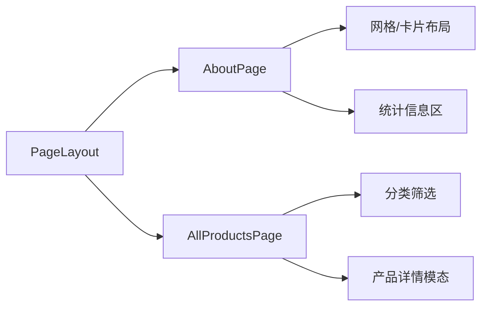
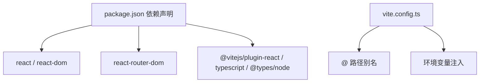

# 主题和样式系统

<cite>
**本文引用的文件**
- [package.json](file://package.json)
- [vite.config.ts](file://vite.config.ts)
- [App.tsx](file://App.tsx)
- [constants.tsx](file://constants.tsx)
- [types.ts](file://types.ts)
- [components/Navbar.tsx](file://components/Navbar.tsx)
- [components/Footer.tsx](file://components/Footer.tsx)
- [components/shared/PageLayout.tsx](file://components/shared/PageLayout.tsx)
- [components/pages/AboutPage.tsx](file://components/pages/AboutPage.tsx)
- [components/pages/AllProductsPage.tsx](file://components/pages/AllProductsPage.tsx)
- [sites/main/main.tsx](file://sites/main/main.tsx)
- [sites/about/about.tsx](file://sites/about/about.tsx)
- [sites/products/products.tsx](file://sites/products/products.tsx)
</cite>

## 目录
1. [简介](#简介)
2. [项目结构](#项目结构)
3. [核心组件](#核心组件)
4. [架构总览](#架构总览)
5. [详细组件分析](#详细组件分析)
6. [依赖关系分析](#依赖关系分析)
7. [性能考量](#性能考量)
8. [故障排查指南](#故障排查指南)
9. [结论](#结论)
10. [附录](#附录)

## 简介
本文件系统性梳理威宇精密工程网站的主题与样式体系，重点覆盖以下方面：
- 明暗主题切换机制与状态管理
- 响应式设计与移动端优先策略
- 样式架构与组件样式隔离
- Tailwind CSS 使用与自定义样式
- 颜色系统、字体排版与间距规范
- 动画过渡、阴影与交互反馈
- 性能优化与构建优化建议
- 主题定制与品牌色彩应用指南

## 项目结构
该仓库采用多站点（multi-site）架构，主站点入口位于 sites/main，其他如 about、products 等独立站点分别渲染对应页面。整体以 React + Vite 构建，样式主要通过 Tailwind CSS 类名组合实现，并辅以少量内联样式与全局动画。

图表来源
- [sites/main/main.tsx](file://sites/main/main.tsx#L1-L10)
- [sites/about/about.tsx](file://sites/about/about.tsx#L1-L24)
- [sites/products/products.tsx](file://sites/products/products.tsx#L1-L24)
- [App.tsx](file://App.tsx#L41-L112)
- [components/shared/PageLayout.tsx](file://components/shared/PageLayout.tsx#L16-L41)
- [components/pages/AboutPage.tsx](file://components/pages/AboutPage.tsx#L4-L144)
- [components/pages/AllProductsPage.tsx](file://components/pages/AllProductsPage.tsx#L84-L281)
- [components/Navbar.tsx](file://components/Navbar.tsx#L6-L260)
- [components/Footer.tsx](file://components/Footer.tsx#L4-L22)

章节来源
- [package.json](file://package.json#L1-L23)
- [vite.config.ts](file://vite.config.ts#L1-L24)
- [sites/main/main.tsx](file://sites/main/main.tsx#L1-L10)
- [sites/about/about.tsx](file://sites/about/about.tsx#L1-L24)
- [sites/products/products.tsx](file://sites/products/products.tsx#L1-L24)

## 核心组件
- 应用根组件 App：负责全局路由、滚动行为、明暗主题状态管理与全局动画注入。
- 导航栏 Navbar：响应式导航、子菜单交互、滚动样式变化与移动端抽屉菜单。
- 页面布局 PageLayout：统一标题、面包屑与内容区域的布局容器。
- 关于页面 AboutPage：展示公司介绍、统计信息、核心价值观与认证信息。
- 产品页面 AllProductsPage：产品筛选、网格展示、模态详情与图片画廊。
- 页脚 Footer：版权与联系方式展示。

章节来源
- [App.tsx](file://App.tsx#L41-L112)
- [components/Navbar.tsx](file://components/Navbar.tsx#L6-L260)
- [components/shared/PageLayout.tsx](file://components/shared/PageLayout.tsx#L16-L41)
- [components/pages/AboutPage.tsx](file://components/pages/AboutPage.tsx#L4-L144)
- [components/pages/AllProductsPage.tsx](file://components/pages/AllProductsPage.tsx#L84-L281)
- [components/Footer.tsx](file://components/Footer.tsx#L4-L22)

## 架构总览
明暗主题通过根节点类名切换实现，配合 Tailwind 的 dark 修饰符生效；页面布局与组件均基于统一的背景与文本色变量，确保主题一致性。导航栏在滚动时改变高度与阴影，移动端采用抽屉菜单；产品页面支持分类筛选与模态详情浏览。

图表来源
- [App.tsx](file://App.tsx#L42-L54)
- [App.tsx](file://App.tsx#L59-L105)

章节来源
- [App.tsx](file://App.tsx#L41-L112)

## 详细组件分析

### 明暗主题系统
- 状态管理：在根组件中维护 isDarkMode 状态，副作用根据状态为 document.documentElement 添加或移除 "dark" 类名。
- 样式应用：通过 Tailwind dark 修饰符对背景、文本、边框等进行主题化映射。
- 交互元素：悬浮切换按钮使用圆角、阴影与旋转动画增强反馈。
- 全局动画：内联样式定义平滑滚动与淡入动画类，贯穿页面。

图表来源
- [App.tsx](file://App.tsx#L42-L54)
- [App.tsx](file://App.tsx#L59-L105)

章节来源
- [App.tsx](file://App.tsx#L41-L112)

### 导航栏与响应式设计
- 桌面端：固定顶部、模糊背景、滚动时高度与阴影变化；悬停高亮与下拉子菜单。
- 移动端：汉堡菜单切换抽屉式导航，子菜单展开/收起逻辑与点击跳转结合。
- 断点策略：使用 Tailwind 的 lg、xl 等断点实现桌面优先布局，移动端降级。
- 交互细节：鼠标进入/离开控制子菜单显示，点击后短暂标记避免闪烁。

图表来源
- [components/Navbar.tsx](file://components/Navbar.tsx#L53-L72)
- [components/Navbar.tsx](file://components/Navbar.tsx#L116-L153)

章节来源
- [components/Navbar.tsx](file://components/Navbar.tsx#L6-L260)

### 页面布局与内容组织
- PageLayout：统一标题、副标题与面包屑，内容区域最大宽度约束与内边距。
- AboutPage：分节展示公司介绍、统计数据、核心价值与认证信息，使用网格与卡片布局。
- AllProductsPage：分类筛选、产品网格、悬停放大与边框高亮、模态详情与缩略图画廊。

图表来源
- [components/shared/PageLayout.tsx](file://components/shared/PageLayout.tsx#L16-L41)
- [components/pages/AboutPage.tsx](file://components/pages/AboutPage.tsx#L14-L139)
- [components/pages/AllProductsPage.tsx](file://components/pages/AllProductsPage.tsx#L84-L277)

章节来源
- [components/shared/PageLayout.tsx](file://components/shared/PageLayout.tsx#L16-L41)
- [components/pages/AboutPage.tsx](file://components/pages/AboutPage.tsx#L4-L144)
- [components/pages/AllProductsPage.tsx](file://components/pages/AllProductsPage.tsx#L84-L281)

### 组件样式隔离与命名约定
- 组件内部样式通过 Tailwind 类名实现，避免全局污染。
- 使用语义化颜色变量名（如 accent、primary、secondary、hover-blue、text-dark 等）提升可读性与一致性。
- 通过容器背景色与边框色区分不同层级，保证在明/暗主题下均有良好对比度。
- 交互反馈采用过渡时间与 transform 缩放，提升可用性。

章节来源
- [components/Navbar.tsx](file://components/Navbar.tsx#L39-L43)
- [components/Footer.tsx](file://components/Footer.tsx#L6-L17)
- [components/pages/AboutPage.tsx](file://components/pages/AboutPage.tsx#L45-L99)
- [components/pages/AllProductsPage.tsx](file://components/pages/AllProductsPage.tsx#L117-L147)

### 动画与过渡
- 全局动画：内联样式定义平滑滚动与淡入动画类，用于页面元素进入时的视觉引导。
- 组件动画：产品卡片悬停放大、边框高亮、按钮缩放与旋转等，增强交互反馈。
- 子菜单动画：使用淡入动画类实现流畅出现。

章节来源
- [App.tsx](file://App.tsx#L88-L105)
- [components/Navbar.tsx](file://components/Navbar.tsx#L132)
- [components/pages/AllProductsPage.tsx](file://components/pages/AllProductsPage.tsx#L122-L145)

### 颜色系统、字体排版与间距
- 颜色系统：强调色（accent）、主色（primary）、次色（secondary）、悬停色（hover-blue）、文本色（text-dark/text-gray）、背景色（base/white/slate-950）等。
- 字体排版：标题使用粗体与斜体字族，副标题与正文使用清晰易读的字号与行高；英文标题使用 tracking 宽度控制。
- 间距规范：容器最大宽度、内边距与网格间距遵循统一的栅格与留白原则，确保在不同屏幕下的平衡感。

章节来源
- [components/pages/AboutPage.tsx](file://components/pages/AboutPage.tsx#L18-L42)
- [components/pages/AllProductsPage.tsx](file://components/pages/AllProductsPage.tsx#L92-L114)
- [components/shared/PageLayout.tsx](file://components/shared/PageLayout.tsx#L21-L36)

### 响应式断点与移动端优先
- 断点使用：lg、xl 等 Tailwind 断点实现桌面优先布局；移动端采用较小字号与更紧凑的间距。
- 移动端交互：汉堡菜单、抽屉式导航、子菜单折叠与点击跳转，减少滚动与层级复杂度。
- 图片处理：产品图片使用 aspect-[3/2] 保持比例，错误时回退占位图，提升稳定性。

章节来源
- [components/Navbar.tsx](file://components/Navbar.tsx#L168-L254)
- [components/pages/AllProductsPage.tsx](file://components/pages/AllProductsPage.tsx#L124-L135)

### 主题定制与品牌色彩应用
- 品牌强调色：通过 accent 与 hover-blue 实现品牌高亮与交互反馈。
- 背景色系：base/white 在浅色主题下作为容器背景，dark: slate-950 在深色主题下提供对比度。
- 组件一致性：导航栏、页脚、卡片与按钮均围绕同一色系进行配色，确保品牌识别度。

章节来源
- [components/Navbar.tsx](file://components/Navbar.tsx#L39-L43)
- [components/Footer.tsx](file://components/Footer.tsx#L6-L17)
- [App.tsx](file://App.tsx#L59-L105)

## 依赖关系分析
- 构建工具：Vite 提供开发服务器与打包能力，React 插件加速开发体验。
- 运行时依赖：React、React DOM、React Router DOM。
- 开发依赖：TypeScript、@vitejs/plugin-react、@types/node。

图表来源
- [package.json](file://package.json#L11-L21)
- [vite.config.ts](file://vite.config.ts#L5-L23)

章节来源
- [package.json](file://package.json#L1-L23)
- [vite.config.ts](file://vite.config.ts#L1-L24)

## 性能考量
- 样式体积：当前未发现独立 CSS 文件，样式集中在类名与内联样式中，有利于 Tree Shaking。
- 图片加载：产品图片在加载失败时回退至占位图，减少资源异常导致的布局抖动。
- 动画与过渡：使用 transform 与 opacity 实现高性能动画，避免触发重排。
- 构建优化：Vite 默认启用按需编译与热更新，建议在生产构建中开启压缩与资源内联。

## 故障排查指南
- 主题不生效
  - 检查根节点是否正确添加/移除 "dark" 类。
  - 确认 Tailwind dark 修饰符在构建产物中存在。
- 子菜单闪烁或无法关闭
  - 检查定时器清理逻辑，确保离开事件触发时正确设置延迟关闭。
- 移动端菜单无法打开
  - 检查 isMenuOpen 状态切换与点击事件绑定。
- 图片加载失败
  - 确认 onError 回退逻辑与占位图 URL 生成规则。

章节来源
- [App.tsx](file://App.tsx#L42-L54)
- [components/Navbar.tsx](file://components/Navbar.tsx#L13-L22)
- [components/Navbar.tsx](file://components/Navbar.tsx#L168-L254)
- [components/pages/AllProductsPage.tsx](file://components/pages/AllProductsPage.tsx#L131-L134)

## 结论
该主题与样式系统以 React + Tailwind 为基础，通过根组件的状态管理与 dark 修饰符实现明暗主题无缝切换；导航栏与页面布局体现桌面优先与移动端优先的混合策略；组件间通过统一的颜色与间距规范形成一致的品牌视觉。建议后续引入独立 CSS 文件与 CSS Modules 以进一步提升样式模块化与可维护性，并在生产构建中优化资源体积与加载性能。

## 附录
- 数据与类型
  - 常量数据：新闻、服务、产品列表等。
  - 类型定义：新闻、产品、服务的数据结构。

章节来源
- [constants.tsx](file://constants.tsx#L4-L167)
- [types.ts](file://types.ts#L2-L30)