# 产品图片画廊

<cite>
**本文档引用的文件**
- [App.tsx](file://App.tsx)
- [Products.tsx](file://components/Products.tsx)
- [AllProductsPage.tsx](file://components/pages/AllProductsPage.tsx)
- [products.tsx](file://sites/products/products.tsx)
- [constants.tsx](file://constants.tsx)
- [types.ts](file://types.ts)
- [index.html](file://index.html)
- [vite.config.ts](file://vite.config.ts)
- [package.json](file://package.json)
- [Navbar.tsx](file://components/Navbar.tsx)
</cite>

## 目录
1. [简介](#简介)
2. [项目结构](#项目结构)
3. [核心组件](#核心组件)
4. [架构概览](#架构概览)
5. [详细组件分析](#详细组件分析)
6. [依赖关系分析](#依赖关系分析)
7. [性能考虑](#性能考虑)
8. [故障排除指南](#故障排除指南)
9. [结论](#结论)

## 简介

威宇精密工程网站的产品图片画廊是一个基于React和TypeScript构建的现代化图片展示系统。该系统提供了完整的图片浏览体验，包括主图片显示区域、缩略图导航系统、图片轮播功能以及响应式设计支持。

本项目采用Tailwind CSS作为样式框架，结合Material Icons字体图标，实现了工业风格的设计语言。画廊功能支持多种图片格式，具备智能占位符处理和错误恢复机制，确保用户在各种网络条件下的浏览体验。

## 项目结构

项目采用模块化架构设计，主要分为以下几个层次：

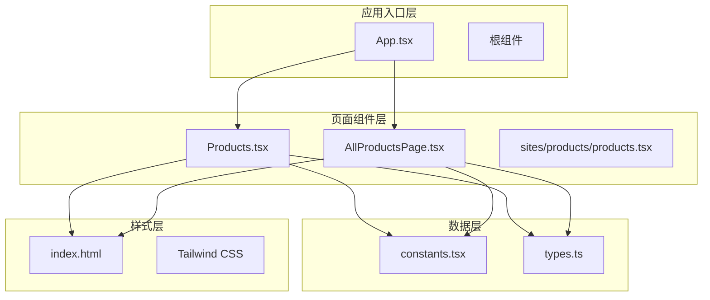

**图表来源**
- [App.tsx](file://App.tsx#L41-L109)
- [Products.tsx](file://components/Products.tsx#L1-L310)
- [AllProductsPage.tsx](file://components/pages/AllProductsPage.tsx#L1-L281)

**章节来源**
- [App.tsx](file://App.tsx#L1-L112)
- [products.tsx](file://sites/products/products.tsx#L1-L24)
- [index.html](file://index.html#L1-L101)

## 核心组件

### 产品画廊组件架构

产品画廊系统由三个主要组件构成，每个组件负责不同的功能层面：

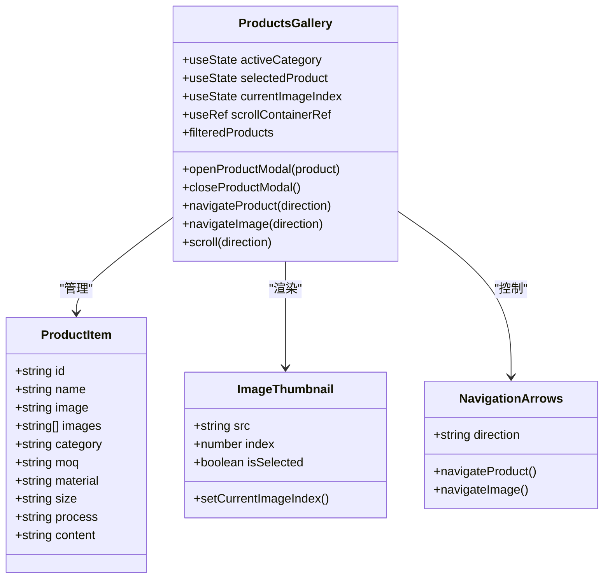

**图表来源**
- [Products.tsx](file://components/Products.tsx#L8-L89)
- [types.ts](file://types.ts#L10-L21)

### 数据模型设计

系统使用类型安全的数据模型来管理产品信息：

| 字段名 | 类型 | 描述 | 必填 |
|--------|------|------|------|
| id | string | 产品唯一标识符 | 是 |
| name | string | 产品名称 | 是 |
| image | string | 主要产品图片URL | 是 |
| images | string[] | 产品图片数组 | 否 |
| category | 'nameplate' \| 'cnc' | 产品类别 | 是 |
| moq | string | 最小订购量 | 否 |
| material | string | 材料信息 | 否 |
| size | string | 尺寸规格 | 否 |
| process | string | 制程工艺 | 否 |
| content | string | 产品描述 | 否 |

**章节来源**
- [types.ts](file://types.ts#L10-L21)
- [constants.tsx](file://constants.tsx#L50-L166)

## 架构概览

### 整体架构流程

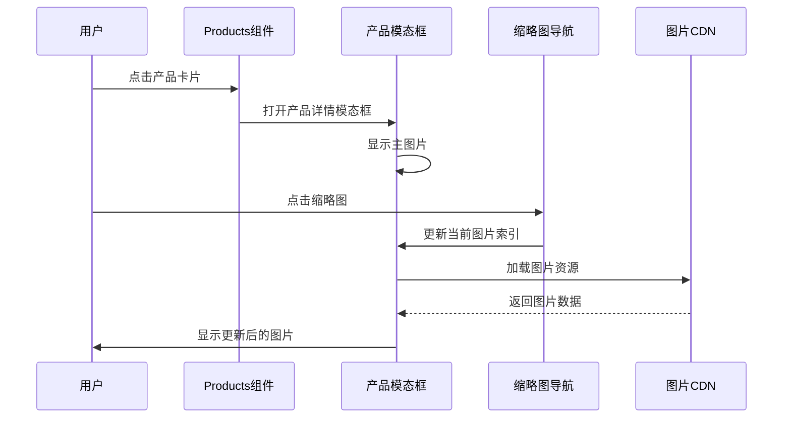

**图表来源**
- [Products.tsx](file://components/Products.tsx#L188-L304)
- [AllProductsPage.tsx](file://components/pages/AllProductsPage.tsx#L159-L275)

### 组件交互关系

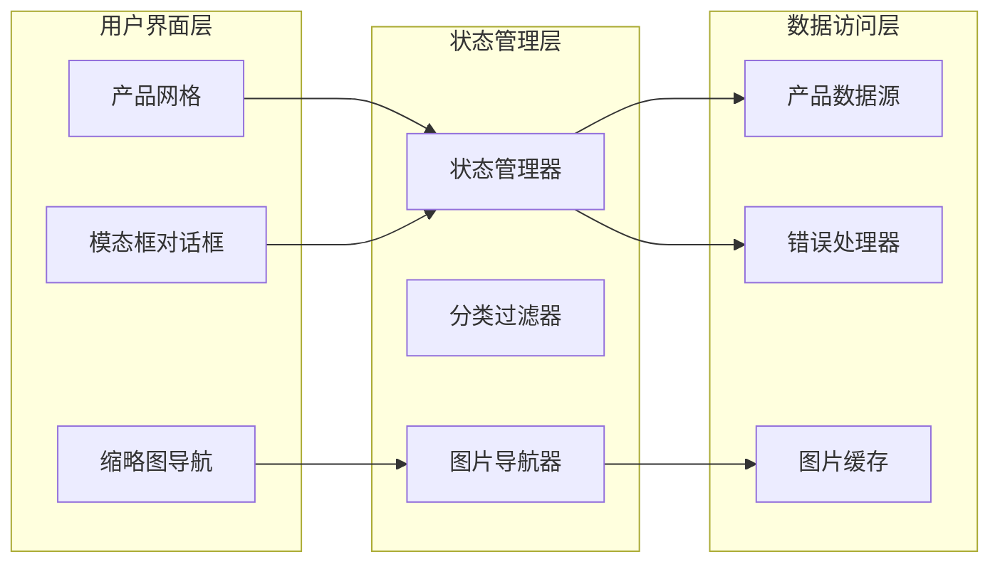

**图表来源**
- [Products.tsx](file://components/Products.tsx#L1-L310)
- [AllProductsPage.tsx](file://components/pages/AllProductsPage.tsx#L1-L281)

## 详细组件分析

### 主图片显示区域实现

主图片显示区域是画廊的核心组件，负责展示当前选中的产品图片。

#### 响应式图片加载机制

系统实现了智能的响应式图片加载策略：

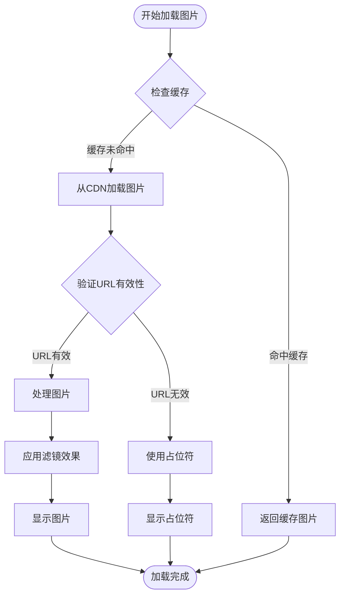

**图表来源**
- [Products.tsx](file://components/Products.tsx#L226-L234)
- [AllProductsPage.tsx](file://components/pages/AllProductsPage.tsx#L197-L205)

#### 占位符处理和错误恢复

系统提供了多层次的错误处理机制：

1. **实时错误检测**: 使用`onError`事件监听图片加载失败
2. **智能占位符生成**: 自动根据产品名称生成占位符图片
3. **渐进式增强**: 支持图片格式降级和质量调整

**章节来源**
- [Products.tsx](file://components/Products.tsx#L149-L151)
- [AllProductsPage.tsx](file://components/pages/AllProductsPage.tsx#L131-L133)

### 缩略图导航系统

缩略图导航系统提供了直观的图片浏览体验，支持动态缩略图生成和智能滚动定位。

#### 动态缩略图生成

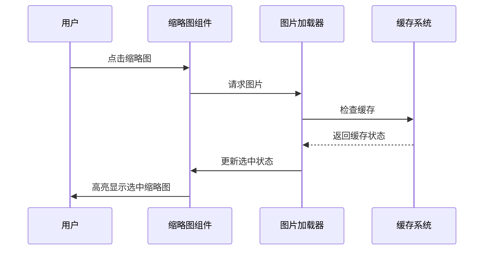

**图表来源**
- [Products.tsx](file://components/Products.tsx#L237-L256)
- [AllProductsPage.tsx](file://components/pages/AllProductsPage.tsx#L208-L227)

#### 选中状态管理

缩略图系统实现了精确的状态同步机制：

| 状态属性 | 描述 | 触发条件 |
|----------|------|----------|
| `isSelected` | 当前选中状态 | 用户点击缩略图 |
| `borderColor` | 边框颜色变化 | 选中状态切换 |
| `shadowEffect` | 阴影效果 | 选中状态激活 |
| `borderWidth` | 边框宽度 | 选中状态高亮 |

#### 滚动定位算法

系统实现了智能的滚动定位功能：

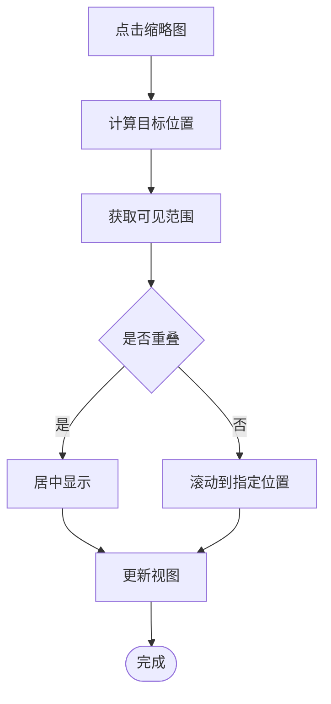

**图表来源**
- [Products.tsx](file://components/Products.tsx#L238-L255)

**章节来源**
- [Products.tsx](file://components/Products.tsx#L236-L256)
- [AllProductsPage.tsx](file://components/pages/AllProductsPage.tsx#L208-L227)

### 图片轮播功能

图片轮播系统提供了流畅的图片切换体验，支持前后切换和循环播放。

#### 平滑过渡效果

系统实现了多种过渡动画效果：

1. **淡入淡出效果**: 使用CSS过渡实现平滑的图片切换
2. **滑动动画**: 支持左右滑动的导航方式
3. **弹性效果**: 在边界条件下的弹性反馈

#### 性能优化策略

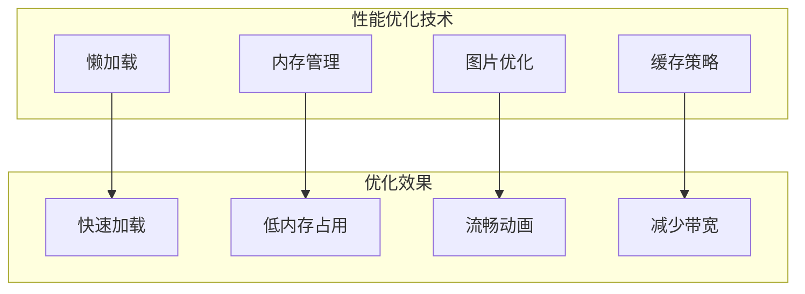

**图表来源**
- [Products.tsx](file://components/Products.tsx#L81-L89)
- [AllProductsPage.tsx](file://components/pages/AllProductsPage.tsx#L74-L82)

**章节来源**
- [Products.tsx](file://components/Products.tsx#L81-L89)
- [AllProductsPage.tsx](file://components/pages/AllProductsPage.tsx#L74-L82)

### 图片懒加载实现

系统采用了多层懒加载策略来优化性能：

#### 预加载策略

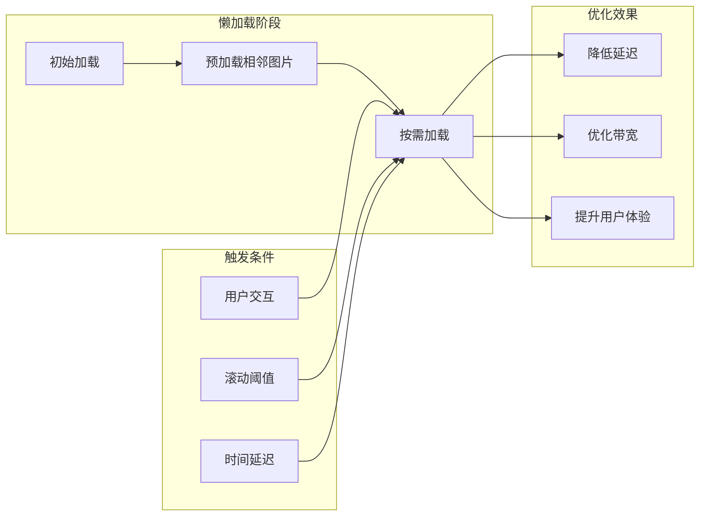

**图表来源**
- [Products.tsx](file://components/Products.tsx#L226-L234)

### CDN集成和缓存策略

#### CDN集成架构

系统通过以下方式集成CDN服务：

1. **自动格式优化**: 使用`auto=format&fit=crop&q=80&w=400`等参数
2. **智能压缩**: 根据设备像素密度选择合适的图片尺寸
3. **边缘缓存**: 利用CDN的全球节点进行内容分发

#### 缓存策略

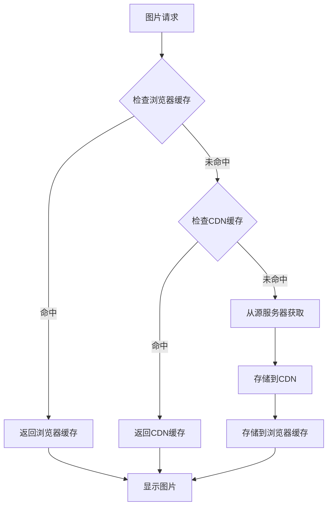

**图表来源**
- [constants.tsx](file://constants.tsx#L9-L9)

**章节来源**
- [constants.tsx](file://constants.tsx#L9-L9)
- [vite.config.ts](file://vite.config.ts#L1-L24)

## 依赖关系分析

### 外部依赖管理

项目使用现代前端工具链构建，主要依赖包括：

```mermaid
graph TB
subgraph "运行时依赖"
React[react ^19.2.3]
ReactDOM[react-dom ^19.2.3]
ReactRouter[react-router-dom ^7.1.3]
end
subgraph "开发依赖"
Vite[vite ^6.2.0]
TypeScript[typescript ~5.8.2]
ReactPlugin[@vitejs/plugin-react ^5.0.0]
end
subgraph "样式依赖"
TailwindCSS[tailwindcss]
MaterialIcons[Material Icons]
InterFont[Inter Font]
end
React --> ReactRouter
ReactDOM --> React
Vite --> ReactPlugin
TailwindCSS --> MaterialIcons
MaterialIcons --> InterFont
```

**图表来源**
- [package.json](file://package.json#L11-L21)

### 内部模块依赖

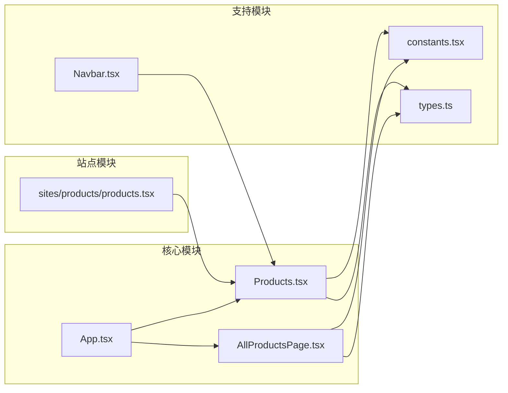

**图表来源**
- [App.tsx](file://App.tsx#L1-L16)
- [products.tsx](file://sites/products/products.tsx#L1-L6)

**章节来源**
- [package.json](file://package.json#L1-L23)
- [index.html](file://index.html#L8-L11)

## 性能考虑

### 图片格式支持和优化

系统支持多种图片格式，并实现了相应的优化策略：

| 图片格式 | 适用场景 | 优化参数 | 质量设置 |
|----------|----------|----------|----------|
| JPEG | 产品照片 | `auto=format&fit=crop&q=80&w=400` | 高质量 |
| WebP | 现代浏览器 | `auto=format&fit=crop&q=80&w=400` | 最佳质量 |
| PNG | 图标和简单图形 | `auto=format&fit=crop&q=80&w=400` | 透明背景 |

### 尺寸适配策略

系统实现了自适应的图片尺寸适配：

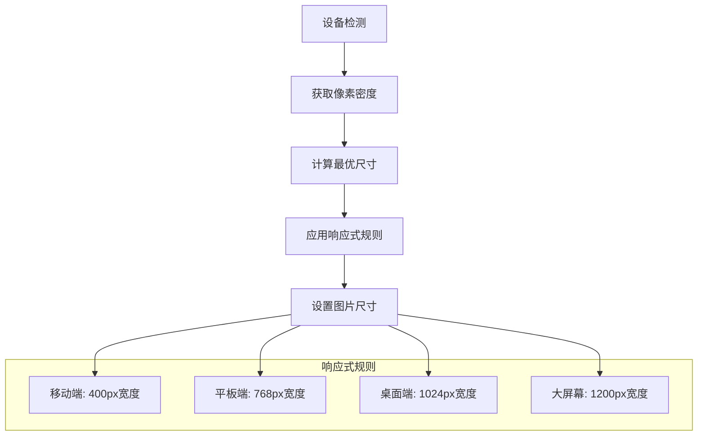

**图表来源**
- [constants.tsx](file://constants.tsx#L9-L9)

### 内存管理最佳实践

系统采用了多项内存管理策略：

1. **组件卸载清理**: 自动清理事件监听器和定时器
2. **图片资源释放**: 及时释放不再使用的图片资源
3. **状态管理优化**: 使用React hooks进行高效的状态更新
4. **虚拟滚动**: 对于大量图片的情况，考虑实现虚拟滚动

## 故障排除指南

### 常见问题诊断

#### 图片加载失败

**症状**: 缩略图或主图片显示为占位符

**可能原因**:
1. CDN服务不可用
2. 图片URL格式不正确
3. 网络连接问题
4. 图片格式不受支持

**解决方案**:
1. 检查CDN服务状态
2. 验证图片URL格式
3. 确认网络连接稳定
4. 尝试其他图片格式

#### 性能问题

**症状**: 页面加载缓慢或图片切换卡顿

**可能原因**:
1. 图片文件过大
2. 同时加载过多图片
3. 缓存配置不当
4. JavaScript执行阻塞

**解决方案**:
1. 优化图片文件大小
2. 实现懒加载和预加载
3. 调整缓存策略
4. 使用Web Workers处理复杂操作

#### 响应式布局问题

**症状**: 图片在不同设备上显示异常

**可能原因**:
1. CSS媒体查询配置错误
2. 图片比例不匹配
3. 设备像素密度处理不当
4. 视口配置问题

**解决方案**:
1. 检查媒体查询语法
2. 确保图片比例一致
3. 实现设备像素密度适配
4. 验证视口配置

**章节来源**
- [Products.tsx](file://components/Products.tsx#L149-L151)
- [AllProductsPage.tsx](file://components/pages/AllProductsPage.tsx#L131-L133)

## 结论

威宇精密工程网站的产品图片画廊系统展现了现代前端开发的最佳实践。通过精心设计的架构和优化的性能策略，系统为用户提供了流畅、直观的图片浏览体验。

### 主要优势

1. **响应式设计**: 完美适配各种设备和屏幕尺寸
2. **性能优化**: 采用多层缓存和懒加载策略
3. **错误处理**: 全面的错误恢复和用户体验保障
4. **可扩展性**: 模块化的架构设计便于功能扩展
5. **维护性**: 类型安全的代码和清晰的组件分离

### 技术亮点

- **智能CDN集成**: 自动格式优化和智能压缩
- **多层缓存策略**: 浏览器缓存、CDN缓存和应用缓存
- **优雅降级**: 支持多种图片格式和浏览器兼容性
- **性能监控**: 实时的性能指标和优化建议

该系统不仅满足了当前的功能需求，还为未来的功能扩展和技术升级奠定了坚实的基础。通过持续的优化和改进，相信能够为用户带来更加出色的图片浏览体验。