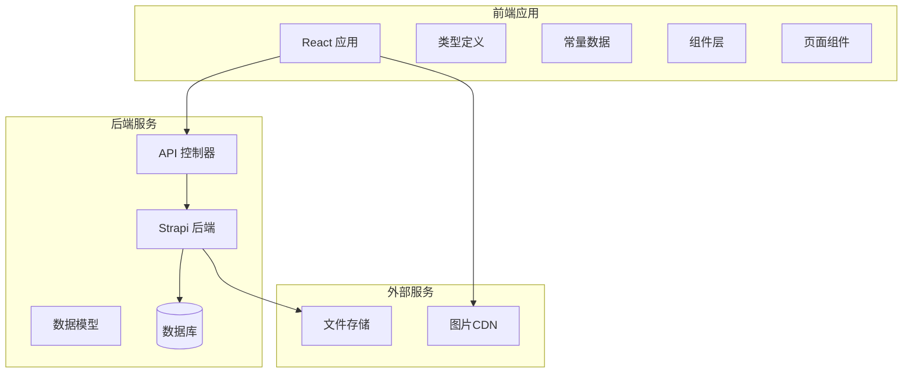
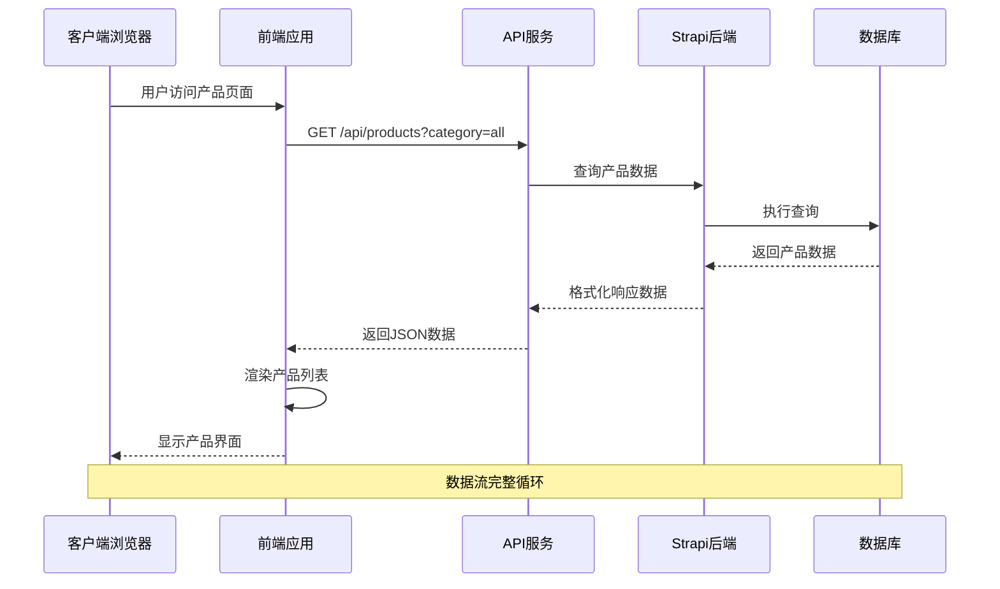
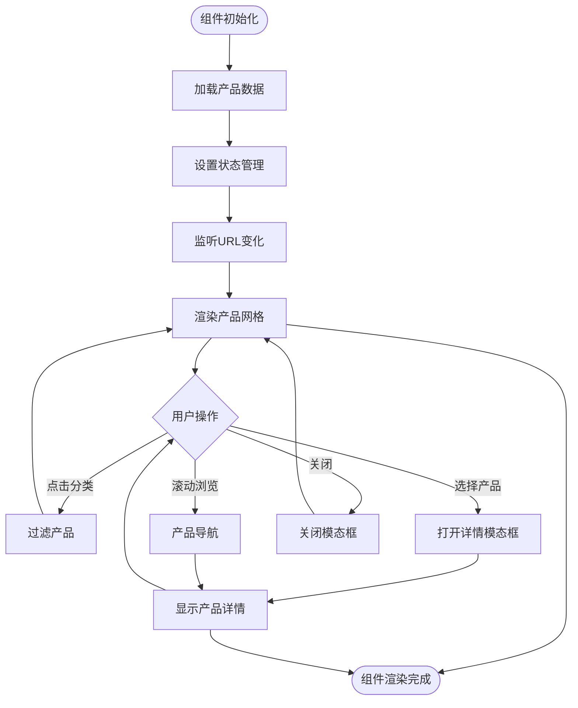
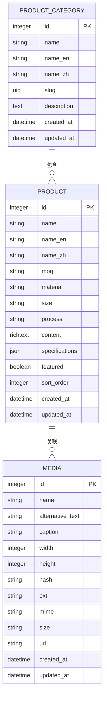
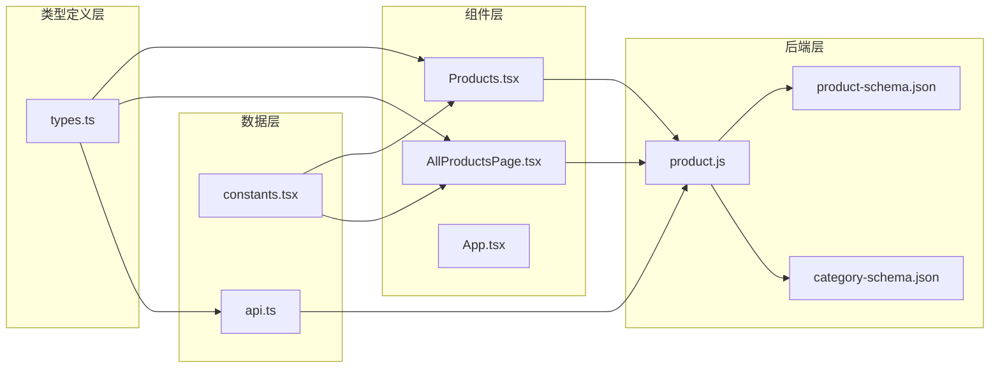
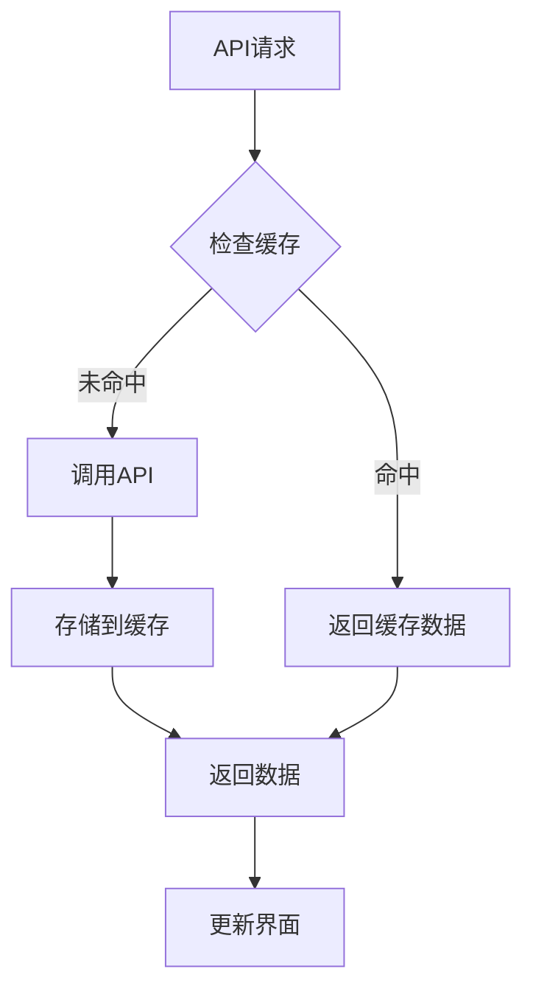

# 产品数据模型

<cite>
**本文档引用的文件**
- [types.ts](file://types.ts)
- [constants.tsx](file://constants.tsx)
- [Products.tsx](file://components/Products.tsx)
- [AllProductsPage.tsx](file://components/pages/AllProductsPage.tsx)
- [App.tsx](file://App.tsx)
- [api.ts](file://src/services/api.ts)
- [product.js](file://backend-strapi/src/api/product/controllers/product.js)
- [product-schema.json](file://backend-strapi/src/api/product/content-types/product/schema.json)
- [category-schema.json](file://backend-strapi/src/api/product-category/content-types/product-category/schema.json)
</cite>

## 目录
1. [简介](#简介)
2. [项目结构](#项目结构)
3. [核心组件](#核心组件)
4. [架构概览](#架构概览)
5. [详细组件分析](#详细组件分析)
6. [依赖关系分析](#依赖关系分析)
7. [性能考虑](#性能考虑)
8. [故障排除指南](#故障排除指南)
9. [结论](#结论)

## 简介

本文档详细阐述了威宇精密工程网站的产品数据模型，重点解析ProductItem接口定义、产品分类系统设计、数据存储结构以及完整的增删改查操作流程。该系统采用前后端分离架构，前端使用React TypeScript构建用户界面，后端基于Strapi内容管理系统提供RESTful API服务。

## 项目结构

项目采用模块化组织方式，主要分为以下层次：



**图表来源**
- [App.tsx](file://App.tsx#L56-L70)
- [api.ts](file://src/services/api.ts#L4-L51)

**章节来源**
- [App.tsx](file://App.tsx#L1-L112)
- [package.json](file://package.json#L1-L23)

## 核心组件

### ProductItem 接口定义

ProductItem是产品数据的核心接口，定义了产品的完整信息结构：

| 字段名 | 类型 | 必填 | 描述 | 默认值 |
|--------|------|------|------|--------|
| id | string | 是 | 产品唯一标识符 | - |
| name | string | 是 | 产品名称 | - |
| image | string | 是 | 主要产品图片URL | - |
| images | string[] | 否 | 产品图片画廊数组 | [] |
| category | 'nameplate' \| 'cnc' | 是 | 产品分类 | - |
| moq | string | 否 | 最小起订量 | - |
| material | string | 否 | 材料规格 | - |
| size | string | 否 | 尺寸规格 | - |
| process | string | 否 | 制程工艺 | - |
| content | string | 否 | 产品详情描述 | - |

**章节来源**
- [types.ts](file://types.ts#L10-L21)

### 产品分类系统

系统支持三种产品分类：all（全部）、nameplate（铭牌）、cnc（数控加工）

```mermaid
classDiagram
class ProductItem {
+string id
+string name
+string image
+string[] images
+CategoryType category
+string moq
+string material
+string size
+string process
+string content
}
class CategoryType {
<<enumeration>>
"all"
"nameplate"
"cnc"
}
class ProductCategory {
+number id
+string name
+string slug
+string description
+ProductItem[] products
}
ProductItem --> CategoryType : "使用"
ProductCategory --> ProductItem : "包含"
```

**图表来源**
- [types.ts](file://types.ts#L6-L21)
- [category-schema.json](file://backend-strapi/src/api/product-category/content-types/product-category/schema.json#L14-L38)

**章节来源**
- [constants.tsx](file://constants.tsx#L50-L166)
- [Products.tsx](file://components/Products.tsx#L34-L38)

## 架构概览

系统采用前后端分离架构，通过RESTful API进行数据交互：



**图表来源**
- [api.ts](file://src/services/api.ts#L38-L51)
- [product.js](file://backend-strapi/src/api/product/controllers/product.js#L4-L27)

**章节来源**
- [api.ts](file://src/services/api.ts#L1-L55)
- [product.js](file://backend-strapi/src/api/product/controllers/product.js#L1-L41)

## 详细组件分析

### 前端产品组件

#### Products 组件分析

Products组件负责主页的产品展示功能，实现了完整的分类筛选和产品详情查看功能：



**图表来源**
- [Products.tsx](file://components/Products.tsx#L8-L32)
- [Products.tsx](file://components/Products.tsx#L136-L166)

#### AllProductsPage 组件分析

AllProductsPage组件提供完整的产品浏览页面，支持URL参数驱动的分类筛选：

**章节来源**
- [Products.tsx](file://components/Products.tsx#L1-L310)
- [AllProductsPage.tsx](file://components/pages/AllProductsPage.tsx#L1-L281)

### 后端数据模型

#### 产品数据模型

后端使用Strapi的自定义内容类型定义产品模型：



**图表来源**
- [product-schema.json](file://backend-strapi/src/api/product/content-types/product/schema.json#L18-L127)
- [category-schema.json](file://backend-strapi/src/api/product-category/content-types/product-category/schema.json#L14-L38)

**章节来源**
- [product-schema.json](file://backend-strapi/src/api/product/content-types/product/schema.json#L1-L129)
- [category-schema.json](file://backend-strapi/src/api/product-category/content-types/product-category/schema.json#L1-L41)

### API 服务层

#### 产品API接口

API服务提供了完整的CRUD操作接口：

| 操作 | 方法 | 端点 | 参数 | 功能 |
|------|------|------|------|------|
| 获取所有产品 | GET | /api/products | category | 分类筛选 |
| 获取单个产品 | GET | /api/products/:id | id | 详情查询 |
| 创建产品 | POST | /api/products | ProductItem | 新增产品 |
| 更新产品 | PUT | /api/products/:id | ProductItem | 修改产品 |
| 删除产品 | DELETE | /api/products/:id | id | 删除产品 |

**章节来源**
- [api.ts](file://src/services/api.ts#L38-L51)
- [product.js](file://backend-strapi/src/api/product/controllers/product.js#L3-L41)

## 依赖关系分析

系统各组件之间的依赖关系如下：



**图表来源**
- [types.ts](file://types.ts#L2-L29)
- [constants.tsx](file://constants.tsx#L2-L2)
- [Products.tsx](file://components/Products.tsx#L2-L4)
- [AllProductsPage.tsx](file://components/pages/AllProductsPage.tsx#L2-L5)

**章节来源**
- [types.ts](file://types.ts#L1-L30)
- [constants.tsx](file://constants.tsx#L1-L167)

## 性能考虑

### 图片优化策略

系统采用了多层图片优化机制：

1. **懒加载**: 使用`loading="lazy"`属性实现图片懒加载
2. **占位符**: 图片加载失败时自动显示占位符
3. **CDN集成**: 支持外部CDN图片资源
4. **响应式**: 根据设备分辨率选择合适的图片尺寸

### 数据缓存机制



**图表来源**
- [Products.tsx](file://components/Products.tsx#L149-L151)
- [AllProductsPage.tsx](file://components/pages/AllProductsPage.tsx#L131-L133)

## 故障排除指南

### 常见问题及解决方案

#### 1. 产品图片加载失败

**问题症状**: 产品图片显示为占位符或加载错误

**解决方法**:
- 检查图片URL是否有效
- 确认CDN服务正常运行
- 验证图片权限设置

#### 2. 分类筛选不生效

**问题症状**: 点击分类标签无响应

**解决方法**:
- 检查URL参数格式
- 验证分类枚举值
- 确认状态管理逻辑

#### 3. API请求失败

**问题症状**: 控制台出现网络错误

**解决方法**:
- 检查API基础URL配置
- 验证后端服务状态
- 查看CORS配置

**章节来源**
- [Products.tsx](file://components/Products.tsx#L149-L151)
- [AllProductsPage.tsx](file://components/pages/AllProductsPage.tsx#L131-L133)
- [api.ts](file://src/services/api.ts#L30-L35)

## 结论

威宇精密工程网站的产品数据模型设计合理，具有以下特点：

1. **类型安全**: 使用TypeScript确保编译时类型检查
2. **数据完整性**: 前后端双重验证机制
3. **扩展性**: 模块化设计便于功能扩展
4. **用户体验**: 响应式设计和流畅的交互体验

该系统为工业制造企业的数字化转型提供了良好的技术基础，建议后续可考虑添加产品搜索、收藏功能和个性化推荐等高级特性。