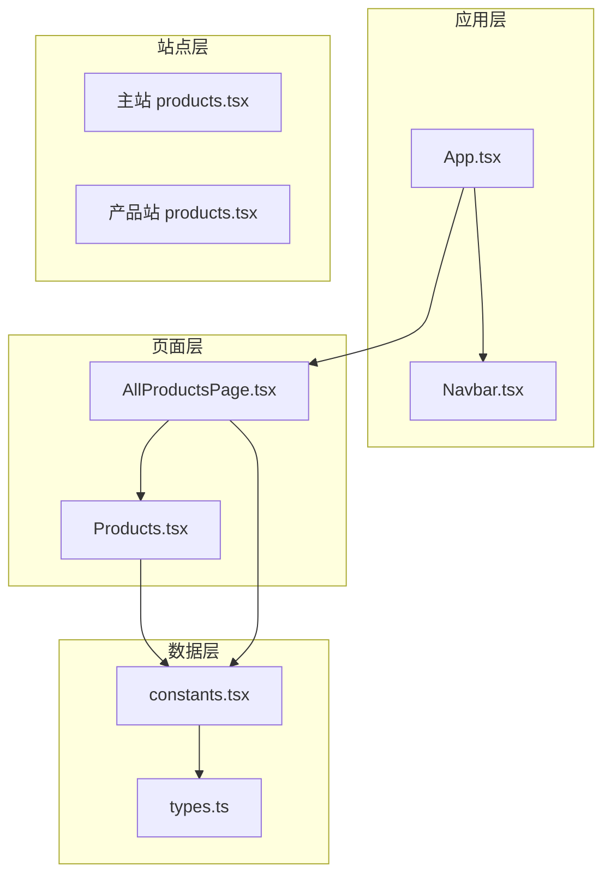
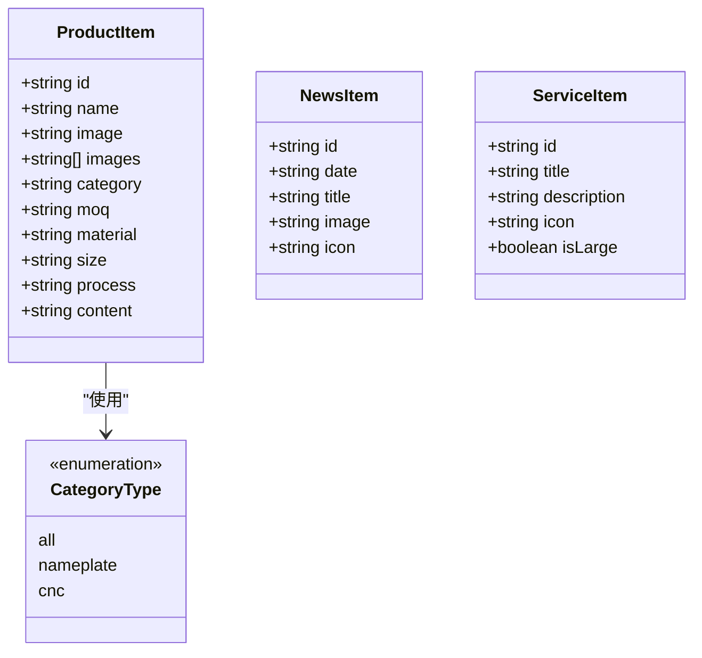
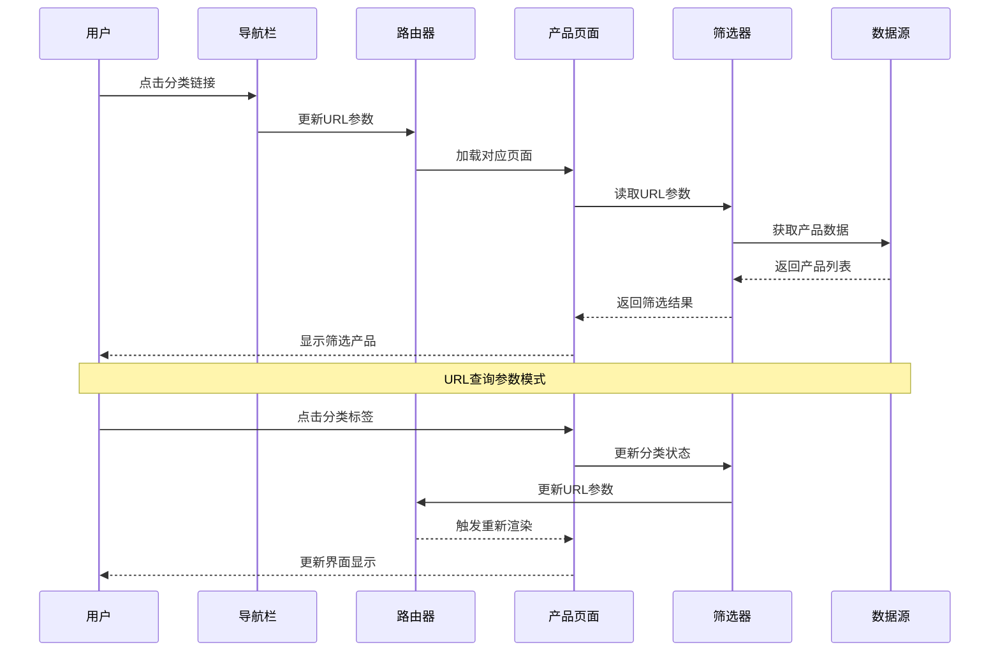
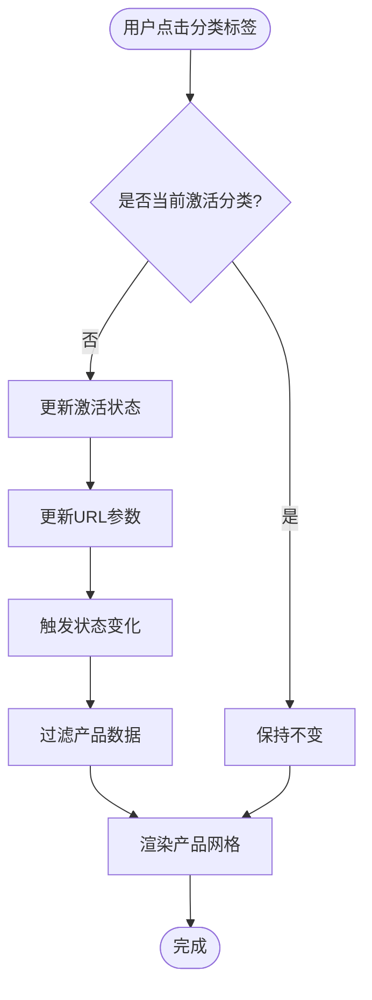
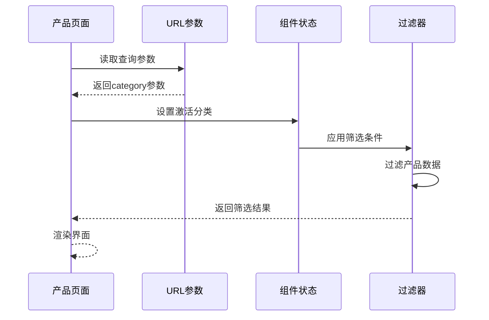
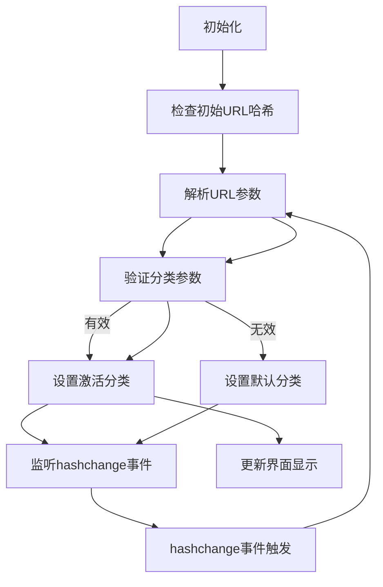
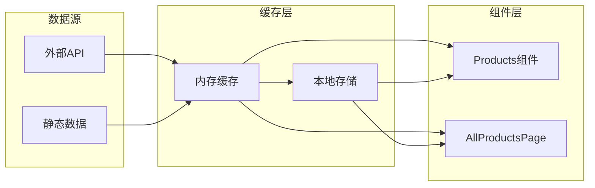
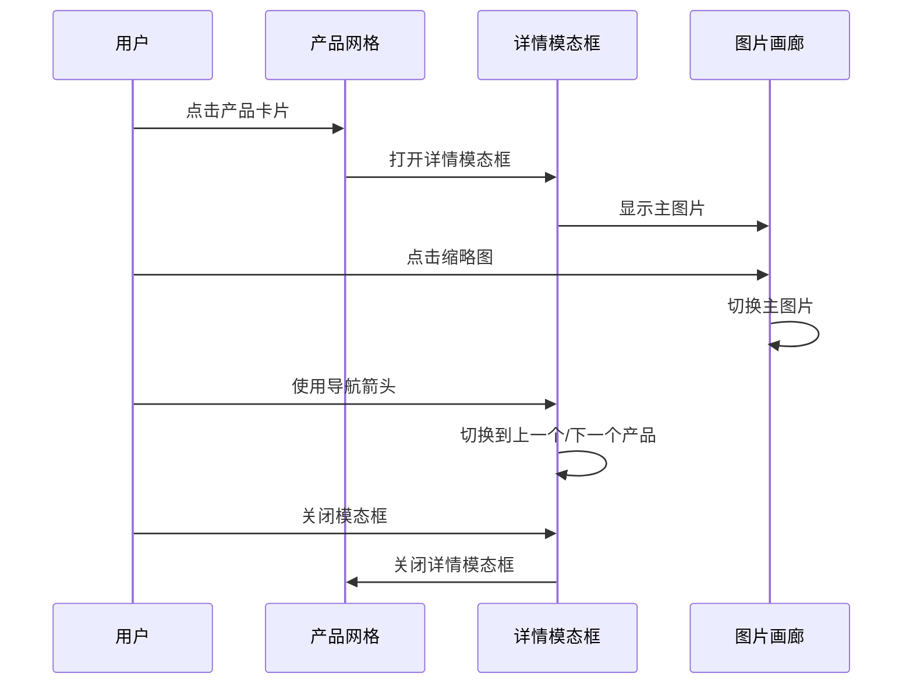
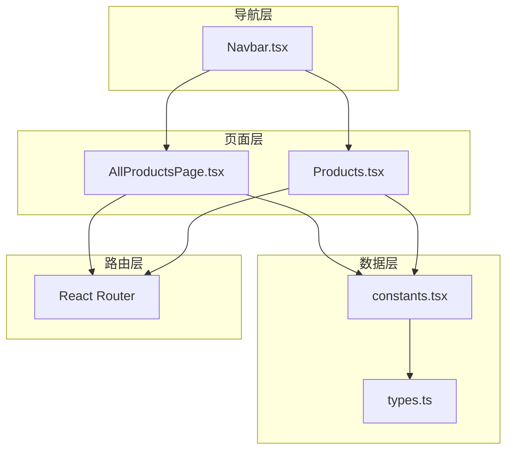
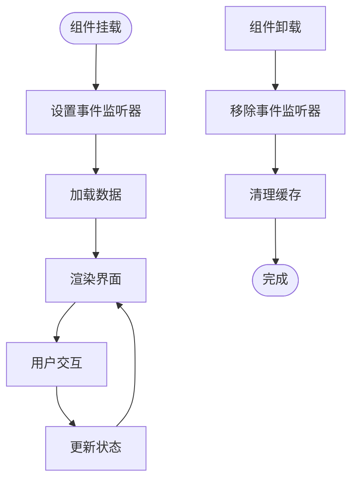

# 产品筛选功能

<cite>
**本文档引用的文件**
- [App.tsx](file://App.tsx)
- [AllProductsPage.tsx](file://components/pages/AllProductsPage.tsx)
- [Products.tsx](file://components/Products.tsx)
- [Navbar.tsx](file://components/Navbar.tsx)
- [constants.tsx](file://constants.tsx)
- [types.ts](file://types.ts)
- [products.tsx](file://sites/products/products.tsx)
- [index.html](file://index.html)
- [products/index.html](file://sites/products/index.html)
</cite>

## 目录
1. [简介](#简介)
2. [项目结构](#项目结构)
3. [核心组件](#核心组件)
4. [架构概览](#架构概览)
5. [详细组件分析](#详细组件分析)
6. [依赖关系分析](#依赖关系分析)
7. [性能考虑](#性能考虑)
8. [故障排除指南](#故障排除指南)
9. [结论](#结论)

## 简介

威宇精密工程网站的产品筛选功能是一个完整的前端筛选系统，支持三种产品分类：'all'（全部）、'nameplate'（铭板）和'cnc'（车床及阳极铝材）。该功能实现了多种筛选机制，包括URL查询参数筛选、URL哈希参数监听、分类标签的动态样式切换以及用户交互反馈。

## 项目结构

项目采用模块化架构，主要分为以下层次：



**图表来源**
- [App.tsx](file://App.tsx#L41-L109)
- [AllProductsPage.tsx](file://components/pages/AllProductsPage.tsx#L1-L281)
- [Products.tsx](file://components/Products.tsx#L1-L310)

**章节来源**
- [App.tsx](file://App.tsx#L1-L112)
- [index.html](file://index.html#L1-L101)

## 核心组件

### 产品数据模型

系统使用统一的数据模型来表示产品信息：



**图表来源**
- [types.ts](file://types.ts#L10-L21)

### 分类筛选算法

系统实现了两种主要的筛选算法：

1. **URL查询参数筛选**：在全站产品页面中使用
2. **URL哈希参数监听**：在首页产品展示中使用

**章节来源**
- [AllProductsPage.tsx](file://components/pages/AllProductsPage.tsx#L44-L46)
- [Products.tsx](file://components/Products.tsx#L40-L42)

## 架构概览

产品筛选功能的整体架构如下：



**图表来源**
- [Navbar.tsx](file://components/Navbar.tsx#L32-L36)
- [AllProductsPage.tsx](file://components/pages/AllProductsPage.tsx#L35-L42)

## 详细组件分析

### 全站产品页面筛选器

全站产品页面实现了基于URL查询参数的完整筛选功能：

#### 分类标签组件



**图表来源**
- [AllProductsPage.tsx](file://components/pages/AllProductsPage.tsx#L99-L114)
- [AllProductsPage.tsx](file://components/pages/AllProductsPage.tsx#L35-L42)

#### URL参数处理机制



**图表来源**
- [AllProductsPage.tsx](file://components/pages/AllProductsPage.tsx#L15-L23)
- [AllProductsPage.tsx](file://components/pages/AllProductsPage.tsx#L44-L46)

**章节来源**
- [AllProductsPage.tsx](file://components/pages/AllProductsPage.tsx#L1-L281)

### 首页产品展示筛选器

首页产品展示使用了不同的筛选机制，通过监听URL哈希参数来实现分类状态同步：

#### 哈希参数监听机制



**图表来源**
- [Products.tsx](file://components/Products.tsx#L14-L32)

#### 动态样式切换

分类标签实现了丰富的视觉反馈效果：

| 状态 | 边框颜色 | 背景颜色 | 文字颜色 | 特殊效果 |
|------|----------|----------|----------|----------|
| 激活状态 | primary | primary | accent | 阴影效果 |
| 悬停状态 | hover-blue | secondary | hover-blue | 缩放动画 |
| 默认状态 | accent/30 | transparent | text-gray | 边框过渡 |

**章节来源**
- [Products.tsx](file://components/Products.tsx#L101-L115)

### 产品数据管理

#### 产品数据结构

系统包含两类主要产品类别：

| 类别 | 产品数量 | 主要特征 | 示例产品 |
|------|----------|----------|----------|
| nameplate | 6个 | 铝制铭板，蚀刻工艺 | 蝕刻銘板、鑽雕鋁銘板 |
| cnc | 2个 | 铝合金车床加工，阳极处理 | 鋁陽極處理機殼、精密車削零件 |
| 总计 | 8个 | - | - |

#### 数据加载和缓存



**图表来源**
- [constants.tsx](file://constants.tsx#L50-L166)

**章节来源**
- [constants.tsx](file://constants.tsx#L1-L167)
- [types.ts](file://types.ts#L10-L21)

### 用户交互反馈

#### 产品详情模态框

系统提供了完整的用户交互体验：



**图表来源**
- [AllProductsPage.tsx](file://components/pages/AllProductsPage.tsx#L159-L275)
- [Products.tsx](file://components/Products.tsx#L188-L304)

**章节来源**
- [AllProductsPage.tsx](file://components/pages/AllProductsPage.tsx#L48-L82)
- [Products.tsx](file://components/Products.tsx#L55-L89)

## 依赖关系分析

### 组件间依赖关系



**图表来源**
- [Navbar.tsx](file://components/Navbar.tsx#L32-L36)
- [AllProductsPage.tsx](file://components/pages/AllProductsPage.tsx#L1-L281)
- [Products.tsx](file://components/Products.tsx#L1-L310)

### 外部依赖

系统使用的主要外部库：

| 依赖库 | 版本 | 用途 | 特性 |
|--------|------|------|------|
| react | ^19.2.3 | 核心框架 | 组件化开发 |
| react-router | 7.13.0 | 路由管理 | 客户端路由 |
| react-router-dom | 7.13.0 | DOM集成 | 路由组件 |
| tailwindcss | CDN | 样式框架 | 原子化CSS |

**章节来源**
- [package-lock.json](file://package-lock.json#L1603-L1640)

## 性能考虑

### 筛选性能优化策略

#### 1. 内存管理优化

- **状态提升**：将筛选状态提升到组件树的合适层级，避免重复渲染
- **事件委托**：使用事件委托减少事件处理器数量
- **虚拟滚动**：对于大量产品数据，考虑实现虚拟滚动以减少DOM节点数量

#### 2. 渲染性能优化

- **React.memo**：对不频繁变化的组件使用记忆化
- **useMemo**：缓存计算结果，避免重复计算
- **useCallback**：缓存回调函数，防止子组件不必要的重渲染

#### 3. 网络性能优化

- **懒加载**：产品图片使用懒加载技术
- **CDN加速**：静态资源通过CDN分发
- **缓存策略**：合理设置HTTP缓存头

### 内存管理最佳实践



**图表来源**
- [Products.tsx](file://components/Products.tsx#L14-L32)

### 事件处理最佳实践

#### 1. 事件监听器管理

- **生命周期绑定**：在组件挂载时添加事件监听器
- **清理机制**：在组件卸载时移除事件监听器
- **防抖处理**：对高频事件进行防抖处理

#### 2. 性能监控

- **渲染时间测量**：监控组件渲染性能
- **内存使用监控**：跟踪内存使用情况
- **网络请求监控**：监控API调用性能

## 故障排除指南

### 常见问题及解决方案

#### 1. 筛选功能异常

**问题症状**：
- 点击分类标签无响应
- URL参数更新但界面不刷新
- 筛选结果不正确

**排查步骤**：
1. 检查URL参数格式是否正确
2. 验证分类值是否在允许范围内
3. 确认数据源是否正常加载

**解决方案**：
```typescript
// 参数验证示例
const isValidCategory = (category: string): category is CategoryType => {
  return ['all', 'nameplate', 'cnc'].includes(category);
};
```

#### 2. 哈希参数监听失效

**问题症状**：
- 页面无法响应URL哈希变化
- 分类状态不同步

**排查步骤**：
1. 检查hashchange事件绑定
2. 验证URL哈希格式
3. 确认参数解析逻辑

**解决方案**：
```typescript
// 哈希监听修复
const handleHashChange = useCallback(() => {
  const hash = window.location.hash;
  const params = new URLSearchParams(hash.split('?')[1] || '');
  const category = params.get('category');
  
  if (category && isValidCategory(category)) {
    setActiveCategory(category);
  }
}, []);
```

#### 3. 样式切换异常

**问题症状**：
- 激活状态样式不正确
- 动画效果缺失
- 响应式布局问题

**排查步骤**：
1. 检查Tailwind CSS类名
2. 验证CSS变量定义
3. 确认暗色模式支持

**解决方案**：
```css
/* 确保样式类正确配置 */
.bg-primary.border-primary.text-accent.shadow-lg {
  /* 激活状态样式 */
}

.bg-transparent.border-accent\/30.text-text-gray.hover\:border-primary.hover\:bg-secondary {
  /* 默认状态样式 */
}
```

**章节来源**
- [Products.tsx](file://components/Products.tsx#L14-L32)
- [AllProductsPage.tsx](file://components/pages/AllProductsPage.tsx#L15-L23)

## 结论

威宇精密工程网站的产品筛选功能展现了现代前端开发的最佳实践：

### 核心优势

1. **多模式支持**：同时支持URL查询参数和哈希参数两种筛选模式
2. **用户体验优秀**：提供流畅的动画效果和直观的交互反馈
3. **代码结构清晰**：模块化设计便于维护和扩展
4. **性能优化到位**：合理的状态管理和事件处理机制

### 技术亮点

- **响应式设计**：完全适配移动设备和桌面设备
- **暗色模式支持**：完整的深色主题适配
- **无障碍访问**：良好的键盘导航和屏幕阅读器支持
- **国际化支持**：中英文双语界面

### 改进建议

1. **性能进一步优化**：考虑实现虚拟滚动和图片懒加载
2. **功能扩展**：支持更多筛选条件如价格范围、材料类型等
3. **SEO优化**：改善搜索引擎可见性
4. **测试覆盖**：增加单元测试和集成测试

该筛选功能为用户提供了直观、高效的产品浏览体验，是现代企业网站前端开发的优秀范例。