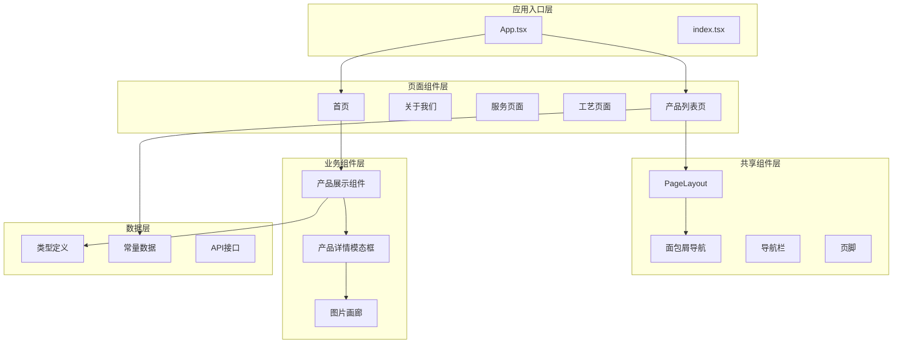
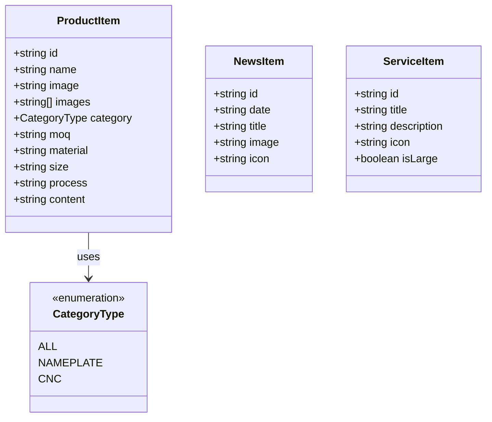
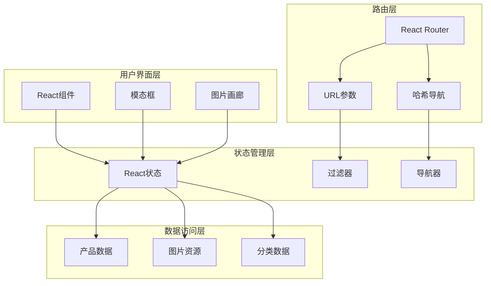
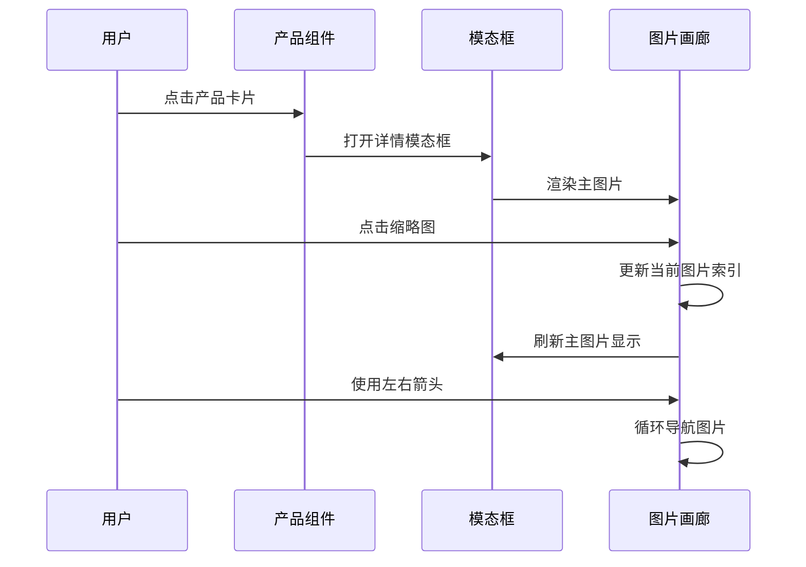
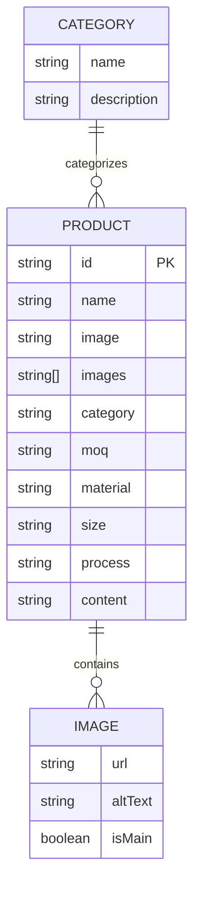
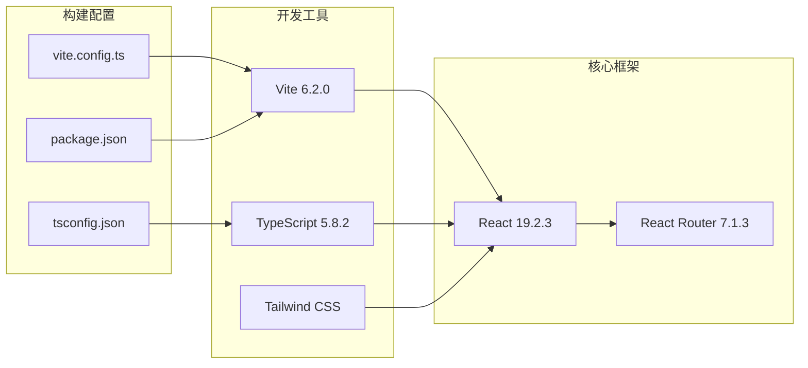
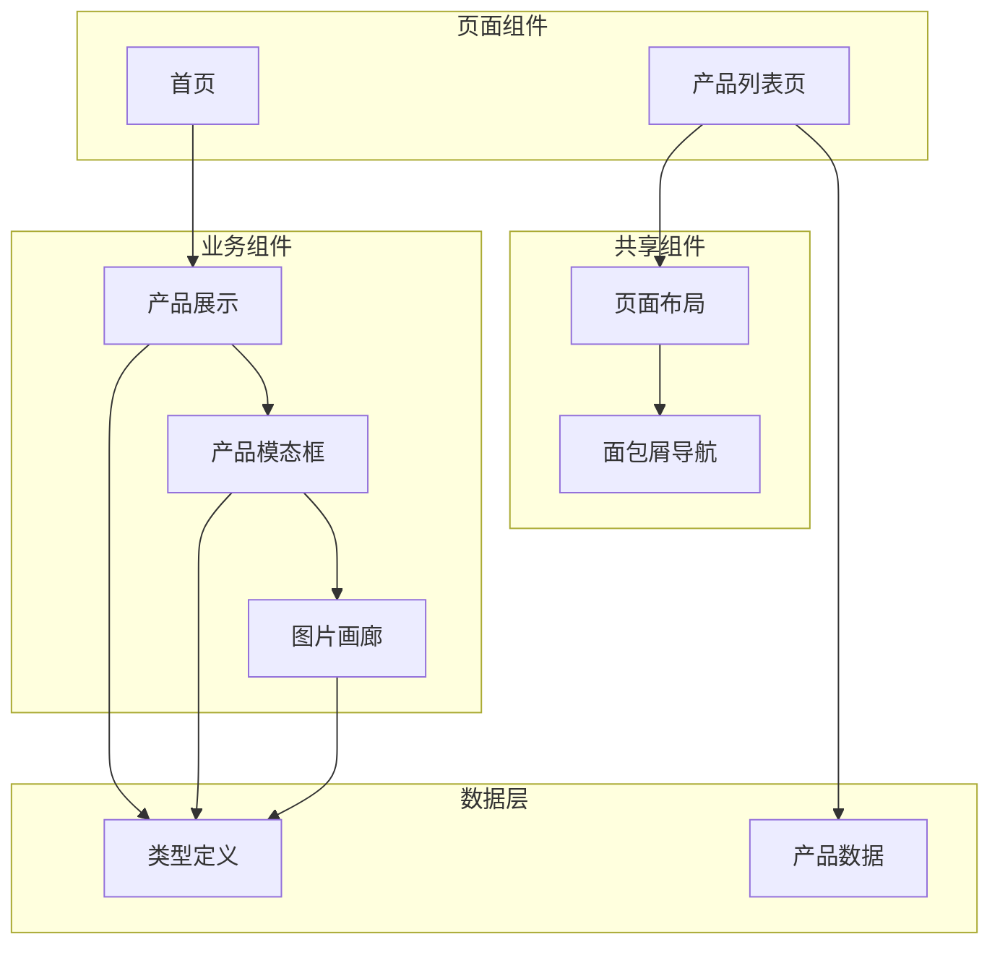

# 产品管理系统

<cite>
**本文档引用的文件**
- [App.tsx](file://App.tsx)
- [types.ts](file://types.ts)
- [Products.tsx](file://components/Products.tsx)
- [AllProductsPage.tsx](file://components/pages/AllProductsPage.tsx)
- [constants.tsx](file://constants.tsx)
- [PageLayout.tsx](file://components/shared/PageLayout.tsx)
- [Breadcrumb.tsx](file://components/shared/Breadcrumb.tsx)
- [products.tsx](file://sites/products/products.tsx)
- [package.json](file://package.json)
- [vite.config.ts](file://vite.config.ts)
- [tsconfig.json](file://tsconfig.json)
- [metadata.json](file://metadata.json)
</cite>

## 目录
1. [简介](#简介)
2. [项目结构](#项目结构)
3. [核心组件](#核心组件)
4. [架构概览](#架构概览)
5. [详细组件分析](#详细组件分析)
6. [依赖关系分析](#依赖关系分析)
7. [性能考虑](#性能考虑)
8. [故障排除指南](#故障排除指南)
9. [结论](#结论)
10. [附录](#附录)

## 简介

威宇精密工程网站的产品管理系统是一个基于React和TypeScript构建的企业级产品展示平台。该系统专注于工业制造领域，提供产品分类浏览、详情展示和图片轮播等核心功能。系统采用现代化的前端技术栈，支持响应式设计和暗黑模式切换，为用户提供优质的浏览体验。

本系统的核心目标是：
- 提供直观的产品分类浏览界面
- 实现高效的产品详情展示功能
- 支持多图片轮播和缩略图导航
- 确保类型安全和数据完整性
- 优化用户体验和性能表现

## 项目结构

项目采用模块化组织方式，主要分为以下层次：

**图表来源**
- [App.tsx](file://App.tsx#L41-L109)
- [Products.tsx](file://components/Products.tsx#L1-L310)
- [AllProductsPage.tsx](file://components/pages/AllProductsPage.tsx#L1-L281)

**章节来源**
- [App.tsx](file://App.tsx#L1-L112)
- [package.json](file://package.json#L1-L23)

## 核心组件

### 产品数据模型

系统使用强类型的数据模型来确保数据完整性：

**图表来源**
- [types.ts](file://types.ts#L10-L21)

### 产品分类系统

系统支持三种产品分类：
- **全部产品 (ALL)**: 显示所有产品
- **铭板 (NAMEPLATE)**: 包括蚀刻铭板、钻石雕刻铝铭板等
- **CNC加工 (CNC)**: 包括阳极处理CNC铝合金外壳、精密车削零件等

**章节来源**
- [types.ts](file://types.ts#L10-L21)
- [constants.tsx](file://constants.tsx#L50-L166)

## 架构概览

系统采用分层架构设计，确保关注点分离和代码可维护性：

**图表来源**
- [Products.tsx](file://components/Products.tsx#L8-L32)
- [AllProductsPage.tsx](file://components/pages/AllProductsPage.tsx#L9-L23)

## 详细组件分析

### 产品展示组件 (Products)

产品展示组件是系统的核心组件，负责产品列表的渲染和交互：

#### 组件功能特性

1. **分类筛选功能**
   - 支持按类别动态过滤产品
   - 实时更新URL参数保持状态同步
   - 响应式分类标签布局

2. **滚动导航**
   - 水平滚动容器支持左右滑动
   - 平滑滚动动画效果
   - 移动端触摸手势支持

3. **模态框详情**
   - 点击产品打开详情模态框
   - 支持键盘导航和ESC关闭
   - 响应式布局适配

#### 图片轮播实现

**图表来源**
- [Products.tsx](file://components/Products.tsx#L188-L304)

#### 缩略图导航系统

系统实现了完整的图片导航功能：

| 功能特性 | 实现方式 | 用户体验 |
|---------|----------|----------|
| 主图片显示 | 基于当前索引渲染 | 即时响应用户选择 |
| 缩略图预览 | 水平滚动展示 | 直观的图片浏览 |
| 循环导航 | 支持首尾循环 | 无缝浏览体验 |
| 索引高亮 | 当前图片高亮显示 | 清晰的视觉反馈 |

**章节来源**
- [Products.tsx](file://components/Products.tsx#L220-L256)

### 产品详情页面 (AllProductsPage)

独立的产品详情页面提供了更丰富的展示功能：

#### 页面特色功能

1. **网格布局**
   - 响应式网格系统 (2-4列)
   - 每个产品卡片独立展示
   - 支持不同屏幕尺寸自适应

2. **URL参数同步**
   - 使用useSearchParams Hook
   - 实时更新浏览器地址栏
   - 支持书签和分享功能

3. **面包屑导航**
   - 结合PageLayout组件
   - 清晰的页面层级指示
   - 支持返回上一级页面

**章节来源**
- [AllProductsPage.tsx](file://components/pages/AllProductsPage.tsx#L1-L281)

### 数据管理与状态

#### 产品数据结构

系统使用静态数据管理方案，所有产品数据存储在constants.tsx文件中：

**图表来源**
- [constants.tsx](file://constants.tsx#L50-L166)

#### 数据验证规则

系统通过TypeScript接口确保数据完整性：

| 字段名称 | 类型 | 必填 | 描述 | 验证规则 |
|---------|------|------|------|----------|
| id | string | 是 | 产品唯一标识符 | 唯一性、格式验证 |
| name | string | 是 | 产品名称 | 长度限制、字符验证 |
| image | string | 是 | 主图片URL | URL格式验证 |
| images | string[] | 否 | 多图片数组 | 数组长度、URL验证 |
| category | 'nameplate' \| 'cnc' | 是 | 产品分类 | 枚举值验证 |
| moq | string | 否 | 最小起订量 | 数字格式验证 |
| material | string | 否 | 材料描述 | 文本格式验证 |
| size | string | 否 | 尺寸规格 | 文本格式验证 |
| process | string | 否 | 加工工艺 | 文本格式验证 |
| content | string | 否 | 产品描述 | 文本长度限制 |

**章节来源**
- [types.ts](file://types.ts#L10-L21)
- [constants.tsx](file://constants.tsx#L50-L166)

## 依赖关系分析

### 技术栈依赖

系统采用现代化的前端技术栈：

**图表来源**
- [package.json](file://package.json#L11-L21)
- [vite.config.ts](file://vite.config.ts#L1-L24)

### 组件依赖关系

**图表来源**
- [Products.tsx](file://components/Products.tsx#L1-L310)
- [AllProductsPage.tsx](file://components/pages/AllProductsPage.tsx#L1-L281)

**章节来源**
- [package.json](file://package.json#L1-L23)
- [vite.config.ts](file://vite.config.ts#L1-L24)

## 性能考虑

### 图片优化策略

1. **懒加载实现**
   - 使用referrerpolicy属性防止隐私泄露
   - 错误处理机制自动降级到占位符图片
   - 对象填充优化确保图片比例一致

2. **内存管理**
   - 模态框关闭时重置状态
   - 图片索引状态局部管理
   - 避免不必要的重新渲染

### 响应式设计

系统采用移动优先的设计理念：

| 断点 | 设备类型 | 列数 | 字体大小 | 间距 |
|------|----------|------|----------|------|
| < 768px | 移动设备 | 2列 | 14px | 16px |
| 768px-1024px | 平板设备 | 3列 | 16px | 24px |
| > 1024px | 桌面设备 | 4列 | 18px | 24px |

### 性能优化建议

1. **代码分割**
   - 按需加载大型组件
   - 图片资源延迟加载
   - 路由级别的代码分割

2. **缓存策略**
   - 浏览器缓存静态资源
   - React组件记忆化
   - 图片CDN加速

3. **渲染优化**
   - 使用React.memo优化组件
   - 避免不必要的状态更新
   - 优化事件处理器绑定

## 故障排除指南

### 常见问题诊断

#### 图片加载失败

**问题症状**: 产品图片显示为占位符或错误图标

**可能原因**:
1. 图片URL无效或已过期
2. 网络连接问题
3. CORS跨域限制

**解决方案**:
1. 检查图片URL的有效性
2. 验证网络连接状态
3. 配置正确的CORS设置

#### 分类筛选失效

**问题症状**: 点击分类标签无响应

**可能原因**:
1. URL参数解析错误
2. 状态管理问题
3. 事件处理器绑定失败

**解决方案**:
1. 检查URL参数格式
2. 验证状态更新逻辑
3. 确认事件监听器正确绑定

#### 模态框显示异常

**问题症状**: 产品详情模态框无法正常显示

**可能原因**:
1. z-index层级冲突
2. 事件冒泡问题
3. DOM元素引用错误

**解决方案**:
1. 调整CSS层级顺序
2. 检查事件传播机制
3. 验证DOM引用有效性

**章节来源**
- [Products.tsx](file://components/Products.tsx#L149-L151)
- [AllProductsPage.tsx](file://components/pages/AllProductsPage.tsx#L131-L133)

### 开发调试技巧

1. **浏览器开发者工具**
   - 使用React DevTools检查组件树
   - 监控网络请求和图片加载
   - 检查CSS样式和响应式断点

2. **TypeScript类型检查**
   - 编译时类型验证
   - 接口实现检查
   - 泛型类型推导

3. **性能分析**
   - React Profiler分析组件渲染
   - Lighthouse性能测试
   - 内存泄漏检测

## 结论

威宇精密工程产品管理系统是一个功能完整、架构清晰的企业级应用。系统通过合理的组件拆分、类型安全的设计和响应式布局，为用户提供了优秀的浏览体验。

### 主要优势

1. **类型安全**: 完整的TypeScript类型定义确保数据完整性
2. **用户体验**: 流畅的动画效果和直观的交互设计
3. **性能优化**: 合理的状态管理和渲染优化策略
4. **可维护性**: 清晰的代码结构和模块化设计

### 改进建议

1. **数据持久化**: 考虑集成后端API实现动态数据管理
2. **搜索功能**: 添加产品搜索和高级过滤功能
3. **国际化**: 支持多语言内容展示
4. **SEO优化**: 增强搜索引擎可见性

## 附录

### API规范

#### 产品数据接口

| 字段 | 类型 | 必填 | 描述 |
|------|------|------|------|
| id | string | 是 | 产品唯一标识符 |
| name | string | 是 | 产品名称 |
| image | string | 是 | 主图片URL |
| images | string[] | 否 | 多图片数组 |
| category | enum | 是 | 产品分类 |
| moq | string | 否 | 最小起订量 |
| material | string | 否 | 材料描述 |
| size | string | 否 | 尺寸规格 |
| process | string | 否 | 加工工艺 |
| content | string | 否 | 产品描述 |

### 部署配置

系统支持多种部署环境：

1. **开发环境**: Vite热重载开发服务器
2. **生产环境**: Vite构建优化打包
3. **静态站点**: 支持静态文件部署

**章节来源**
- [metadata.json](file://metadata.json#L1-L5)
- [vite.config.ts](file://vite.config.ts#L5-L23)