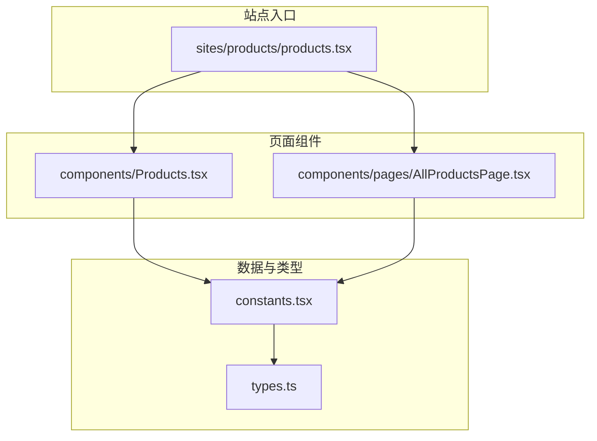
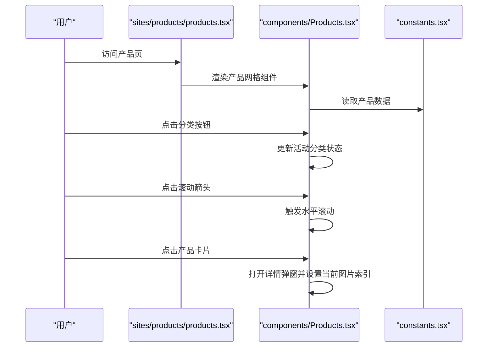
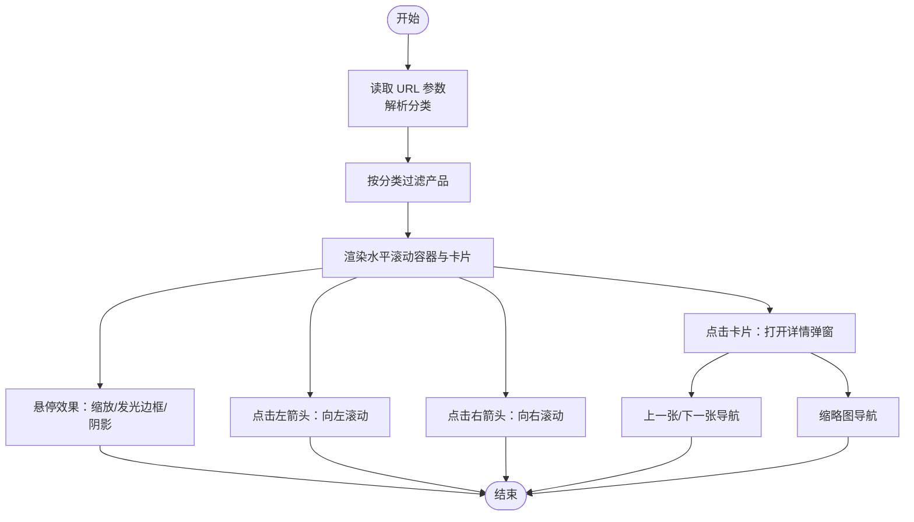
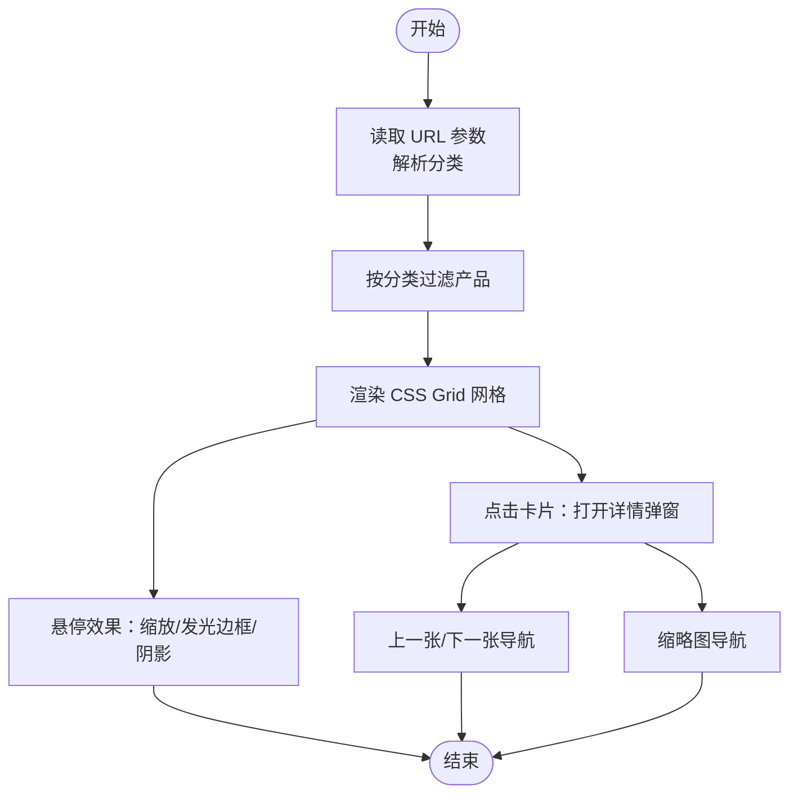
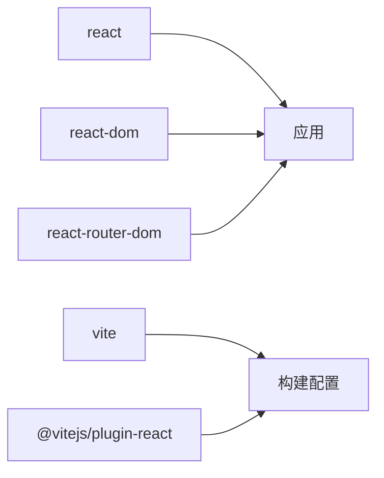

# 产品网格布局

<cite>
**本文引用的文件**
- [components/Products.tsx](file://components/Products.tsx)
- [sites/products/products.tsx](file://sites/products/products.tsx)
- [components/pages/AllProductsPage.tsx](file://components/pages/AllProductsPage.tsx)
- [constants.tsx](file://constants.tsx)
- [types.ts](file://types.ts)
- [package.json](file://package.json)
- [vite.config.ts](file://vite.config.ts)
</cite>

## 目录
1. [简介](#简介)
2. [项目结构](#项目结构)
3. [核心组件](#核心组件)
4. [架构总览](#架构总览)
5. [详细组件分析](#详细组件分析)
6. [依赖关系分析](#依赖关系分析)
7. [性能考虑](#性能考虑)
8. [故障排查指南](#故障排查指南)
9. [结论](#结论)
10. [附录](#附录)

## 简介
本文件聚焦于威宇精密工程网站的产品网格布局系统，系统在移动端与桌面端采用差异化布局策略：移动端使用“水平滚动容器 + 左右滚动箭头”的交互方式，桌面端则采用“CSS Grid 列表 + 固定宽高比”的栅格化展示。同时，系统实现了产品卡片的统一设计规范（3:2 宽高比、悬停阴影与发光边框、缩放过渡）、滚动条隐藏与跨浏览器兼容处理，并提供了产品详情弹窗与多图缩略导航。针对大数据集场景，建议结合虚拟滚动与懒加载策略以提升性能。

## 项目结构
该仓库包含两套产品页实现：
- 单页应用中的“首页产品区”组件，负责水平滚动与卡片交互
- 页面级“全部产品页”，负责基于 CSS Grid 的网格布局

图表来源
- [sites/products/products.tsx](file://sites/products/products.tsx#L1-L24)
- [components/Products.tsx](file://components/Products.tsx#L1-L310)
- [components/pages/AllProductsPage.tsx](file://components/pages/AllProductsPage.tsx#L1-L281)
- [constants.tsx](file://constants.tsx#L1-L167)
- [types.ts](file://types.ts#L1-L30)

章节来源
- [sites/products/products.tsx](file://sites/products/products.tsx#L1-L24)
- [components/Products.tsx](file://components/Products.tsx#L1-L310)
- [components/pages/AllProductsPage.tsx](file://components/pages/AllProductsPage.tsx#L1-L281)
- [constants.tsx](file://constants.tsx#L1-L167)
- [types.ts](file://types.ts#L1-L30)

## 核心组件
- 水平滚动产品区组件：提供分类筛选、左右滚动箭头、产品卡片点击进入详情弹窗等能力
- 页面级网格产品页：提供分类筛选、CSS Grid 网格布局、产品卡片点击进入详情弹窗等能力
- 数据常量与类型：集中管理产品数据、字段结构与枚举类型

章节来源
- [components/Products.tsx](file://components/Products.tsx#L1-L310)
- [components/pages/AllProductsPage.tsx](file://components/pages/AllProductsPage.tsx#L1-L281)
- [constants.tsx](file://constants.tsx#L50-L166)
- [types.ts](file://types.ts#L10-L21)

## 架构总览
整体由“站点入口 -> 页面组件 -> 数据与类型”构成，组件通过状态管理实现分类切换、滚动控制与详情弹窗；数据层通过常量文件集中维护产品信息。

图表来源
- [sites/products/products.tsx](file://sites/products/products.tsx#L1-L24)
- [components/Products.tsx](file://components/Products.tsx#L1-L310)
- [constants.tsx](file://constants.tsx#L50-L166)

## 详细组件分析

### 组件一：水平滚动产品区（移动端优先）
- 功能要点
  - 分类筛选：支持“全部/铭板/CNC”三类过滤
  - 水平滚动容器：左右箭头触发平滑滚动，支持触摸滑动
  - 产品卡片：3:2 宽高比、悬停缩放与发光边框、阴影层级提升
  - 详情弹窗：支持上一张/下一张切换与多图缩略导航
  - 空状态提示：无匹配产品时显示提示文案
- 关键实现路径
  - 分类状态与 URL 参数联动：[useEffect 与 hash 处理](file://components/Products.tsx#L14-L32)
  - 过滤逻辑：[按分类过滤产品](file://components/Products.tsx#L40-L42)
  - 水平滚动函数：[scrollTo 平滑滚动](file://components/Products.tsx#L44-L53)
  - 卡片点击打开详情：[openProductModal](file://components/Products.tsx#L55-L58)
  - 上一张/下一张导航：[navigateProduct](file://components/Products.tsx#L65-L79)
  - 图片缩略切换：[navigateImage](file://components/Products.tsx#L81-L89)
  - 卡片样式与悬停效果：[卡片容器与悬停样式](file://components/Products.tsx#L136-L164)
  - 3:2 宽高比容器：[aspect-[3/2]](file://components/Products.tsx#L143)
  - 滚动条隐藏与跨浏览器兼容：[scrollbar-hide 与内联样式](file://components/Products.tsx#L132-L134)
  - 错误占位图回退：[onError 回退到占位图](file://components/Products.tsx#L149-L151)

图表来源
- [components/Products.tsx](file://components/Products.tsx#L14-L32)
- [components/Products.tsx](file://components/Products.tsx#L40-L89)
- [components/Products.tsx](file://components/Products.tsx#L132-L164)

章节来源
- [components/Products.tsx](file://components/Products.tsx#L1-L310)

### 组件二：页面级网格产品页（桌面端优先）
- 功能要点
  - 分类筛选：支持“全部/铭板/CNC”
  - CSS Grid 网格布局：2/3/4 列自适应（移动端小屏、平板中屏、桌面大屏）
  - 产品卡片：3:2 宽高比、悬停缩放与发光边框、阴影层级提升
  - 详情弹窗：支持上一张/下一张切换与多图缩略导航
  - 空状态提示：无匹配产品时显示提示文案
- 关键实现路径
  - 分类状态与 URL 参数联动：[useSearchParams](file://components/pages/AllProductsPage.tsx#L10-L23)
  - 过滤逻辑：[按分类过滤产品](file://components/pages/AllProductsPage.tsx#L44-L46)
  - Grid 列数：[grid-cols-2 md:grid-cols-3 lg:grid-cols-4](file://components/pages/AllProductsPage.tsx#L117)
  - 卡片样式与悬停效果：[卡片容器与悬停样式](file://components/pages/AllProductsPage.tsx#L119-L146)
  - 3:2 宽高比容器：[aspect-[3/2]](file://components/pages/AllProductsPage.tsx#L125)
  - 错误占位图回退：[onError 回退到占位图](file://components/pages/AllProductsPage.tsx#L131-L133)

图表来源
- [components/pages/AllProductsPage.tsx](file://components/pages/AllProductsPage.tsx#L10-L23)
- [components/pages/AllProductsPage.tsx](file://components/pages/AllProductsPage.tsx#L44-L82)
- [components/pages/AllProductsPage.tsx](file://components/pages/AllProductsPage.tsx#L117-L146)

章节来源
- [components/pages/AllProductsPage.tsx](file://components/pages/AllProductsPage.tsx#L1-L281)

### 数据与类型
- 产品数据结构：包含 ID、名称、主图、可选多图、分类、最小起订量、材质、尺寸、工艺、描述等字段
- 常量数据：集中存放产品列表，便于组件直接导入使用
- 类型约束：确保数据一致性与开发期校验

章节来源
- [types.ts](file://types.ts#L10-L21)
- [constants.tsx](file://constants.tsx#L50-L166)

## 依赖关系分析
- 运行时依赖：React、React DOM、React Router
- 构建工具：Vite + React 插件
- 组件间依赖：站点入口渲染组件，组件依赖常量数据与类型定义

图表来源
- [package.json](file://package.json#L11-L21)
- [vite.config.ts](file://vite.config.ts#L1-L24)

章节来源
- [package.json](file://package.json#L1-L23)
- [vite.config.ts](file://vite.config.ts#L1-L24)

## 性能考虑
- 当前实现
  - 水平滚动容器：使用原生 scrollLeft 与 scrollTo 实现平滑滚动，适合中小规模产品集
  - CSS Grid 网格：一次性渲染所有卡片，适合中小规模产品集
  - 图片回退：错误时使用占位图，避免空白或重绘异常
- 大数据集与性能优化建议
  - 虚拟滚动：仅渲染可视区域卡片，减少 DOM 节点数量，显著降低重排与重绘成本
  - 懒加载：对非首屏卡片与缩略图启用懒加载，降低初始渲染压力
  - 图片优化：使用现代格式（WebP）与合适的尺寸，配合占位图与骨架屏
  - 防抖与节流：对滚动事件与窗口大小变化进行节流，避免频繁计算
  - IntersectionObserver：用于懒加载与可见性检测，提升交互流畅度
  - CSS Grid 与 Flex 的选择：在移动端优先场景，优先使用 Flex 控制单行滚动；在桌面端使用 Grid 提升布局效率
- 可用性与可访问性
  - 为滚动箭头添加 aria-label
  - 为图片提供 alt 文案
  - 为键盘用户提供焦点管理与快捷键支持

[本节为通用性能指导，不直接分析具体文件，故无章节来源]

## 故障排查指南
- 产品未显示或为空
  - 检查分类参数是否正确传递与解析
  - 检查过滤逻辑是否命中目标分类
  - 检查空状态渲染条件
- 滚动异常
  - 确认滚动容器引用是否存在
  - 确认 scrollLeft 与 scrollTo 的调用时机
  - 检查样式中是否禁用了滚动条但未提供替代交互
- 图片加载失败
  - 检查 onError 回退逻辑是否生效
  - 确认占位图 URL 与编码是否正确
- 弹窗无法关闭或导航失效
  - 检查事件冒泡与点击阻止传播
  - 检查当前产品索引与边界循环逻辑
- 跨浏览器兼容
  - 检查 scrollbar-hide 与内联样式在各浏览器表现
  - 对不支持的属性提供降级方案

章节来源
- [components/Products.tsx](file://components/Products.tsx#L14-L32)
- [components/Products.tsx](file://components/Products.tsx#L44-L53)
- [components/Products.tsx](file://components/Products.tsx#L149-L151)
- [components/Products.tsx](file://components/Products.tsx#L55-L89)
- [components/pages/AllProductsPage.tsx](file://components/pages/AllProductsPage.tsx#L131-L133)
- [components/pages/AllProductsPage.tsx](file://components/pages/AllProductsPage.tsx#L44-L82)

## 结论
该产品网格布局系统在移动端通过水平滚动容器与箭头控制实现流畅浏览，在桌面端通过 CSS Grid 实现响应式网格展示。产品卡片遵循统一设计规范（3:2 宽高比、悬停缩放与发光边框、阴影层级），并提供详情弹窗与多图导航。对于更大规模的数据集，建议引入虚拟滚动与懒加载策略以进一步提升性能与用户体验。

[本节为总结性内容，不直接分析具体文件，故无章节来源]

## 附录
- 设计规范摘要
  - 卡片尺寸：3:2 宽高比容器
  - 悬停效果：缩放、发光边框、阴影层级提升
  - 颜色体系：主色、悬停色、文字灰度、背景层次
  - 交互反馈：平滑滚动、过渡动画、无障碍标签
- 开发与构建
  - 使用 Vite + React 构建，支持热更新与快速预览
  - 通过别名 @ 指向项目根目录，便于模块导入

章节来源
- [vite.config.ts](file://vite.config.ts#L1-L24)
- [package.json](file://package.json#L1-L23)