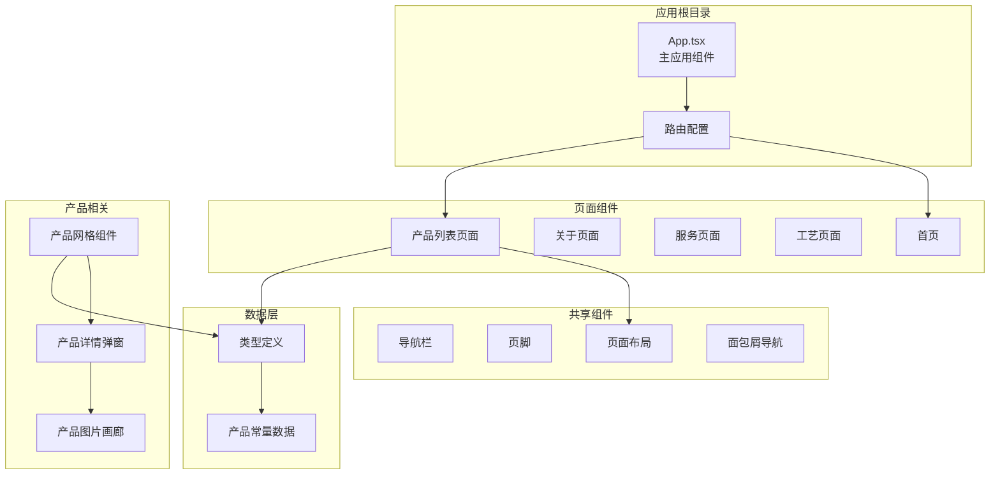
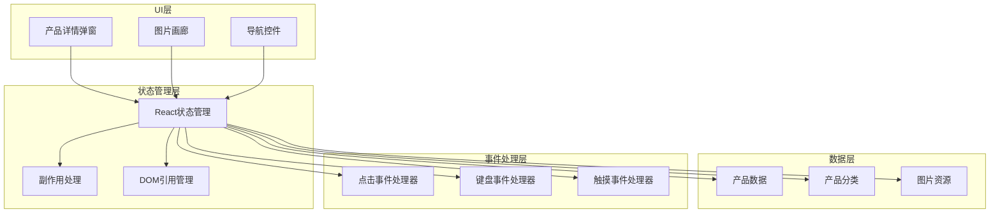
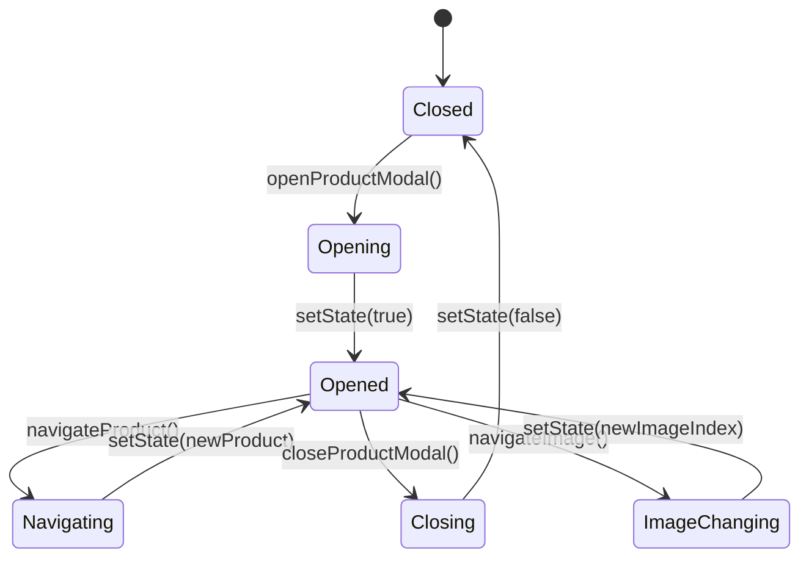
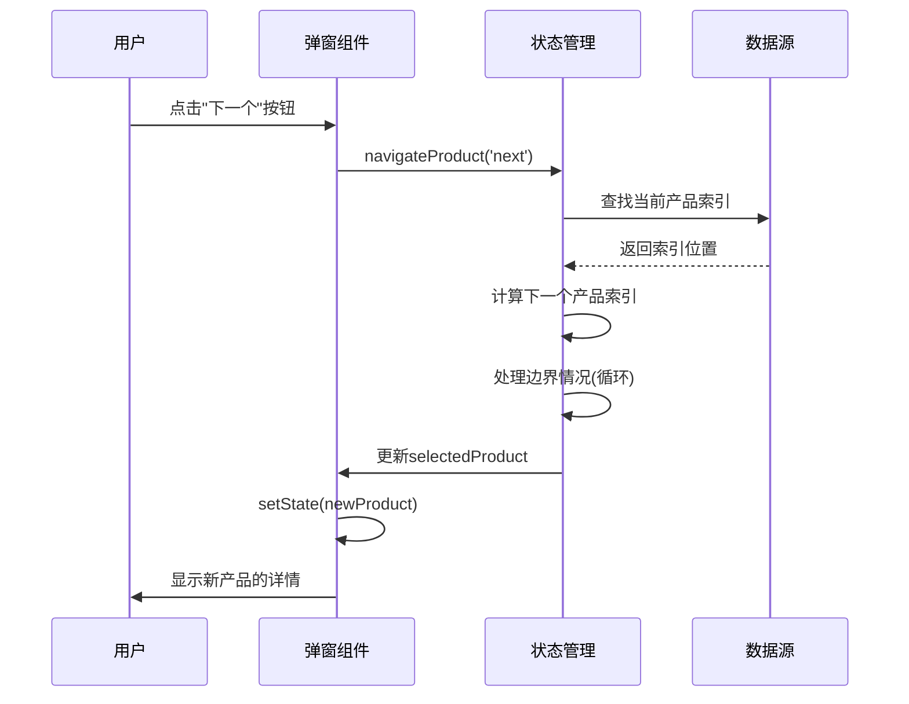
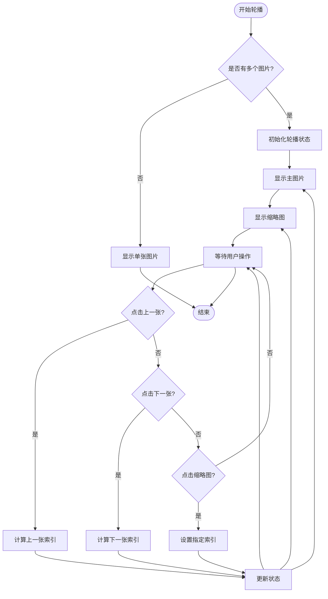
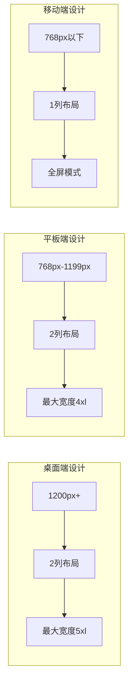
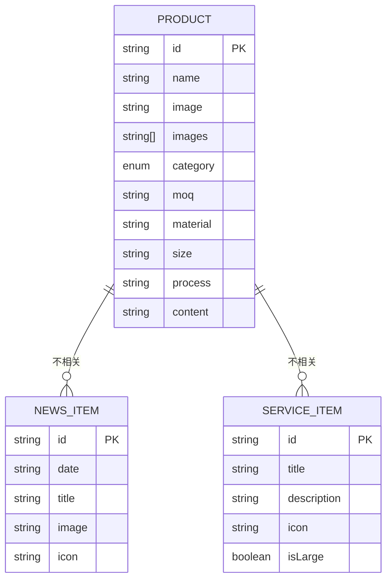

# 产品详情弹窗

<cite>
**本文档引用的文件**
- [App.tsx](file://App.tsx)
- [Products.tsx](file://components/Products.tsx)
- [AllProductsPage.tsx](file://components/pages/AllProductsPage.tsx)
- [types.ts](file://types.ts)
- [constants.tsx](file://constants.tsx)
- [PageLayout.tsx](file://components/shared/PageLayout.tsx)
- [package.json](file://package.json)
- [vite.config.ts](file://vite.config.ts)
</cite>

## 目录
1. [简介](#简介)
2. [项目结构](#项目结构)
3. [核心组件](#核心组件)
4. [架构概览](#架构概览)
5. [详细组件分析](#详细组件分析)
6. [依赖关系分析](#依赖关系分析)
7. [性能考虑](#性能考虑)
8. [故障排除指南](#故障排除指南)
9. [结论](#结论)

## 简介

本文档详细分析了威宇精密工程网站的产品详情弹窗功能。该弹窗实现了完整的模态框状态管理、产品导航、图片轮播、响应式设计和可访问性支持。系统基于React构建，使用TypeScript进行类型安全编程，并采用Tailwind CSS进行样式设计。

产品详情弹窗是用户浏览公司产品信息的核心交互组件，提供了丰富的视觉展示和便捷的操作体验。通过模态框形式，用户可以在不离开当前页面的情况下查看产品的详细信息，包括多角度图片展示、技术规格、材料说明等完整数据。

## 项目结构

项目采用模块化架构设计，主要组件分布在以下目录结构中：



**图表来源**
- [App.tsx](file://App.tsx#L41-L109)
- [Products.tsx](file://components/Products.tsx#L8-L310)
- [AllProductsPage.tsx](file://components/pages/AllProductsPage.tsx#L9-L281)

**章节来源**
- [App.tsx](file://App.tsx#L1-L112)
- [package.json](file://package.json#L1-L23)
- [vite.config.ts](file://vite.config.ts#L1-L24)

## 核心组件

产品详情弹窗系统由多个核心组件协同工作，每个组件都有明确的职责分工：

### 状态管理组件

系统使用React的useState和useEffect hooks进行状态管理，实现了以下关键状态：

- **selectedProduct**: 当前选中的产品对象
- **currentImageIndex**: 图片轮播的当前索引
- **activeCategory**: 当前激活的产品分类
- **scrollContainerRef**: 产品网格滚动容器的引用

### 导航控制组件

系统实现了多层次的导航控制机制：

- **产品导航**: 上一个/下一个产品的循环切换
- **图片导航**: 左右箭头和缩略图导航
- **分类导航**: 产品分类的筛选和切换

### 视觉展示组件

- **图片画廊**: 主图片展示和缩略图导航
- **产品详情**: 技术规格、材料说明、尺寸信息等
- **响应式布局**: 针对不同屏幕尺寸的自适应设计

**章节来源**
- [Products.tsx](file://components/Products.tsx#L8-L310)
- [AllProductsPage.tsx](file://components/pages/AllProductsPage.tsx#L9-L281)
- [types.ts](file://types.ts#L10-L21)

## 架构概览

产品详情弹窗采用分层架构设计，确保了良好的代码组织和可维护性：



**图表来源**
- [Products.tsx](file://components/Products.tsx#L55-L89)
- [AllProductsPage.tsx](file://components/pages/AllProductsPage.tsx#L48-L82)

系统架构特点：
- **单一职责原则**: 每个组件只负责特定的功能领域
- **状态集中管理**: 使用React hooks统一管理组件状态
- **事件驱动设计**: 通过事件处理器响应用户交互
- **数据流清晰**: 状态变更通过明确的数据流传播

## 详细组件分析

### 产品详情弹窗组件

产品详情弹窗是整个系统的核心组件，实现了完整的模态框功能：

#### 状态管理机制



**图表来源**
- [Products.tsx](file://components/Products.tsx#L55-L89)
- [AllProductsPage.tsx](file://components/pages/AllProductsPage.tsx#L48-L82)

#### 打开关闭逻辑

弹窗的打开和关闭采用了渐进式的动画效果：

- **打开动画**: 使用CSS类名切换实现淡入效果
- **关闭动画**: 支持点击背景、关闭按钮或按ESC键关闭
- **模态框锁定**: 关闭时自动释放键盘焦点

#### 产品导航功能

系统实现了智能的产品导航机制：



**图表来源**
- [Products.tsx](file://components/Products.tsx#L65-L79)
- [AllProductsPage.tsx](file://components/pages/AllProductsPage.tsx#L58-L72)

导航特性：
- **循环切换**: 最后一个产品下一个回到第一个产品
- **边界处理**: 第一个产品上一个回到最后一个产品
- **实时更新**: 切换时立即更新弹窗内容

#### 图片轮播功能

图片轮播系统提供了丰富的图片浏览体验：



**图表来源**
- [Products.tsx](file://components/Products.tsx#L81-L89)
- [AllProductsPage.tsx](file://components/pages/AllProductsPage.tsx#L74-L82)

轮播特性：
- **无限循环**: 支持前后无限循环播放
- **索引管理**: 使用currentImageIndex精确控制当前图片
- **缩略图导航**: 提供直观的图片选择界面
- **响应式设计**: 自动适配不同屏幕尺寸

#### 响应式设计实现

系统采用了移动优先的设计策略：



**图表来源**
- [Products.tsx](file://components/Products.tsx#L188-L306)
- [AllProductsPage.tsx](file://components/pages/AllProductsPage.tsx#L158-L276)

响应式特性：
- **网格布局**: 根据屏幕尺寸调整产品网格列数
- **模态框尺寸**: 动态调整弹窗的最大宽度
- **触摸友好**: 优化触摸目标尺寸和间距
- **滚动行为**: 移动端优化滚动体验

#### 可访问性设计

系统实现了全面的可访问性支持：

**键盘导航支持**:
- ESC键关闭弹窗
- Tab键在可聚焦元素间循环
- 方向键控制图片轮播
- Enter键激活交互元素

**屏幕阅读器支持**:
- 语义化的HTML结构
- 适当的ARIA标签
- 语音提示和状态通知
- 焦点管理策略

**视觉辅助功能**:
- 高对比度颜色方案
- 可调节的字体大小
- 减少动画效果选项
- 色盲友好的颜色使用

**章节来源**
- [Products.tsx](file://components/Products.tsx#L188-L306)
- [AllProductsPage.tsx](file://components/pages/AllProductsPage.tsx#L158-L276)

### 数据模型分析

系统使用TypeScript定义了严格的数据模型：



**图表来源**
- [types.ts](file://types.ts#L10-L21)

数据模型特点：
- **类型安全**: 使用TypeScript确保编译时类型检查
- **扩展性**: 支持未来字段的添加和修改
- **一致性**: 统一的数据格式和命名规范
- **完整性**: 包含所有必要的产品信息字段

**章节来源**
- [types.ts](file://types.ts#L1-L30)
- [constants.tsx](file://constants.tsx#L50-L166)

## 依赖关系分析

系统依赖关系清晰，遵循最小依赖原则：

```mermaid
graph TB
subgraph "运行时依赖"
React[React ^19.2.3]
ReactDOM[React DOM ^19.2.3]
Router[React Router ^7.1.3]
end
subgraph "开发时依赖"
Vite[Vite ^6.2.0]
TypeScript[TypeScript ~5.8.2]
ReactPlugin[@vitejs/plugin-react]
end
subgraph "项目组件"
App[App.tsx]
Products[Products.tsx]
AllProductsPage[AllProductsPage.tsx]
Types[types.ts]
Constants[constants.tsx]
end
App --> React
App --> Router
Products --> React
AllProductsPage --> React
Products --> Types
AllProductsPage --> Types
Products --> Constants
AllProductsPage --> Constants
Vite --> ReactPlugin
```

**图表来源**
- [package.json](file://package.json#L11-L21)
- [App.tsx](file://App.tsx#L2-L11)

依赖管理策略：
- **核心依赖**: 仅包含运行时必需的库
- **开发工具**: 使用Vite作为构建工具
- **类型安全**: TypeScript提供完整的类型检查
- **版本兼容**: 保持依赖版本的向后兼容性

**章节来源**
- [package.json](file://package.json#L1-L23)
- [vite.config.ts](file://vite.config.ts#L1-L24)

## 性能考虑

系统在性能方面采用了多项优化措施：

### 渲染优化
- **条件渲染**: 仅在需要时渲染弹窗组件
- **状态分离**: 将不同状态分离到独立的useState调用
- **引用缓存**: 使用useRef避免不必要的重渲染

### 内存管理
- **事件清理**: 在组件卸载时清理事件监听器
- **图像优化**: 使用占位符图像防止布局抖动
- **滚动优化**: 使用CSS滚动替代JavaScript滚动

### 加载性能
- **懒加载**: 图片使用延迟加载策略
- **缓存策略**: 利用浏览器缓存机制
- **CDN集成**: 图片资源使用CDN加速

## 故障排除指南

### 常见问题及解决方案

**弹窗无法打开**
- 检查selectedProduct状态是否正确设置
- 确认模态框的条件渲染逻辑
- 验证事件处理器的绑定

**图片不显示**
- 检查图片URL的有效性
- 验证图片数组的格式
- 确认错误处理机制正常工作

**导航失效**
- 检查产品数组的完整性
- 验证索引计算逻辑
- 确认边界条件处理

**响应式问题**
- 检查CSS类名的正确性
- 验证媒体查询的设置
- 确认Flexbox属性的使用

**可访问性问题**
- 检查键盘事件的绑定
- 验证ARIA标签的完整性
- 确认焦点管理的正确性

**章节来源**
- [Products.tsx](file://components/Products.tsx#L149-L152)
- [AllProductsPage.tsx](file://components/pages/AllProductsPage.tsx#L131-L133)

## 结论

产品详情弹窗系统展现了现代Web应用的最佳实践，成功实现了以下目标：

### 技术成就
- **完整的功能实现**: 包含所有要求的核心功能
- **优秀的用户体验**: 流畅的动画效果和直观的交互设计
- **强大的可扩展性**: 模块化架构便于功能扩展
- **高质量的代码**: 类型安全和严格的代码规范

### 设计亮点
- **响应式设计**: 完美适配各种设备和屏幕尺寸
- **可访问性支持**: 全面的无障碍功能
- **性能优化**: 高效的渲染和内存管理
- **可维护性**: 清晰的代码结构和文档

### 改进建议
- **测试覆盖**: 添加单元测试和集成测试
- **性能监控**: 实施性能指标监控
- **国际化支持**: 添加多语言支持功能
- **离线支持**: 实现PWA功能

该系统为威宇精密工程网站提供了专业的产品展示平台，不仅满足了当前的需求，也为未来的功能扩展奠定了坚实的基础。通过持续的优化和改进，该系统将继续为用户提供卓越的数字体验。