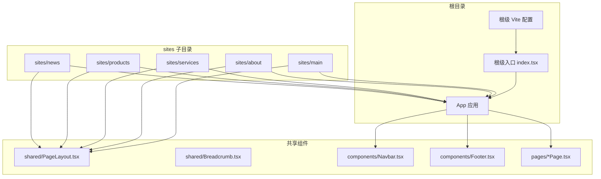
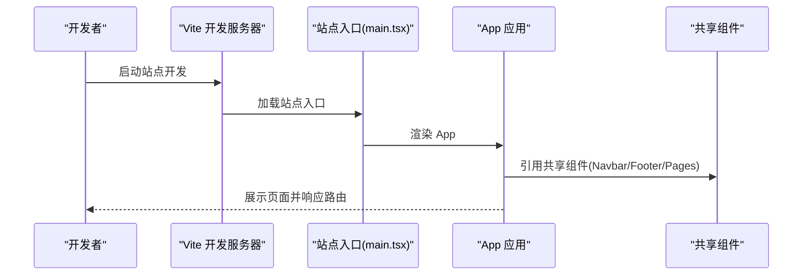
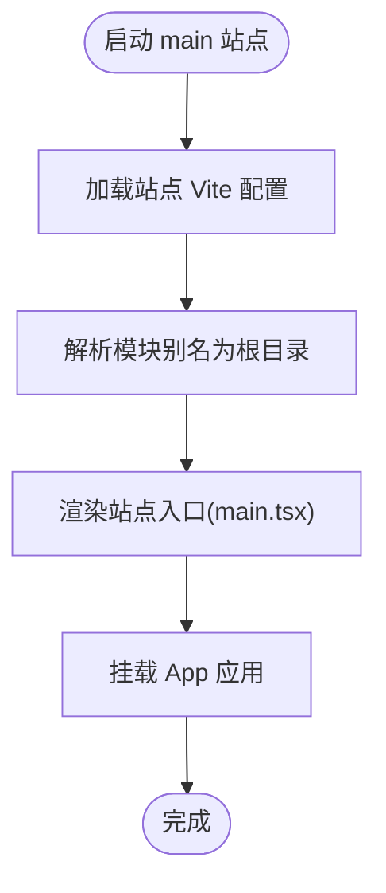
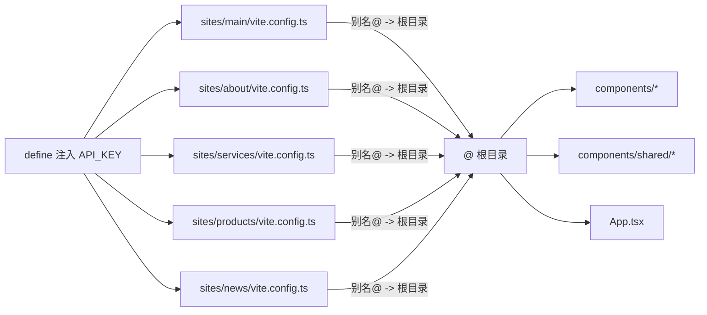

# 多站点部署

<cite>
**本文引用的文件**
- [README.md](file://README.md)
- [package.json](file://package.json)
- [vite.config.ts（根）](file://vite.config.ts)
- [index.tsx](file://index.tsx)
- [App.tsx](file://App.tsx)
- [sites/main/vite.config.ts](file://sites/main/vite.config.ts)
- [sites/about/vite.config.ts](file://sites/about/vite.config.ts)
- [sites/news/vite.config.ts](file://sites/news/vite.config.ts)
- [sites/products/vite.config.ts](file://sites/products/vite.config.ts)
- [sites/services/vite.config.ts](file://sites/services/vite.config.ts)
- [sites/main/main.tsx](file://sites/main/main.tsx)
- [sites/about/about.tsx](file://sites/about/about.tsx)
- [sites/news/news.tsx](file://sites/news/news.tsx)
- [sites/products/products.tsx](file://sites/products/products.tsx)
- [sites/services/services.tsx](file://sites/services/services.tsx)
- [components/shared/PageLayout.tsx](file://components/shared/PageLayout.tsx)
- [components/shared/Breadcrumb.tsx](file://components/shared/Breadcrumb.tsx)
- [components/Navbar.tsx](file://components/Navbar.tsx)
- [components/Footer.tsx](file://components/Footer.tsx)
- [components/pages/AboutPage.tsx](file://components/pages/AboutPage.tsx)
- [components/pages/ServicePage.tsx](file://components/pages/ServicePage.tsx)
- [components/pages/ProcessPage.tsx](file://components/pages/ProcessPage.tsx)
- [components/pages/AllProductsPage.tsx](file://components/pages/AllProductsPage.tsx)
- [components/About.tsx](file://components/About.tsx)
- [components/News.tsx](file://components/News.tsx)
- [components/Services.tsx](file://components/Services.tsx)
- [components/Products.tsx](file://components/Products.tsx)
- [components/Enquiry.tsx](file://components/Enquiry.tsx)
- [start-all-sites.bat](file://start-all-sites.bat)
- [windows_qoder.bat](file://windows_qoder.bat)
</cite>

## 目录
1. [简介](#简介)
2. [项目结构](#项目结构)
3. [核心组件](#核心组件)
4. [架构总览](#架构总览)
5. [详细组件分析](#详细组件分析)
6. [依赖关系分析](#依赖关系分析)
7. [性能考虑](#性能考虑)
8. [故障排查指南](#故障排查指南)
9. [结论](#结论)
10. [附录](#附录)

## 简介
本项目为“威宇精密工程”网站的多站点部署系统，采用 Vite + React 架构，通过独立站点目录与共享组件复用的方式，实现 main、about、services、products、news 等站点的独立开发与统一构建。每个站点拥有独立的入口文件与 Vite 配置，同时共享公共布局、导航、页脚与页面组件，以降低重复开发成本并提升一致性。

## 项目结构
- 根级配置与入口
  - 根级 Vite 配置用于本地开发与全局环境变量注入。
  - 根级入口负责渲染主应用 App。
- 站点目录（sites）
  - 每个子目录代表一个独立站点，包含该站点的入口文件与独立 Vite 配置。
  - 独立 Vite 配置通过别名指向根目录，使各站点可共享组件库。
- 共享组件（components）
  - 共享布局、面包屑、导航栏、页脚等基础 UI 组件。
  - 页面级组件（如 AboutPage、ServicePage、ProcessPage、AllProductsPage）按需在不同站点中使用或独立渲染。

图表来源
- [vite.config.ts（根）](file://vite.config.ts#L1-L24)
- [index.tsx](file://index.tsx#L1-L17)
- [App.tsx](file://App.tsx#L1-L112)
- [sites/main/vite.config.ts](file://sites/main/vite.config.ts#L1-L25)
- [sites/about/vite.config.ts](file://sites/about/vite.config.ts#L1-L25)
- [sites/services/vite.config.ts](file://sites/services/vite.config.ts#L1-L25)
- [sites/products/vite.config.ts](file://sites/products/vite.config.ts#L1-L25)
- [sites/news/vite.config.ts](file://sites/news/vite.config.ts#L1-L25)

章节来源
- [README.md](file://README.md#L1-L21)
- [package.json](file://package.json#L1-L23)
- [vite.config.ts（根）](file://vite.config.ts#L1-L24)
- [index.tsx](file://index.tsx#L1-L17)
- [App.tsx](file://App.tsx#L1-L112)

## 核心组件
- 应用入口与路由
  - 根级入口负责挂载 App；App 使用 React Router 进行路由分发，支持首页与多页面路径。
  - 路由切换时自动滚动至顶部，提供平滑滚动体验。
- 导航与页脚
  - Navbar 提供全局导航；Footer 提供统一页脚信息。
- 页面组件
  - AboutPage、ServicePage、ProcessPage、AllProductsPage 等页面组件在 App 中注册，作为独立页面使用。
- 共享布局与面包屑
  - PageLayout、Breadcrumb 提供统一布局与面包屑导航，便于多站点复用。

章节来源
- [App.tsx](file://App.tsx#L1-L112)
- [components/shared/PageLayout.tsx](file://components/shared/PageLayout.tsx)
- [components/shared/Breadcrumb.tsx](file://components/shared/Breadcrumb.tsx)
- [components/Navbar.tsx](file://components/Navbar.tsx)
- [components/Footer.tsx](file://components/Footer.tsx)
- [components/pages/AboutPage.tsx](file://components/pages/AboutPage.tsx)
- [components/pages/ServicePage.tsx](file://components/pages/ServicePage.tsx)
- [components/pages/ProcessPage.tsx](file://components/pages/ProcessPage.tsx)
- [components/pages/AllProductsPage.tsx](file://components/pages/AllProductsPage.tsx)

## 架构总览
多站点架构采用“独立入口 + 共享组件”的模式：
- 各站点拥有独立入口文件与 Vite 配置，确保端口与根目录隔离。
- 通过 Vite 别名将模块解析到根目录，实现对共享组件的统一引用。
- App 负责全局路由与主题切换逻辑，站点入口仅负责挂载对应应用。

图表来源
- [sites/main/main.tsx](file://sites/main/main.tsx#L1-L10)
- [App.tsx](file://App.tsx#L1-L112)
- [components/Navbar.tsx](file://components/Navbar.tsx)
- [components/Footer.tsx](file://components/Footer.tsx)
- [components/pages/AboutPage.tsx](file://components/pages/AboutPage.tsx)

## 详细组件分析

### 站点入口与配置（main）
- 入口文件
  - 站点入口负责创建根节点并渲染 App。
- Vite 配置
  - 设置独立 root、端口与主机，定义全局环境变量，配置别名为根目录，确保共享组件可用。

图表来源
- [sites/main/vite.config.ts](file://sites/main/vite.config.ts#L1-L25)
- [sites/main/main.tsx](file://sites/main/main.tsx#L1-L10)

章节来源
- [sites/main/vite.config.ts](file://sites/main/vite.config.ts#L1-L25)
- [sites/main/main.tsx](file://sites/main/main.tsx#L1-L10)

### 站点入口与配置（about）
- 入口文件
  - 独立渲染 About 页面，包含导航与页脚。
- Vite 配置
  - 独立端口与根目录，别名指向根目录，共享组件可用。

章节来源
- [sites/about/vite.config.ts](file://sites/about/vite.config.ts#L1-L25)
- [sites/about/about.tsx](file://sites/about/about.tsx#L1-L24)

### 站点入口与配置（services）
- 入口文件
  - 独立渲染 Services 页面，包含导航与页脚。
- Vite 配置
  - 独立端口与根目录，别名指向根目录，共享组件可用。

章节来源
- [sites/services/vite.config.ts](file://sites/services/vite.config.ts#L1-L25)
- [sites/services/services.tsx](file://sites/services/services.tsx#L1-L24)

### 站点入口与配置（products）
- 入口文件
  - 独立渲染 Products 页面，包含导航与页脚。
- Vite 配置
  - 独立端口与根目录，别名指向根目录，共享组件可用。

章节来源
- [sites/products/vite.config.ts](file://sites/products/vite.config.ts#L1-L25)
- [sites/products/products.tsx](file://sites/products/products.tsx#L1-L24)

### 站点入口与配置（news）
- 入口文件
  - 独立渲染 News 页面，包含导航与页脚。
- Vite 配置
  - 独立端口与根目录，别名指向根目录，共享组件可用。

章节来源
- [sites/news/vite.config.ts](file://sites/news/vite.config.ts#L1-L25)
- [sites/news/news.tsx](file://sites/news/news.tsx#L1-L24)

### App 应用与路由
- 路由与页面
  - 定义首页与多页面路由，包含 About、Service、Process、Products。
- 主题切换
  - 支持明暗主题切换，并通过类名控制样式。
- 平滑滚动
  - 路由变化时自动滚动至顶部，提升用户体验。

章节来源
- [App.tsx](file://App.tsx#L1-L112)

### 共享组件与页面
- 导航与页脚
  - Navbar、Footer 在各站点中复用，保证风格一致。
- 页面组件
  - AboutPage、ServicePage、ProcessPage、AllProductsPage 作为页面级组件在 App 中注册使用。

章节来源
- [components/Navbar.tsx](file://components/Navbar.tsx)
- [components/Footer.tsx](file://components/Footer.tsx)
- [components/pages/AboutPage.tsx](file://components/pages/AboutPage.tsx)
- [components/pages/ServicePage.tsx](file://components/pages/ServicePage.tsx)
- [components/pages/ProcessPage.tsx](file://components/pages/ProcessPage.tsx)
- [components/pages/AllProductsPage.tsx](file://components/pages/AllProductsPage.tsx)

## 依赖关系分析
- 模块别名
  - 各站点 Vite 配置通过别名将模块解析到根目录，从而共享 components 与 shared 目录中的组件。
- 环境变量
  - 通过 define 将 GEMINI_API_KEY 注入到运行时，确保各站点可访问相同密钥。
- 依赖管理
  - package.json 定义了 React、React Router 与 Vite 生态依赖，确保开发与构建一致性。

图表来源
- [sites/main/vite.config.ts](file://sites/main/vite.config.ts#L1-L25)
- [sites/about/vite.config.ts](file://sites/about/vite.config.ts#L1-L25)
- [sites/services/vite.config.ts](file://sites/services/vite.config.ts#L1-L25)
- [sites/products/vite.config.ts](file://sites/products/vite.config.ts#L1-L25)
- [sites/news/vite.config.ts](file://sites/news/vite.config.ts#L1-L25)
- [vite.config.ts（根）](file://vite.config.ts#L1-L24)
- [App.tsx](file://App.tsx#L1-L112)

章节来源
- [package.json](file://package.json#L1-L23)
- [vite.config.ts（根）](file://vite.config.ts#L1-L24)

## 性能考虑
- 构建与预览
  - 使用 Vite 的 build 与 preview 脚本进行生产构建与本地预览，建议在 CI 中生成静态产物并部署至 CDN。
- 资源优化
  - 合理拆分代码与懒加载页面组件，减少首屏体积。
  - 对图片与媒体资源进行压缩与格式优化，结合 CDN 缓存策略提升加载速度。
- 缓存策略
  - 静态资源启用长缓存，版本化文件名，避免浏览器缓存旧资源。
- 性能监控
  - 建议接入前端性能监控工具，跟踪首屏时间、交互延迟与错误率。

## 故障排查指南
- 根节点未找到
  - 若入口挂载失败，请检查 HTML 中是否存在 id 为 root 的容器元素。
- 端口冲突
  - 各站点使用不同端口，若启动报错，请确认端口占用情况并调整配置。
- 环境变量缺失
  - 确保在 .env.local 中设置 GEMINI_API_KEY，否则运行时可能无法访问相关功能。
- 路由跳转异常
  - 检查 App 中路由定义是否与站点入口一致，避免路径不匹配导致页面空白。

章节来源
- [index.tsx](file://index.tsx#L1-L17)
- [sites/main/vite.config.ts](file://sites/main/vite.config.ts#L1-L25)
- [vite.config.ts（根）](file://vite.config.ts#L1-L24)
- [App.tsx](file://App.tsx#L1-L112)

## 结论
本多站点部署系统通过“独立入口 + 共享组件”的方式，在保证各站点独立性的同时，最大化复用共享资源，降低维护成本。配合清晰的 Vite 配置与路由设计，可快速扩展更多站点并实现统一构建与部署。

## 附录
- 部署脚本与自动化
  - start-all-sites.bat：一键启动所有站点开发服务器，便于本地联调。
  - windows_qoder.bat：与诊断工具相关的批处理脚本，可用于本地问题排查。
- 域名绑定与路由
  - 建议在反向代理或 CDN 层面将不同域名映射到各站点端口或路径，实现多域名访问。
- 生产环境优化
  - 使用 CDN 分发静态资源，开启 Gzip/Brotli 压缩，合理设置缓存头。
- 版本管理与回滚
  - 建议在 CI 中生成带版本号的产物目录，回滚时直接切换到上一个稳定版本目录。

章节来源
- [start-all-sites.bat](file://start-all-sites.bat)
- [windows_qoder.bat](file://windows_qoder.bat)