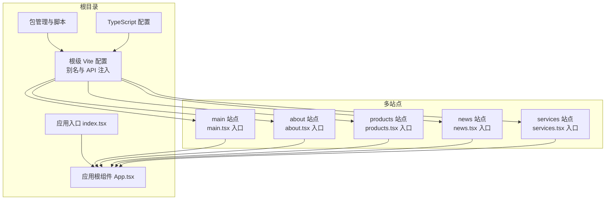
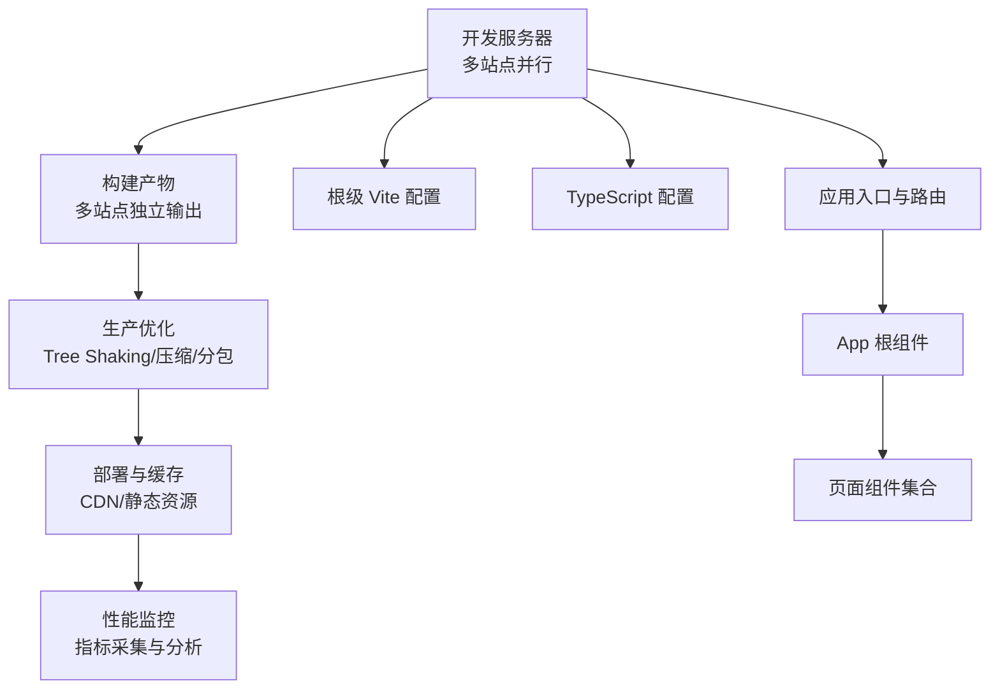
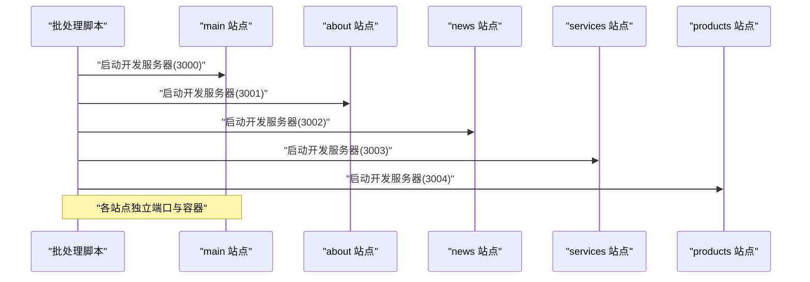
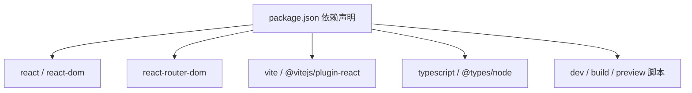

# 构建和优化策略

<cite>
**本文引用的文件**
- [vite.config.ts](file://vite.config.ts)
- [sites/main/vite.config.ts](file://sites/main/vite.config.ts)
- [sites/about/vite.config.ts](file://sites/about/vite.config.ts)
- [sites/products/vite.config.ts](file://sites/products/vite.config.ts)
- [sites/news/vite.config.ts](file://sites/news/vite.config.ts)
- [sites/services/vite.config.ts](file://sites/services/vite.config.ts)
- [package.json](file://package.json)
- [tsconfig.json](file://tsconfig.json)
- [index.tsx](file://index.tsx)
- [App.tsx](file://App.tsx)
- [sites/main/main.tsx](file://sites/main/main.tsx)
- [sites/about/about.tsx](file://sites/about/about.tsx)
- [sites/products/products.tsx](file://sites/products/products.tsx)
- [sites/news/news.tsx](file://sites/news/news.tsx)
- [sites/services/services.tsx](file://sites/services/services.tsx)
- [start-all-sites.bat](file://start-all-sites.bat)
</cite>

## 目录
1. [简介](#简介)
2. [项目结构](#项目结构)
3. [核心组件](#核心组件)
4. [架构总览](#架构总览)
5. [详细组件分析](#详细组件分析)
6. [依赖分析](#依赖分析)
7. [性能考虑](#性能考虑)
8. [故障排查指南](#故障排查指南)
9. [结论](#结论)
10. [附录](#附录)

## 简介
本文件面向“威宇精密工程”网站的构建与优化，聚焦于 Vite 构建配置、多站点并行开发、代码分割与资源压缩、生产环境优化（Tree Shaking、Bundle 分析、资源预加载与懒加载）、静态资源与 CDN 集成、缓存与增量构建策略、性能监控与构建时间优化、TypeScript 编译与 ESLint 质量保障、以及部署前测试与安全扫描流程。文档同时提供可操作的优化建议与落地方法，帮助在不牺牲开发体验的前提下提升构建效率与运行性能。

## 项目结构
项目采用多站点（Multi-Spa）架构，根目录提供统一的开发服务器与通用配置，各子站点拥有独立入口与配置，便于并行开发与独立部署。关键特性包括：
- 根级 Vite 配置与别名解析，统一 API 密钥注入与路径别名。
- 各站点独立的 Vite 配置，确保端口与 root 路径隔离。
- TypeScript 编译目标与模块解析策略，配合 React JSX 运行时。
- 批处理脚本用于一键启动所有站点，便于联调与对比。

图表来源
- [vite.config.ts](file://vite.config.ts#L1-L24)
- [sites/main/vite.config.ts](file://sites/main/vite.config.ts#L1-L25)
- [sites/about/vite.config.ts](file://sites/about/vite.config.ts#L1-L25)
- [sites/products/vite.config.ts](file://sites/products/vite.config.ts#L1-L25)
- [sites/news/vite.config.ts](file://sites/news/vite.config.ts#L1-L25)
- [sites/services/vite.config.ts](file://sites/services/vite.config.ts#L1-L25)
- [package.json](file://package.json#L1-L23)
- [tsconfig.json](file://tsconfig.json#L1-L29)
- [index.tsx](file://index.tsx#L1-L17)
- [App.tsx](file://App.tsx#L1-L112)
- [sites/main/main.tsx](file://sites/main/main.tsx#L1-L10)
- [sites/about/about.tsx](file://sites/about/about.tsx#L1-L24)
- [sites/products/products.tsx](file://sites/products/products.tsx#L1-L24)
- [sites/news/news.tsx](file://sites/news/news.tsx#L1-L24)
- [sites/services/services.tsx](file://sites/services/services.tsx#L1-L24)

章节来源
- [vite.config.ts](file://vite.config.ts#L1-L24)
- [package.json](file://package.json#L1-L23)
- [tsconfig.json](file://tsconfig.json#L1-L29)
- [index.tsx](file://index.tsx#L1-L17)
- [App.tsx](file://App.tsx#L1-L112)
- [sites/main/main.tsx](file://sites/main/main.tsx#L1-L10)
- [sites/about/about.tsx](file://sites/about/about.tsx#L1-L24)
- [sites/products/products.tsx](file://sites/products/products.tsx#L1-L24)
- [sites/news/news.tsx](file://sites/news/news.tsx#L1-L24)
- [sites/services/services.tsx](file://sites/services/services.tsx#L1-L24)
- [start-all-sites.bat](file://start-all-sites.bat#L1-L26)

## 核心组件
- 根级 Vite 配置：统一开发服务器端口、插件、环境变量注入与路径别名，确保多站点共享同一套开发体验。
- 各站点 Vite 配置：独立 root 与端口，避免冲突；继承根级别名与 API 注入策略。
- 应用入口与根组件：统一的路由与主题切换逻辑，按需渲染页面组件。
- 多站点入口：每个站点独立挂载到各自容器，便于独立构建与部署。
- TypeScript 配置：明确模块系统、目标语言版本、路径映射与 JSX 运行时，提升类型安全与构建性能。
- 包管理脚本：提供开发、构建与预览命令，支持多站点并行启动批处理脚本。

章节来源
- [vite.config.ts](file://vite.config.ts#L1-L24)
- [sites/main/vite.config.ts](file://sites/main/vite.config.ts#L1-L25)
- [sites/about/vite.config.ts](file://sites/about/vite.config.ts#L1-L25)
- [sites/products/vite.config.ts](file://sites/products/vite.config.ts#L1-L25)
- [sites/news/vite.config.ts](file://sites/news/vite.config.ts#L1-L25)
- [sites/services/vite.config.ts](file://sites/services/vite.config.ts#L1-L25)
- [App.tsx](file://App.tsx#L1-L112)
- [index.tsx](file://index.tsx#L1-L17)
- [package.json](file://package.json#L1-L23)
- [tsconfig.json](file://tsconfig.json#L1-L29)
- [start-all-sites.bat](file://start-all-sites.bat#L1-L26)

## 架构总览
下图展示从开发到生产的整体流程：多站点并行开发、根级 Vite 统一配置、TypeScript 编译、React 渲染与路由、最终产物输出与部署。

图表来源
- [vite.config.ts](file://vite.config.ts#L1-L24)
- [tsconfig.json](file://tsconfig.json#L1-L29)
- [App.tsx](file://App.tsx#L1-L112)
- [sites/main/main.tsx](file://sites/main/main.tsx#L1-L10)
- [sites/about/about.tsx](file://sites/about/about.tsx#L1-L24)
- [sites/products/products.tsx](file://sites/products/products.tsx#L1-L24)
- [sites/news/news.tsx](file://sites/news/news.tsx#L1-L24)
- [sites/services/services.tsx](file://sites/services/services.tsx#L1-L24)

## 详细组件分析

### Vite 构建配置与优化要点
- 开发服务器与网络：统一 host 与端口策略，避免冲突；根级与各站点独立端口设计，便于并行调试。
- 插件体系：启用 React 插件以获得更快的 HMR 与更佳的开发体验。
- 环境变量注入：通过 define 将 API 密钥注入到客户端，避免硬编码与泄露风险。
- 路径别名：统一 @ 指向项目根或站点根，简化导入路径，提升可维护性。
- 生产优化建议（待补充）：在现有基础上增加 rollupOptions 的 external、manualChunks、output 规则，结合压缩插件实现 Tree Shaking 与资源压缩。

章节来源
- [vite.config.ts](file://vite.config.ts#L1-L24)
- [sites/main/vite.config.ts](file://sites/main/vite.config.ts#L1-L25)
- [sites/about/vite.config.ts](file://sites/about/vite.config.ts#L1-L25)
- [sites/products/vite.config.ts](file://sites/products/vite.config.ts#L1-L25)
- [sites/news/vite.config.ts](file://sites/news/vite.config.ts#L1-L25)
- [sites/services/vite.config.ts](file://sites/services/vite.config.ts#L1-L25)

### 多站点并行处理与增量构建
- 并行启动：批处理脚本为每个站点单独开启窗口并分配不同端口，实现真正的并行开发与联调。
- 独立增量构建：各站点独立的 Vite 配置与入口，减少相互影响，提升热更新与增量构建效率。
- 端口与容器隔离：避免端口冲突与 DOM 容器重叠，确保每个站点独立运行。

图表来源
- [start-all-sites.bat](file://start-all-sites.bat#L1-L26)
- [sites/main/vite.config.ts](file://sites/main/vite.config.ts#L8-L12)
- [sites/about/vite.config.ts](file://sites/about/vite.config.ts#L8-L12)
- [sites/news/vite.config.ts](file://sites/news/vite.config.ts#L8-L12)
- [sites/services/vite.config.ts](file://sites/services/vite.config.ts#L8-L12)
- [sites/products/vite.config.ts](file://sites/products/vite.config.ts#L8-L12)

章节来源
- [start-all-sites.bat](file://start-all-sites.bat#L1-L26)
- [sites/main/vite.config.ts](file://sites/main/vite.config.ts#L1-L25)
- [sites/about/vite.config.ts](file://sites/about/vite.config.ts#L1-L25)
- [sites/news/vite.config.ts](file://sites/news/vite.config.ts#L1-L25)
- [sites/services/vite.config.ts](file://sites/services/vite.config.ts#L1-L25)
- [sites/products/vite.config.ts](file://sites/products/vite.config.ts#L1-L25)

### 代码分割策略与资源压缩
- 代码分割建议：基于路由拆分（如按页面组件），利用动态导入实现按需加载；对第三方库进行 vendor 分包，降低重复打包与缓存失效概率。
- 资源压缩：启用压缩插件（如 terser 或 esbuild），在生产模式下最小化 JS/CSS，并开启 gzip/br 压缩。
- 输出命名与哈希：为产物添加内容哈希，提升缓存命中率与版本控制能力。

章节来源
- [vite.config.ts](file://vite.config.ts#L1-L24)
- [sites/main/vite.config.ts](file://sites/main/vite.config.ts#L1-L25)
- [sites/about/vite.config.ts](file://sites/about/vite.config.ts#L1-L25)
- [sites/products/vite.config.ts](file://sites/products/vite.config.ts#L1-L25)
- [sites/news/vite.config.ts](file://sites/news/vite.config.ts#L1-L25)
- [sites/services/vite.config.ts](file://sites/services/vite.config.ts#L1-L25)

### 生产环境优化：Tree Shaking、Bundle 分析、预加载与懒加载
- Tree Shaking：确保模块采用 ES Module 导出，关闭严格模式下的副作用标记，启用打包器的摇树优化。
- Bundle 分析：使用可视化工具（如 rollup-plugin-visualizer 或 vite-bundle-analyzer）生成报告，识别大体积依赖与重复模块。
- 预加载与懒加载：对关键路由与首屏资源使用 prefetch/preload；对非关键资源采用动态导入与路由级懒加载。
- 资源优化：图片与媒体采用现代格式（WebP/AVIF），并提供合适的尺寸与分辨率；字体使用可变字体与子集化。

章节来源
- [vite.config.ts](file://vite.config.ts#L1-L24)
- [sites/main/vite.config.ts](file://sites/main/vite.config.ts#L1-L25)
- [sites/about/vite.config.ts](file://sites/about/vite.config.ts#L1-L25)
- [sites/products/vite.config.ts](file://sites/products/vite.config.ts#L1-L25)
- [sites/news/vite.config.ts](file://sites/news/vite.config.ts#L1-L25)
- [sites/services/vite.config.ts](file://sites/services/vite.config.ts#L1-L25)

### 静态资源处理、CDN 集成与缓存策略
- 静态资源：将图片、字体、媒体等放入 public 目录或通过构建器处理，确保路径正确与缓存友好。
- CDN 集成：将构建产物上传至 CDN，配置域名与回源规则；对静态资源设置长缓存与版本化。
- 缓存策略：浏览器缓存与 ETag/Last-Modified 结合；对 HTML 设置较短缓存，对 JS/CSS 设置长期缓存；对 API 使用合理的缓存头。

章节来源
- [vite.config.ts](file://vite.config.ts#L1-L24)
- [sites/main/vite.config.ts](file://sites/main/vite.config.ts#L1-L25)
- [sites/about/vite.config.ts](file://sites/about/vite.config.ts#L1-L25)
- [sites/products/vite.config.ts](file://sites/products/vite.config.ts#L1-L25)
- [sites/news/vite.config.ts](file://sites/news/vite.config.ts#L1-L25)
- [sites/services/vite.config.ts](file://sites/services/vite.config.ts#L1-L25)

### 性能监控指标、构建时间优化与内存控制
- 性能监控：在应用中埋点关键指标（FP、FCP、LCP、FID、CLS），结合服务端日志与前端监控 SDK 实现全链路观测。
- 构建时间优化：启用并行构建、缓存中间产物（如 esbuild 缓存）、减少不必要的插件与解析步骤；对大型依赖进行外部化。
- 内存控制：限制并发度、合理设置堆大小、避免一次性加载过多模块；对长时间任务进行分片与异步化。

章节来源
- [vite.config.ts](file://vite.config.ts#L1-L24)
- [sites/main/vite.config.ts](file://sites/main/vite.config.ts#L1-L25)
- [sites/about/vite.config.ts](file://sites/about/vite.config.ts#L1-L25)
- [sites/products/vite.config.ts](file://sites/products/vite.config.ts#L1-L25)
- [sites/news/vite.config.ts](file://sites/news/vite.config.ts#L1-L25)
- [sites/services/vite.config.ts](file://sites/services/vite.config.ts#L1-L25)

### TypeScript 编译优化、ESLint 与代码质量
- TypeScript：采用 ESNext 模块系统与 ES2022 目标，启用 bundler 解析与严格类型检查；通过路径映射简化导入。
- ESLint：集成规则集（如 react-hooks、eslint-plugin-react-refresh），在 CI 中执行静态检查与自动修复。
- 代码质量：结合 Prettier 与 Commitlint，规范提交信息；在 PR 流程中引入代码审查与自动化测试。

章节来源
- [tsconfig.json](file://tsconfig.json#L1-L29)
- [package.json](file://package.json#L1-L23)

### 部署前测试验证、错误检查与安全扫描
- 单元与集成测试：使用测试框架（如 Vitest/Jest）覆盖关键业务逻辑；对路由与组件行为进行快照与交互测试。
- 错误检查：在本地与 CI 中执行构建与打包检查，捕获潜在的语法与类型错误。
- 安全扫描：对依赖进行漏洞扫描（如 npm audit/snyk），对静态资源进行 XSS 与 MIME 类型校验。

章节来源
- [package.json](file://package.json#L1-L23)

### 构建产物分析、体积优化与加载性能改进
- 产物分析：使用可视化工具生成 bundle 报告，定位大体积模块与重复依赖，制定优化计划。
- 体积优化：移除未使用代码与无用依赖；对第三方库进行按需引入与外部化；对 CSS 进行去重与压缩。
- 加载性能：启用 HTTP/2 多路复用、资源优先级排序、关键渲染路径优化；对首屏资源进行内联或预加载。

章节来源
- [vite.config.ts](file://vite.config.ts#L1-L24)
- [sites/main/vite.config.ts](file://sites/main/vite.config.ts#L1-L25)
- [sites/about/vite.config.ts](file://sites/about/vite.config.ts#L1-L25)
- [sites/products/vite.config.ts](file://sites/products/vite.config.ts#L1-L25)
- [sites/news/vite.config.ts](file://sites/news/vite.config.ts#L1-L25)
- [sites/services/vite.config.ts](file://sites/services/vite.config.ts#L1-L25)

## 依赖分析
- 核心依赖：React 19 与 React Router Dom 7，提供现代前端框架与路由能力。
- 构建工具：Vite 6 与 @vitejs/plugin-react，提供快速开发与高效打包能力。
- 类型与编译：TypeScript 5.8 与相关类型定义，确保类型安全与更好的 DX。
- 开发脚本：提供 dev/build/preview 命令，支持多站点并行启动。

图表来源
- [package.json](file://package.json#L1-L23)

章节来源
- [package.json](file://package.json#L1-L23)

## 性能考虑
- 开发阶段：启用快速 HMR、合理拆分模块、避免大型依赖进入热更新范围。
- 构建阶段：并行处理、缓存中间产物、外部化稳定依赖、按需引入第三方库。
- 运行阶段：首屏优化、关键资源预加载、懒加载非关键模块、CDN 与缓存策略。

## 故障排查指南
- 端口冲突：确认各站点端口唯一，避免同时启动相同端口。
- 路径别名：检查 @ 别名是否指向正确根目录，避免导入失败。
- 环境变量：确认 API 密钥在 define 中正确注入，避免运行时报错。
- 构建失败：查看构建日志中的模块解析与类型错误，逐步缩小问题范围。

章节来源
- [vite.config.ts](file://vite.config.ts#L1-L24)
- [sites/main/vite.config.ts](file://sites/main/vite.config.ts#L1-L25)
- [sites/about/vite.config.ts](file://sites/about/vite.config.ts#L1-L25)
- [sites/products/vite.config.ts](file://sites/products/vite.config.ts#L1-L25)
- [sites/news/vite.config.ts](file://sites/news/vite.config.ts#L1-L25)
- [sites/services/vite.config.ts](file://sites/services/vite.config.ts#L1-L25)

## 结论
通过根级统一配置与多站点独立入口的设计，项目实现了高效的并行开发与部署灵活性。结合后续的生产优化（Tree Shaking、Bundle 分析、预加载/懒加载、CDN 与缓存策略），可在保证开发体验的同时显著提升构建效率与运行性能。建议尽快引入可视化分析工具与安全扫描流程，形成闭环的质量与性能保障体系。

## 附录
- 多站点入口与路由组织清晰，便于扩展新页面与新站点。
- 批处理脚本提供便捷的并行启动方式，适合团队联调场景。
- TypeScript 与 Vite 配置为后续引入更多优化手段（如外部化、分包、压缩）奠定基础。