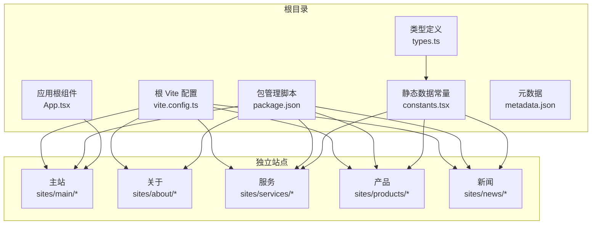
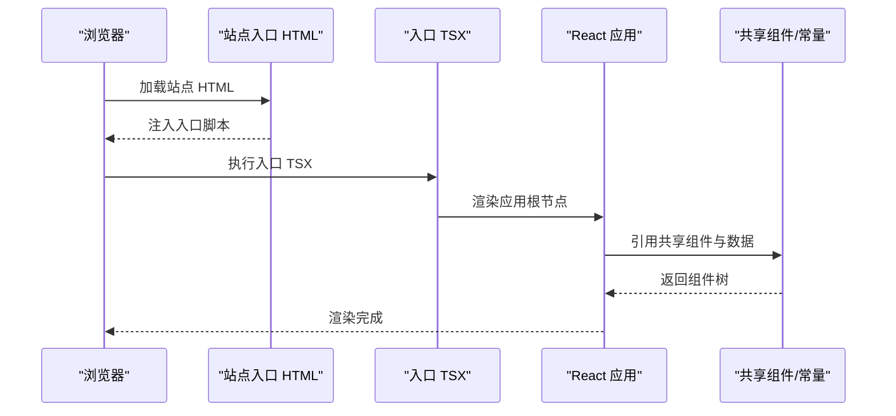
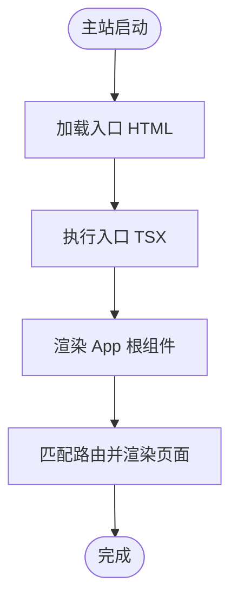
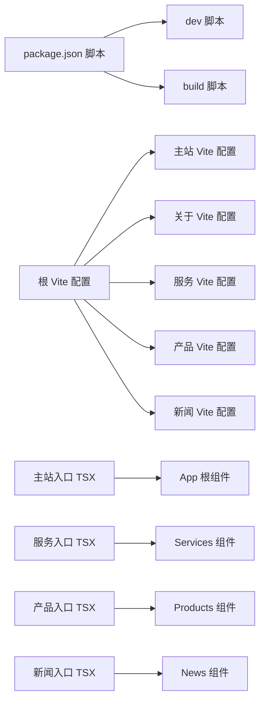

# 独立站点配置

<cite>
**本文档引用的文件**
- [vite.config.ts](file://vite.config.ts)
- [sites/main/vite.config.ts](file://sites/main/vite.config.ts)
- [sites/about/vite.config.ts](file://sites/about/vite.config.ts)
- [sites/services/vite.config.ts](file://sites/services/vite.config.ts)
- [sites/products/vite.config.ts](file://sites/products/vite.config.ts)
- [sites/news/vite.config.ts](file://sites/news/vite.config.ts)
- [sites/main/main.tsx](file://sites/main/main.tsx)
- [sites/main/index.html](file://sites/main/index.html)
- [sites/about/index.html](file://sites/about/index.html)
- [sites/services/services.tsx](file://sites/services/services.tsx)
- [sites/products/products.tsx](file://sites/products/products.tsx)
- [sites/news/news.tsx](file://sites/news/news.tsx)
- [App.tsx](file://App.tsx)
- [package.json](file://package.json)
- [constants.tsx](file://constants.tsx)
- [types.ts](file://types.ts)
- [metadata.json](file://metadata.json)
- [start-all-sites.bat](file://start-all-sites.bat)
</cite>

## 目录
1. [简介](#简介)
2. [项目结构](#项目结构)
3. [核心组件](#核心组件)
4. [架构总览](#架构总览)
5. [详细组件分析](#详细组件分析)
6. [依赖分析](#依赖分析)
7. [性能考虑](#性能考虑)
8. [故障排除指南](#故障排除指南)
9. [结论](#结论)
10. [附录](#附录)

## 简介
本文件面向威宇精密工程网站的独立站点配置，系统性说明各站点的入口文件、Vite 构建与开发服务器配置、路由设置与数据模型，以及环境变量、静态资源处理与代码分割策略。文档同时提供站点特定样式定制、组件复用与性能优化建议，并解释新增独立站点与扩展现有站点功能的方法。

## 项目结构
该仓库采用“多站点单仓库”的组织方式：根目录提供统一的 Vite 配置与共享组件、类型与常量；各独立站点位于 sites 目录下，拥有独立的入口 HTML、入口 TSX 与 Vite 配置，便于并行开发与差异化部署。

图表来源
- [vite.config.ts](file://vite.config.ts#L1-L24)
- [sites/main/vite.config.ts](file://sites/main/vite.config.ts#L1-L25)
- [sites/about/vite.config.ts](file://sites/about/vite.config.ts#L1-L25)
- [sites/services/vite.config.ts](file://sites/services/vite.config.ts#L1-L25)
- [sites/products/vite.config.ts](file://sites/products/vite.config.ts#L1-L25)
- [sites/news/vite.config.ts](file://sites/news/vite.config.ts#L1-L25)
- [App.tsx](file://App.tsx#L1-L112)
- [constants.tsx](file://constants.tsx#L1-L167)
- [types.ts](file://types.ts#L1-L30)
- [metadata.json](file://metadata.json#L1-L5)

章节来源
- [vite.config.ts](file://vite.config.ts#L1-L24)
- [package.json](file://package.json#L1-L23)

## 核心组件
- 应用根组件 App.tsx：集中定义路由（首页、关于、服务、流程、产品），并提供全局暗黑模式切换与滚动行为控制。
- 类型与常量：types.ts 定义新闻、产品、服务的数据结构；constants.tsx 提供静态演示数据。
- 元数据：metadata.json 描述站点名称与描述，用于平台集成或扩展用途。

章节来源
- [App.tsx](file://App.tsx#L41-L112)
- [types.ts](file://types.ts#L1-L30)
- [constants.tsx](file://constants.tsx#L1-L167)
- [metadata.json](file://metadata.json#L1-L5)

## 架构总览
独立站点通过各自的入口 HTML 与入口 TSX 启动，共享根级 Vite 配置与 React 组件库。主站使用 App.tsx 的路由体系；其他站点直接渲染对应页面组件，保持最小化入口与高内聚。

图表来源
- [sites/main/index.html](file://sites/main/index.html#L1-L24)
- [sites/main/main.tsx](file://sites/main/main.tsx#L1-L10)
- [sites/services/services.tsx](file://sites/services/services.tsx#L1-L24)
- [sites/products/products.tsx](file://sites/products/products.tsx#L1-L24)
- [sites/news/news.tsx](file://sites/news/news.tsx#L1-L24)
- [App.tsx](file://App.tsx#L1-L112)
- [constants.tsx](file://constants.tsx#L1-L167)

## 详细组件分析

### 主站（main）配置
- 入口文件：sites/main/main.tsx 将根组件 App 挂载到 DOM。
- HTML：sites/main/index.html 设置语言、Tailwind 引入与暗黑模式配置。
- Vite：sites/main/vite.config.ts 使用根目录别名与环境变量注入，端口 3000。
- 路由：App.tsx 定义首页与多页面路由，主站作为统一入口承载导航与页面集合。
- 数据：通过 constants.tsx 与 types.ts 提供新闻、产品、服务等数据模型与示例数据。

图表来源
- [sites/main/index.html](file://sites/main/index.html#L1-L24)
- [sites/main/main.tsx](file://sites/main/main.tsx#L1-L10)
- [App.tsx](file://App.tsx#L41-L112)

章节来源
- [sites/main/main.tsx](file://sites/main/main.tsx#L1-L10)
- [sites/main/index.html](file://sites/main/index.html#L1-L24)
- [sites/main/vite.config.ts](file://sites/main/vite.config.ts#L1-L25)
- [App.tsx](file://App.tsx#L41-L112)

### 关于我们（about）配置
- 入口 HTML：sites/about/index.html 提供独立标题与 Tailwind 配置。
- Vite：sites/about/vite.config.ts 与主站一致，端口 3001。
- 页面：about 站点未在当前仓库提供独立入口 TSX，通常可复用共享组件或按需扩展。

章节来源
- [sites/about/index.html](file://sites/about/index.html#L1-L24)
- [sites/about/vite.config.ts](file://sites/about/vite.config.ts#L1-L25)

### 服务（services）配置
- 入口 TSX：sites/services/services.tsx 直接渲染 Navbar、Services、Footer，形成最小化入口。
- Vite：sites/services/vite.config.ts 端口 3003。
- 数据：使用 constants.tsx 中的服务列表与 types.ts 中的服务项类型。

章节来源
- [sites/services/services.tsx](file://sites/services/services.tsx#L1-L24)
- [sites/services/vite.config.ts](file://sites/services/vite.config.ts#L1-L25)
- [constants.tsx](file://constants.tsx#L25-L48)
- [types.ts](file://types.ts#L23-L30)

### 产品（products）配置
- 入口 TSX：sites/products/products.tsx 直接渲染 Navbar、Products、Footer。
- Vite：sites/products/vite.config.ts 端口 3004。
- 数据：使用 constants.tsx 中的产品列表与类型约束。

章节来源
- [sites/products/products.tsx](file://sites/products/products.tsx#L1-L24)
- [sites/products/vite.config.ts](file://sites/products/vite.config.ts#L1-L25)
- [constants.tsx](file://constants.tsx#L50-L166)
- [types.ts](file://types.ts#L10-L21)

### 新闻（news）配置
- 入口 TSX：sites/news/news.tsx 直接渲染 Navbar、News、Footer。
- Vite：sites/news/vite.config.ts 端口 3002。
- 数据：使用 constants.tsx 中的新闻列表与类型约束。

章节来源
- [sites/news/news.tsx](file://sites/news/news.tsx#L1-L24)
- [sites/news/vite.config.ts](file://sites/news/vite.config.ts#L1-L25)
- [constants.tsx](file://constants.tsx#L4-L23)
- [types.ts](file://types.ts#L2-L8)

### 路由与页面组织
- 主站路由：App.tsx 在根路由下聚合首页模块，在二级路由下分别挂载关于、服务、流程、产品页面。
- 独立站点路由：services、products、news 采用入口 TSX 直接渲染对应页面，无需额外路由层。
- 暗黑模式：主站提供全局暗黑模式开关与样式动画，独立站点如需可复用该机制。

章节来源
- [App.tsx](file://App.tsx#L63-L85)

## 依赖分析
- 依赖关系：各站点入口 TSX 依赖共享组件（Navbar、Services、Products、News、Footer）与根组件 App；根 Vite 配置统一提供插件与别名。
- 环境变量：根 Vite 与各站点 Vite 配置均通过 loadEnv 注入 GEMINI_API_KEY，确保运行时可用。
- 包脚本：根 package.json 提供通用开发与构建命令，独立站点可通过批处理并行启动。

图表来源
- [package.json](file://package.json#L6-L10)
- [vite.config.ts](file://vite.config.ts#L5-L23)
- [sites/main/vite.config.ts](file://sites/main/vite.config.ts#L5-L24)
- [sites/about/vite.config.ts](file://sites/about/vite.config.ts#L5-L24)
- [sites/services/vite.config.ts](file://sites/services/vite.config.ts#L5-L24)
- [sites/products/vite.config.ts](file://sites/products/vite.config.ts#L5-L24)
- [sites/news/vite.config.ts](file://sites/news/vite.config.ts#L5-L24)
- [sites/main/main.tsx](file://sites/main/main.tsx#L1-L10)
- [sites/services/services.tsx](file://sites/services/services.tsx#L1-L24)
- [sites/products/products.tsx](file://sites/products/products.tsx#L1-L24)
- [sites/news/news.tsx](file://sites/news/news.tsx#L1-L24)
- [App.tsx](file://App.tsx#L1-L112)

章节来源
- [package.json](file://package.json#L1-L23)
- [vite.config.ts](file://vite.config.ts#L1-L24)

## 性能考虑
- 代码分割：建议在主站 App.tsx 的路由中对页面组件进行懒加载导入，以减少首屏体积与提升加载速度。
- 静态资源：通过根 Vite 配置的别名与静态资源目录统一管理图片与媒体资源，避免重复请求。
- 开发服务器：各站点使用不同端口并行启动，避免端口冲突；生产构建时可合并输出至同一目录或按站点拆分。
- 暗黑模式：主站已内置切换逻辑与样式动画，独立站点可按需启用以降低重复实现成本。

## 故障排除指南
- 端口占用：若启动失败，检查 start-all-sites.bat 中各站点端口是否被占用（3000–3004）。
- 环境变量：确认 GEMINI_API_KEY 已在 .env 文件中正确设置，以便 Vite 注入。
- 路由跳转：主站路由变更后需刷新页面，确保 ScrollToTop 生效。
- 组件缺失：about 站点缺少独立入口 TSX 时，可参考 services/products/news 的结构快速补齐。

章节来源
- [start-all-sites.bat](file://start-all-sites.bat#L1-L26)
- [vite.config.ts](file://vite.config.ts#L13-L16)
- [sites/main/vite.config.ts](file://sites/main/vite.config.ts#L14-L16)
- [sites/about/vite.config.ts](file://sites/about/vite.config.ts#L14-L16)
- [sites/services/vite.config.ts](file://sites/services/vite.config.ts#L14-L16)
- [sites/products/vite.config.ts](file://sites/products/vite.config.ts#L14-L16)
- [sites/news/vite.config.ts](file://sites/news/vite.config.ts#L14-L16)

## 结论
本仓库通过“多站点单仓库”模式实现了清晰的职责分离与高效开发体验。主站承担统一路由与导航，独立站点聚焦特定页面渲染与差异化配置。通过共享组件与常量、统一的 Vite 配置与环境变量注入，既保证了可维护性，也为后续扩展提供了良好基础。

## 附录

### 环境变量与静态资源
- 环境变量：GEMINI_API_KEY 通过 define 注入到运行时，便于在各站点中使用。
- 静态资源：入口 HTML 中引入 CDN 样式与脚本（如 Tailwind），建议在本地托管以提升稳定性与离线可用性。

章节来源
- [vite.config.ts](file://vite.config.ts#L13-L16)
- [sites/main/index.html](file://sites/main/index.html#L9-L17)
- [sites/about/index.html](file://sites/about/index.html#L9-L17)

### 代码分割策略建议
- 对主站的 AboutPage、ServicePage、ProcessPage、AllProductsPage 进行动态导入，减少初始包体。
- 对图片与媒体资源使用懒加载与占位图，改善首屏性能。

章节来源
- [App.tsx](file://App.tsx#L63-L69)

### 添加新独立站点步骤
- 在 sites 下新建目录（如 sites/newsite），添加入口 HTML 与入口 TSX。
- 复制任一站点的 vite.config.ts 并调整端口与别名路径。
- 如需路由，可在 App.tsx 中新增路由映射；如仅页面渲染，可沿用独立入口模式。
- 在 package.json 中增加 dev:newsite 脚本或在 start-all-sites.bat 中追加启动窗口。

章节来源
- [sites/services/vite.config.ts](file://sites/services/vite.config.ts#L1-L25)
- [sites/news/news.tsx](file://sites/news/news.tsx#L1-L24)
- [App.tsx](file://App.tsx#L63-L69)
- [start-all-sites.bat](file://start-all-sites.bat#L13-L21)