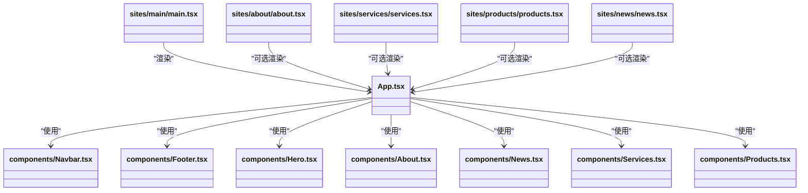

# 站点架构设计

<cite>
**本文引用的文件**
- [README.md](file://README.md)
- [package.json](file://package.json)
- [vite.config.ts](file://vite.config.ts)
- [App.tsx](file://App.tsx)
- [index.tsx](file://index.tsx)
- [sites/main/vite.config.ts](file://sites/main/vite.config.ts)
- [sites/about/vite.config.ts](file://sites/about/vite.config.ts)
- [sites/services/vite.config.ts](file://sites/services/vite.config.ts)
- [sites/products/vite.config.ts](file://sites/products/vite.config.ts)
- [sites/news/vite.config.ts](file://sites/news/vite.config.ts)
- [sites/main/main.tsx](file://sites/main/main.tsx)
- [sites/about/about.tsx](file://sites/about/about.tsx)
- [sites/services/services.tsx](file://sites/services/services.tsx)
- [sites/products/products.tsx](file://sites/products/products.tsx)
- [sites/news/news.tsx](file://sites/news/news.tsx)
</cite>

## 目录
1. [简介](#简介)
2. [项目结构](#项目结构)
3. [核心组件](#核心组件)
4. [架构总览](#架构总览)
5. [详细组件分析](#详细组件分析)
6. [依赖分析](#依赖分析)
7. [性能考虑](#性能考虑)
8. [故障排查指南](#故障排查指南)
9. [结论](#结论)
10. [附录](#附录)

## 简介
本文件面向“威宇精密工程”网站的多站点架构设计，系统化阐述 sites 目录的整体架构、各站点的独立入口点与职责分工、共享组件复用机制、Vite 配置中的路径别名与环境变量注入、构建与运行优化策略，并给出站点间数据共享与状态管理的建议方案。同时总结多站点部署的优势、挑战与最佳实践，帮助在保持可维护性的同时提升性能与扩展性。

## 项目结构
该仓库采用“单仓库多站点”的组织方式：
- 根级 Vite 配置与全局应用逻辑位于根目录，统一定义开发服务器端口、插件、环境变量注入与路径别名。
- 各子站点（main、about、services、products、news）分别拥有独立的入口文件与 Vite 配置，实现独立开发与构建。
- 共享组件与页面组件位于 components 目录，供多站点按需复用。

图表来源
- [vite.config.ts](file://vite.config.ts#L1-L24)
- [App.tsx](file://App.tsx#L1-L112)
- [index.tsx](file://index.tsx#L1-L17)
- [sites/main/vite.config.ts](file://sites/main/vite.config.ts#L1-L25)
- [sites/about/vite.config.ts](file://sites/about/vite.config.ts#L1-L25)
- [sites/services/vite.config.ts](file://sites/services/vite.config.ts#L1-L25)
- [sites/products/vite.config.ts](file://sites/products/vite.config.ts#L1-L25)
- [sites/news/vite.config.ts](file://sites/news/vite.config.ts#L1-L25)

章节来源
- [README.md](file://README.md#L1-L21)
- [package.json](file://package.json#L1-L23)
- [vite.config.ts](file://vite.config.ts#L1-L24)
- [App.tsx](file://App.tsx#L1-L112)
- [index.tsx](file://index.tsx#L1-L17)

## 核心组件
- 应用容器与路由：根级 App.tsx 定义了统一的导航、页脚、暗色模式切换、滚动到顶部行为以及全局动画样式；通过 React Router 的 Routes/Route 映射到首页与各页面。
- 根级入口：index.tsx 将 App 渲染到根节点，确保统一挂载流程。
- 多站点入口：各站点的 main.tsx、about.tsx、services.tsx、products.tsx、news.tsx 分别渲染对应的应用容器或页面组件，形成独立入口点。
- 共享组件：components 目录下的 Navbar、Footer、Hero、About、News、Services、Products、Enquiry 及 pages 下的 AboutPage、ServicePage、ProcessPage、AllProductsPage 等，作为跨站点复用的基础单元。

章节来源
- [App.tsx](file://App.tsx#L1-L112)
- [index.tsx](file://index.tsx#L1-L17)
- [sites/main/main.tsx](file://sites/main/main.tsx#L1-L10)
- [sites/about/about.tsx](file://sites/about/about.tsx#L1-L24)
- [sites/services/services.tsx](file://sites/services/services.tsx#L1-L24)
- [sites/products/products.tsx](file://sites/products/products.tsx#L1-L24)
- [sites/news/news.tsx](file://sites/news/news.tsx#L1-L24)

## 架构总览
多站点架构以“共享内核 + 独立入口”为核心思想：
- 共享内核：根级 App.tsx 提供统一的路由、主题切换、滚动行为与全局样式；components 目录提供可复用的布局与业务组件。
- 独立入口：每个站点拥有独立的入口文件与 Vite 配置，便于独立开发、调试与构建。
- 环境隔离：各站点通过 loadEnv 从根目录加载环境变量，统一注入到各自构建中，避免硬编码。

图表来源
- [sites/main/main.tsx](file://sites/main/main.tsx#L1-L10)
- [App.tsx](file://App.tsx#L1-L112)
- [vite.config.ts](file://vite.config.ts#L1-L24)

## 详细组件分析

### 主站 main
- 职责：作为门户站点，承载首页内容（Hero、About、News、Services、Products、Enquiry），并提供全局导航与页脚。
- 入口：sites/main/main.tsx 引入根级 App.tsx 并挂载。
- 配置：sites/main/vite.config.ts 指定独立根目录与端口，路径别名为根目录，环境变量从上级目录加载。

章节来源
- [sites/main/main.tsx](file://sites/main/main.tsx#L1-L10)
- [sites/main/vite.config.ts](file://sites/main/vite.config.ts#L1-L25)
- [App.tsx](file://App.tsx#L17-L28)

### 关于我们 about
- 职责：专注公司介绍与品牌故事，提供简洁一致的导航与页脚。
- 入口：sites/about/about.tsx 直接渲染 About 页面组件，不引入根级 App.tsx。
- 配置：独立 Vite 配置，端口与别名规则同其他站点。

章节来源
- [sites/about/about.tsx](file://sites/about/about.tsx#L1-L24)
- [sites/about/vite.config.ts](file://sites/about/vite.config.ts#L1-L25)

### 服务介绍 services
- 职责：展示服务体系与服务范围，强调专业性与可访问性。
- 入口：sites/services/services.tsx 渲染 Services 组件。
- 配置：独立 Vite 配置，端口与别名规则同其他站点。

章节来源
- [sites/services/services.tsx](file://sites/services/services.tsx#L1-L24)
- [sites/services/vite.config.ts](file://sites/services/vite.config.ts#L1-L25)

### 产品展示 products
- 职责：集中呈现产品线与技术能力，强调视觉与信息密度。
- 入口：sites/products/products.tsx 渲染 Products 组件。
- 配置：独立 Vite 配置，端口与别名规则同其他站点。

章节来源
- [sites/products/products.tsx](file://sites/products/products.tsx#L1-L24)
- [sites/products/vite.config.ts](file://sites/products/vite.config.ts#L1-L25)

### 新闻资讯 news
- 职责：发布行业动态与企业新闻，强调时效性与可读性。
- 入口：sites/news/news.tsx 渲染 News 组件。
- 配置：独立 Vite 配置，端口与别名规则同其他站点。

章节来源
- [sites/news/news.tsx](file://sites/news/news.tsx#L1-L24)
- [sites/news/vite.config.ts](file://sites/news/vite.config.ts#L1-L25)

### 根级应用 App.tsx
- 路由与页面：定义首页与多条路由，组合 Hero、About、News、Services、Products、Enquiry 等组件。
- 主题与交互：提供暗色模式切换、滚动到顶部、全局动画样式等。
- 复用策略：其他站点可通过引入 App.tsx 实现统一风格与行为。

图表来源
- [App.tsx](file://App.tsx#L41-L109)

章节来源
- [App.tsx](file://App.tsx#L1-L112)

### Vite 配置与路径别名
- 根级配置：统一开发服务器端口、插件、环境变量注入与路径别名；别名指向根目录，便于跨站点共享组件导入。
- 站点配置：各站点独立设置 root、端口与 host；别名同样指向根目录，确保与根级配置一致；环境变量通过 loadEnv 从上级目录加载，保证 API 密钥等敏感信息的安全与一致性。

图表来源
- [vite.config.ts](file://vite.config.ts#L5-L23)
- [sites/main/vite.config.ts](file://sites/main/vite.config.ts#L5-L24)
- [sites/about/vite.config.ts](file://sites/about/vite.config.ts#L5-L24)
- [sites/services/vite.config.ts](file://sites/services/vite.config.ts#L5-L24)
- [sites/products/vite.config.ts](file://sites/products/vite.config.ts#L5-L24)
- [sites/news/vite.config.ts](file://sites/news/vite.config.ts#L5-L24)

章节来源
- [vite.config.ts](file://vite.config.ts#L1-L24)
- [sites/main/vite.config.ts](file://sites/main/vite.config.ts#L1-L25)
- [sites/about/vite.config.ts](file://sites/about/vite.config.ts#L1-L25)
- [sites/services/vite.config.ts](file://sites/services/vite.config.ts#L1-L25)
- [sites/products/vite.config.ts](file://sites/products/vite.config.ts#L1-L25)
- [sites/news/vite.config.ts](file://sites/news/vite.config.ts#L1-L25)

### 站点间数据共享与状态管理
- 当前现状：各站点入口相对独立，未见集中式状态管理库或跨站点共享状态的实现。
- 推荐方案：
  - 使用 React Context 或轻量状态库（如 Zustand、Valtio）在根级 App.tsx 中集中管理共享状态（如语言、主题、用户态等）。
  - 对于需要持久化的数据（如用户偏好），可结合浏览器存储或后端接口。
  - 对于页面级状态，建议在各站点内部组件中局部管理，避免过度耦合。

章节来源
- [App.tsx](file://App.tsx#L42-L54)

### 组件继承与复用关系
- 继承关系：各站点入口文件对 App.tsx 或具体页面组件进行渲染，形成“入口 -> 应用/页面 -> 共享组件”的层级关系。
- 复用机制：共享组件（Navbar、Footer、Hero、About、News、Services、Products、Enquiry）位于根目录 components，被多站点按需引入，降低重复代码与维护成本。

图表来源
- [App.tsx](file://App.tsx#L1-L112)
- [sites/main/main.tsx](file://sites/main/main.tsx#L1-L10)
- [sites/about/about.tsx](file://sites/about/about.tsx#L1-L24)
- [sites/services/services.tsx](file://sites/services/services.tsx#L1-L24)
- [sites/products/products.tsx](file://sites/products/products.tsx#L1-L24)
- [sites/news/news.tsx](file://sites/news/news.tsx#L1-L24)

## 依赖分析
- 运行时依赖：React、React DOM、React Router DOM。
- 开发依赖：@vitejs/plugin-react、TypeScript、Vite。
- 包脚本：dev、build、preview，分别用于本地开发、生产构建与预览。

图表来源
- [package.json](file://package.json#L6-L21)

章节来源
- [package.json](file://package.json#L1-L23)

## 性能考虑
- 构建优化建议：
  - 启用产物压缩与分包策略，减少首屏加载时间。
  - 对第三方库进行外部化处理，利用 CDN 加速。
  - 合理拆分路由级组件，结合 React.lazy 与 Suspense 实现按需加载。
- 开发体验优化：
  - 使用根级 Vite 配置统一缓存与热更新策略。
  - 为各站点分配不同端口，避免端口冲突。
- 资源与网络：
  - 图片与媒体资源采用响应式尺寸与懒加载策略。
  - 通过别名缩短导入路径，减少解析开销。

## 故障排查指南
- 环境变量问题：
  - 确认 .env.local 文件存在且包含 GEMINI_API_KEY。
  - 各站点的 loadEnv 路径应正确指向根目录。
- 端口占用：
  - 若端口被占用，可在各站点 vite.config.ts 中调整 server.port。
- 路径别名无效：
  - 确保 @ 别名指向根目录，且各站点的 root 设置正确。
- 根节点不存在：
  - 确认 HTML 中存在 id 为 root 的挂载元素。

章节来源
- [README.md](file://README.md#L16-L20)
- [sites/main/vite.config.ts](file://sites/main/vite.config.ts#L8-L22)
- [sites/about/vite.config.ts](file://sites/about/vite.config.ts#L8-L22)
- [sites/services/vite.config.ts](file://sites/services/vite.config.ts#L8-L22)
- [sites/products/vite.config.ts](file://sites/products/vite.config.ts#L8-L22)
- [sites/news/vite.config.ts](file://sites/news/vite.config.ts#L8-L22)
- [index.tsx](file://index.tsx#L6-L9)

## 结论
该多站点架构以“共享内核 + 独立入口”为核心，既实现了统一的组件与主题风格，又保留了各站点的灵活性与独立性。通过根级 Vite 配置与路径别名，有效降低了模块解析复杂度；通过独立的站点入口与路由映射，提升了开发与部署效率。建议后续引入集中式状态管理与按需加载策略，进一步增强可维护性与性能表现。

## 附录
- 多站点部署优势：
  - 独立构建与发布，降低相互影响。
  - 灵活的域名与路径策略，便于 SEO 与品牌区分。
- 多站点部署挑战：
  - 跨站点共享资源的一致性与版本管理。
  - 环境变量与密钥的统一管理与安全控制。
- 最佳实践：
  - 使用统一的 CI/CD 流水线，按站点并行构建与测试。
  - 通过别名与模块联邦（Module Federation）进一步提升共享能力。
  - 对关键站点启用缓存与 CDN，优化全球访问性能。