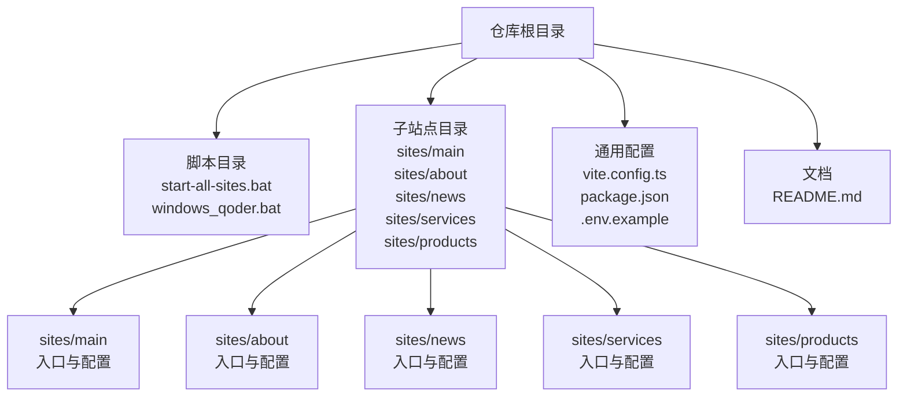
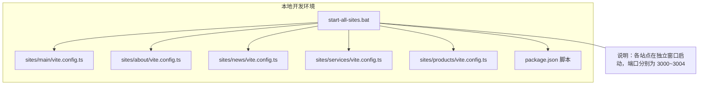
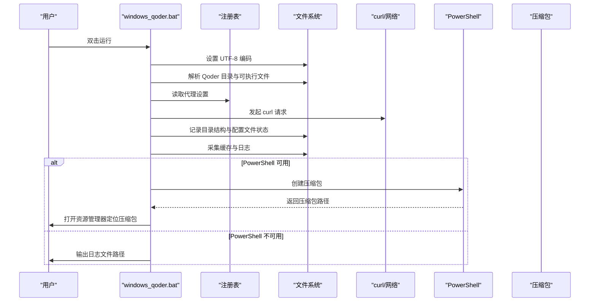
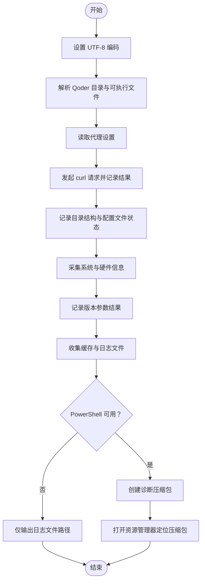

# 部署脚本系统

<cite>
**本文引用的文件**
- [start-all-sites.bat](file://start-all-sites.bat)
- [windows_qoder.bat](file://windows_qoder.bat)
- [package.json](file://package.json)
- [README.md](file://README.md)
- [sites/main/vite.config.ts](file://sites/main/vite.config.ts)
- [sites/about/vite.config.ts](file://sites/about/vite.config.ts)
- [sites/news/vite.config.ts](file://sites/news/vite.config.ts)
- [sites/services/vite.config.ts](file://sites/services/vite.config.ts)
- [sites/products/vite.config.ts](file://sites/products/vite.config.ts)
- [vite.config.ts](file://vite.config.ts)
- [.env.example](file://.env.example)
</cite>

## 目录
1. [简介](#简介)
2. [项目结构](#项目结构)
3. [核心组件](#核心组件)
4. [架构总览](#架构总览)
5. [详细组件分析](#详细组件分析)
6. [依赖分析](#依赖分析)
7. [性能考虑](#性能考虑)
8. [故障排除指南](#故障排除指南)
9. [结论](#结论)
10. [附录](#附录)

## 简介
本文件面向威宇精密工程网站的部署脚本系统，聚焦以下两类脚本：
- start-all-sites.bat：用于一次性启动多个子站点（主站、关于、新闻、服务、产品），统一输出各站点访问地址与控制提示。
- windows_qoder.bat：用于在 Windows 环境下诊断与收集 Qoder 工具链相关信息，生成诊断包以便问题排查。

文档将从功能、使用方法、执行流程、参数与错误处理、依赖检查、权限与兼容性、自定义与扩展、日志与故障排除、性能监控、跨平台运行与优化、以及 CI/CD 集成等方面进行系统化说明。

## 项目结构
仓库采用多站点（Monorepo）结构，每个子站点拥有独立的入口文件与 Vite 配置，根目录提供通用的 Vite 配置与脚本工具。关键位置如下：
- 根级脚本：start-all-sites.bat、windows_qoder.bat
- 子站点：sites/main、sites/about、sites/news、sites/services、sites/products
- 通用配置：vite.config.ts、package.json、.env.example
- 文档：README.md

图表来源
- [start-all-sites.bat](file://start-all-sites.bat#L1-L26)
- [windows_qoder.bat](file://windows_qoder.bat#L1-L231)
- [sites/main/vite.config.ts](file://sites/main/vite.config.ts#L1-L25)
- [sites/about/vite.config.ts](file://sites/about/vite.config.ts#L1-L25)
- [sites/news/vite.config.ts](file://sites/news/vite.config.ts#L1-L25)
- [sites/services/vite.config.ts](file://sites/services/vite.config.ts#L1-L25)
- [sites/products/vite.config.ts](file://sites/products/vite.config.ts#L1-L25)
- [vite.config.ts](file://vite.config.ts#L1-L24)
- [package.json](file://package.json#L1-L23)
- [.env.example](file://.env.example#L1-L6)
- [README.md](file://README.md#L1-L21)

章节来源
- [README.md](file://README.md#L1-L21)
- [package.json](file://package.json#L1-L23)
- [vite.config.ts](file://vite.config.ts#L1-L24)
- [sites/main/vite.config.ts](file://sites/main/vite.config.ts#L1-L25)
- [sites/about/vite.config.ts](file://sites/about/vite.config.ts#L1-L25)
- [sites/news/vite.config.ts](file://sites/news/vite.config.ts#L1-L25)
- [sites/services/vite.config.ts](file://sites/services/vite.config.ts#L1-L25)
- [sites/products/vite.config.ts](file://sites/products/vite.config.ts#L1-L25)

## 核心组件
- 多站点启动脚本：start-all-sites.bat
  - 功能：依次启动主站、关于、新闻、服务、产品五个站点，分别在不同端口提供本地开发服务器。
  - 参数：无显式命令行参数；通过内部 npm 脚本名称区分站点。
  - 错误处理：未见显式错误捕获与重试逻辑；若某站点启动失败，需手动查看对应窗口输出。
  - 执行流程：打印提示 → 启动各站点 → 输出“全部启动完成”提示 → 暂停等待用户操作。
- Qoder 诊断脚本：windows_qoder.bat
  - 功能：检测 Qoder 安装路径与可执行文件、抓取网络代理信息、记录 curl 请求结果、收集目录结构与配置文件状态、采集系统与硬件信息、调用版本查询、打包诊断压缩包并打开资源管理器定位。
  - 参数：无显式命令行参数；内部通过注册表与文件系统读取环境信息。
  - 错误处理：对关键文件缺失给出明确提示；当 PowerShell 不可用时降级输出日志文件路径。
  - 执行流程：设置编码 → 解析 Qoder 路径 → 写入日志头 → 抓取网络与系统信息 → 校验配置文件 → 记录版本与启动结果 → 收集缓存与日志 → 创建诊断包 → 打开结果位置。

章节来源
- [start-all-sites.bat](file://start-all-sites.bat#L1-L26)
- [windows_qoder.bat](file://windows_qoder.bat#L1-L231)

## 架构总览
下图展示脚本系统与站点配置之间的关系，以及启动流程的关键节点。

图表来源
- [start-all-sites.bat](file://start-all-sites.bat#L1-L26)
- [sites/main/vite.config.ts](file://sites/main/vite.config.ts#L1-L25)
- [sites/about/vite.config.ts](file://sites/about/vite.config.ts#L1-L25)
- [sites/news/vite.config.ts](file://sites/news/vite.config.ts#L1-L25)
- [sites/services/vite.config.ts](file://sites/services/vite.config.ts#L1-L25)
- [sites/products/vite.config.ts](file://sites/products/vite.config.ts#L1-L25)
- [package.json](file://package.json#L1-L23)

## 详细组件分析

### 组件 A：多站点启动脚本（start-all-sites.bat）
- 功能要点
  - 同步启动多个子站点，便于并行开发与联调。
  - 在启动前打印各站点访问地址，便于快速打开浏览器测试。
  - 使用 Windows 的 start 命令在独立 CMD 窗口中运行，避免阻塞。
- 参数与配置
  - 无外部命令行参数；通过 npm 脚本名称区分站点（如 dev:main、dev:about 等）。
  - 依赖 package.json 中的 scripts 字段提供具体命令。
- 错误处理
  - 未内置错误重试或失败回滚；若某个站点启动失败，建议检查对应窗口输出与端口占用情况。
- 执行流程（序列图）

图表来源
- [start-all-sites.bat](file://start-all-sites.bat#L1-L26)
- [package.json](file://package.json#L1-L23)

- 关键实现点（流程图）

图表来源
- [start-all-sites.bat](file://start-all-sites.bat#L1-L26)

章节来源
- [start-all-sites.bat](file://start-all-sites.bat#L1-L26)
- [package.json](file://package.json#L1-L23)

### 组件 B：Qoder 诊断脚本（windows_qoder.bat）
- 功能要点
  - 自动定位 Qoder 安装目录与可执行文件，记录版本信息。
  - 抓取系统与硬件信息、网络代理状态、目录结构与配置文件存在性。
  - 发起 curl 请求探测网络连通性，记录响应结果。
  - 收集缓存与日志文件，使用 PowerShell 创建诊断压缩包。
  - 若 PowerShell 不可用，则仅输出日志文件路径供人工查看。
- 参数与配置
  - 无命令行参数；内部通过注册表与文件系统读取环境信息。
  - 日志文件名包含日期与时间戳，便于归档与追踪。
- 错误处理
  - 对关键文件缺失与网络请求失败给出明确提示。
  - 当 PowerShell 不可用时，降级到仅输出日志文件路径。
- 执行流程（序列图）

图表来源
- [windows_qoder.bat](file://windows_qoder.bat#L1-L231)

- 关键实现点（流程图）

图表来源
- [windows_qoder.bat](file://windows_qoder.bat#L1-L231)

章节来源
- [windows_qoder.bat](file://windows_qoder.bat#L1-L231)

## 依赖分析
- start-all-sites.bat 依赖
  - Windows 批处理命令：start、cmd、timeout、cd。
  - npm 生态：通过 npm.cmd 调用各站点的开发脚本（如 dev:main）。
  - 各子站点的 Vite 配置：确保端口与主机绑定正确。
- windows_qoder.bat 依赖
  - Windows 注册表：读取代理设置。
  - 文件系统：遍历 Qoder 安装目录、读取配置与缓存文件。
  - 网络工具：curl 用于探测网络连通性。
  - PowerShell：用于创建压缩包；不可用时降级为仅输出日志。
- 环境变量与密钥
  - 项目使用 .env.example 提供 API 地址与 Gemini API Key 示例，实际运行需在本地环境准备相应配置文件。

章节来源
- [start-all-sites.bat](file://start-all-sites.bat#L1-L26)
- [windows_qoder.bat](file://windows_qoder.bat#L1-L231)
- [.env.example](file://.env.example#L1-L6)

## 性能考虑
- 并行启动策略
  - start-all-sites.bat 通过独立窗口并行启动各站点，减少串行等待时间；但需注意 CPU 与内存占用峰值。
- 端口与资源
  - 各站点端口连续且不冲突（3000~3004），避免端口争用导致启动失败。
- 网络探测
  - windows_qoder.bat 的 curl 请求会增加少量网络延迟，建议在网络稳定时运行。
- I/O 与磁盘
  - 诊断脚本会复制缓存与日志文件并创建压缩包，建议在空闲时段运行以降低对系统 I/O 的影响。

[本节为通用指导，无需列出章节来源]

## 故障排除指南
- start-all-sites.bat 常见问题
  - 端口被占用：检查 3000~3004 是否已被其他进程占用，必要时更换端口或终止占用进程。
  - npm 脚本不存在：确认 package.json 中是否存在 dev:main、dev:about、dev:news、dev:services、dev:products 等脚本。
  - 窗口立即关闭：若启动后窗口迅速关闭，检查对应站点的 Vite 配置与依赖安装是否完整。
- windows_qoder.bat 常见问题
  - Qoder.exe 不存在：确认 Qoder 安装路径与版本目录是否正确；脚本会自动解析最新版本目录。
  - PowerShell 不可用：脚本会降级输出日志文件路径，请手动查看日志内容。
  - 代理设置异常：脚本会记录代理启用状态，若网络不通，请检查代理配置。
  - 无法创建压缩包：确认目标目录写权限与磁盘空间充足。

章节来源
- [start-all-sites.bat](file://start-all-sites.bat#L1-L26)
- [windows_qoder.bat](file://windows_qoder.bat#L1-L231)

## 结论
- start-all-sites.bat 提供了便捷的一键多站点启动能力，适合本地联调与并行开发场景。
- windows_qoder.bat 提供了完善的诊断与日志收集能力，有助于快速定位 Qoder 相关问题。
- 建议在团队内统一端口规划与 npm 脚本命名，确保脚本可移植性与一致性。
- 在 CI/CD 环境中，可将脚本作为本地预检步骤，结合日志与诊断包提升问题定位效率。

[本节为总结性内容，无需列出章节来源]

## 附录

### A. 使用方法与最佳实践
- 启动多站点
  - 在仓库根目录双击 start-all-sites.bat，按提示打开各站点页面进行联调。
  - 如需停止所有服务器，可在任一 CMD 窗口中按 Ctrl+C。
- Qoder 诊断
  - 在仓库根目录双击 windows_qoder.bat，等待完成后根据提示查看诊断包或日志文件。
  - 将诊断包提交给技术支持以协助问题排查。

章节来源
- [start-all-sites.bat](file://start-all-sites.bat#L1-L26)
- [windows_qoder.bat](file://windows_qoder.bat#L1-L231)

### B. 参数配置与扩展
- 自定义站点端口
  - 修改各站点 vite.config.ts 中的 server.port 与 host，确保端口不冲突。
- 添加新站点
  - 在 sites 目录新增子目录与入口文件，更新 package.json 的开发脚本，并在 start-all-sites.bat 中追加启动命令。
- 环境变量
  - 参考 .env.example 设置 VITE_API_URL 与 GEMINI_API_KEY，确保本地开发正常。

章节来源
- [sites/main/vite.config.ts](file://sites/main/vite.config.ts#L1-L25)
- [sites/about/vite.config.ts](file://sites/about/vite.config.ts#L1-L25)
- [sites/news/vite.config.ts](file://sites/news/vite.config.ts#L1-L25)
- [sites/services/vite.config.ts](file://sites/services/vite.config.ts#L1-L25)
- [sites/products/vite.config.ts](file://sites/products/vite.config.ts#L1-L25)
- [package.json](file://package.json#L1-L23)
- [.env.example](file://.env.example#L1-L6)

### C. 跨平台运行与优化
- Linux/macOS 运行
  - start-all-sites.bat 为 Windows 批处理，Linux/macOS 可使用 shell 脚本替代；建议使用 tmux 或 screen 管理会话，实现并行启动与后台运行。
- 优化建议
  - 使用任务管理器或系统监视器观察资源占用，合理安排启动顺序与数量。
  - 在 CI/CD 中使用容器化方式运行，隔离依赖并加速构建。

[本节为通用指导，无需列出章节来源]

### D. CI/CD 集成与自动化部署
- 本地预检
  - 在 PR 或合并前运行 start-all-sites.bat 进行快速预检，确保端口与脚本可用。
- 诊断报告
  - 在自动化流程中调用 windows_qoder.bat，收集诊断包并上传至制品库，便于问题追溯。
- 持续集成
  - 在流水线中加入环境变量注入（如 .env 文件生成）、依赖安装与脚本执行步骤，确保每次构建的一致性。

[本节为通用指导，无需列出章节来源]