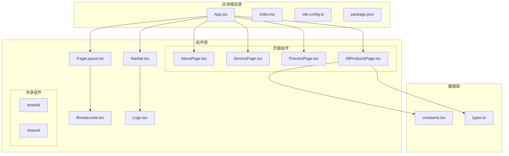
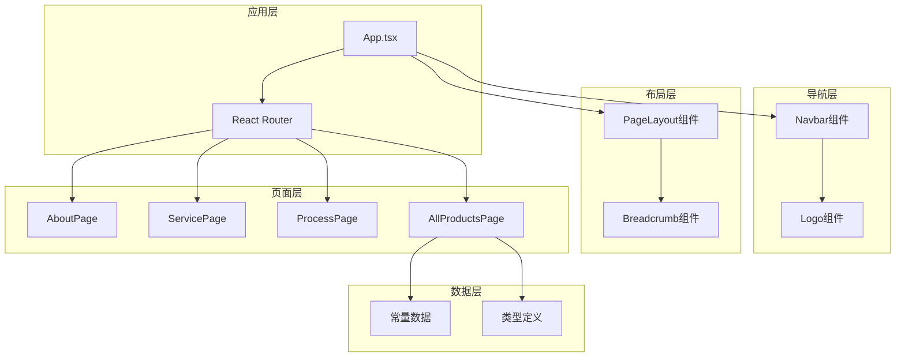
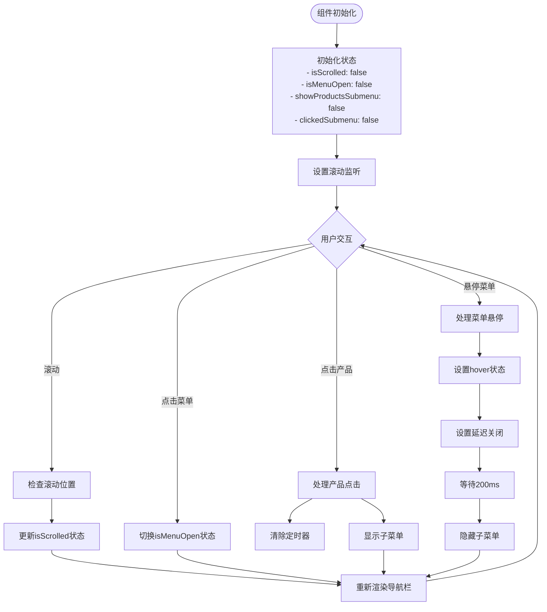
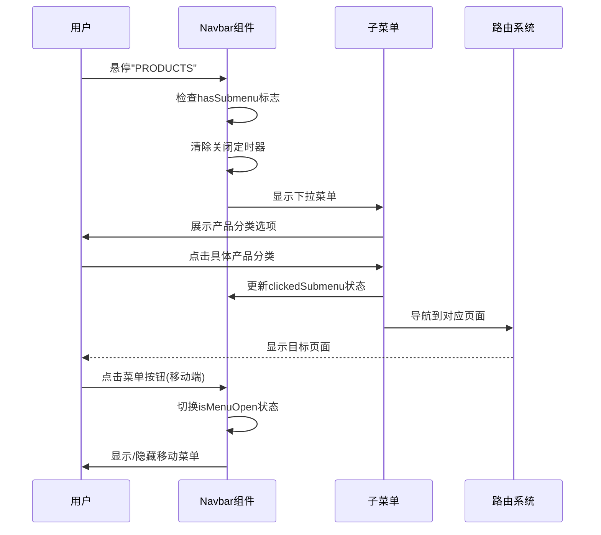
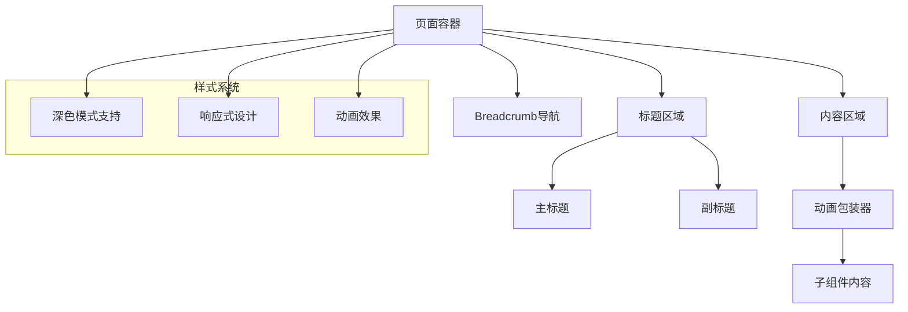
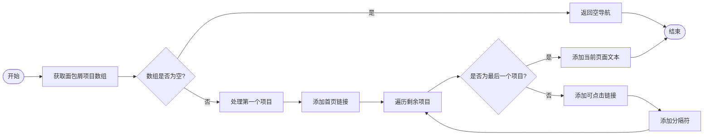
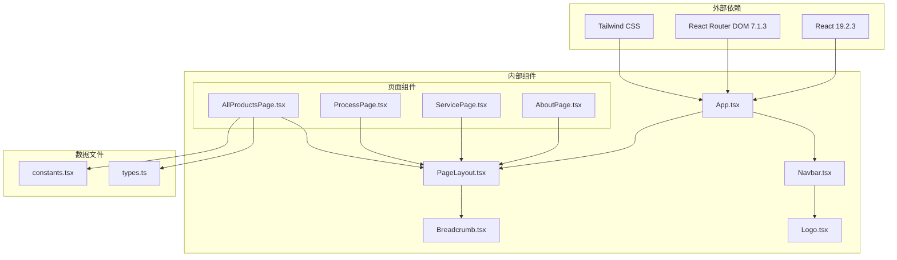
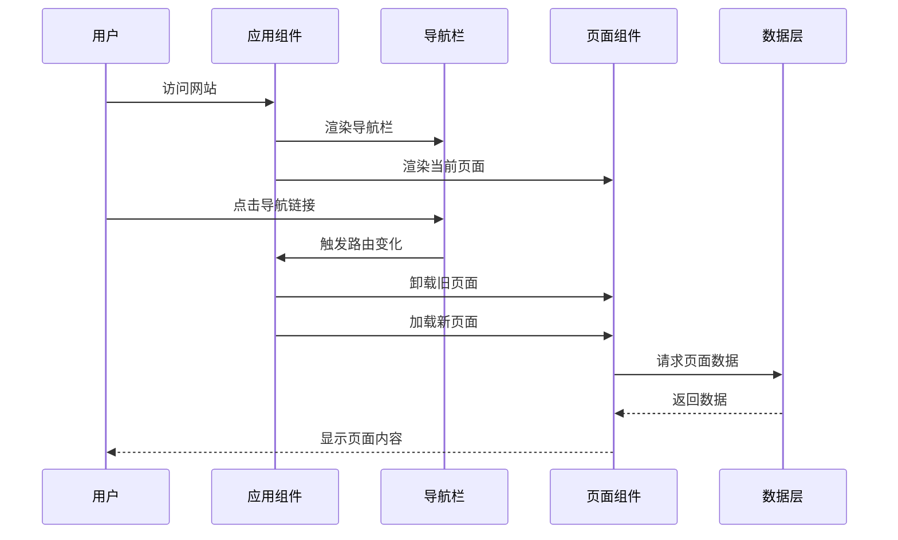

# 导航和布局系统

<cite>
**本文档引用的文件**
- [App.tsx](file://App.tsx)
- [index.tsx](file://index.tsx)
- [components/Navbar.tsx](file://components/Navbar.tsx)
- [components/shared/PageLayout.tsx](file://components/shared/PageLayout.tsx)
- [components/shared/Breadcrumb.tsx](file://components/shared/Breadcrumb.tsx)
- [components/pages/AboutPage.tsx](file://components/pages/AboutPage.tsx)
- [components/pages/ServicePage.tsx](file://components/pages/ServicePage.tsx)
- [components/pages/AllProductsPage.tsx](file://components/pages/AllProductsPage.tsx)
- [components/pages/ProcessPage.tsx](file://components/pages/ProcessPage.tsx)
- [components/Logo.tsx](file://components/Logo.tsx)
- [constants.tsx](file://constants.tsx)
- [types.ts](file://types.ts)
- [package.json](file://package.json)
- [vite.config.ts](file://vite.config.ts)
</cite>

## 目录
1. [简介](#简介)
2. [项目结构](#项目结构)
3. [核心组件](#核心组件)
4. [架构概览](#架构概览)
5. [详细组件分析](#详细组件分析)
6. [依赖关系分析](#依赖关系分析)
7. [性能考虑](#性能考虑)
8. [故障排除指南](#故障排除指南)
9. [结论](#结论)

## 简介

威宇精密工程网站采用现代化的React技术栈构建，专注于提供专业的导航和布局系统。该系统实现了响应式设计、流畅的用户体验和无障碍访问支持。项目基于React 19.2.3、React Router DOM 7.1.3和Vite 6.2.0构建，采用TypeScript进行类型安全编程。

系统的核心特色包括：
- 智能导航栏，支持桌面端和移动端的无缝切换
- 流畅的面包屑导航系统
- 灵活的页面布局组件
- 响应式断点和CSS媒体查询
- 深色模式支持和主题切换
- 动画过渡效果和用户体验优化

## 项目结构

项目采用模块化的组件架构，主要目录结构如下：

**图表来源**
- [App.tsx](file://App.tsx#L1-L112)
- [components/Navbar.tsx](file://components/Navbar.tsx#L1-L260)
- [components/shared/PageLayout.tsx](file://components/shared/PageLayout.tsx#L1-L41)

**章节来源**
- [App.tsx](file://App.tsx#L1-L112)
- [index.tsx](file://index.tsx#L1-L17)
- [vite.config.ts](file://vite.config.ts#L1-L24)

## 核心组件

### 导航栏组件 (Navbar)

Navbar组件是整个网站导航系统的核心，实现了复杂的交互逻辑和响应式设计。该组件包含以下关键特性：

#### 状态管理机制
- **滚动状态**: 监听窗口滚动事件，动态调整导航栏样式
- **菜单状态**: 控制移动端菜单的展开和收起
- **子菜单状态**: 管理产品分类下拉菜单的显示逻辑
- **定时器管理**: 使用setTimeout实现智能的菜单延迟关闭

#### 导航链接配置
组件定义了固定的导航链接数组，包含ABOUT US、SERVICE、PROCESS、PRODUCTS和ENQUIRY五个主要导航项。其中PRODUCTS链接具有下拉菜单功能。

#### 响应式设计
- **桌面端**: 显示完整的导航链接和下拉菜单
- **移动端**: 通过汉堡菜单按钮切换导航显示
- **断点设置**: 使用lg(1024px)作为移动端切换点

**章节来源**
- [components/Navbar.tsx](file://components/Navbar.tsx#L1-L260)

### 页面布局组件 (PageLayout)

PageLayout组件提供了统一的页面布局框架，确保所有页面具有一致的视觉风格和结构。

#### 布局结构
- **容器设计**: 最大宽度约束(max-w-7xl)和居中对齐
- **标题区域**: 支持主标题和副标题的双层标题系统
- **面包屑导航**: 自动集成的导航路径显示
- **内容区域**: 动画过渡的内容展示

#### 设计特性
- **暗色模式支持**: 完整的深色/浅色主题适配
- **动画效果**: 引入淡入向上动画增强用户体验
- **响应式间距**: 使用px-6 py-12提供合适的内边距

**章节来源**
- [components/shared/PageLayout.tsx](file://components/shared/PageLayout.tsx#L1-L41)

### 面包屑导航组件 (Breadcrumb)

面包屑导航组件实现了智能的路径生成和用户导航体验优化。

#### 实现逻辑
- **动态路径生成**: 根据当前页面自动生成导航路径
- **链接处理**: 区分可点击的中间节点和当前页面的非链接节点
- **样式区分**: 当前页面使用强调色和粗体显示

#### 用户体验
- **回到首页**: 首个面包屑链接到根路径
- **平滑滚动**: 点击链接时自动滚动到页面顶部
- **无障碍支持**: 使用语义化的nav元素和适当的ARIA属性

**章节来源**
- [components/shared/Breadcrumb.tsx](file://components/shared/Breadcrumb.tsx#L1-L51)

## 架构概览

系统采用分层架构设计，确保各组件职责清晰且相互解耦。

**图表来源**
- [App.tsx](file://App.tsx#L41-L109)
- [components/Navbar.tsx](file://components/Navbar.tsx#L6-L260)
- [components/shared/PageLayout.tsx](file://components/shared/PageLayout.tsx#L16-L39)

## 详细组件分析

### 导航栏组件深度解析

#### 状态管理流程图

**图表来源**
- [components/Navbar.tsx](file://components/Navbar.tsx#L7-L22)
- [components/Navbar.tsx](file://components/Navbar.tsx#L53-L72)

#### 导航栏交互序列图

**图表来源**
- [components/Navbar.tsx](file://components/Navbar.tsx#L115-L153)
- [components/Navbar.tsx](file://components/Navbar.tsx#L167-L254)

#### 移动端适配策略

移动端导航采用汉堡菜单设计，实现了以下特性：

- **触摸友好**: 大尺寸点击区域，便于移动设备操作
- **滑动关闭**: 子菜单支持滑动手势关闭
- **层级管理**: 使用z-index确保菜单层级正确
- **动画过渡**: 平滑的展开/收起动画效果

**章节来源**
- [components/Navbar.tsx](file://components/Navbar.tsx#L158-L254)

### 页面布局组件详细分析

#### 布局结构设计

PageLayout组件采用了经典的三段式布局结构：

**图表来源**
- [components/shared/PageLayout.tsx](file://components/shared/PageLayout.tsx#L16-L39)

#### 响应式断点设计

系统采用Tailwind CSS的响应式断点系统：

- **移动端**: 默认基础样式
- **平板端**: md断点，调整字体大小和间距
- **桌面端**: lg断点，启用完整的导航功能
- **大屏端**: xl断点，进一步优化布局密度

**章节来源**
- [components/shared/PageLayout.tsx](file://components/shared/PageLayout.tsx#L21-L35)

### 面包屑导航实现

#### 路径生成算法

面包屑导航实现了智能的路径生成逻辑：

**图表来源**
- [components/shared/Breadcrumb.tsx](file://components/shared/Breadcrumb.tsx#L13-L47)

**章节来源**
- [components/shared/Breadcrumb.tsx](file://components/shared/Breadcrumb.tsx#L13-L47)

## 依赖关系分析

### 组件依赖图

**图表来源**
- [package.json](file://package.json#L11-L14)
- [App.tsx](file://App.tsx#L4-L15)

### 数据流分析

系统采用单向数据流架构，确保状态管理的可预测性和可维护性：

**图表来源**
- [App.tsx](file://App.tsx#L62-L69)
- [components/Navbar.tsx](file://components/Navbar.tsx#L86-L113)

**章节来源**
- [package.json](file://package.json#L1-L23)
- [vite.config.ts](file://vite.config.ts#L1-L24)

## 性能考虑

### 优化策略

系统采用了多项性能优化措施：

#### 状态管理优化
- **状态分离**: 将不同类型的导航状态分离管理，避免不必要的重渲染
- **事件清理**: 在组件卸载时清理滚动监听和定时器，防止内存泄漏
- **条件渲染**: 使用条件渲染减少DOM节点数量

#### 资源加载优化
- **懒加载**: 页面组件按需加载，减少初始包体积
- **图片优化**: 使用现代图片格式和适当的尺寸
- **CSS优化**: 使用原子化CSS减少样式文件大小

#### 用户体验优化
- **预加载**: 关键资源预加载，提升首屏速度
- **骨架屏**: 页面加载时显示占位符，改善感知性能
- **缓存策略**: 合理的浏览器缓存策略

## 故障排除指南

### 常见问题诊断

#### 导航栏不响应问题
1. **检查事件绑定**: 确认滚动事件监听器正确绑定
2. **验证状态更新**: 检查状态更新函数是否正确执行
3. **调试定时器**: 确认定时器清理逻辑正常工作

#### 移动端菜单显示异常
1. **检查CSS类名**: 验证响应式CSS类名正确应用
2. **测试触摸事件**: 确认触摸事件处理器正常工作
3. **验证z-index**: 检查菜单层级是否正确

#### 面包屑路径错误
1. **验证数据结构**: 检查面包屑项目数据格式
2. **检查路由配置**: 确认路由路径配置正确
3. **调试链接生成**: 验证链接生成逻辑

**章节来源**
- [components/Navbar.tsx](file://components/Navbar.tsx#L13-L22)
- [components/shared/Breadcrumb.tsx](file://components/shared/Breadcrumb.tsx#L13-L47)

## 结论

威宇精密工程网站的导航和布局系统展现了现代Web开发的最佳实践。系统通过精心设计的组件架构、响应式布局和用户体验优化，为用户提供了专业而流畅的导航体验。

### 主要成就

1. **组件化设计**: 清晰的组件边界和职责分离
2. **响应式架构**: 完善的移动端适配和断点设计
3. **用户体验**: 流畅的动画效果和直观的导航逻辑
4. **可维护性**: 良好的代码组织和类型安全

### 技术亮点

- 智能的状态管理机制
- 灵活的布局系统
- 完善的导航体验
- 现代化的开发工具链

该系统为类似的企业网站提供了优秀的参考模板，展示了如何在保持技术先进性的同时，确保良好的用户体验和可维护性。