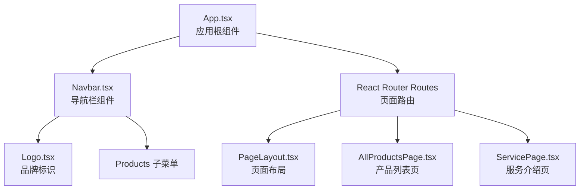
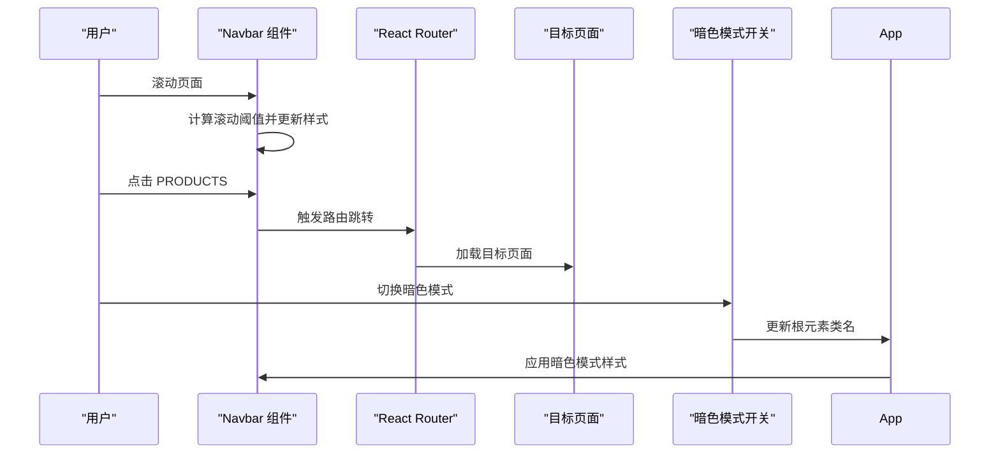
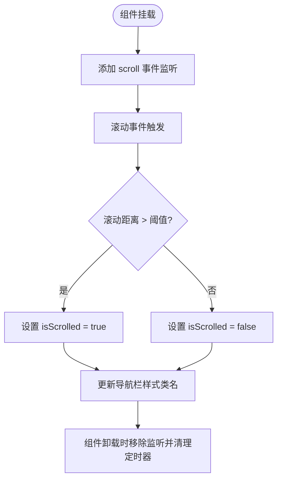
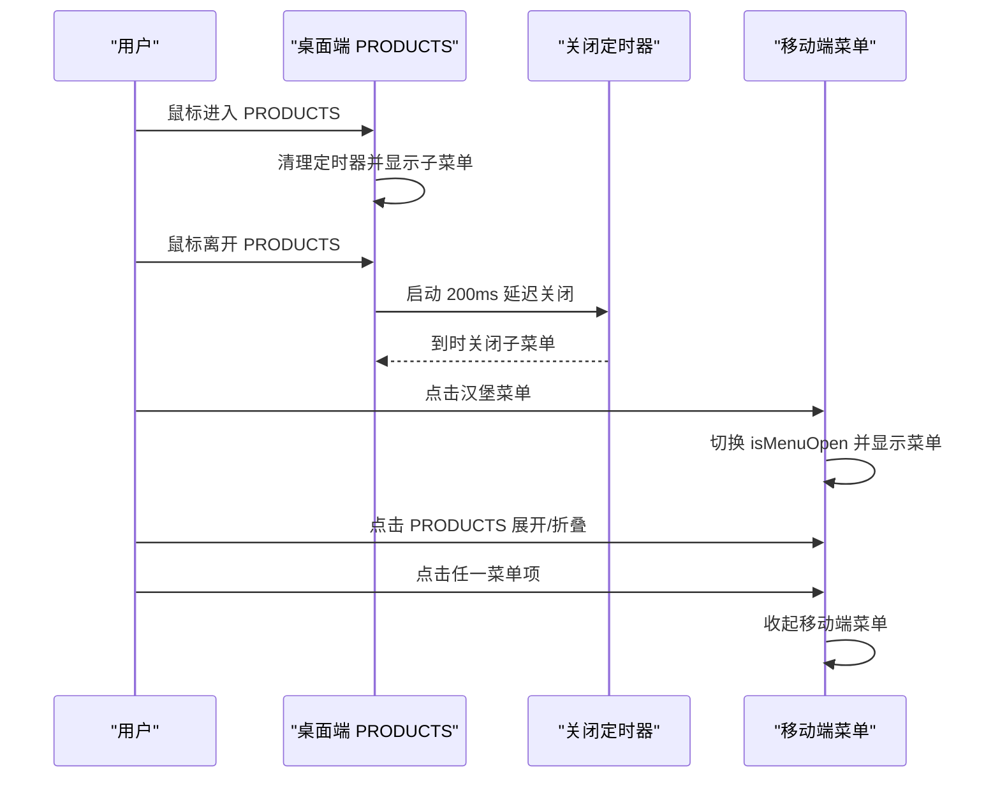
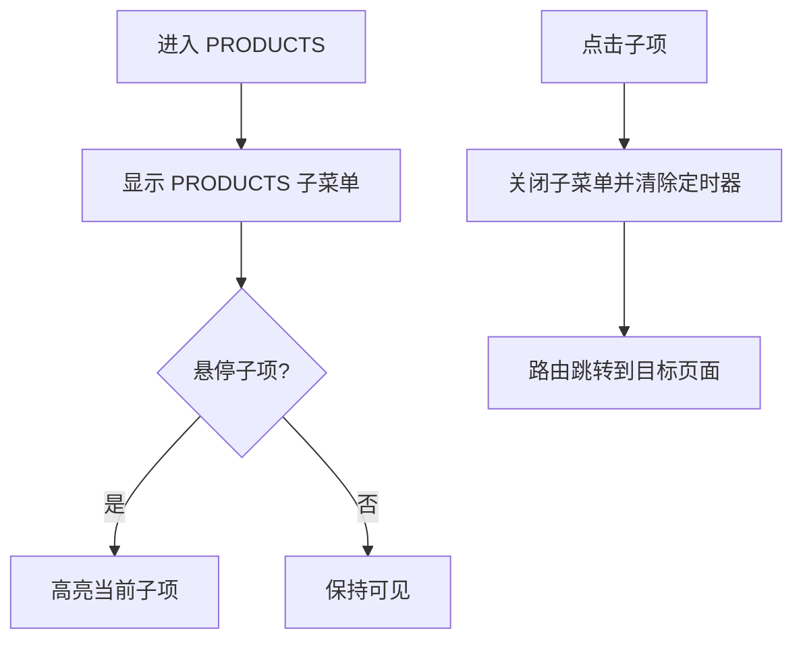
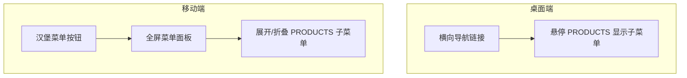
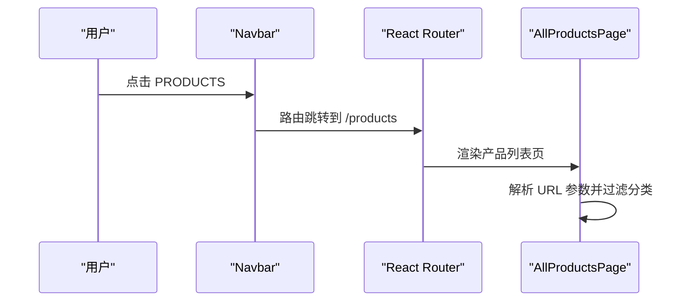
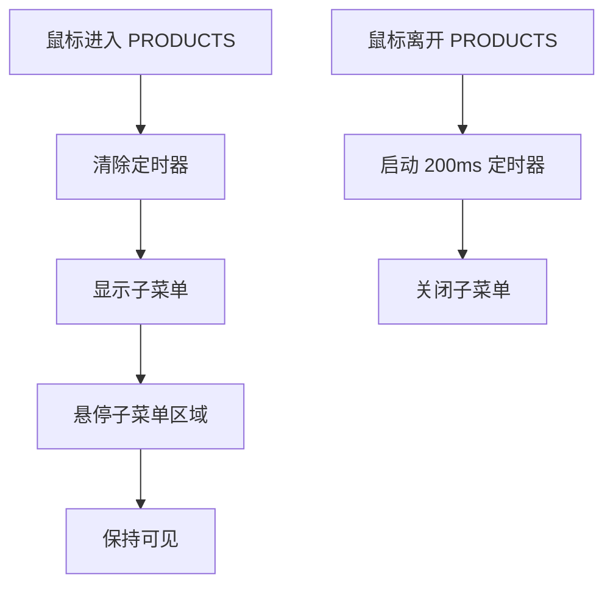
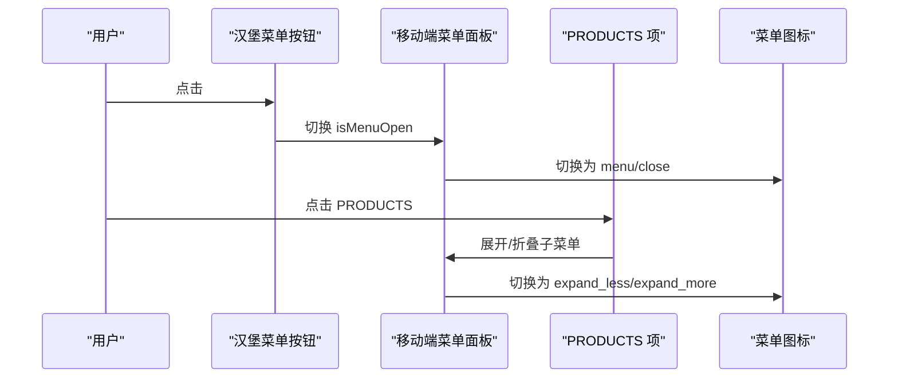
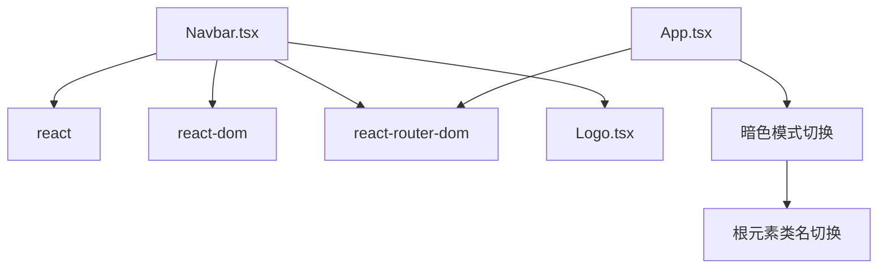

# 导航栏组件

<cite>
**本文档引用的文件**
- [components/Navbar.tsx](file://components/Navbar.tsx)
- [App.tsx](file://App.tsx)
- [components/shared/PageLayout.tsx](file://components/shared/PageLayout.tsx)
- [components/pages/AllProductsPage.tsx](file://components/pages/AllProductsPage.tsx)
- [components/pages/ServicePage.tsx](file://components/pages/ServicePage.tsx)
- [index.html](file://index.html)
- [package.json](file://package.json)
</cite>

## 目录
1. [简介](#简介)
2. [项目结构](#项目结构)
3. [核心组件](#核心组件)
4. [架构总览](#架构总览)
5. [详细组件分析](#详细组件分析)
6. [依赖关系分析](#依赖关系分析)
7. [性能考虑](#性能考虑)
8. [故障排除指南](#故障排除指南)
9. [结论](#结论)
10. [附录](#附录)

## 简介
本文件系统性解析导航栏组件（Navbar）的实现原理与使用方式，覆盖以下关键主题：
- 滚动状态检测：导航栏在滚动时的视觉变化与交互行为
- 菜单展开/收起逻辑：桌面端悬停触发与移动端点击切换
- 子菜单管理： PRODUCTS 子菜单的显示与隐藏策略
- 响应式设计：桌面端与移动端的差异化布局与交互
- 导航链接配置：静态链接与动态路由集成
- 悬停事件处理：鼠标进入/离开的延迟关闭机制
- 移动端菜单切换：汉堡菜单图标切换与动画效果
- 导航状态持久化与路由同步：滚动位置与URL参数联动
- 用户体验优化：过渡动画、延迟关闭、暗色模式适配
- 组件属性配置、样式定制与主题适配
- 无障碍访问支持与键盘导航建议

## 项目结构
导航栏组件位于 components 目录下，作为应用顶层路由的直接子组件被渲染。应用通过 React Router 进行路由管理，并在 App 中统一注入全局样式与暗色模式切换。

图表来源
- [App.tsx](file://App.tsx#L56-L108)
- [components/Navbar.tsx](file://components/Navbar.tsx#L1-L260)
- [components/shared/PageLayout.tsx](file://components/shared/PageLayout.tsx#L1-L41)
- [components/pages/AllProductsPage.tsx](file://components/pages/AllProductsPage.tsx#L1-L281)
- [components/pages/ServicePage.tsx](file://components/pages/ServicePage.tsx#L1-L182)

章节来源
- [App.tsx](file://App.tsx#L41-L112)
- [components/Navbar.tsx](file://components/Navbar.tsx#L1-L260)

## 核心组件
- 组件名称：Navbar
- 所属文件：components/Navbar.tsx
- 功能概述：
  - 桌面端：悬停 PRODUCTS 项显示子菜单；滚动超过阈值时导航栏高度与背景发生变化
  - 移动端：点击汉堡菜单展开全屏菜单； PRODUCTS 项支持展开/折叠
  - 子菜单： PRODUCTS 下包含“全部”、“銘板”、“CNC”等分类链接
  - 路由集成：使用 react-router-dom 的 Link 与路由路径进行导航
  - 样式与主题：基于 Tailwind CSS 与自定义颜色变量，支持暗色模式

章节来源
- [components/Navbar.tsx](file://components/Navbar.tsx#L6-L260)

## 架构总览
导航栏组件与应用路由、页面布局以及暗色模式切换紧密协作，形成统一的导航体验。

图表来源
- [components/Navbar.tsx](file://components/Navbar.tsx#L13-L22)
- [App.tsx](file://App.tsx#L42-L54)
- [App.tsx](file://App.tsx#L56-L108)

章节来源
- [components/Navbar.tsx](file://components/Navbar.tsx#L38-L43)
- [App.tsx](file://App.tsx#L42-L54)
- [App.tsx](file://App.tsx#L56-L108)

## 详细组件分析

### 滚动状态检测
- 实现机制：监听 window.scroll 事件，当滚动距离超过阈值时设置 isScrolled 状态，从而改变导航栏的背景、阴影与高度
- 视觉反馈：导航栏在滚动后会变浅、带模糊背景与边框，提升可读性
- 清理策略：组件卸载时移除事件监听并清理定时器，避免内存泄漏

图表来源
- [components/Navbar.tsx](file://components/Navbar.tsx#L13-L22)

章节来源
- [components/Navbar.tsx](file://components/Navbar.tsx#L13-L22)

### 菜单展开/收起逻辑
- 桌面端：
  - PRODUCTS 项悬停时显示子菜单，离开时延时关闭，避免误触导致的闪烁
  - 子菜单区域同样支持悬停保持显示
- 移动端：
  - 点击汉堡菜单切换 isMenuOpen 状态，展开全屏菜单
  - PRODUCTS 项支持展开/折叠，同时保留“查看所有產品”的直达链接
  - 点击任一菜单项后自动收起移动端菜单

图表来源
- [components/Navbar.tsx](file://components/Navbar.tsx#L53-L72)
- [components/Navbar.tsx](file://components/Navbar.tsx#L118-L131)
- [components/Navbar.tsx](file://components/Navbar.tsx#L159-L164)
- [components/Navbar.tsx](file://components/Navbar.tsx#L186-L201)

章节来源
- [components/Navbar.tsx](file://components/Navbar.tsx#L53-L72)
- [components/Navbar.tsx](file://components/Navbar.tsx#L118-L131)
- [components/Navbar.tsx](file://components/Navbar.tsx#L159-L164)
- [components/Navbar.tsx](file://components/Navbar.tsx#L186-L201)

### 子菜单管理
- PRODUCTS 子菜单包含“全部”、“銘板”、“CNC”三个分类，点击任一项均会关闭 PRODUCTS 子菜单并清除定时器
- 桌面端与移动端均支持子菜单的展开/折叠与点击跳转
- 子菜单项具有不同的文本样式与悬停效果，突出首项“全部”

图表来源
- [components/Navbar.tsx](file://components/Navbar.tsx#L133-L151)
- [components/Navbar.tsx](file://components/Navbar.tsx#L232-L249)

章节来源
- [components/Navbar.tsx](file://components/Navbar.tsx#L32-L36)
- [components/Navbar.tsx](file://components/Navbar.tsx#L133-L151)
- [components/Navbar.tsx](file://components/Navbar.tsx#L232-L249)

### 响应式设计
- 断点：lg（桌面端）及以上隐藏移动端菜单，显示横向导航链接；lg 以下显示汉堡菜单
- 字体与间距：桌面端使用更紧凑的字体与字距，移动端使用更大字号以提升可读性
- 动画：子菜单采用淡入上移动画，增强流畅感

图表来源
- [components/Navbar.tsx](file://components/Navbar.tsx#L48-L156)
- [components/Navbar.tsx](file://components/Navbar.tsx#L168-L254)

章节来源
- [components/Navbar.tsx](file://components/Navbar.tsx#L48-L156)
- [components/Navbar.tsx](file://components/Navbar.tsx#L168-L254)

### 导航链接配置与路由同步
- 静态链接：ABOUT US、SERVICE、PROCESS、ENQUIRY 等
- PRODUCTS：支持子菜单与分类筛选（AllProductsPage 中通过 URL 参数实现）
- 路由同步：点击 PRODUCTS 或其子项后，导航栏状态重置，确保用户体验一致

图表来源
- [components/Navbar.tsx](file://components/Navbar.tsx#L24-L30)
- [components/Navbar.tsx](file://components/Navbar.tsx#L32-L36)
- [components/pages/AllProductsPage.tsx](file://components/pages/AllProductsPage.tsx#L15-L23)

章节来源
- [components/Navbar.tsx](file://components/Navbar.tsx#L24-L36)
- [components/pages/AllProductsPage.tsx](file://components/pages/AllProductsPage.tsx#L15-L23)

### 悬停事件处理与延迟关闭
- 桌面端 PRODUCTS 项的 onMouseEnter/onMouseLeave 事件配合定时器实现“延迟关闭”
- 进入 PRODUCTS 时清除定时器并显示子菜单；离开时启动定时器，避免鼠标移动过程中的闪烁
- 子菜单区域同样具备延迟关闭逻辑，提升交互稳定性

图表来源
- [components/Navbar.tsx](file://components/Navbar.tsx#L53-L72)
- [components/Navbar.tsx](file://components/Navbar.tsx#L118-L131)

章节来源
- [components/Navbar.tsx](file://components/Navbar.tsx#L53-L72)
- [components/Navbar.tsx](file://components/Navbar.tsx#L118-L131)

### 移动端菜单切换、按钮图标变化与动画效果
- 图标切换：汉堡菜单在打开/关闭时分别显示 menu 与 close
- 展开/折叠：点击 PRODUCTS 展开/折叠子菜单，图标相应变为 expand_less/expand_more
- 动画效果：移动端菜单面板与子菜单采用淡入上移动画，提升流畅度

图表来源
- [components/Navbar.tsx](file://components/Navbar.tsx#L159-L164)
- [components/Navbar.tsx](file://components/Navbar.tsx#L186-L201)
- [components/Navbar.tsx](file://components/Navbar.tsx#L132)

章节来源
- [components/Navbar.tsx](file://components/Navbar.tsx#L159-L164)
- [components/Navbar.tsx](file://components/Navbar.tsx#L186-L201)
- [components/Navbar.tsx](file://components/Navbar.tsx#L132)

### 导航状态持久化与用户体验优化
- 滚动状态：isScrolled 仅影响导航栏外观，不涉及路由或页面内容持久化
- 菜单状态：isMenuOpen 在移动端用于控制菜单显示，点击任一菜单项后自动收起
- 子菜单状态：showProductsSubmenu 控制 PRODUCTS 子菜单显示；点击子项后关闭并清除定时器
- 动画与过渡：统一的过渡时长与动画函数，保证交互一致性
- 暗色模式：通过切换根元素类名实现主题切换，导航栏样式随主题自动适配

章节来源
- [components/Navbar.tsx](file://components/Navbar.tsx#L7-L11)
- [components/Navbar.tsx](file://components/Navbar.tsx#L13-L22)
- [App.tsx](file://App.tsx#L42-L54)

### 组件属性配置、样式定制与主题适配
- 主题颜色：通过 Tailwind CSS 自定义颜色变量（primary、secondary、accent、base 等），支持暗色模式
- 字体与排版：桌面端使用较细的字距与字号，移动端使用更大字号提升可读性
- 动画：全局定义了淡入上移动画，子菜单与移动端菜单面板使用该动画
- 暗色模式：根元素添加 dark 类名，导航栏背景与文字颜色自动切换

章节来源
- [index.html](file://index.html#L13-L42)
- [index.html](file://index.html#L44-L105)
- [App.tsx](file://App.tsx#L42-L54)

### 无障碍访问支持与键盘导航建议
- 当前实现要点：
  - 使用语义化的 button 与 a/Link 元素，便于屏幕阅读器识别
  - 汉堡菜单按钮具备明确的标题属性，便于工具提示
  - 子菜单使用绝对定位与 z-index，避免层级问题
- 建议改进（通用实践）：
  - 为汉堡菜单按钮添加 aria-expanded 与 aria-controls 属性，指示菜单状态与关联元素
  - 为导航链接添加 aria-current="page"（结合路由库能力）以指示当前页面
  - 为移动端菜单添加 tabindex 与键盘事件（如 ESC 关闭），提升键盘可达性
  - 为子菜单容器添加 role="menu" 与子项 role="menuitem"，增强屏幕阅读器理解

章节来源
- [components/Navbar.tsx](file://components/Navbar.tsx#L159-L164)
- [components/Navbar.tsx](file://components/Navbar.tsx#L172-L183)
- [components/Navbar.tsx](file://components/Navbar.tsx#L216-L227)

## 依赖关系分析
- 依赖库：react、react-dom、react-router-dom
- 样式框架：Tailwind CSS（含插件 forms、typography、aspect-ratio）
- 字体资源：Material Icons 与多种 Google Fonts 字体
- 主题系统：基于 darkMode: "class" 的暗色模式切换

图表来源
- [package.json](file://package.json#L11-L21)
- [components/Navbar.tsx](file://components/Navbar.tsx#L2-L4)
- [App.tsx](file://App.tsx#L42-L54)

章节来源
- [package.json](file://package.json#L11-L21)
- [components/Navbar.tsx](file://components/Navbar.tsx#L2-L4)
- [App.tsx](file://App.tsx#L42-L54)

## 性能考虑
- 事件监听：滚动事件监听在组件挂载时添加，在卸载时移除，避免内存泄漏
- 定时器管理：子菜单延迟关闭使用定时器，离开时启动，进入时清理，防止重复定时器
- 动画与过渡：统一的过渡时长与动画函数，减少不必要的重绘与回流
- 路由跳转：使用 Link 组件进行客户端路由跳转，避免整页刷新

章节来源
- [components/Navbar.tsx](file://components/Navbar.tsx#L13-L22)
- [components/Navbar.tsx](file://components/Navbar.tsx#L67-L71)

## 故障排除指南
- 滚动事件未生效
  - 检查组件是否正确挂载并添加了 scroll 事件监听
  - 确认组件卸载时是否移除了监听器
- 子菜单无法关闭或频繁闪烁
  - 检查定时器是否正确启动与清理
  - 确认鼠标离开 PRODUCTS 与子菜单区域的事件绑定
- 移动端菜单无法展开/收起
  - 检查 isMenuOpen 状态是否正确切换
  - 确认点击事件是否阻止默认行为并正确调用 setState
- 暗色模式样式异常
  - 检查根元素是否正确添加/移除 dark 类名
  - 确认 Tailwind 配置中 darkMode 设置为 class

章节来源
- [components/Navbar.tsx](file://components/Navbar.tsx#L13-L22)
- [components/Navbar.tsx](file://components/Navbar.tsx#L67-L71)
- [components/Navbar.tsx](file://components/Navbar.tsx#L159-L164)
- [App.tsx](file://App.tsx#L42-L54)

## 结论
Navbar 组件通过简洁的状态管理与事件处理，实现了稳定的桌面端悬停交互与移动端点击切换体验。配合暗色模式与统一的动画体系，整体导航体验流畅且可维护。建议在未来版本中进一步增强无障碍支持（ARIA 属性与键盘导航），以满足更广泛的用户需求。

## 附录
- 页面布局与导航栏的关系：页面布局组件 PageLayout 与导航栏共同构成页面骨架，导航栏负责主导航，页面布局负责内容区的面包屑与标题展示
- 产品分类与导航：AllProductsPage 通过 URL 参数实现分类筛选，与 Navbar 的 PRODUCTS 子菜单形成一致的导航体验

章节来源
- [components/shared/PageLayout.tsx](file://components/shared/PageLayout.tsx#L16-L39)
- [components/pages/AllProductsPage.tsx](file://components/pages/AllProductsPage.tsx#L15-L42)