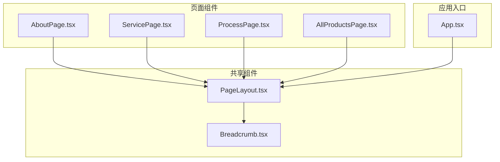
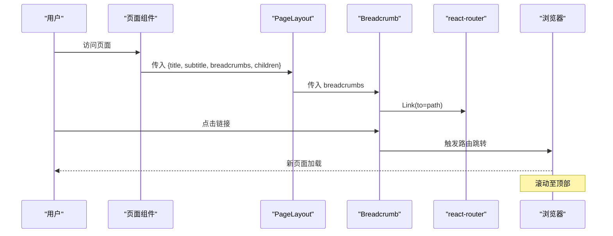
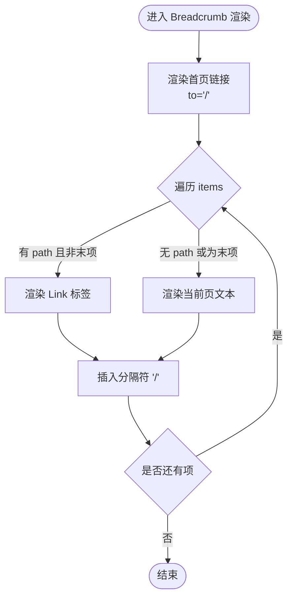
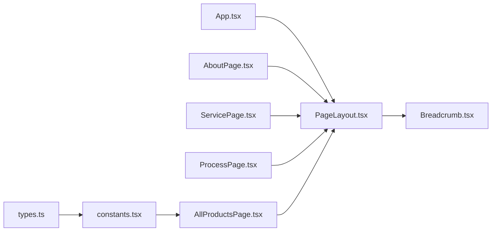
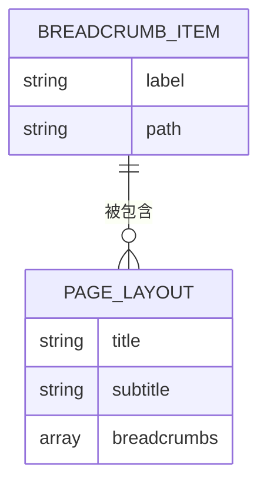

# 面包屑导航

<cite>
**本文引用的文件**
- [components/shared/Breadcrumb.tsx](file://components/shared/Breadcrumb.tsx)
- [components/shared/PageLayout.tsx](file://components/shared/PageLayout.tsx)
- [components/pages/AboutPage.tsx](file://components/pages/AboutPage.tsx)
- [components/pages/ServicePage.tsx](file://components/pages/ServicePage.tsx)
- [components/pages/ProcessPage.tsx](file://components/pages/ProcessPage.tsx)
- [components/pages/AllProductsPage.tsx](file://components/pages/AllProductsPage.tsx)
- [App.tsx](file://App.tsx)
- [types.ts](file://types.ts)
- [constants.tsx](file://constants.tsx)
- [metadata.json](file://metadata.json)
- [package.json](file://package.json)
- [vite.config.ts](file://vite.config.ts)
</cite>

## 目录
1. [简介](#简介)
2. [项目结构](#项目结构)
3. [核心组件](#核心组件)
4. [架构总览](#架构总览)
5. [详细组件分析](#详细组件分析)
6. [依赖关系分析](#依赖关系分析)
7. [性能考量](#性能考量)
8. [故障排查指南](#故障排查指南)
9. [结论](#结论)
10. [附录](#附录)

## 简介
本文件系统化梳理了项目中的面包屑导航组件，涵盖其数据结构、渲染逻辑、样式设计、分隔符与交互行为，并结合路由系统与页面布局进行端到端分析。同时给出国际化支持建议、SEO 优化思路、用户体验设计要点以及可扩展的配置项与自定义样式方案。

## 项目结构
面包屑导航由两个核心模块组成：
- Breadcrumb：负责渲染面包屑导航条，包含层级项与分隔符。
- PageLayout：页面通用布局容器，接收面包屑数据并注入到页面顶部。

页面侧通过各业务页面组件（如 AboutPage、ServicePage、ProcessPage、AllProductsPage）构造面包屑数据，传递给 PageLayout，最终由 Breadcrumb 渲染。

图表来源
- [components/shared/Breadcrumb.tsx](file://components/shared/Breadcrumb.tsx#L1-L51)
- [components/shared/PageLayout.tsx](file://components/shared/PageLayout.tsx#L1-L41)
- [components/pages/AboutPage.tsx](file://components/pages/AboutPage.tsx#L1-L144)
- [components/pages/ServicePage.tsx](file://components/pages/ServicePage.tsx#L1-L182)
- [components/pages/ProcessPage.tsx](file://components/pages/ProcessPage.tsx#L1-L297)
- [components/pages/AllProductsPage.tsx](file://components/pages/AllProductsPage.tsx#L1-L281)
- [App.tsx](file://App.tsx#L41-L112)

章节来源
- [components/shared/Breadcrumb.tsx](file://components/shared/Breadcrumb.tsx#L1-L51)
- [components/shared/PageLayout.tsx](file://components/shared/PageLayout.tsx#L1-L41)
- [components/pages/AboutPage.tsx](file://components/pages/AboutPage.tsx#L1-L144)
- [components/pages/ServicePage.tsx](file://components/pages/ServicePage.tsx#L1-L182)
- [components/pages/ProcessPage.tsx](file://components/pages/ProcessPage.tsx#L1-L297)
- [components/pages/AllProductsPage.tsx](file://components/pages/AllProductsPage.tsx#L1-L281)
- [App.tsx](file://App.tsx#L41-L112)

## 核心组件
- Breadcrumb 组件
  - 接收 items 数组，每个元素包含 label 与可选 path。
  - 渲染首项“首页”链接，其余项按顺序渲染，末尾项为当前页文本（无链接）。
  - 分隔符采用静态斜杠“/”，位于每个层级项之前。
  - 链接使用 react-router-dom 的 Link 组件，支持点击滚动至顶部。
- PageLayout 组件
  - 作为页面容器，接收 title、subtitle、breadcrumbs 与 children。
  - 将面包屑注入到内容区域上方，形成统一的页面骨架。
- 页面组件
  - 各页面组件内部构造 breadcrumbs 数组，传入 PageLayout。
  - 例如 AboutPage、ServicePage、ProcessPage 仅包含一个层级；AllProductsPage 也仅包含一个层级。

章节来源
- [components/shared/Breadcrumb.tsx](file://components/shared/Breadcrumb.tsx#L4-L11)
- [components/shared/Breadcrumb.tsx](file://components/shared/Breadcrumb.tsx#L13-L50)
- [components/shared/PageLayout.tsx](file://components/shared/PageLayout.tsx#L9-L14)
- [components/shared/PageLayout.tsx](file://components/shared/PageLayout.tsx#L16-L39)
- [components/pages/AboutPage.tsx](file://components/pages/AboutPage.tsx#L4-L14)
- [components/pages/ServicePage.tsx](file://components/pages/ServicePage.tsx#L4-L8)
- [components/pages/ProcessPage.tsx](file://components/pages/ProcessPage.tsx#L4-L8)
- [components/pages/AllProductsPage.tsx](file://components/pages/AllProductsPage.tsx#L25-L28)

## 架构总览
面包屑的运行时流程如下：
- 应用启动后，App 设置全局路由与滚动行为。
- 页面组件根据自身语义构造 breadcrumbs 数据。
- PageLayout 将 breadcrumbs 传递给 Breadcrumb。
- Breadcrumb 渲染导航条，用户点击链接触发路由跳转与滚动至顶。

图表来源
- [App.tsx](file://App.tsx#L30-L39)
- [components/shared/PageLayout.tsx](file://components/shared/PageLayout.tsx#L16-L39)
- [components/shared/Breadcrumb.tsx](file://components/shared/Breadcrumb.tsx#L13-L50)
- [components/pages/AboutPage.tsx](file://components/pages/AboutPage.tsx#L9-L14)
- [components/pages/ServicePage.tsx](file://components/pages/ServicePage.tsx#L78-L83)
- [components/pages/ProcessPage.tsx](file://components/pages/ProcessPage.tsx#L131-L136)
- [components/pages/AllProductsPage.tsx](file://components/pages/AllProductsPage.tsx#L84-L89)

## 详细组件分析

### Breadcrumb 组件
- 数据结构
  - BreadcrumbItem：label 必填，path 可选。
  - BreadcrumbProps：items 为 BreadcrumbItem[]。
- 渲染逻辑
  - 固定首项“首页”链接，指向根路径。
  - 其余项循环渲染，若存在 path 且非最后一项，则渲染为 Link；否则渲染为普通文本。
  - 每个层级前插入分隔符“/”。
- 交互行为
  - 首项 Link 点击时触发滚动至顶部。
  - 其他 Link 使用 react-router-dom 的 Link，自动处理路由跳转。
- 样式设计
  - 使用 Tailwind 类控制间距、颜色与过渡效果，适配明暗主题。
  - 当前页文本使用强调色与加粗以突出层级终点。

图表来源
- [components/shared/Breadcrumb.tsx](file://components/shared/Breadcrumb.tsx#L13-L50)

章节来源
- [components/shared/Breadcrumb.tsx](file://components/shared/Breadcrumb.tsx#L4-L11)
- [components/shared/Breadcrumb.tsx](file://components/shared/Breadcrumb.tsx#L13-L50)

### PageLayout 组件
- 职责
  - 作为页面骨架，统一标题、副标题与面包屑的展示位置。
  - 将 children 包裹在统一的容器内，保证页面内容的一致性与动画效果。
- 与 Breadcrumb 的协作
  - 通过 breadcrumbs 属性将页面级面包屑数据向下传递。

章节来源
- [components/shared/PageLayout.tsx](file://components/shared/PageLayout.tsx#L9-L14)
- [components/shared/PageLayout.tsx](file://components/shared/PageLayout.tsx#L16-L39)

### 页面组件中的面包屑使用
- AboutPage：仅包含“ABOUT US 关于我们”一项。
- ServicePage：仅包含“SERVICE 服务”一项。
- ProcessPage：仅包含“PROCESS 制程”一项。
- AllProductsPage：仅包含“PRODUCTS 产品”一项。

这些页面均通过构造 breadcrumbs 数组并传入 PageLayout 实现面包屑的注入。

章节来源
- [components/pages/AboutPage.tsx](file://components/pages/AboutPage.tsx#L4-L14)
- [components/pages/ServicePage.tsx](file://components/pages/ServicePage.tsx#L4-L8)
- [components/pages/ProcessPage.tsx](file://components/pages/ProcessPage.tsx#L4-L8)
- [components/pages/AllProductsPage.tsx](file://components/pages/AllProductsPage.tsx#L25-L28)

### 路由系统与导航历史
- App 中定义了基础路由（首页、关于、服务、制程、产品），并内置滚动至顶逻辑。
- Breadcrumb 首项“首页”链接指向根路径，确保用户可一键回到首页。
- react-router-dom 的 Link 组件负责处理导航与历史栈更新，配合滚动钩子实现平滑体验。

章节来源
- [App.tsx](file://App.tsx#L63-L69)
- [App.tsx](file://App.tsx#L30-L39)
- [components/shared/Breadcrumb.tsx](file://components/shared/Breadcrumb.tsx#L18-L24)

## 依赖关系分析
- 组件耦合
  - Breadcrumb 与 PageLayout 低耦合：Breadcrumb 仅依赖 items 属性；PageLayout 仅负责布局与透传。
  - 页面组件与布局解耦：页面组件仅负责构造面包屑数据，不关心具体渲染细节。
- 外部依赖
  - react-router-dom：提供 Link 组件与路由跳转能力。
  - Tailwind：提供样式类与响应式布局能力。
- 潜在循环依赖
  - 未发现直接循环导入；组件间为单向数据流。

图表来源
- [types.ts](file://types.ts#L1-L30)
- [constants.tsx](file://constants.tsx#L1-L167)
- [components/pages/AllProductsPage.tsx](file://components/pages/AllProductsPage.tsx#L1-L281)
- [App.tsx](file://App.tsx#L41-L112)
- [components/shared/PageLayout.tsx](file://components/shared/PageLayout.tsx#L1-L41)
- [components/shared/Breadcrumb.tsx](file://components/shared/Breadcrumb.tsx#L1-L51)
- [components/pages/AboutPage.tsx](file://components/pages/AboutPage.tsx#L1-L144)
- [components/pages/ServicePage.tsx](file://components/pages/ServicePage.tsx#L1-L182)
- [components/pages/ProcessPage.tsx](file://components/pages/ProcessPage.tsx#L1-L297)

章节来源
- [package.json](file://package.json#L11-L21)
- [vite.config.ts](file://vite.config.ts#L1-L24)

## 性能考量
- 渲染开销
  - Breadcrumb 为纯展示组件，列表项较少，渲染开销极低。
- 路由跳转
  - 使用 Link 组件进行客户端路由跳转，避免整页刷新，性能优异。
- 滚动行为
  - 在路由切换时执行滚动至顶，改善长页面切换体验，但需注意对首屏加载的影响。

## 故障排查指南
- 链接无效或跳转异常
  - 检查 Breadcrumb 中的 path 是否正确，确认页面路由已注册。
  - 确认 App 中的路由配置与 Link 的 to 值一致。
- 分隔符显示异常
  - 确认分隔符“/”在渲染逻辑中按层级前缀插入。
- 文本颜色与主题不符
  - 检查 Tailwind 类名与明暗主题类（如 dark）是否正确应用。
- 首页链接未滚动至顶
  - 确认 Breadcrumb 首项 Link 上的点击处理逻辑正常执行。

章节来源
- [components/shared/Breadcrumb.tsx](file://components/shared/Breadcrumb.tsx#L18-L24)
- [components/shared/Breadcrumb.tsx](file://components/shared/Breadcrumb.tsx#L28-L44)
- [App.tsx](file://App.tsx#L30-L39)

## 结论
当前面包屑导航组件结构清晰、职责单一，与路由系统和页面布局高度解耦。通过简单的数据驱动方式即可实现多层级导航的渲染与交互。建议后续在保持现有简洁性的基础上，增加国际化标签映射、SEO 结构化数据输出与动态层级生成能力，以进一步提升可维护性与用户体验。

## 附录

### 数据模型图

图表来源
- [components/shared/Breadcrumb.tsx](file://components/shared/Breadcrumb.tsx#L4-L11)
- [components/shared/PageLayout.tsx](file://components/shared/PageLayout.tsx#L9-L14)

### 国际化支持建议
- 将“首页”等固定文案抽取为 i18n 键值，按语言环境动态渲染。
- 对页面标题与面包屑 label 进行翻译映射，确保多语言场景下的一致性。

### SEO 优化建议
- 为面包屑容器添加结构化数据（如 JSON-LD 的 BreadcrumbList），提升搜索引擎理解。
- 确保每个 Link 的 href 与实际路由一致，避免重复内容与索引分散。
- 为当前页项设置 aria-current，增强可访问性。

### 用户体验设计要点
- 首项“首页”应始终可见且易于点击，作为导航锚点。
- 当前页文本使用强调色与加粗，明确当前位置。
- 移动端下分隔符与文字间距需适配小屏设备。

### 配置选项与扩展
- 支持自定义分隔符（如图标或自定义字符串）。
- 支持禁用滚动至顶或自定义滚动行为。
- 支持动态生成层级（基于路由路径或路由元信息）。
- 支持隐藏当前页项或显示完整路径。

### 与路由系统的集成方式
- 通过 react-router-dom 的 Link 组件实现导航。
- 通过 useLocation/useEffect 实现路由变化时的滚动控制。
- 通过路由注册与 Link to 值保持一致性，确保面包屑与路由同步。

章节来源
- [App.tsx](file://App.tsx#L30-L39)
- [components/shared/Breadcrumb.tsx](file://components/shared/Breadcrumb.tsx#L18-L24)
- [components/shared/Breadcrumb.tsx](file://components/shared/Breadcrumb.tsx#L30-L41)