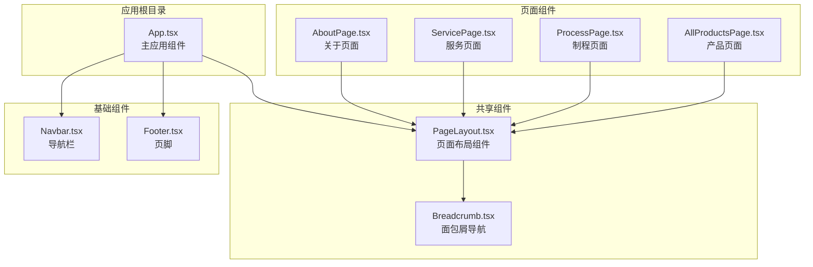
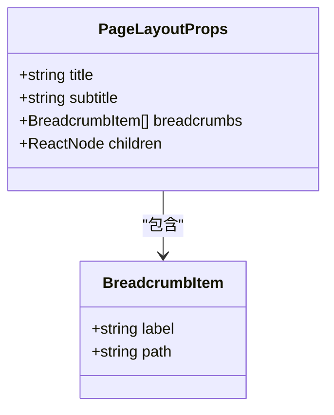
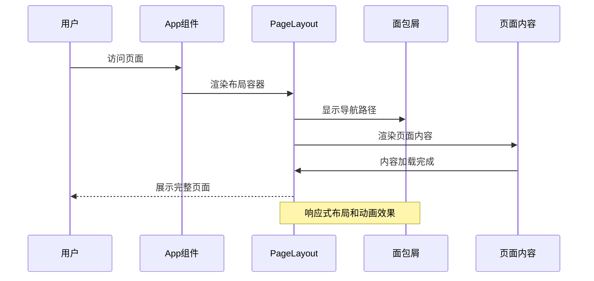
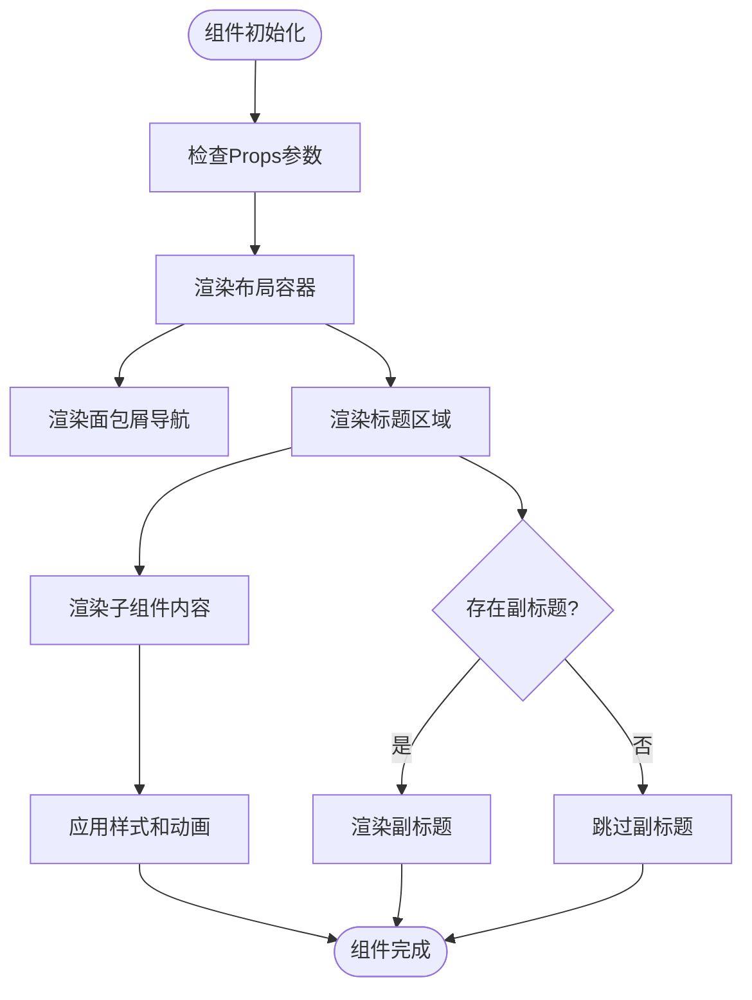
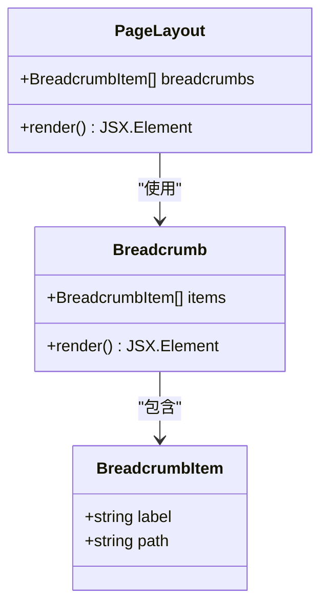
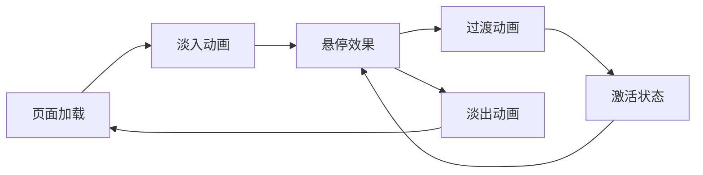
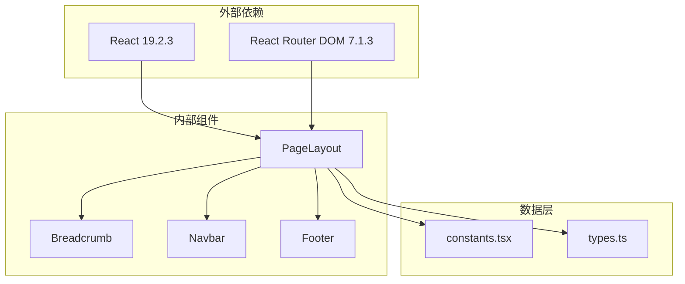

# 页面布局组件

<cite>
**本文档引用的文件**
- [PageLayout.tsx](file://components/shared/PageLayout.tsx)
- [Breadcrumb.tsx](file://components/shared/Breadcrumb.tsx)
- [App.tsx](file://App.tsx)
- [AboutPage.tsx](file://components/pages/AboutPage.tsx)
- [AllProductsPage.tsx](file://components/pages/AllProductsPage.tsx)
- [ProcessPage.tsx](file://components/pages/ProcessPage.tsx)
- [ServicePage.tsx](file://components/pages/ServicePage.tsx)
- [Navbar.tsx](file://components/Navbar.tsx)
- [Footer.tsx](file://components/Footer.tsx)
- [constants.tsx](file://constants.tsx)
- [types.ts](file://types.ts)
- [package.json](file://package.json)
</cite>

## 目录
1. [简介](#简介)
2. [项目结构](#项目结构)
3. [核心组件](#核心组件)
4. [架构概览](#架构概览)
5. [详细组件分析](#详细组件分析)
6. [依赖关系分析](#依赖关系分析)
7. [性能考虑](#性能考虑)
8. [故障排除指南](#故障排除指南)
9. [结论](#结论)

## 简介

页面布局组件（PageLayout）是威宇精密工程网站的核心布局系统，负责统一管理网站的页面结构、导航和内容展示。该组件采用现代化的响应式设计原则，结合Tailwind CSS实用类构建，实现了高度可定制的页面布局解决方案。

PageLayout组件通过清晰的三段式布局结构（头部导航、主要内容区域、页脚），为网站提供了统一的视觉语言和用户体验。组件支持深色模式切换、动画效果、网格系统和灵活的内容传递机制，能够适应各种业务页面的需求。

## 项目结构

该项目采用基于功能模块的组织方式，页面布局组件位于共享组件目录中，便于在整个应用中复用。

**图表来源**
- [App.tsx](file://App.tsx#L41-L109)
- [PageLayout.tsx](file://components/shared/PageLayout.tsx#L1-L41)
- [Breadcrumb.tsx](file://components/shared/Breadcrumb.tsx#L1-L51)

**章节来源**
- [App.tsx](file://App.tsx#L1-L112)
- [package.json](file://package.json#L1-L23)

## 核心组件

### PageLayout 组件概述

PageLayout组件是一个高度可配置的页面容器，提供统一的布局结构和样式系统。组件通过React函数式组件实现，支持TypeScript类型检查和严格的接口定义。

#### 主要特性

- **响应式设计**：支持移动端到桌面端的完整响应式覆盖
- **深色模式支持**：内置暗黑主题切换机制
- **动画效果**：提供淡入动画和过渡效果
- **网格系统**：集成Tailwind CSS网格布局
- **内容传递**：通过children属性支持任意内容嵌套

**章节来源**
- [PageLayout.tsx](file://components/shared/PageLayout.tsx#L9-L14)

### Props 接口定义

PageLayout组件通过明确的接口定义确保类型安全和开发体验：

**图表来源**
- [PageLayout.tsx](file://components/shared/PageLayout.tsx#L4-L14)

**章节来源**
- [PageLayout.tsx](file://components/shared/PageLayout.tsx#L9-L14)

## 架构概览

PageLayout组件在整个应用架构中扮演着关键角色，作为页面容器协调各个UI元素的交互。

**图表来源**
- [App.tsx](file://App.tsx#L56-L108)
- [PageLayout.tsx](file://components/shared/PageLayout.tsx#L16-L39)

### 布局结构设计

PageLayout组件采用三段式布局设计，每个部分都有明确的功能定位：

#### 头部区域（导航层）
- **面包屑导航**：提供页面层级导航和返回路径
- **深色模式切换**：全局主题切换功能
- **滚动行为控制**：路由切换时自动回到顶部

#### 主要内容区域（内容层）
- **标题系统**：支持主标题和副标题显示
- **网格布局**：基于Tailwind CSS的响应式网格系统
- **动画效果**：内容进入时的淡入动画
- **间距管理**：统一的内外边距和垂直间距

#### 底部区域（页脚层）
- **版权信息**：公司基本信息和版权声明
- **联系信息**：地址、电话、传真等联系方式

**章节来源**
- [PageLayout.tsx](file://components/shared/PageLayout.tsx#L16-L39)
- [App.tsx](file://App.tsx#L56-L108)

## 详细组件分析

### PageLayout 组件实现

PageLayout组件通过简洁的实现提供了强大的布局功能：

**图表来源**
- [PageLayout.tsx](file://components/shared/PageLayout.tsx#L16-L39)

#### 样式系统分析

组件采用分层样式架构，确保一致的视觉体验：

| 样式层次 | 作用域 | 示例类名 |
|---------|--------|----------|
| 基础容器 | 整个页面 | `min-h-screen bg-white dark:bg-slate-950` |
| 内容容器 | 主要内容区 | `max-w-7xl mx-auto px-6 py-12` |
| 标题样式 | 页面标题 | `text-4xl md:text-5xl font-bold mb-4` |
| 文本样式 | 普通文本 | `text-slate-600 dark:text-slate-400` |

**章节来源**
- [PageLayout.tsx](file://components/shared/PageLayout.tsx#L18-L36)

### Breadcrumb 组件集成

面包屑组件与PageLayout紧密集成，提供完整的导航体验：

**图表来源**
- [Breadcrumb.tsx](file://components/shared/Breadcrumb.tsx#L9-L11)
- [PageLayout.tsx](file://components/shared/PageLayout.tsx#L18-L19)

**章节来源**
- [Breadcrumb.tsx](file://components/shared/Breadcrumb.tsx#L13-L48)

### 响应式设计实现

组件通过Tailwind CSS的响应式断点实现跨设备兼容：

| 断点 | 最小宽度 | 类名前缀 | 使用场景 |
|------|----------|----------|----------|
| 默认 | 0px | 无前缀 | 移动设备基础样式 |
| sm | 640px | `sm:` | 小屏平板设备 |
| md | 768px | `md:` | 大屏平板和小屏桌面 |
| lg | 1024px | `lg:` | 中等桌面设备 |
| xl | 1280px | `xl:` | 大桌面设备 |
| 2xl | 1536px | `2xl:` | 超大桌面设备 |

**章节来源**
- [PageLayout.tsx](file://components/shared/PageLayout.tsx#L21-L31)

### 动画和过渡效果

组件集成了多种动画效果提升用户体验：

**图表来源**
- [App.tsx](file://App.tsx#L88-L105)

**章节来源**
- [App.tsx](file://App.tsx#L88-L105)

## 依赖关系分析

PageLayout组件的依赖关系相对简单但功能完整：

**图表来源**
- [package.json](file://package.json#L11-L21)
- [PageLayout.tsx](file://components/shared/PageLayout.tsx#L1-L2)

### 组件间耦合度分析

PageLayout组件与其它组件的耦合关系呈现以下特点：

- **低耦合设计**：主要依赖于React和React Router的基础功能
- **单向数据流**：通过props传递数据，避免复杂的事件传播
- **松散集成**：与面包屑组件的集成通过标准的React模式实现

**章节来源**
- [package.json](file://package.json#L11-L21)

## 性能考虑

### 渲染性能优化

PageLayout组件在设计时充分考虑了性能因素：

- **最小DOM树**：保持简洁的HTML结构减少渲染开销
- **CSS类复用**：通过Tailwind CSS类名复用减少样式计算
- **懒加载支持**：子组件可以按需加载，避免不必要的渲染

### 内存管理

组件在生命周期管理方面表现良好：

- **无状态组件**：纯函数式组件避免状态管理复杂性
- **无副作用**：不直接操作DOM，减少内存泄漏风险
- **清理机制**：配合React的自动清理机制

### 缓存策略

虽然PageLayout本身不涉及数据缓存，但可以与应用的整体缓存策略协同工作：

- **浏览器缓存**：利用浏览器的资源缓存机制
- **组件缓存**：React的组件缓存机制
- **样式缓存**：Tailwind CSS生成的样式缓存

## 故障排除指南

### 常见问题诊断

#### 样式不生效问题

**症状**：页面样式显示异常或主题切换无效

**可能原因**：
- Tailwind CSS未正确编译
- 深色模式类名冲突
- CSS优先级问题

**解决方法**：
1. 检查Tailwind配置文件
2. 确认深色模式类名正确添加到html元素
3. 检查CSS文件的加载顺序

#### 响应式布局问题

**症状**：在某些设备上布局错乱

**可能原因**：
- 断点设置不当
- 容器宽度限制
- 子组件样式冲突

**解决方法**：
1. 检查断点类名的使用
2. 验证容器的最大宽度设置
3. 确认子组件的响应式类名

#### 导航问题

**症状**：面包屑导航无法正常工作

**可能原因**：
- 路由配置错误
- 路径参数缺失
- 组件导入问题

**解决方法**：
1. 检查路由配置
2. 验证面包屑数据结构
3. 确认组件正确导入

**章节来源**
- [App.tsx](file://App.tsx#L42-L54)
- [Breadcrumb.tsx](file://components/shared/Breadcrumb.tsx#L18-L25)

## 结论

PageLayout组件作为威宇精密工程网站的核心布局系统，展现了现代前端开发的最佳实践。组件通过简洁的实现、清晰的接口设计和完善的响应式支持，为网站提供了稳定可靠的页面框架。

### 设计优势

1. **模块化设计**：组件职责单一，易于维护和测试
2. **类型安全**：完整的TypeScript支持确保开发质量
3. **响应式支持**：全面的跨设备兼容性
4. **主题适配**：灵活的深色模式支持
5. **性能优化**：简洁的实现减少不必要的开销

### 扩展建议

未来可以在现有基础上进行以下改进：

1. **插槽系统**：增加更多的自定义插槽支持
2. **主题系统**：实现更丰富的主题定制选项
3. **国际化**：添加多语言支持
4. **无障碍访问**：增强ARIA标签和键盘导航
5. **性能监控**：集成性能指标监控

PageLayout组件为整个网站奠定了坚实的技术基础，其设计理念和实现方式值得在类似的Web项目中借鉴和应用。