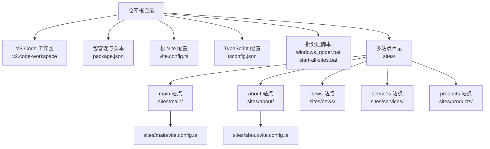
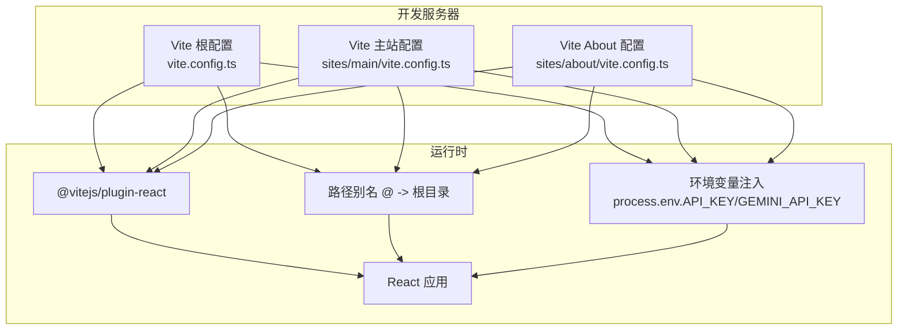
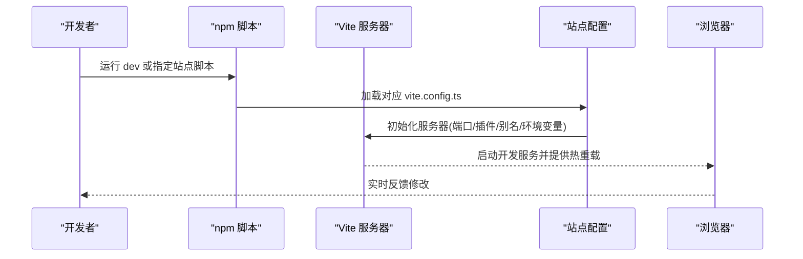
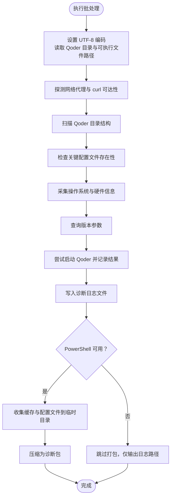
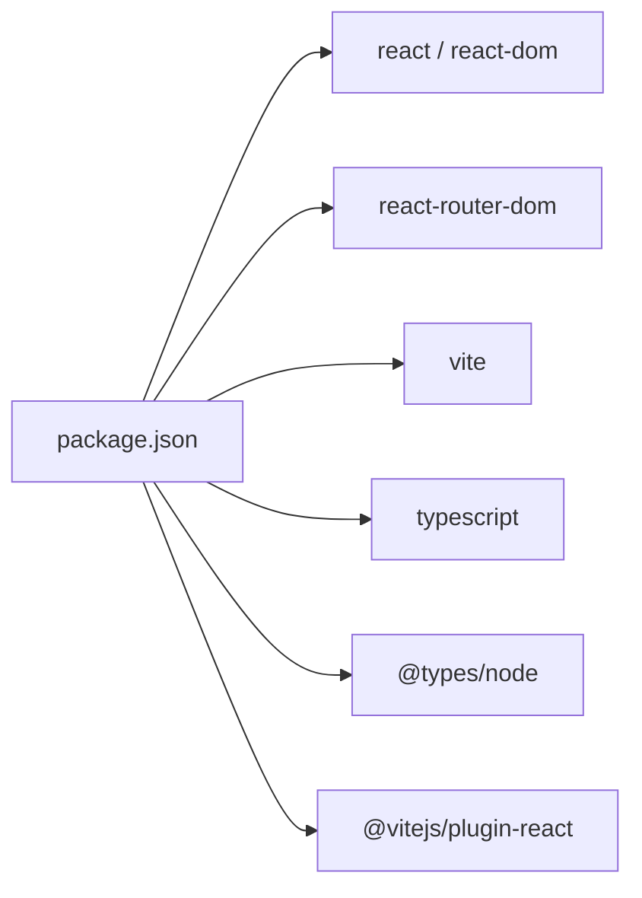

# 开发工具和调试

<cite>
**本文引用的文件**
- [v2.code-workspace](file://v2.code-workspace)
- [package.json](file://package.json)
- [windows_qoder.bat](file://windows_qoder.bat)
- [start-all-sites.bat](file://start-all-sites.bat)
- [vite.config.ts（根）](file://vite.config.ts)
- [vite.config.ts（main 站点）](file://sites/main/vite.config.ts)
- [vite.config.ts（about 站点）](file://sites/about/vite.config.ts)
- [tsconfig.json](file://tsconfig.json)
- [README.md](file://README.md)
- [Qoder 日志文件](file://qoder-diagnosis_週一 2026-02-02_11-58-20.88/Qoder_Log_週一 2026-02-02_11-58-16.10.txt)
</cite>

## 目录
1. [简介](#简介)
2. [项目结构](#项目结构)
3. [核心组件](#核心组件)
4. [架构总览](#架构总览)
5. [详细组件分析](#详细组件分析)
6. [依赖分析](#依赖分析)
7. [性能考虑](#性能考虑)
8. [故障排除指南](#故障排除指南)
9. [结论](#结论)
10. [附录](#附录)

## 简介
本文件面向威宇精密工程网站的前端开发与调试，聚焦 VS Code 工作区配置、开发调试流程、性能优化与任务自动化。内容涵盖：
- v2.code-workspace 的工作区设置与多根文件夹配置
- 多站点 Vite 配置与端口分配
- Windows 批处理脚本的使用：启动单站/全站、Qoder 诊断日志收集
- 代码格式化、类型检查与 IDE 配置建议
- 调试工具、性能分析与内存泄漏检测思路
- 热重载、源码映射与错误追踪
- 开发效率与团队协作建议
- 故障排除与最佳实践

## 项目结构
该仓库采用多站点（多入口）Vite 架构，主应用位于根目录，各子站点在 sites 目录下拥有独立的入口与配置。VS Code 工作区通过 v2.code-workspace 将当前目录作为单一根路径。

图表来源
- [v2.code-workspace](file://v2.code-workspace#L1-L8)
- [package.json](file://package.json#L1-L23)
- [vite.config.ts（根）](file://vite.config.ts#L1-L24)
- [vite.config.ts（main 站点）](file://sites/main/vite.config.ts#L1-L25)
- [vite.config.ts（about 站点）](file://sites/about/vite.config.ts#L1-L25)
- [tsconfig.json](file://tsconfig.json#L1-L29)
- [windows_qoder.bat](file://windows_qoder.bat#L1-L231)
- [start-all-sites.bat](file://start-all-sites.bat#L1-L26)

章节来源
- [v2.code-workspace](file://v2.code-workspace#L1-L8)
- [package.json](file://package.json#L1-L23)
- [vite.config.ts（根）](file://vite.config.ts#L1-L24)
- [vite.config.ts（main 站点）](file://sites/main/vite.config.ts#L1-L25)
- [vite.config.ts（about 站点）](file://sites/about/vite.config.ts#L1-L25)
- [tsconfig.json](file://tsconfig.json#L1-L29)
- [windows_qoder.bat](file://windows_qoder.bat#L1-L231)
- [start-all-sites.bat](file://start-all-sites.bat#L1-L26)

## 核心组件
- VS Code 工作区：v2.code-workspace 将当前目录作为单一根路径，便于统一设置与扩展管理。
- 包管理与脚本：package.json 定义了开发、构建与预览脚本，并声明 React、React Router 与 Vite 生态依赖。
- 多站点 Vite：根 vite.config.ts 与各站点 vite.config.ts 分别控制服务器端口、插件、别名与环境变量注入。
- TypeScript：tsconfig.json 统一编译选项，启用 JSX、路径别名与 bundler 模块解析。
- 批处理脚本：windows_qoder.bat 收集 Qoder 运行诊断信息；start-all-sites.bat 启动多站点开发服务器。

章节来源
- [v2.code-workspace](file://v2.code-workspace#L1-L8)
- [package.json](file://package.json#L1-L23)
- [vite.config.ts（根）](file://vite.config.ts#L1-L24)
- [vite.config.ts（main 站点）](file://sites/main/vite.config.ts#L1-L25)
- [vite.config.ts（about 站点）](file://sites/about/vite.config.ts#L1-L25)
- [tsconfig.json](file://tsconfig.json#L1-L29)
- [windows_qoder.bat](file://windows_qoder.bat#L1-L231)
- [start-all-sites.bat](file://start-all-sites.bat#L1-L26)

## 架构总览
多站点开发采用“根配置 + 子站点配置”的分层设计。根配置负责全局服务器、插件与别名；各站点配置覆盖 root、端口与别名，确保模块解析与开发体验一致。

图表来源
- [vite.config.ts（根）](file://vite.config.ts#L1-L24)
- [vite.config.ts（main 站点）](file://sites/main/vite.config.ts#L1-L25)
- [vite.config.ts（about 站点）](file://sites/about/vite.config.ts#L1-L25)

## 详细组件分析

### VS Code 工作区与多根文件夹配置
- 当前工作区将仓库根目录作为唯一文件夹，适合集中管理与统一设置。
- 若未来需要按功能或模块拆分工作区，可在 folders 中添加多个路径项，并在 settings 中进行差异化配置。

章节来源
- [v2.code-workspace](file://v2.code-workspace#L1-L8)

### 多站点 Vite 配置与端口管理
- 根 vite.config.ts 设置默认端口、host、React 插件与路径别名，同时注入环境变量。
- 各站点 vite.config.ts 覆盖 root、端口与别名，确保每个站点独立开发且共享根级别名。

图表来源
- [package.json](file://package.json#L6-L10)
- [vite.config.ts（根）](file://vite.config.ts#L1-L24)
- [vite.config.ts（main 站点）](file://sites/main/vite.config.ts#L1-L25)
- [vite.config.ts（about 站点）](file://sites/about/vite.config.ts#L1-L25)

章节来源
- [package.json](file://package.json#L6-L10)
- [vite.config.ts（根）](file://vite.config.ts#L1-L24)
- [vite.config.ts（main 站点）](file://sites/main/vite.config.ts#L1-L25)
- [vite.config.ts（about 站点）](file://sites/about/vite.config.ts#L1-L25)

### 批处理脚本：开发环境启动与任务自动化
- windows_qoder.bat：用于收集 Qoder 运行诊断信息，包括网络代理、curl 请求结果、目录结构、配置文件存在性、系统硬件信息、版本参数、缓存与日志文件等，并可打包生成诊断压缩包。
- start-all-sites.bat：批量启动所有站点开发服务器，分别在不同端口打开窗口，便于并行开发与对比。

图表来源
- [windows_qoder.bat](file://windows_qoder.bat#L1-L231)

章节来源
- [windows_qoder.bat](file://windows_qoder.bat#L1-L231)
- [start-all-sites.bat](file://start-all-sites.bat#L1-L26)

### TypeScript 与路径别名
- tsconfig.json 统一编译目标、模块系统、JSX 与路径别名，确保跨站点一致的类型检查与导入行为。
- Vite 配置中的 resolve.alias 与 tsconfig.json 的 paths 协同，保证开发时的模块解析一致。

章节来源
- [tsconfig.json](file://tsconfig.json#L1-L29)
- [vite.config.ts（根）](file://vite.config.ts#L17-L21)
- [vite.config.ts（main 站点）](file://sites/main/vite.config.ts#L18-L22)
- [vite.config.ts（about 站点）](file://sites/about/vite.config.ts#L18-L22)

### 环境变量与安全
- Vite 配置通过 define 注入环境变量，便于在客户端访问 API 密钥等敏感信息。
- README 提示需在 .env.local 中设置 GEMINI_API_KEY，建议在本地开发时使用受控的密钥管理策略。

章节来源
- [vite.config.ts（根）](file://vite.config.ts#L13-L16)
- [vite.config.ts（main 站点）](file://sites/main/vite.config.ts#L14-L17)
- [vite.config.ts（about 站点）](file://sites/about/vite.config.ts#L14-L17)
- [README.md](file://README.md#L16-L20)

### 热重载、源码映射与错误追踪
- Vite 默认启用 HMR，修改代码后浏览器自动刷新，配合 React 插件实现快速迭代。
- 源码映射由 Vite 与 TypeScript 编译器共同保障，结合浏览器开发者工具可定位到原始源文件。
- 错误追踪建议开启严格模式与 ESLint 规则，结合堆栈与断点进行定位。

章节来源
- [vite.config.ts（根）](file://vite.config.ts#L12-L12)
- [tsconfig.json](file://tsconfig.json#L1-L29)

## 依赖分析
- 依赖关系：React 与 React DOM 为运行时基础；React Router 用于路由；Vite 提供开发与构建；@vitejs/plugin-react 为开发加速；TypeScript 与 @types/node 提供类型支持。
- 环境变量：通过 Vite define 注入，避免硬编码在源码中。

图表来源
- [package.json](file://package.json#L11-L21)

章节来源
- [package.json](file://package.json#L11-L21)

## 性能考虑
- 服务器端口与 Host：根配置默认端口与 host 已设定，多站点可通过各自配置微调端口以避免冲突。
- 模块解析：统一的路径别名减少相对路径层级，提升可维护性与加载速度。
- 类型检查：noEmit 与 bundler 模式有助于更快的增量编译与更准确的模块解析。
- 构建与预览：使用 Vite 的 build 与 preview 脚本进行生产构建与本地预览验证。

章节来源
- [vite.config.ts（根）](file://vite.config.ts#L8-L11)
- [vite.config.ts（main 站点）](file://sites/main/vite.config.ts#L9-L12)
- [vite.config.ts（about 站点）](file://sites/about/vite.config.ts#L9-L12)
- [tsconfig.json](file://tsconfig.json#L26-L28)
- [package.json](file://package.json#L6-L10)

## 故障排除指南
- 端口占用：若端口被占用，调整对应站点 vite.config.ts 的 server.port。
- 环境变量未生效：确认 .env.local 文件存在且包含 GEMINI_API_KEY，重启开发服务器使变更生效。
- Qoder 诊断：使用 windows_qoder.bat 收集日志与缓存文件，定位网络、权限与版本问题。
- 多站点冲突：start-all-sites.bat 会为每个站点分配独立端口，如遇异常关闭多余窗口并检查端口占用。
- 源码映射失效：确保浏览器开发者工具启用 Source Map，并检查 tsconfig.json 与 Vite 配置中的路径别名一致性。

章节来源
- [vite.config.ts（根）](file://vite.config.ts#L8-L11)
- [vite.config.ts（main 站点）](file://sites/main/vite.config.ts#L9-L12)
- [vite.config.ts（about 站点）](file://sites/about/vite.config.ts#L9-L12)
- [README.md](file://README.md#L16-L20)
- [windows_qoder.bat](file://windows_qoder.bat#L1-L231)
- [start-all-sites.bat](file://start-all-sites.bat#L1-L26)
- [Qoder 日志文件](file://qoder-diagnosis_週一 2026-02-02_11-58-20.88/Qoder_Log_週一 2026-02-02_11-58-16.10.txt#L1-L54)

## 结论
本项目采用多站点 Vite 架构与统一的 VS Code 工作区配置，结合批处理脚本实现高效开发与诊断。通过明确的端口规划、路径别名与环境变量注入，开发者可在多站点并行开发的同时保持一致的开发体验。建议持续完善 Lint 与格式化规则，强化热重载与源码映射的调试流程，并在团队内规范密钥管理与诊断报告提交流程。

## 附录

### VS Code 开发调试建议
- 扩展推荐：ESLint、Prettier、TypeScript TSServer、Bracket Pair Colorizer
- 设置要点：启用 editor.formatOnSave、editor.codeActionsOnSave、typescript.preferences.importModuleSpecifier
- 调试配置：可在 launch.json 中为不同站点添加调试配置（如 Chrome/Edge 启动）

### 代码格式化与 Lint 规则建议
- 使用 Prettier 与 ESLint 统一风格；在 pre-commit 钩子中执行格式化与静态检查
- 针对 React 与 TypeScript 的规则组合，确保 JSX 与类型安全

### 性能分析与内存泄漏检测
- 使用浏览器 Performance 面板分析渲染与网络瓶颈
- 使用 Memory 面板监控堆内存增长，排查未释放的事件监听与定时器
- 对长列表与高频率更新的组件启用 React.memo 与 useMemo/useCallback

### 快捷键与团队协作
- VS Code 快捷键：Ctrl+Shift+P 打开命令面板；Ctrl+Shift+K 删除行；Ctrl+Shift+上下移动行
- 团队协作：统一分支命名、提交信息规范；使用 Pull Request 模板与代码评审流程