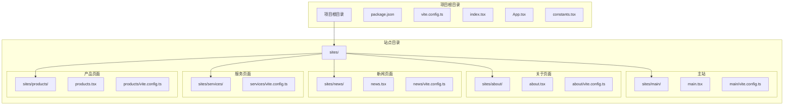
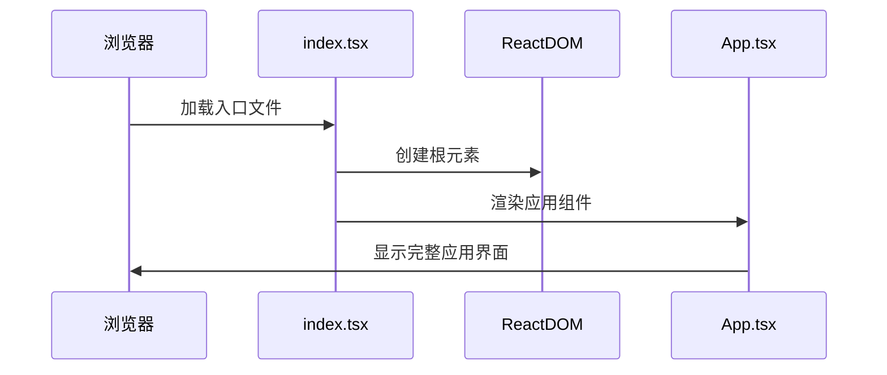
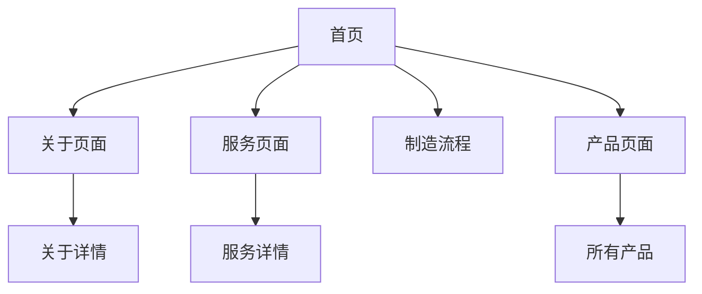
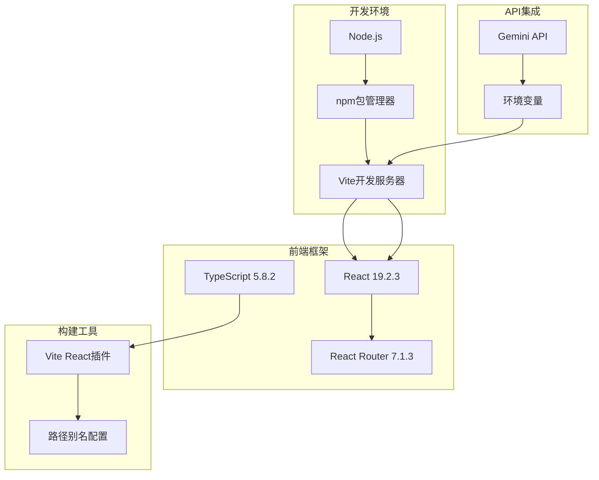
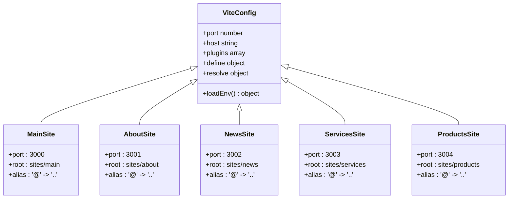
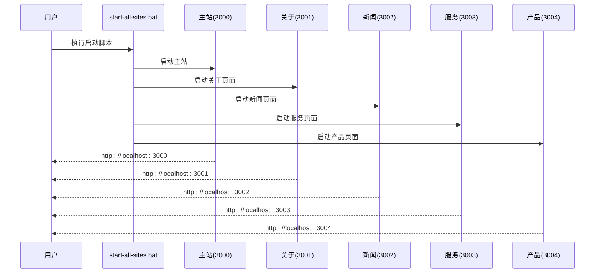
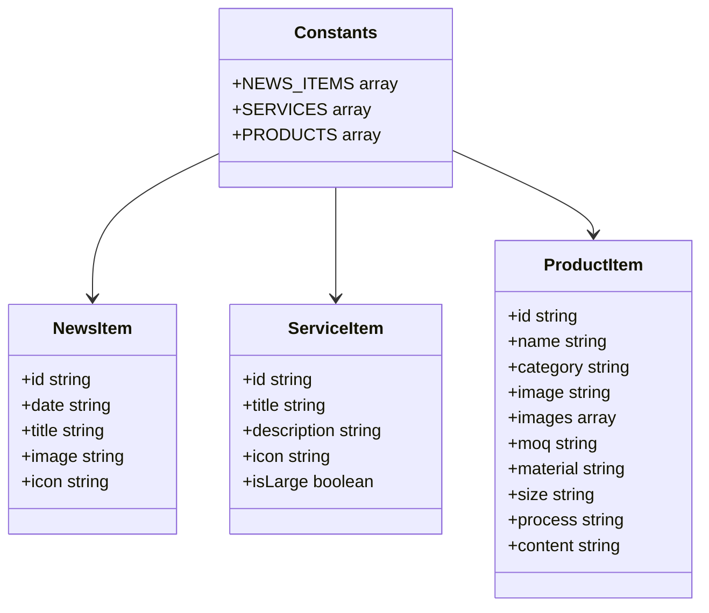

# 快速开始

<cite>
**本文档引用的文件**
- [README.md](file://README.md)
- [package.json](file://package.json)
- [vite.config.ts](file://vite.config.ts)
- [sites/main/vite.config.ts](file://sites/main/vite.config.ts)
- [sites/about/vite.config.ts](file://sites/about/vite.config.ts)
- [sites/news/vite.config.ts](file://sites/news/vite.config.ts)
- [sites/services/vite.config.ts](file://sites/services/vite.config.ts)
- [sites/products/vite.config.ts](file://sites/products/vite.config.ts)
- [start-all-sites.bat](file://start-all-sites.bat)
- [windows_qoder.bat](file://windows_qoder.bat)
- [index.tsx](file://index.tsx)
- [App.tsx](file://App.tsx)
- [constants.tsx](file://constants.tsx)
</cite>

## 目录
1. [简介](#简介)
2. [项目结构](#项目结构)
3. [核心组件](#核心组件)
4. [架构概览](#架构概览)
5. [详细组件分析](#详细组件分析)
6. [依赖分析](#依赖分析)
7. [性能考虑](#性能考虑)
8. [故障排除指南](#故障排除指南)
9. [结论](#结论)

## 简介
本指南旨在帮助开发者快速搭建和运行威宇精密工程网站项目。项目采用 React + Vite 技术栈，支持多站点开发模式（主站、关于、新闻、服务、产品）。文档将涵盖环境要求、依赖安装、环境变量配置、开发服务器启动流程，并提供常见问题排查方案。

## 项目结构
项目采用多站点架构设计，每个子站点拥有独立的入口文件、路由配置和构建配置：



**图表来源**
- [package.json](file://package.json#L1-L23)
- [vite.config.ts](file://vite.config.ts#L1-L24)
- [sites/main/vite.config.ts](file://sites/main/vite.config.ts#L1-L25)

**章节来源**
- [package.json](file://package.json#L1-L23)
- [vite.config.ts](file://vite.config.ts#L1-L24)

## 核心组件
项目的核心组件包括应用入口、路由配置和全局状态管理：

### 应用入口
应用通过根目录的入口文件启动，负责挂载 React 应用到 DOM 中：



**图表来源**
- [index.tsx](file://index.tsx#L1-L17)
- [App.tsx](file://App.tsx#L1-L112)

### 路由系统
应用使用 React Router 实现多页面路由，支持首页、关于、服务、流程和产品页面：



**图表来源**
- [App.tsx](file://App.tsx#L17-L69)

**章节来源**
- [index.tsx](file://index.tsx#L1-L17)
- [App.tsx](file://App.tsx#L1-L112)

## 架构概览
项目采用现代化前端架构，结合 Vite 开发工具链和 React 组件化设计：



**图表来源**
- [package.json](file://package.json#L11-L21)
- [vite.config.ts](file://vite.config.ts#L5-L23)

## 详细组件分析

### 环境配置与启动
项目支持多种启动方式，包括单站点开发和多站点同时启动：

#### 单站点开发配置
每个站点都有独立的 Vite 配置文件，支持不同的端口和服务设置：



**图表来源**
- [sites/main/vite.config.ts](file://sites/main/vite.config.ts#L5-L24)
- [sites/about/vite.config.ts](file://sites/about/vite.config.ts#L5-L24)
- [sites/news/vite.config.ts](file://sites/news/vite.config.ts#L5-L24)
- [sites/services/vite.config.ts](file://sites/services/vite.config.ts#L5-L24)
- [sites/products/vite.config.ts](file://sites/products/vite.config.ts#L5-L24)

#### 多站点启动脚本
项目提供了批量启动多个站点的批处理脚本：



**图表来源**
- [start-all-sites.bat](file://start-all-sites.bat#L1-L26)

**章节来源**
- [sites/main/vite.config.ts](file://sites/main/vite.config.ts#L1-L25)
- [sites/about/vite.config.ts](file://sites/about/vite.config.ts#L1-L25)
- [sites/news/vite.config.ts](file://sites/news/vite.config.ts#L1-L25)
- [sites/services/vite.config.ts](file://sites/services/vite.config.ts#L1-L25)
- [sites/products/vite.config.ts](file://sites/products/vite.config.ts#L1-L25)
- [start-all-sites.bat](file://start-all-sites.bat#L1-L26)

### 数据模型与内容管理
项目包含预定义的数据常量，用于展示新闻、服务和产品信息：



**图表来源**
- [constants.tsx](file://constants.tsx#L4-L167)

**章节来源**
- [constants.tsx](file://constants.tsx#L1-L167)

## 依赖分析
项目依赖关系清晰明确，主要依赖包括 React 生态系统和开发工具链：

```mermaid
graph TB
subgraph "生产依赖"
React[react ^19.2.3]
ReactDOM[react-dom ^19.2.3]
Router[react-router-dom ^7.1.3]
end
subgraph "开发依赖"
Vite[vite ^6.2.0]
Typescript[typescript ~5.8.2]
ReactPlugin[@vitejs/plugin-react ^5.0.0]
NodeTypes[@types/node ^22.14.0]
end
subgraph "脚本命令"
Dev[npm run dev]
Build[npm run build]
Preview[npm run preview]
end
React --> ReactDOM
React --> Router
Vite --> ReactPlugin
Typescript --> Vite
Dev --> Vite
Build --> Vite
Preview --> Vite
```

**图表来源**
- [package.json](file://package.json#L11-L21)

**章节来源**
- [package.json](file://package.json#L1-L23)

## 性能考虑
项目在性能方面采用了多项优化策略：

### 开发服务器优化
- 使用 Vite 提供的快速热重载功能
- 智能模块预构建减少冷启动时间
- 并行构建优化提升开发体验

### 构建优化
- Tree-shaking 自动移除未使用的代码
- 代码分割实现按需加载
- 压缩和优化生产构建

### 内存管理
- React 18 的并发特性提升渲染性能
- 合理的组件拆分避免不必要的重渲染

## 故障排除指南

### 环境变量配置问题
**问题描述**: 启动时出现 API 密钥相关的错误

**解决方案**:
1. 确保已创建 `.env.local` 文件
2. 在文件中添加 `GEMINI_API_KEY=your_api_key_here`
3. 重启开发服务器使配置生效

**章节来源**
- [README.md](file://README.md#L16-L20)

### 端口冲突问题
**问题描述**: 启动多个站点时出现端口占用

**解决方案**:
1. 检查系统中是否已有其他进程占用端口
2. 修改对应站点的 Vite 配置文件中的端口号
3. 使用任务管理器结束占用端口的进程

### 依赖安装失败
**问题描述**: npm install 执行失败

**解决方案**:
1. 清理 npm 缓存：`npm cache clean --force`
2. 删除 node_modules 和 package-lock.json
3. 重新安装依赖：`npm install`
4. 检查网络连接和代理设置

### 路径解析问题
**问题描述**: 模块导入路径报错

**解决方案**:
1. 确认 Vite 配置中的路径别名设置正确
2. 检查相对路径是否相对于当前文件位置
3. 使用绝对路径别名 `@` 进行导入

### 跨平台兼容性
**问题描述**: Windows 批处理脚本无法执行

**解决方案**:
1. 确保批处理文件具有执行权限
2. 检查系统是否启用了执行批处理文件的选项
3. 使用管理员权限运行命令提示符

**章节来源**
- [windows_qoder.bat](file://windows_qoder.bat#L1-L231)

## 结论
威宇精密工程网站项目提供了完整的现代化前端开发环境。通过遵循本快速开始指南，开发者可以快速搭建开发环境、配置必要的环境变量，并成功启动多站点开发服务器。项目采用的技术栈和架构设计为后续的功能扩展和维护奠定了良好的基础。

建议开发者在开始开发前：
1. 确保满足最低系统要求
2. 完成环境变量配置
3. 熟悉项目结构和启动流程
4. 了解各站点的独立配置特点
5. 掌握故障排除的基本方法