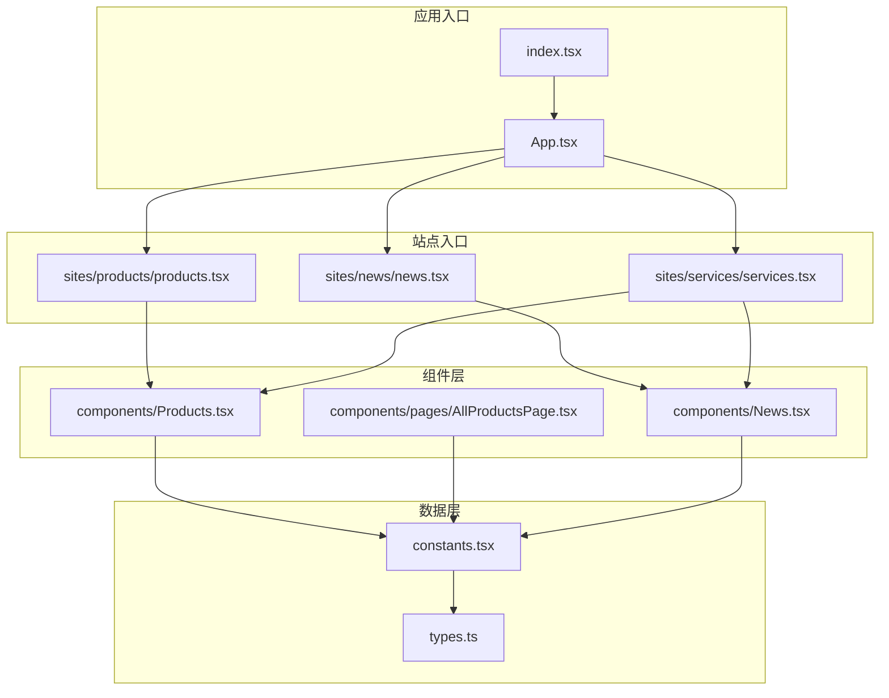
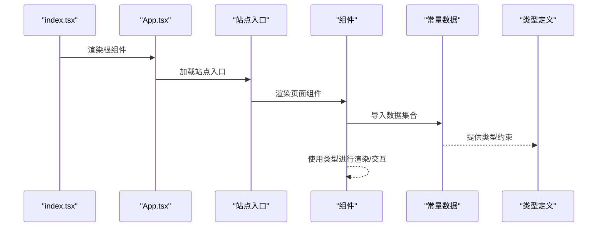
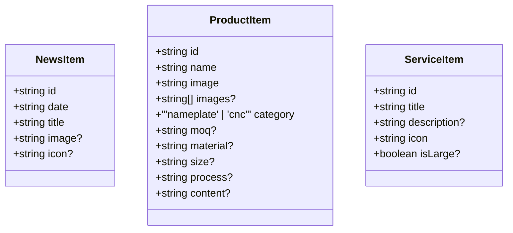
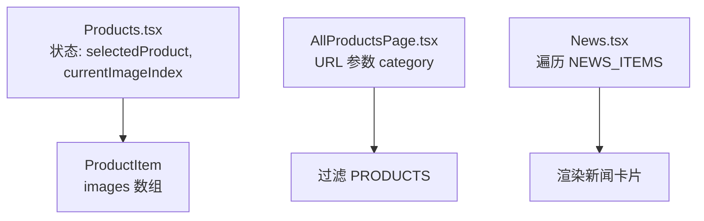
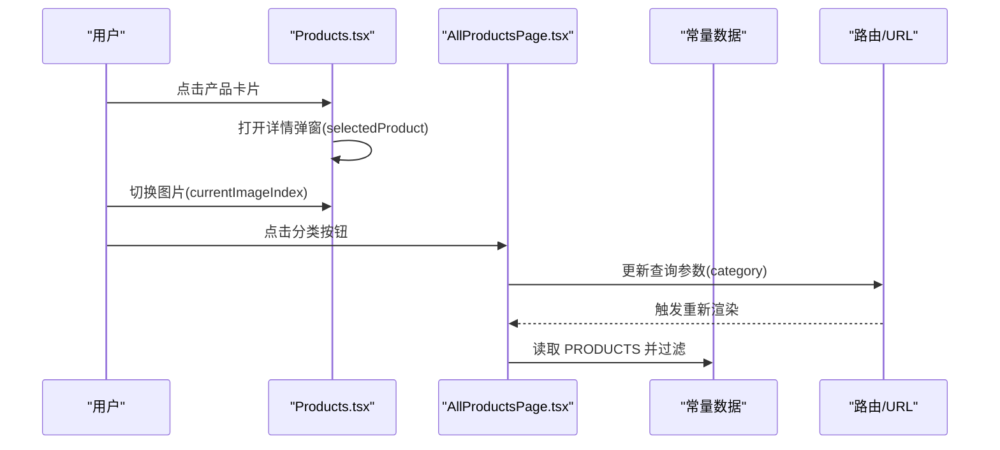
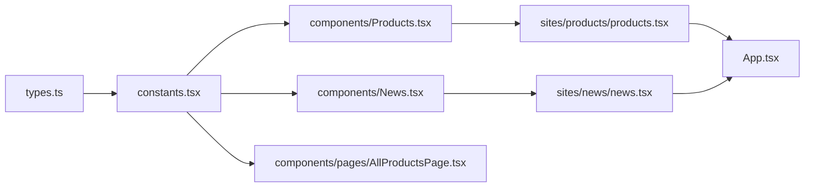

# 数据模型和类型定义

<cite>
**本文引用的文件**
- [types.ts](file://types.ts)
- [constants.tsx](file://constants.tsx)
- [News.tsx](file://components/News.tsx)
- [Products.tsx](file://components/Products.tsx)
- [AllProductsPage.tsx](file://components/pages/AllProductsPage.tsx)
- [products.tsx](file://sites/products/products.tsx)
- [news.tsx](file://sites/news/news.tsx)
- [services.tsx](file://sites/services/services.tsx)
- [App.tsx](file://App.tsx)
- [index.tsx](file://index.tsx)
- [package.json](file://package.json)
- [metadata.json](file://metadata.json)
</cite>

## 目录
1. [引言](#引言)
2. [项目结构](#项目结构)
3. [核心组件](#核心组件)
4. [架构总览](#架构总览)
5. [详细组件分析](#详细组件分析)
6. [依赖分析](#依赖分析)
7. [性能考虑](#性能考虑)
8. [故障排除指南](#故障排除指南)
9. [结论](#结论)
10. [附录](#附录)

## 引言
本文件面向威宇精密工程网站的数据模型与类型定义，系统化梳理 TypeScript 接口、数据结构设计与类型安全策略；解释核心数据模型（如 ProductItem、ServiceItem、NewsItem）的字段、类型与验证规则；阐明数据模型间的关系、嵌套与引用；给出数据访问模式、缓存策略与性能考量；记录数据生命周期与保留策略；解释数据迁移路径、版本管理与向后兼容；并提供类型推导、泛型使用与接口扩展的最佳实践。

## 项目结构
本项目采用基于功能模块的组织方式：页面组件位于 components/pages，共享组件位于 components/shared，业务组件位于 components，多站点入口位于 sites。数据模型集中在 types.ts 中定义，实际数据以常量形式在 constants.tsx 中提供，并由各组件按需导入使用。

图表来源
- [index.tsx](file://index.tsx#L1-L17)
- [App.tsx](file://App.tsx#L1-L112)
- [sites/products/products.tsx](file://sites/products/products.tsx#L1-L24)
- [sites/news/news.tsx](file://sites/news/news.tsx#L1-L24)
- [sites/services/services.tsx](file://sites/services/services.tsx#L1-L24)
- [components/Products.tsx](file://components/Products.tsx#L1-L310)
- [components/News.tsx](file://components/News.tsx#L1-L58)
- [components/pages/AllProductsPage.tsx](file://components/pages/AllProductsPage.tsx#L1-L281)
- [constants.tsx](file://constants.tsx#L1-L167)
- [types.ts](file://types.ts#L1-L30)

章节来源
- [index.tsx](file://index.tsx#L1-L17)
- [App.tsx](file://App.tsx#L1-L112)
- [sites/products/products.tsx](file://sites/products/products.tsx#L1-L24)
- [sites/news/news.tsx](file://sites/news/news.tsx#L1-L24)
- [sites/services/services.tsx](file://sites/services/services.tsx#L1-L24)
- [components/Products.tsx](file://components/Products.tsx#L1-L310)
- [components/News.tsx](file://components/News.tsx#L1-L58)
- [components/pages/AllProductsPage.tsx](file://components/pages/AllProductsPage.tsx#L1-L281)
- [constants.tsx](file://constants.tsx#L1-L167)
- [types.ts](file://types.ts#L1-L30)

## 核心组件
本节聚焦数据模型与类型定义，包括：
- 类型接口：NewsItem、ProductItem、ServiceItem
- 常量数据集：NEWS_ITEMS、SERVICES、PRODUCTS
- 组件中的使用模式：导入、渲染、交互与导航

章节来源
- [types.ts](file://types.ts#L1-L30)
- [constants.tsx](file://constants.tsx#L1-L167)
- [components/News.tsx](file://components/News.tsx#L1-L58)
- [components/Products.tsx](file://components/Products.tsx#L1-L310)
- [components/pages/AllProductsPage.tsx](file://components/pages/AllProductsPage.tsx#L1-L281)

## 架构总览
数据流自上而下：入口应用加载路由与页面；页面组件通过导入常量数据进行渲染；用户交互触发状态更新（如产品分类、详情弹窗、图片轮播）。类型定义贯穿于数据声明、组件消费与运行时校验。

图表来源
- [index.tsx](file://index.tsx#L1-L17)
- [App.tsx](file://App.tsx#L1-L112)
- [sites/products/products.tsx](file://sites/products/products.tsx#L1-L24)
- [components/Products.tsx](file://components/Products.tsx#L1-L310)
- [components/News.tsx](file://components/News.tsx#L1-L58)
- [constants.tsx](file://constants.tsx#L1-L167)
- [types.ts](file://types.ts#L1-L30)

## 详细组件分析

### 数据模型与类型定义
- NewsItem
  - 字段：id（字符串）、date（字符串）、title（字符串）、image（可选字符串）、icon（可选字符串）
  - 类型安全：严格字段名与可选性；用于新闻列表项渲染
  - 验证规则：id 唯一性由外部保证；date 与 title 必填；image/icon 至少存在其一
- ProductItem
  - 字段：id、name、image、images（可选字符串数组）、category（字面量联合类型 'nameplate' | 'cnc'）、moq（可选字符串）、material（可选字符串）、size（可选字符串）、process（可选字符串）、content（可选字符串）
  - 类型安全：category 使用字面量联合类型确保值域受控；images 为数组类型；其余字段均为字符串或可选
  - 验证规则：id 唯一；必填字段在常量中已提供；可选字段在渲染前应判空
- ServiceItem
  - 字段：id、title、description（可选字符串）、icon（字符串）、isLarge（可选布尔）
  - 类型安全：icon 为字符串标识；isLarge 为布尔开关
  - 验证规则：id 唯一；icon 与标题必填；isLarge 控制布局样式

图表来源
- [types.ts](file://types.ts#L1-L30)

章节来源
- [types.ts](file://types.ts#L1-L30)

### 数据模型关系与嵌套
- 关系
  - NewsItem 与 ProductItem/ServiceItem 在组件中独立使用，无直接外键关联
  - ProductItem 的 images 字段为内嵌数组，表示产品图库
- 嵌套
  - 组件内部状态包含 selectedProduct、currentImageIndex 等，形成“模型+视图状态”的组合
- 引用
  - 组件通过 id 进行筛选与导航（如产品详情弹窗中的 prev/next）

图表来源
- [components/Products.tsx](file://components/Products.tsx#L1-L310)
- [components/pages/AllProductsPage.tsx](file://components/pages/AllProductsPage.tsx#L1-L281)
- [components/News.tsx](file://components/News.tsx#L1-L58)
- [constants.tsx](file://constants.tsx#L1-L167)

章节来源
- [components/Products.tsx](file://components/Products.tsx#L1-L310)
- [components/pages/AllProductsPage.tsx](file://components/pages/AllProductsPage.tsx#L1-L281)
- [components/News.tsx](file://components/News.tsx#L1-L58)
- [constants.tsx](file://constants.tsx#L1-L167)

### 数据访问模式与交互流程
- 新闻模块（News.tsx）
  - 访问：导入 NEWS_ITEMS 并遍历渲染
  - 交互：点击卡片打开详情（当前实现为静态数据，无动态路由）
- 产品模块（Products.tsx 与 AllProductsPage.tsx）
  - 访问：导入 PRODUCTS，按 category 过滤
  - 交互：分类切换、滚动导航、弹窗详情、图片缩略图切换
  - URL 同步：AllProductsPage 使用 URL 查询参数同步分类状态
- 入口与路由
  - App.tsx 定义主路由与页面组件挂载
  - 站点入口（sites/*）分别渲染独立页面

图表来源
- [components/Products.tsx](file://components/Products.tsx#L1-L310)
- [components/pages/AllProductsPage.tsx](file://components/pages/AllProductsPage.tsx#L1-L281)
- [constants.tsx](file://constants.tsx#L1-L167)
- [App.tsx](file://App.tsx#L1-L112)

章节来源
- [components/Products.tsx](file://components/Products.tsx#L1-L310)
- [components/pages/AllProductsPage.tsx](file://components/pages/AllProductsPage.tsx#L1-L281)
- [components/News.tsx](file://components/News.tsx#L1-L58)
- [App.tsx](file://App.tsx#L1-L112)

### 缓存策略与性能考虑
- 当前实现
  - 数据以常量形式注入，组件直接读取，未见专用缓存层
  - 图片加载包含错误回退逻辑，避免空白占位
- 性能建议
  - 对 PRODUCTS 进行 memo 化或分页加载，减少渲染压力
  - 图片懒加载与尺寸适配，降低首屏时间
  - 使用 URL 参数驱动的分类状态，避免重复请求
- 类型安全与运行时校验
  - 使用非空断言（!）前应确保字段存在；可引入运行时校验工具（如 Zod）增强健壮性

章节来源
- [components/Products.tsx](file://components/Products.tsx#L1-L310)
- [components/pages/AllProductsPage.tsx](file://components/pages/AllProductsPage.tsx#L1-L281)

### 数据生命周期、保留策略与归档规则
- 生命周期
  - 常量数据在构建期注入，运行期只读
  - 组件状态仅影响 UI 展示（如分类、弹窗、图片索引）
- 保留策略
  - 未发现自动清理机制；建议在数据源变更时统一更新常量
- 归档规则
  - 未见归档逻辑；如需历史数据，可在常量中维护版本化条目或迁移脚本

章节来源
- [constants.tsx](file://constants.tsx#L1-L167)
- [types.ts](file://types.ts#L1-L30)

### 数据迁移路径、版本管理与向后兼容
- 迁移路径
  - 从常量到内容管理（CMS）：参考后台分析文档中对 Services 与 Products 的说明，逐步替换常量为 API 获取
- 版本管理
  - 通过语义化版本号与变更日志追踪数据结构变更
- 向后兼容
  - 保持 id 不变；新增字段使用可选属性；对旧客户端做默认值处理

章节来源
- [package.json](file://package.json#L1-L23)
- [metadata.json](file://metadata.json#L1-L5)

### 数据安全、隐私与访问控制
- 当前实现
  - 数据为静态常量，不涉及敏感信息
- 建议
  - 若接入 CMS 或 API，需启用 HTTPS、鉴权与权限控制
  - 对图片资源设置 referrerPolicy 与 CORS 策略

章节来源
- [components/Products.tsx](file://components/Products.tsx#L1-L310)
- [components/News.tsx](file://components/News.tsx#L1-L58)

### 类型推导、泛型与接口扩展最佳实践
- 类型推导
  - 使用 typeof 常量推导类型，减少重复定义
- 泛型
  - 在通用组件中使用泛型约束 props，提升复用性
- 接口扩展
  - 通过交叉类型扩展基础模型，避免破坏现有结构
- 实践要点
  - 保持字段最小可用集；为可选字段提供默认值；对枚举类字段使用字面量联合类型

章节来源
- [types.ts](file://types.ts#L1-L30)
- [constants.tsx](file://constants.tsx#L1-L167)

## 依赖分析
- 内部依赖
  - components 依赖 constants.tsx 提供的数据
  - sites/* 入口依赖对应组件
  - App.tsx 作为路由容器，协调页面加载
- 外部依赖
  - React、React Router DOM、Material Icons（通过字符串 icon 名称使用）

图表来源
- [types.ts](file://types.ts#L1-L30)
- [constants.tsx](file://constants.tsx#L1-L167)
- [components/News.tsx](file://components/News.tsx#L1-L58)
- [components/Products.tsx](file://components/Products.tsx#L1-L310)
- [components/pages/AllProductsPage.tsx](file://components/pages/AllProductsPage.tsx#L1-L281)
- [sites/news/news.tsx](file://sites/news/news.tsx#L1-L24)
- [sites/products/products.tsx](file://sites/products/products.tsx#L1-L24)
- [App.tsx](file://App.tsx#L1-L112)

章节来源
- [types.ts](file://types.ts#L1-L30)
- [constants.tsx](file://constants.tsx#L1-L167)
- [components/News.tsx](file://components/News.tsx#L1-L58)
- [components/Products.tsx](file://components/Products.tsx#L1-L310)
- [components/pages/AllProductsPage.tsx](file://components/pages/AllProductsPage.tsx#L1-L281)
- [sites/news/news.tsx](file://sites/news/news.tsx#L1-L24)
- [sites/products/products.tsx](file://sites/products/products.tsx#L1-L24)
- [App.tsx](file://App.tsx#L1-L112)

## 性能考虑
- 渲染优化
  - 对 PRODUCTS 进行分页或虚拟滚动，减少一次性渲染节点数
  - 图片懒加载与尺寸适配，避免阻塞主线程
- 状态管理
  - 将弹窗详情状态局部化，避免全局状态污染
- 资源加载
  - 使用 referrerPolicy 与错误回退，提升容错能力

章节来源
- [components/Products.tsx](file://components/Products.tsx#L1-L310)
- [components/pages/AllProductsPage.tsx](file://components/pages/AllProductsPage.tsx#L1-L281)

## 故障排除指南
- 常见问题
  - 图片加载失败：组件内置错误回退至占位图
  - 分类筛选异常：确认 URL 查询参数与组件状态同步逻辑
  - 弹窗无法关闭：检查事件冒泡与点击遮罩关闭逻辑
- 调试建议
  - 在组件中打印 selectedProduct 与 currentImageIndex，确认状态流转
  - 检查 PRODUCTS 中是否存在重复 id 或缺失必填字段

章节来源
- [components/Products.tsx](file://components/Products.tsx#L1-L310)
- [components/pages/AllProductsPage.tsx](file://components/pages/AllProductsPage.tsx#L1-L281)

## 结论
本项目通过清晰的类型定义与常量数据，实现了稳定的数据模型与组件渲染。建议后续引入内容管理与 API 驱动的数据源，配合缓存与分页策略，进一步提升性能与可维护性；同时完善数据迁移与版本管理流程，确保向后兼容与平滑演进。

## 附录
- 术语
  - 常量数据：在编译期注入的静态数据集合
  - 运行时校验：在运行期对数据进行类型与完整性检查
- 参考
  - 后台分析文档中对 Services 与 Products 的内容类型说明，可作为未来迁移到 CMS 的依据

章节来源
- [metadata.json](file://metadata.json#L1-L5)