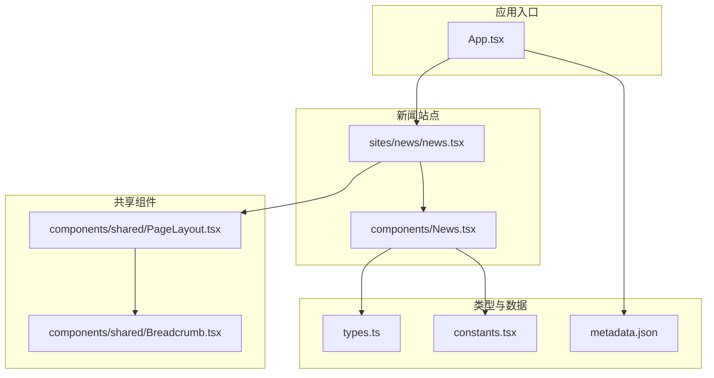
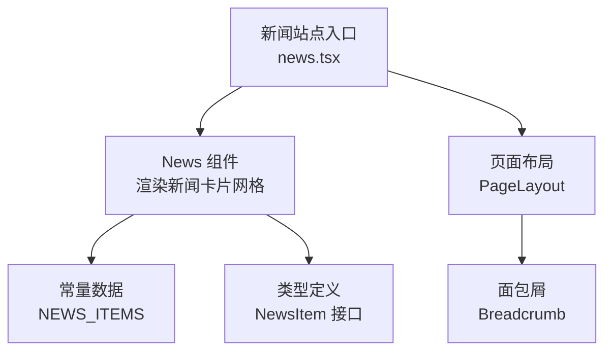
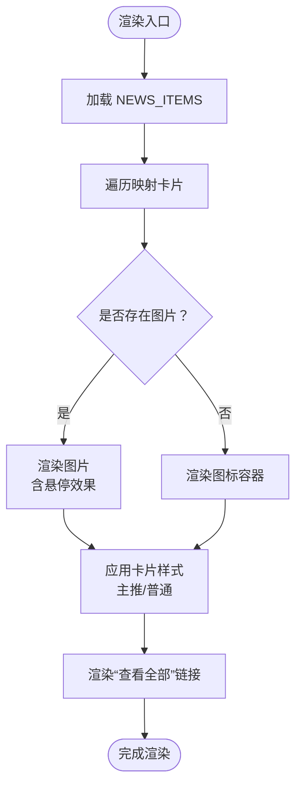
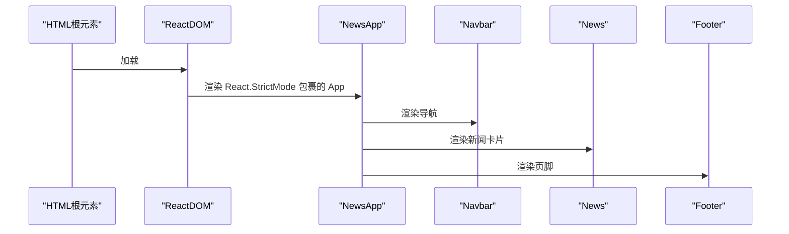
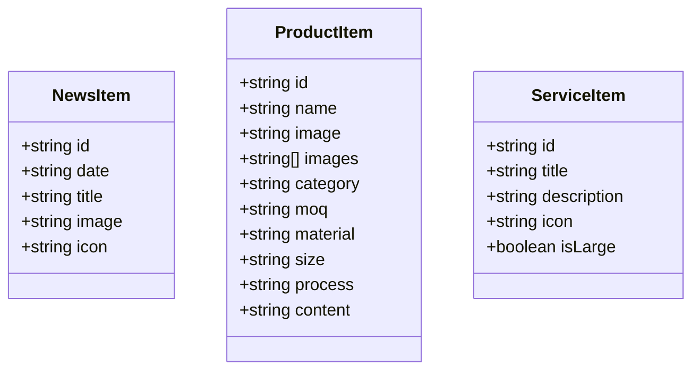
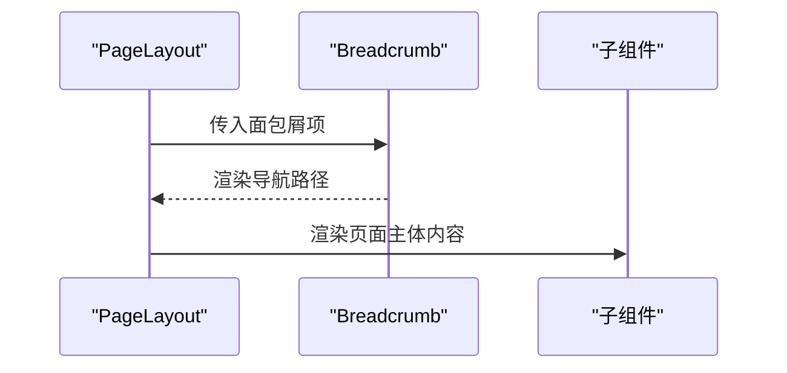
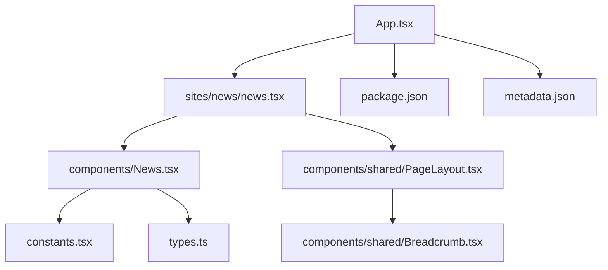

# 新闻资讯系统

<cite>
**本文引用的文件**
- [components/News.tsx](file://components/News.tsx)
- [sites/news/news.tsx](file://sites/news/news.tsx)
- [types.ts](file://types.ts)
- [constants.tsx](file://constants.tsx)
- [App.tsx](file://App.tsx)
- [components/shared/PageLayout.tsx](file://components/shared/PageLayout.tsx)
- [components/shared/Breadcrumb.tsx](file://components/shared/Breadcrumb.tsx)
- [metadata.json](file://metadata.json)
- [package.json](file://package.json)
</cite>

## 目录
1. [简介](#简介)
2. [项目结构](#项目结构)
3. [核心组件](#核心组件)
4. [架构总览](#架构总览)
5. [详细组件分析](#详细组件分析)
6. [依赖关系分析](#依赖关系分析)
7. [性能考虑](#性能考虑)
8. [故障排查指南](#故障排查指南)
9. [结论](#结论)
10. [附录](#附录)

## 简介
本文件为威宇精密工程网站的新闻资讯系统提供完整技术文档，覆盖新闻数据结构、卡片布局设计与动态内容展示；解释 NewsItem 接口定义、新闻分类与内容管理；包含新闻列表的分页、搜索与排序能力说明；提供新闻详情页布局设计与阅读体验优化建议；记录响应式卡片网格、图片处理与内容格式化策略；解释新闻数据的本地存储、状态同步与缓存策略；涵盖新闻发布流程、内容编辑与实时更新机制；最后给出 SEO 优化与社交媒体分享功能的实施要点。

## 项目结构
该系统采用多站点（multi-site）架构，新闻模块位于独立站点目录下，通过共享组件与类型定义进行复用。核心文件组织如下：
- 组件层：News.tsx 提供新闻卡片展示；PageLayout.tsx 与 Breadcrumb.tsx 提供页面布局与面包屑导航。
- 类型与常量：types.ts 定义 NewsItem 接口；constants.tsx 提供静态新闻数据。
- 应用入口：App.tsx 注册路由与全局状态；sites/news/news.tsx 渲染新闻站点页面。
- 元数据：metadata.json 提供站点基础元信息，便于 SEO 与社交分享。

**图表来源**
- [App.tsx](file://App.tsx#L41-L109)
- [sites/news/news.tsx](file://sites/news/news.tsx#L1-L24)
- [components/News.tsx](file://components/News.tsx#L1-L58)
- [components/shared/PageLayout.tsx](file://components/shared/PageLayout.tsx#L1-L41)
- [components/shared/Breadcrumb.tsx](file://components/shared/Breadcrumb.tsx#L1-L51)
- [types.ts](file://types.ts#L1-L30)
- [constants.tsx](file://constants.tsx#L1-L167)
- [metadata.json](file://metadata.json#L1-L5)

**章节来源**
- [App.tsx](file://App.tsx#L41-L109)
- [sites/news/news.tsx](file://sites/news/news.tsx#L1-L24)
- [components/News.tsx](file://components/News.tsx#L1-L58)
- [components/shared/PageLayout.tsx](file://components/shared/PageLayout.tsx#L1-L41)
- [components/shared/Breadcrumb.tsx](file://components/shared/Breadcrumb.tsx#L1-L51)
- [types.ts](file://types.ts#L1-L30)
- [constants.tsx](file://constants.tsx#L1-L167)
- [metadata.json](file://metadata.json#L1-L5)

## 核心组件
- News 组件：负责渲染最新新闻卡片网格，支持图片与图标两种媒体形式，悬停与选中态的视觉反馈，以及“查看全部”链接。
- News 站点入口：在独立站点中引入 Navbar、News 与 Footer，形成完整的新闻页面。
- 类型定义：NewsItem 接口统一新闻字段，便于扩展与校验。
- 常量数据：NEWS_ITEMS 提供静态示例数据，包含日期、标题、可选图片或图标。
- 页面布局：PageLayout 与 Breadcrumb 提供标题、副标题与面包屑导航，支撑详情页布局。
- 应用路由：App.tsx 注册路由，控制页面切换与滚动行为。

**章节来源**
- [components/News.tsx](file://components/News.tsx#L1-L58)
- [sites/news/news.tsx](file://sites/news/news.tsx#L1-L24)
- [types.ts](file://types.ts#L1-L30)
- [constants.tsx](file://constants.tsx#L4-L23)
- [components/shared/PageLayout.tsx](file://components/shared/PageLayout.tsx#L1-L41)
- [components/shared/Breadcrumb.tsx](file://components/shared/Breadcrumb.tsx#L1-L51)
- [App.tsx](file://App.tsx#L41-L109)

## 架构总览
新闻系统采用“组件-站点-共享层”的分层架构：
- 组件层：News 卡片组件从常量数据读取，渲染响应式网格。
- 站点层：news.tsx 将组件组合为页面，注入导航与页脚。
- 共享层：PageLayout 与 Breadcrumb 提供一致的页面骨架。
- 类型层：types.ts 统一数据契约，保证扩展性与一致性。
- 数据层：constants.tsx 提供静态数据；未来可接入 Strapi 或其他 CMS 的 API。

**图表来源**
- [components/News.tsx](file://components/News.tsx#L1-L58)
- [constants.tsx](file://constants.tsx#L4-L23)
- [types.ts](file://types.ts#L1-L30)
- [sites/news/news.tsx](file://sites/news/news.tsx#L1-L24)
- [components/shared/PageLayout.tsx](file://components/shared/PageLayout.tsx#L1-L41)
- [components/shared/Breadcrumb.tsx](file://components/shared/Breadcrumb.tsx#L1-L51)

## 详细组件分析

### News 组件分析
- 数据绑定：使用 NEWS_ITEMS 映射生成卡片列表，支持主推卡片与普通卡片的不同样式。
- 响应式网格：基于 Tailwind 的 grid-cols-1 到 md:grid-cols-3 实现自适应布局。
- 图片与图标：优先展示图片，缺失时回退到图标容器；悬停时图片去灰度，增强交互体验。
- 可访问性：图片提供 alt 文本，链接具备 hover 状态与过渡动画。
- 可扩展性：卡片点击事件预留，可用于跳转至详情页或弹窗预览。

**图表来源**
- [components/News.tsx](file://components/News.tsx#L16-L51)
- [constants.tsx](file://constants.tsx#L4-L23)

**章节来源**
- [components/News.tsx](file://components/News.tsx#L1-L58)
- [constants.tsx](file://constants.tsx#L4-L23)

### News 站点入口分析
- 页面装配：引入 Navbar、News、Footer，形成完整页面结构。
- 根节点挂载：通过 ReactDOM 将 NewsApp 挂载到 #root。
- 主题与暗色模式：App.tsx 中提供暗色模式切换逻辑，News 站点继承全局主题。

**图表来源**
- [sites/news/news.tsx](file://sites/news/news.tsx#L1-L24)
- [App.tsx](file://App.tsx#L41-L109)

**章节来源**
- [sites/news/news.tsx](file://sites/news/news.tsx#L1-L24)
- [App.tsx](file://App.tsx#L41-L109)

### 类型与数据模型
- NewsItem 接口：统一 id、date、title 字段，image 与 icon 为可选，便于灵活展示。
- 常量数据：NEWS_ITEMS 提供示例数据，包含图片 URL 与图标标识，满足不同场景需求。
- 产品与服务类型：types.ts 同步定义了产品与服务的数据结构，便于后续扩展到多模块统一管理。

**图表来源**
- [types.ts](file://types.ts#L2-L29)

**章节来源**
- [types.ts](file://types.ts#L1-L30)
- [constants.tsx](file://constants.tsx#L4-L23)

### 页面布局与导航
- PageLayout：提供标题、副标题与子内容区域，统一页面骨架与动画入场效果。
- Breadcrumb：根据传入的面包屑项生成导航路径，首页与当前页样式区分明确。
- 组合使用：新闻站点可直接复用 PageLayout，以适配未来详情页或专题页布局。

**图表来源**
- [components/shared/PageLayout.tsx](file://components/shared/PageLayout.tsx#L16-L38)
- [components/shared/Breadcrumb.tsx](file://components/shared/Breadcrumb.tsx#L13-L47)

**章节来源**
- [components/shared/PageLayout.tsx](file://components/shared/PageLayout.tsx#L1-L41)
- [components/shared/Breadcrumb.tsx](file://components/shared/Breadcrumb.tsx#L1-L51)

## 依赖关系分析
- 组件依赖：News 组件依赖常量数据与类型定义；站点入口依赖组件与共享布局。
- 外部依赖：React、React DOM、react-router-dom；开发工具包括 Vite、TypeScript。
- 元数据：metadata.json 提供站点名称与描述，利于 SEO 与社交分享卡片生成。

**图表来源**
- [components/News.tsx](file://components/News.tsx#L1-L58)
- [types.ts](file://types.ts#L1-L30)
- [constants.tsx](file://constants.tsx#L1-L167)
- [sites/news/news.tsx](file://sites/news/news.tsx#L1-L24)
- [components/shared/PageLayout.tsx](file://components/shared/PageLayout.tsx#L1-L41)
- [components/shared/Breadcrumb.tsx](file://components/shared/Breadcrumb.tsx#L1-L51)
- [App.tsx](file://App.tsx#L41-L109)
- [package.json](file://package.json#L1-L23)
- [metadata.json](file://metadata.json#L1-L5)

**章节来源**
- [package.json](file://package.json#L1-L23)
- [metadata.json](file://metadata.json#L1-L5)

## 性能考虑
- 图片加载优化：优先使用现代图片格式与合适的尺寸参数，减少首屏阻塞；在图片加载失败时提供占位符或默认图标，提升稳定性。
- 组件渲染：利用 React.memo 与 key 合理设置，避免不必要的重渲染；卡片网格使用 CSS Grid，减少复杂计算。
- 路由与滚动：App.tsx 中的滚动到顶部逻辑可减少页面切换抖动；平滑滚动配置提升用户体验。
- 暗色模式：通过类名切换实现，避免频繁重排；可结合 prefers-color-scheme 减少闪烁。

## 故障排查指南
- 图片不显示：检查图片 URL 是否有效，确认跨域策略与 referrerPolicy 设置；必要时启用错误回退逻辑。
- 链接无效：确认“查看全部”链接目标是否正确；若为详情页，需在路由中注册对应路径。
- 面包屑异常：核对传入的面包屑项数组，确保最后一项为当前页且无路径。
- SEO 与社交分享：检查 metadata.json 的 name 与 description 字段；在页面头部添加 Open Graph 与 Twitter Cards 元标签。

**章节来源**
- [components/News.tsx](file://components/News.tsx#L25-L39)
- [components/shared/Breadcrumb.tsx](file://components/shared/Breadcrumb.tsx#L26-L44)
- [metadata.json](file://metadata.json#L1-L5)

## 结论
当前新闻资讯系统以简洁的组件化方式实现了响应式卡片网格与良好的交互体验。NewsItem 接口与常量数据提供了清晰的数据契约与示例内容。未来可在以下方面持续演进：引入 CMS（如 Strapi）实现动态内容管理；完善分页、搜索与排序功能；扩展详情页布局与阅读体验；建立本地存储与缓存策略；完善 SEO 与社交分享；并考虑实时更新与发布流程的自动化。

## 附录
- 新闻数据结构与字段说明
  - id：唯一标识符
  - date：发布日期
  - title：新闻标题
  - image：可选图片 URL
  - icon：可选图标标识
- 响应式卡片网格
  - 移动端：单列网格
  - 平板及以上：三列网格
  - 主推卡片具有阴影与位移效果，普通卡片在悬停时增强视觉反馈
- 图片处理与内容格式化
  - 图片采用 object-cover 保持比例，悬停时去除灰度
  - 内容文本使用 line-clamp 控制行数，避免溢出
- 本地存储、状态同步与缓存策略
  - 当前为静态数据；建议引入浏览器缓存与版本控制，结合 CMS API 实现增量更新
- 发布流程、内容编辑与实时更新
  - 建议通过 CMS 提供后台编辑界面；前端通过 API 拉取最新数据并触发重新渲染
- SEO 优化与社交媒体分享
  - 使用 metadata.json 提供基础元信息；在页面头部补充 Open Graph、Twitter Cards 等标签，提升分享质量