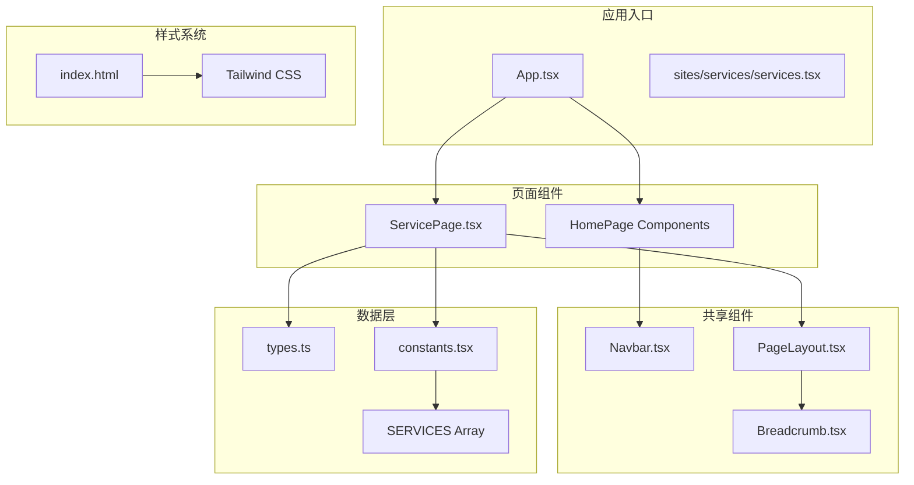
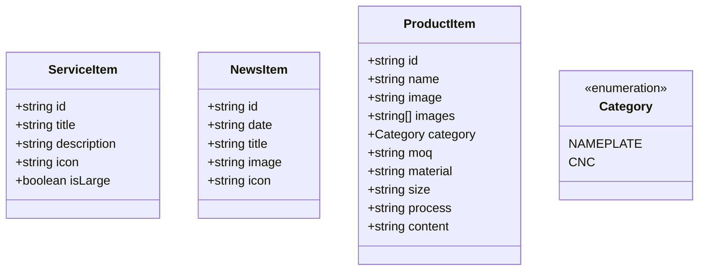
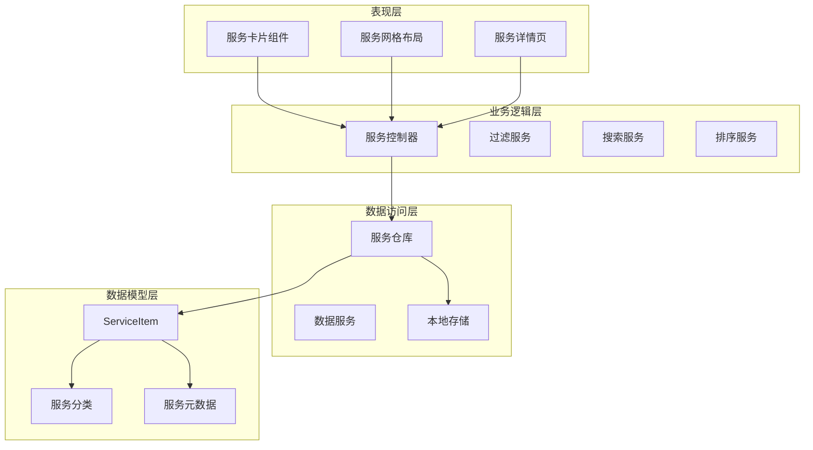
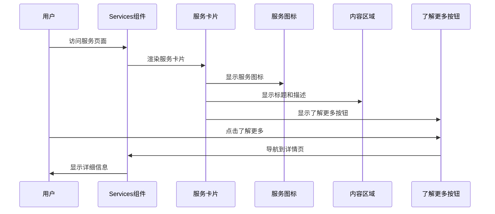
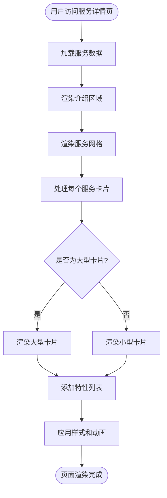
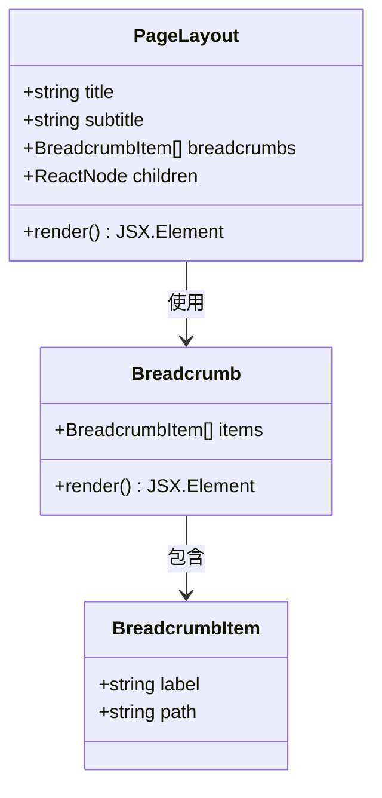
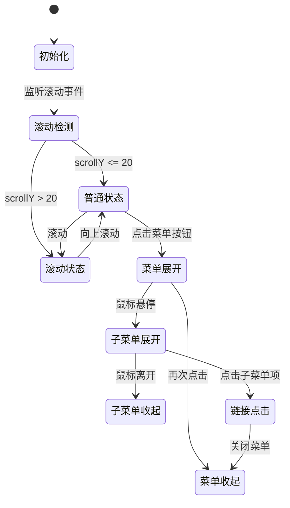
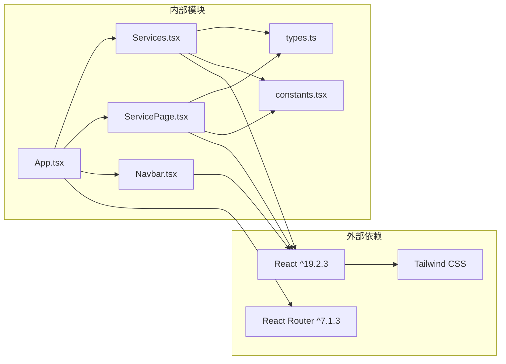
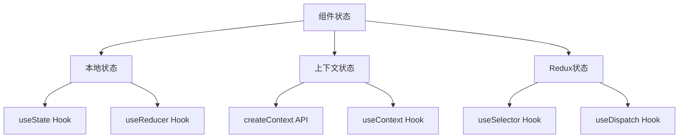

# 服务展示系统

<cite>
**本文档引用的文件**
- [components/services.tsx](file://components/Services.tsx)
- [sites/services/services.tsx](file://sites/services/services.tsx)
- [types.ts](file://types.ts)
- [constants.tsx](file://constants.tsx)
- [components/pages/servicepage.tsx](file://components/pages/ServicePage.tsx)
- [components/shared/pagelayout.tsx](file://components/shared/PageLayout.tsx)
- [components/navbar.tsx](file://components/Navbar.tsx)
- [components/shared/breadcrumb.tsx](file://components/shared/Breadcrumb.tsx)
- [app.tsx](file://App.tsx)
- [index.html](file://index.html)
- [metadata.json](file://metadata.json)
- [package.json](file://package.json)
</cite>

## 目录
1. [简介](#简介)
2. [项目结构](#项目结构)
3. [核心组件](#核心组件)
4. [架构概览](#架构概览)
5. [详细组件分析](#详细组件分析)
6. [依赖关系分析](#依赖关系分析)
7. [性能考虑](#性能考虑)
8. [故障排除指南](#故障排除指南)
9. [结论](#结论)
10. [附录](#附录)

## 简介

威宇精密工程网站的服务展示系统是一个基于React和TypeScript构建的企业级工业制造公司网站。该系统专注于展示公司的核心服务，包括CNC精密加工、注塑成型、装配测试和质量保证等专业制造服务。

本系统采用现代化的前端技术栈，结合Tailwind CSS实用类样式框架，实现了响应式设计和优秀的用户体验。系统支持深色模式切换、平滑滚动动画和流畅的交互效果。

## 项目结构

该项目采用模块化的组件架构，主要分为以下几个核心部分：

**图表来源**
- [app.tsx](file://App.tsx#L1-L112)
- [sites/services/services.tsx](file://sites/services/services.tsx#L1-L24)
- [components/pages/servicepage.tsx](file://components/pages/ServicePage.tsx#L1-L182)

**章节来源**
- [app.tsx](file://App.tsx#L1-L112)
- [package.json](file://package.json#L1-L23)

## 核心组件

### ServiceItem 数据结构

系统使用统一的ServiceItem接口来管理服务数据，确保类型安全和数据一致性：

**图表来源**
- [types.ts](file://types.ts#L23-L29)

### 服务数据管理

系统通过constants.tsx文件集中管理所有服务数据，采用静态数组形式存储：

**章节来源**
- [types.ts](file://types.ts#L23-L29)
- [constants.tsx](file://constants.tsx#L25-L48)

## 架构概览

服务展示系统采用分层架构设计，从底层的数据模型到顶层的用户界面形成了清晰的层次结构：

**图表来源**
- [components/services.tsx](file://components/Services.tsx#L1-L56)
- [components/pages/servicepage.tsx](file://components/pages/ServicePage.tsx#L1-L182)
- [constants.tsx](file://constants.tsx#L25-L48)

## 详细组件分析

### 服务卡片组件 (Services.tsx)

服务卡片组件是系统的核心展示组件，负责渲染单个服务条目：

**图表来源**
- [components/services.tsx](file://components/Services.tsx#L14-L25)

#### 卡片设计特点

1. **响应式布局**: 使用CSS Grid实现自适应布局
2. **悬停效果**: 平滑的过渡动画和阴影变化
3. **图标系统**: Material Icons提供一致的视觉语言
4. **颜色体系**: 工业风格的配色方案

**章节来源**
- [components/services.tsx](file://components/Services.tsx#L1-L56)

### 服务详情页 (ServicePage.tsx)

服务详情页提供了更完整的服务信息展示：

**图表来源**
- [components/pages/servicepage.tsx](file://components/pages/ServicePage.tsx#L94-L117)

#### 页面结构分析

1. **面包屑导航**: 提供清晰的页面层级导航
2. **服务网格**: 响应式网格布局展示多个服务
3. **特性列表**: 详细展示每个服务的优势
4. **为什么选择我们**: 展示公司核心竞争力
5. **行动号召**: 引导用户联系咨询

**章节来源**
- [components/pages/servicepage.tsx](file://components/pages/ServicePage.tsx#L1-L182)

### 页面布局组件 (PageLayout.tsx)

PageLayout组件提供了统一的页面布局结构：

**图表来源**
- [components/shared/pagelayout.tsx](file://components/shared/PageLayout.tsx#L9-L14)

**章节来源**
- [components/shared/pagelayout.tsx](file://components/shared/PageLayout.tsx#L1-L41)

### 导航栏组件 (Navbar.tsx)

导航栏组件实现了复杂的交互功能：

**图表来源**
- [components/navbar.tsx](file://components/Navbar.tsx#L7-L22)

**章节来源**
- [components/navbar.tsx](file://components/Navbar.tsx#L1-L260)

## 依赖关系分析

系统采用模块化设计，各组件之间保持低耦合高内聚的关系：

**图表来源**
- [package.json](file://package.json#L11-L21)
- [app.tsx](file://App.tsx#L1-L112)

**章节来源**
- [package.json](file://package.json#L1-L23)

## 性能考虑

### 响应式设计优化

系统采用移动优先的设计理念，通过以下方式优化性能：

1. **CSS Grid布局**: 使用原生CSS Grid实现高效的响应式布局
2. **图片优化**: 实现图片加载失败时的占位符机制
3. **动画性能**: 使用transform属性替代position属性进行动画
4. **懒加载**: 图片组件实现错误时的智能降级

### 状态管理

系统采用简单的状态管理模式：

**章节来源**
- [components/services.tsx](file://components/Services.tsx#L1-L56)
- [components/pages/servicepage.tsx](file://components/pages/ServicePage.tsx#L1-L182)

## 故障排除指南

### 常见问题及解决方案

1. **服务图标不显示**
   - 检查Material Icons字体是否正确加载
   - 验证icon属性值是否存在于Material Icons库中

2. **响应式布局异常**
   - 确认Tailwind CSS配置正确
   - 检查断点设置是否符合设计要求

3. **深色模式切换失效**
   - 验证CSS变量定义
   - 检查DOM元素上的dark类名

4. **导航菜单交互问题**
   - 确认事件监听器正确绑定
   - 检查定时器清理逻辑

**章节来源**
- [components/navbar.tsx](file://components/Navbar.tsx#L13-L22)
- [app.tsx](file://App.tsx#L42-L54)

## 结论

威宇精密工程网站的服务展示系统展现了现代企业网站的最佳实践。通过精心设计的组件架构、响应式布局和丰富的交互效果，系统成功地传达了公司的专业形象和技术实力。

系统的主要优势包括：
- 清晰的组件层次结构
- 一致的视觉设计语言
- 优秀的用户体验设计
- 良好的可维护性架构

未来可以考虑的功能增强包括：
- 服务数据的动态加载和缓存
- 更丰富的交互动画效果
- 多语言支持功能
- SEO优化的进一步改进

## 附录

### 开发环境配置

系统使用Vite作为构建工具，支持热重载和快速开发：

**章节来源**
- [package.json](file://package.json#L6-L10)

### 主题和样式系统

系统采用工业风格的主题设计，使用定制的颜色方案：

**章节来源**
- [index.html](file://index.html#L13-L42)

### 元数据配置

系统包含基本的SEO元数据配置：

**章节来源**
- [metadata.json](file://metadata.json#L1-L5)