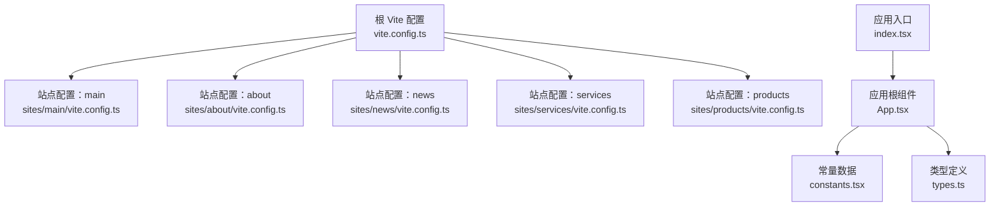
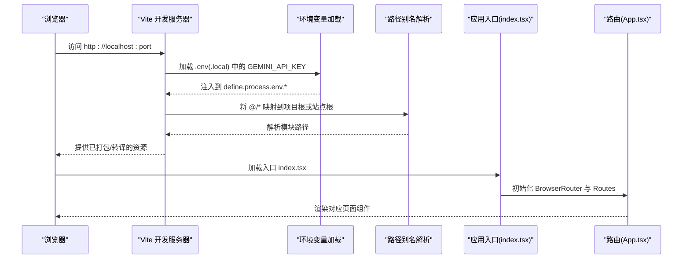
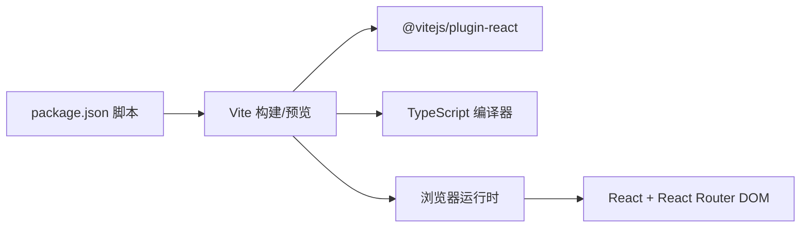

# 构建和部署配置

<cite>
**本文引用的文件**
- [vite.config.ts（根）](file://vite.config.ts)
- [package.json](file://package.json)
- [tsconfig.json](file://tsconfig.json)
- [README.md](file://README.md)
- [index.tsx](file://index.tsx)
- [App.tsx](file://App.tsx)
- [constants.tsx](file://constants.tsx)
- [types.ts](file://types.ts)
- [sites/main/vite.config.ts](file://sites/main/vite.config.ts)
- [sites/about/vite.config.ts](file://sites/about/vite.config.ts)
- [sites/news/vite.config.ts](file://sites/news/vite.config.ts)
- [sites/products/vite.config.ts](file://sites/products/vite.config.ts)
- [sites/services/vite.config.ts](file://sites/services/vite.config.ts)
- [start-all-sites.bat](file://start-all-sites.bat)
</cite>

## 目录
1. [简介](#简介)
2. [项目结构](#项目结构)
3. [核心组件](#核心组件)
4. [架构总览](#架构总览)
5. [详细组件分析](#详细组件分析)
6. [依赖关系分析](#依赖关系分析)
7. [性能考量](#性能考量)
8. [故障排查指南](#故障排查指南)
9. [结论](#结论)
10. [附录](#附录)

## 简介
本文件面向威宇精密工程网站的构建与部署配置，系统性说明 Vite 构建配置、环境变量管理、生产环境优化策略，并结合多站点（main、about、news、services、products）的独立开发服务器配置进行落地说明。文档同时覆盖 TypeScript 编译配置、路径别名与模块解析规则、包脚本与依赖管理、构建产物优化、代码分割与资源压缩、环境变量与 API 密钥的安全实践、以及 CI/CD 流程与自动化部署的建议。

## 项目结构
该仓库采用“单仓库多站点”的组织方式：根目录提供统一的 Vite 配置与通用应用入口；各子站点在 sites 目录下拥有独立的入口文件与 Vite 配置，便于本地并行开发与调试。

图表来源
- [vite.config.ts（根）](file://vite.config.ts#L1-L24)
- [sites/main/vite.config.ts](file://sites/main/vite.config.ts#L1-L25)
- [sites/about/vite.config.ts](file://sites/about/vite.config.ts#L1-L25)
- [sites/news/vite.config.ts](file://sites/news/vite.config.ts#L1-L25)
- [sites/services/vite.config.ts](file://sites/services/vite.config.ts#L1-L25)
- [sites/products/vite.config.ts](file://sites/products/vite.config.ts#L1-L25)
- [index.tsx](file://index.tsx#L1-L17)
- [App.tsx](file://App.tsx#L1-L112)
- [constants.tsx](file://constants.tsx#L1-L167)
- [types.ts](file://types.ts#L1-L30)

章节来源
- [vite.config.ts（根）](file://vite.config.ts#L1-L24)
- [sites/main/vite.config.ts](file://sites/main/vite.config.ts#L1-L25)
- [sites/about/vite.config.ts](file://sites/about/vite.config.ts#L1-L25)
- [sites/news/vite.config.ts](file://sites/news/vite.config.ts#L1-L25)
- [sites/products/vite.config.ts](file://sites/products/vite.config.ts#L1-L25)
- [sites/services/vite.config.ts](file://sites/services/vite.config.ts#L1-L25)
- [index.tsx](file://index.tsx#L1-L17)
- [App.tsx](file://App.tsx#L1-L112)
- [constants.tsx](file://constants.tsx#L1-L167)
- [types.ts](file://types.ts#L1-L30)

## 核心组件
- Vite 根配置：统一开发服务器端口、主机绑定、React 插件、全局常量注入与路径别名。
- 多站点 Vite 配置：每个站点独立 root、端口与别名，共享环境变量加载逻辑。
- 应用入口与路由：通过 React Router 实现页面级路由与滚动行为控制。
- TypeScript 配置：ESNext 模块、bundler 解析、路径映射与 JSX 支持。
- 包脚本与依赖：开发、构建、预览命令与关键依赖版本。

章节来源
- [vite.config.ts（根）](file://vite.config.ts#L5-L23)
- [sites/main/vite.config.ts](file://sites/main/vite.config.ts#L5-L24)
- [sites/about/vite.config.ts](file://sites/about/vite.config.ts#L5-L24)
- [sites/news/vite.config.ts](file://sites/news/vite.config.ts#L5-L24)
- [sites/products/vite.config.ts](file://sites/products/vite.config.ts#L5-L24)
- [sites/services/vite.config.ts](file://sites/services/vite.config.ts#L5-L24)
- [index.tsx](file://index.tsx#L1-L17)
- [App.tsx](file://App.tsx#L41-L109)
- [tsconfig.json](file://tsconfig.json#L1-L29)
- [package.json](file://package.json#L1-L23)

## 架构总览
下图展示从浏览器到构建工具再到运行时的关键交互路径，包括开发服务器启动、环境变量注入、别名解析与路由渲染。

图表来源
- [vite.config.ts（根）](file://vite.config.ts#L6-L16)
- [sites/main/vite.config.ts](file://sites/main/vite.config.ts#L6-L17)
- [index.tsx](file://index.tsx#L1-L17)
- [App.tsx](file://App.tsx#L41-L69)

章节来源
- [vite.config.ts（根）](file://vite.config.ts#L5-L23)
- [sites/main/vite.config.ts](file://sites/main/vite.config.ts#L5-L24)
- [index.tsx](file://index.tsx#L1-L17)
- [App.tsx](file://App.tsx#L41-L69)

## 详细组件分析

### Vite 根配置（vite.config.ts）
- 开发服务器：开放主机与固定端口，便于局域网联调。
- 插件：启用 React 插件以支持 JSX/TSX 转换与 HMR。
- 全局常量注入：将 GEMINI_API_KEY 以 define 的形式注入到客户端代码中，避免直接暴露在 window 上。
- 路径别名：将 @ 指向项目根目录，简化导入路径。

章节来源
- [vite.config.ts（根）](file://vite.config.ts#L8-L21)

### 各站点 Vite 配置（sites/*/vite.config.ts）
- 独立 root：每个站点的 root 指向自身目录，确保入口 HTML 与资源相对路径正确。
- 独立端口：main(3000)、about(3001)、news(3002)、services(3003)、products(3004)，避免冲突。
- 环境变量：通过 loadEnv 从上级目录加载，保证与根配置一致的变量注入。
- 别名：@ 指向项目根，便于跨站点共享组件与资源。

章节来源
- [sites/main/vite.config.ts](file://sites/main/vite.config.ts#L8-L22)
- [sites/about/vite.config.ts](file://sites/about/vite.config.ts#L8-L22)
- [sites/news/vite.config.ts](file://sites/news/vite.config.ts#L8-L22)
- [sites/services/vite.config.ts](file://sites/services/vite.config.ts#L8-L22)
- [sites/products/vite.config.ts](file://sites/products/vite.config.ts#L8-L22)

### TypeScript 编译配置（tsconfig.json）
- 目标与模块：ES2022 目标、ESNext 模块，适配现代浏览器与 Vite 打包器。
- 模块解析：bundler 解析，与 Vite 的原生 ESM 生态契合。
- 路径别名：@/* 对应 ./*，与 Vite 别名保持一致。
- JSX 与类型：启用 react-jsx，允许 .tsx/.ts 使用，noEmit 确保仅做类型检查。
- 其他：跳过库检查、开启装饰器实验特性等。

章节来源
- [tsconfig.json](file://tsconfig.json#L2-L28)

### 应用入口与路由（index.tsx、App.tsx）
- 入口挂载：在 index.tsx 中查找 #root 并渲染 App。
- 路由与页面：App.tsx 使用 React Router 定义首页与多页面路由，包含滚动到顶部的行为。
- 主题切换：内置深色模式开关，动态添加/移除 dark 类名。
- 页面组件：引入各页面组件（AboutPage、ServicePage、ProcessPage、AllProductsPage）并按需渲染。

章节来源
- [index.tsx](file://index.tsx#L6-L16)
- [App.tsx](file://App.tsx#L17-L28)
- [App.tsx](file://App.tsx#L31-L39)
- [App.tsx](file://App.tsx#L41-L69)
- [App.tsx](file://App.tsx#L74-L85)

### 数据与类型（constants.tsx、types.ts）
- 类型定义：NewsItem、ProductItem、ServiceItem，约束数据结构。
- 常量数据：新闻、服务与产品列表，用于页面渲染与占位展示。

章节来源
- [types.ts](file://types.ts#L2-L29)
- [constants.tsx](file://constants.tsx#L4-L23)
- [constants.tsx](file://constants.tsx#L25-L48)
- [constants.tsx](file://constants.tsx#L50-L167)

### 多站点并行启动（start-all-sites.bat）
- 功能：一次性启动所有站点的开发服务器，分别打开不同端口窗口。
- 使用场景：本地联调多个站点、并行开发与测试。

章节来源
- [start-all-sites.bat](file://start-all-sites.bat#L13-L21)

## 依赖关系分析
- 构建工具链：Vite 作为构建与开发服务器，@vitejs/plugin-react 提供 React 转换与 HMR。
- 运行时框架：React 与 React DOM，React Router DOM 用于路由。
- 类型与工具：TypeScript 与 @types/node 提供类型支持。
- 项目脚本：dev/build/preview 三个基础脚本，配合多站点启动脚本。

图表来源
- [package.json](file://package.json#L6-L10)
- [package.json](file://package.json#L16-L21)
- [vite.config.ts（根）](file://vite.config.ts#L12-L12)

章节来源
- [package.json](file://package.json#L1-L23)
- [vite.config.ts（根）](file://vite.config.ts#L12-L12)

## 性能考量
以下为通用优化建议，适用于当前仓库的 Vite 与 React 架构：

- 代码分割与懒加载
  - 将大型页面或组件按路由拆分，利用 React.lazy 与 Suspense 实现按需加载，减少首屏体积。
  - 在多站点场景下，可进一步拆分公共依赖与业务代码，避免重复打包。

- 资源压缩与静态资源处理
  - 使用 Vite 默认的最小化器（基于 esbuild），确保 JS/CSS 压缩与 Tree Shaking。
  - 图片与媒体资源建议预压缩与使用现代格式（如 AVIF/WebP），并在构建后进行 CDN 缓存优化。

- 构建产物分析
  - 使用 Vite 插件（如 vite-bundle-analyzer 或 rollup-plugin-visualizer）生成可视化报告，识别大体积依赖与重复模块。
  - 结合浏览器 DevTools 的 Network 与 Performance 面板，定位慢加载资源与渲染瓶颈。

- 缓存与持久化
  - 合理设置静态资源缓存策略（长缓存 + 版本号/哈希命名），避免缓存穿透。
  - 对第三方字体与图标资源，优先使用 CDN 并开启 HTTP/2 多路复用。

- 环境变量与安全
  - 仅注入前端可见的 API 密钥（如 GEMINI_API_KEY），避免在客户端暴露后端敏感信息。
  - 在生产环境通过反向代理或边缘计算层进行密钥转发与访问控制，不直接在浏览器发起受限请求。

- 开发体验
  - 保持 HMR 高效，避免在插件中执行重任务。
  - 使用 .vite 目录外的缓存与临时文件，避免污染版本控制。

## 故障排查指南
- 环境变量未生效
  - 确认 .env(.local) 文件存在且包含 GEMINI_API_KEY。
  - 检查 Vite 配置中的 loadEnv 调用路径是否正确（根配置与各站点配置的相对路径不同）。
  - 确认 define 注入的键名与代码读取的一致（process.env.API_KEY 与 process.env.GEMINI_API_KEY）。

- 路径别名无效
  - 确认 tsconfig.json 与 vite.config.ts 的 @/* 别名指向一致（项目根 vs 站点根）。
  - 在 IDE 中确认 TS 能解析别名，避免编辑器报错影响开发。

- 多站点端口冲突
  - 若本地已有服务占用端口，请调整各站点的 server.port。
  - 使用 start-all-sites.bat 启动前，先关闭可能占用的进程。

- 入口元素未找到
  - 确认 index.html 中存在 id 为 root 的容器元素，否则入口会抛出错误。

- 构建失败或运行时错误
  - 清理 node_modules 与重新安装依赖，确保版本兼容。
  - 检查 React 与 React Router 的版本是否匹配 Vite 的 ESM 行为。

章节来源
- [vite.config.ts（根）](file://vite.config.ts#L6-L16)
- [sites/main/vite.config.ts](file://sites/main/vite.config.ts#L6-L17)
- [tsconfig.json](file://tsconfig.json#L21-L25)
- [index.tsx](file://index.tsx#L6-L9)
- [README.md](file://README.md#L18-L20)
- [start-all-sites.bat](file://start-all-sites.bat#L4-L8)

## 结论
本项目采用“单仓库多站点”的 Vite + React 架构，通过统一的根配置与各站点独立配置实现高效开发与部署准备。结合路径别名、环境变量注入与 TypeScript 配置，既保证了开发效率也兼顾了可维护性。建议在生产环境中引入构建产物分析、资源压缩与缓存策略，并通过安全的密钥管理与反向代理实现更稳健的线上发布。

## 附录

### Vite 配置要点速览
- 开发服务器：host 与 port 统一开放，便于联调。
- 插件：React 插件启用，适配 JSX/TSX。
- 全局常量：define 注入 API 密钥，避免直接暴露。
- 路径别名：@ 指向项目根或站点根，与 tsconfig 保持一致。

章节来源
- [vite.config.ts（根）](file://vite.config.ts#L8-L21)
- [sites/main/vite.config.ts](file://sites/main/vite.config.ts#L9-L22)
- [tsconfig.json](file://tsconfig.json#L21-L25)

### TypeScript 配置要点速览
- 目标与模块：ES2022 + ESNext。
- 模块解析：bundler，与 Vite 协同。
- 路径别名：@/* → ./*。
- JSX：react-jsx。
- noEmit：仅类型检查。

章节来源
- [tsconfig.json](file://tsconfig.json#L2-L28)

### 包脚本与依赖
- 脚本：dev、build、preview。
- 依赖：React、React DOM、React Router DOM。
- 开发依赖：@vitejs/plugin-react、TypeScript、Vite、@types/node。

章节来源
- [package.json](file://package.json#L6-L10)
- [package.json](file://package.json#L11-L21)

### 多站点开发流程
- 启动：使用 start-all-sites.bat 并行启动各站点。
- 访问：根据端口访问对应站点页面。
- 调试：在各自 vite.config.ts 中调整端口与别名，确保路径解析正确。

章节来源
- [start-all-sites.bat](file://start-all-sites.bat#L4-L8)
- [sites/main/vite.config.ts](file://sites/main/vite.config.ts#L10-L11)
- [sites/about/vite.config.ts](file://sites/about/vite.config.ts#L10-L11)
- [sites/news/vite.config.ts](file://sites/news/vite.config.ts#L10-L11)
- [sites/services/vite.config.ts](file://sites/services/vite.config.ts#L10-L11)
- [sites/products/vite.config.ts](file://sites/products/vite.config.ts#L10-L11)