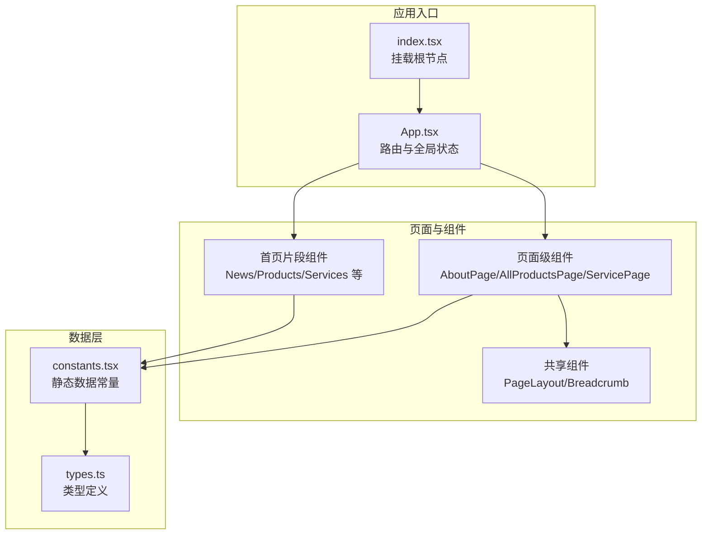
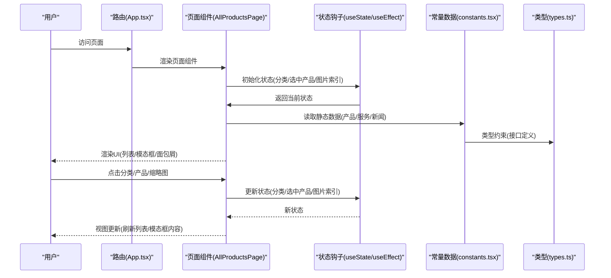
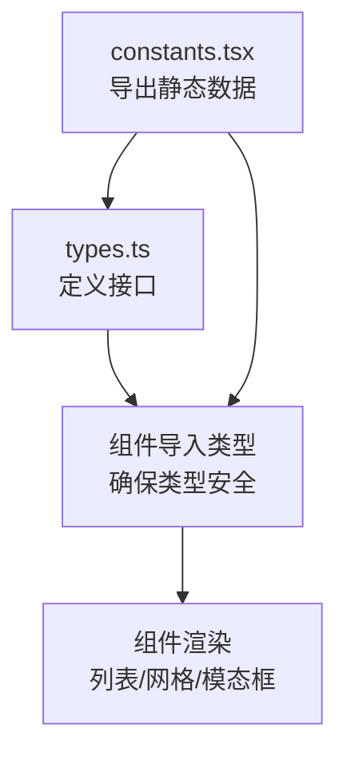
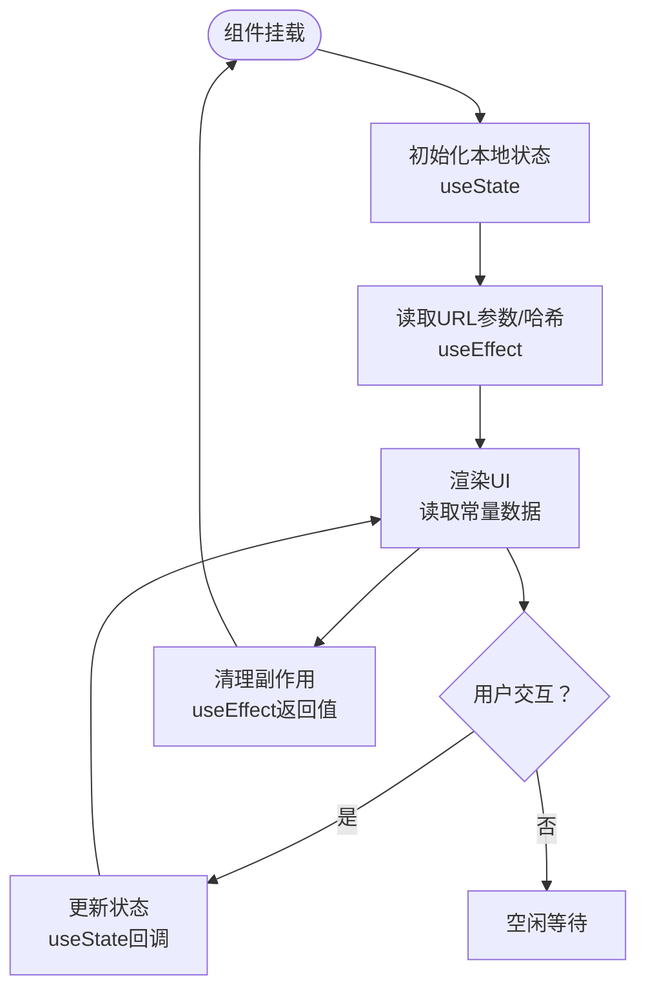
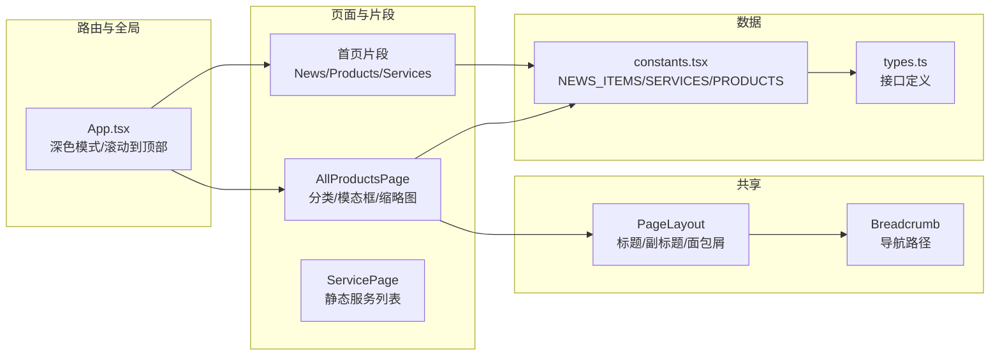
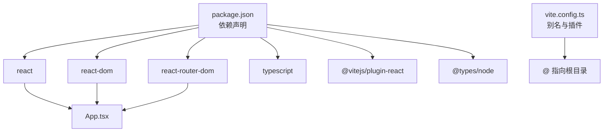

# 数据流设计

<cite>
**本文引用的文件**
- [App.tsx](file://App.tsx)
- [index.tsx](file://index.tsx)
- [constants.tsx](file://constants.tsx)
- [types.ts](file://types.ts)
- [components/News.tsx](file://components/News.tsx)
- [components/Products.tsx](file://components/Products.tsx)
- [components/pages/AllProductsPage.tsx](file://components/pages/AllProductsPage.tsx)
- [components/pages/ServicePage.tsx](file://components/pages/ServicePage.tsx)
- [components/shared/PageLayout.tsx](file://components/shared/PageLayout.tsx)
- [components/shared/Breadcrumb.tsx](file://components/shared/Breadcrumb.tsx)
- [package.json](file://package.json)
- [vite.config.ts](file://vite.config.ts)
</cite>

## 目录
1. [引言](#引言)
2. [项目结构](#项目结构)
3. [核心组件](#核心组件)
4. [架构总览](#架构总览)
5. [详细组件分析](#详细组件分析)
6. [依赖关系分析](#依赖关系分析)
7. [性能考量](#性能考量)
8. [故障排查指南](#故障排查指南)
9. [结论](#结论)
10. [附录](#附录)

## 引言
本设计文档围绕“威宇精密工程”网站的数据流进行系统化梳理，覆盖从用户交互到组件渲染的完整路径：用户输入 → 组件状态更新 → 状态变化触发重新渲染 → 常量数据驱动渲染。文档重点阐述静态数据管理策略（constants.tsx 中的产品、服务、新闻数据结构）、TypeScript 类型系统对数据流的类型安全保证、状态管理模式（useState、useEffect 的使用场景与最佳实践），并提供数据流图示与性能优化建议，帮助开发者与维护者高效理解与改进系统。

## 项目结构
该站点采用 React + TypeScript 构建，通过 Vite 提供开发与构建支持。应用入口负责路由与全局状态（如深色模式），页面组件通过常量数据驱动渲染，共享组件（面包屑、页面布局）统一承载页面结构与导航。

**图表来源**
- [index.tsx](file://index.tsx#L1-L17)
- [App.tsx](file://App.tsx#L1-L112)
- [components/News.tsx](file://components/News.tsx#L1-L58)
- [components/Products.tsx](file://components/Products.tsx#L1-L310)
- [components/pages/AllProductsPage.tsx](file://components/pages/AllProductsPage.tsx#L1-L281)
- [components/pages/ServicePage.tsx](file://components/pages/ServicePage.tsx#L1-L182)
- [components/shared/PageLayout.tsx](file://components/shared/PageLayout.tsx#L1-L41)
- [components/shared/Breadcrumb.tsx](file://components/shared/Breadcrumb.tsx#L1-L51)
- [constants.tsx](file://constants.tsx#L1-L167)
- [types.ts](file://types.ts#L1-L30)

**章节来源**
- [index.tsx](file://index.tsx#L1-L17)
- [App.tsx](file://App.tsx#L1-L112)
- [package.json](file://package.json#L1-L23)
- [vite.config.ts](file://vite.config.ts#L1-L24)

## 核心组件
- 应用根节点与路由：应用入口负责挂载根节点；App.tsx 定义路由与全局状态（深色模式），并提供滚动回到顶部的副作用。
- 页面组件：首页片段组件（News、Products、Services）直接消费常量数据；页面级组件（AllProductsPage、ServicePage）承担更复杂的交互与状态管理。
- 共享组件：PageLayout 统一页面标题、副标题与面包屑容器；Breadcrumb 提供导航路径。

**章节来源**
- [index.tsx](file://index.tsx#L1-L17)
- [App.tsx](file://App.tsx#L1-L112)
- [components/News.tsx](file://components/News.tsx#L1-L58)
- [components/Products.tsx](file://components/Products.tsx#L1-L310)
- [components/pages/AllProductsPage.tsx](file://components/pages/AllProductsPage.tsx#L1-L281)
- [components/pages/ServicePage.tsx](file://components/pages/ServicePage.tsx#L1-L182)
- [components/shared/PageLayout.tsx](file://components/shared/PageLayout.tsx#L1-L41)
- [components/shared/Breadcrumb.tsx](file://components/shared/Breadcrumb.tsx#L1-L51)

## 架构总览
下图展示了用户交互到组件渲染的端到端数据流：用户在页面上进行点击或筛选，组件内部状态被更新，触发重新渲染；渲染过程中读取常量数据，最终呈现内容。

**图表来源**
- [App.tsx](file://App.tsx#L41-L109)
- [components/pages/AllProductsPage.tsx](file://components/pages/AllProductsPage.tsx#L9-L82)
- [components/Products.tsx](file://components/Products.tsx#L8-L89)
- [constants.tsx](file://constants.tsx#L1-L167)
- [types.ts](file://types.ts#L1-L30)

## 详细组件分析

### 静态数据管理策略与类型安全
- 数据集中存放于 constants.tsx，分别导出 NEWS_ITEMS、SERVICES、PRODUCTS 三类常量，作为各组件的稳定数据源。
- types.ts 定义了 NewsItem、ProductItem、ServiceItem 接口，确保数据结构一致性与类型安全。
- 组件通过导入常量并结合接口类型进行消费，形成“常量数据驱动渲染”的模式，降低运行时计算成本，提升渲染稳定性。

**图表来源**
- [constants.tsx](file://constants.tsx#L1-L167)
- [types.ts](file://types.ts#L1-L30)
- [components/News.tsx](file://components/News.tsx#L1-L58)
- [components/Products.tsx](file://components/Products.tsx#L1-L310)
- [components/pages/AllProductsPage.tsx](file://components/pages/AllProductsPage.tsx#L1-L281)

**章节来源**
- [constants.tsx](file://constants.tsx#L1-L167)
- [types.ts](file://types.ts#L1-L30)

### 状态管理模式与最佳实践
- App.tsx
  - 使用 useState 管理深色模式开关，并通过 useEffect 将类名写入/移除到 documentElement，实现主题切换。
  - 使用 useEffect 在路由变更时滚动到顶部，改善用户体验。
- AllProductsPage.tsx
  - 使用 useState 管理活动分类、选中产品、当前图片索引。
  - 使用 useEffect 从 URL 查询参数读取初始分类，保持 URL 与视图一致。
  - 使用 useSearchParams 控制分类参数的变更，避免手动拼接字符串。
- Products.tsx（首页片段）
  - 使用 useState 管理活动分类、选中产品、当前图片索引。
  - 使用 useEffect 监听 URL hash 变化，实现无需刷新的分类切换。
  - 使用 useRef 获取滚动容器，实现平滑横向滚动。
- 共享组件
  - PageLayout 与 Breadcrumb 仅消费 props，不持有内部状态，职责单一，利于复用与测试。

**图表来源**
- [App.tsx](file://App.tsx#L41-L109)
- [components/pages/AllProductsPage.tsx](file://components/pages/AllProductsPage.tsx#L9-L82)
- [components/Products.tsx](file://components/Products.tsx#L8-L32)

**章节来源**
- [App.tsx](file://App.tsx#L41-L109)
- [components/pages/AllProductsPage.tsx](file://components/pages/AllProductsPage.tsx#L9-L82)
- [components/Products.tsx](file://components/Products.tsx#L8-L32)

### 数据流图示（组件间传递与状态同步）

**图表来源**
- [App.tsx](file://App.tsx#L1-L112)
- [components/pages/AllProductsPage.tsx](file://components/pages/AllProductsPage.tsx#L1-L281)
- [components/pages/ServicePage.tsx](file://components/pages/ServicePage.tsx#L1-L182)
- [components/News.tsx](file://components/News.tsx#L1-L58)
- [components/Products.tsx](file://components/Products.tsx#L1-L310)
- [components/shared/PageLayout.tsx](file://components/shared/PageLayout.tsx#L1-L41)
- [components/shared/Breadcrumb.tsx](file://components/shared/Breadcrumb.tsx#L1-L51)
- [constants.tsx](file://constants.tsx#L1-L167)
- [types.ts](file://types.ts#L1-L30)

## 依赖关系分析
- 运行时依赖：React、ReactDOM、react-router-dom。
- 开发时依赖：@types/node、@vitejs/plugin-react、typescript、vite。
- 别名解析：Vite 配置将 @ 指向仓库根目录，便于统一导入路径。

**图表来源**
- [package.json](file://package.json#L1-L23)
- [vite.config.ts](file://vite.config.ts#L1-L24)
- [App.tsx](file://App.tsx#L1-L112)

**章节来源**
- [package.json](file://package.json#L1-L23)
- [vite.config.ts](file://vite.config.ts#L1-L24)

## 性能考量
- 避免不必要的重渲染
  - 将只读数据（常量）置于组件外部，减少渲染时的重复计算与对象重建。
  - 对高频渲染区域（如产品网格）优先使用稳定的键值与最小化状态粒度，避免因状态抖动导致整块区域重绘。
- 内存泄漏防护
  - 在 Products.tsx 中监听 hashchange 并在卸载时移除事件监听器，防止内存泄漏。
  - App.tsx 中对副作用的清理应与依赖数组保持一致，避免重复绑定。
- 图片加载与回退
  - 在图片加载失败时提供占位符回退逻辑，减少异常对渲染的影响。
- 路由与滚动
  - 在路由切换时主动滚动到顶部，避免历史滚动位置影响用户体验。

[本节为通用指导，不直接分析具体文件，故无“章节来源”]

## 故障排查指南
- 深色模式未生效
  - 检查 App.tsx 中是否正确将类名添加/移除到 documentElement。
- 分类筛选无效
  - 检查 AllProductsPage.tsx 或 Products.tsx 中对 URL 参数/哈希的读取与状态更新逻辑。
- 模态框无法关闭
  - 检查模态框点击遮罩关闭的事件处理与事件冒泡阻止逻辑。
- 图片空白或加载失败
  - 检查图片错误回退逻辑与 referrerPolicy 设置。
- 面包屑链接异常
  - 检查 Breadcrumb 组件的路径生成与 Link 组件的 to 属性。

**章节来源**
- [App.tsx](file://App.tsx#L41-L109)
- [components/pages/AllProductsPage.tsx](file://components/pages/AllProductsPage.tsx#L84-L156)
- [components/Products.tsx](file://components/Products.tsx#L187-L304)
- [components/shared/Breadcrumb.tsx](file://components/shared/Breadcrumb.tsx#L13-L48)

## 结论
本项目通过“常量数据驱动渲染 + 明确的状态管理模式”，实现了清晰、可维护且具备良好性能的数据流。TypeScript 类型系统进一步强化了数据结构的一致性与可预测性。未来可在以下方面持续优化：进一步拆分与复用共享逻辑、引入选择器与不可变数据结构以降低渲染成本、完善错误边界与加载状态提示。

## 附录
- 关键实现参考路径
  - 深色模式与滚动到顶部：[App.tsx](file://App.tsx#L41-L109)
  - 产品分类与模态框：[components/pages/AllProductsPage.tsx](file://components/pages/AllProductsPage.tsx#L9-L82)
  - 首页产品片段与滚动：[components/Products.tsx](file://components/Products.tsx#L8-L32)
  - 静态数据与类型：[constants.tsx](file://constants.tsx#L1-L167)、[types.ts](file://types.ts#L1-L30)
  - 页面布局与面包屑：[components/shared/PageLayout.tsx](file://components/shared/PageLayout.tsx#L1-L41)、[components/shared/Breadcrumb.tsx](file://components/shared/Breadcrumb.tsx#L1-L51)