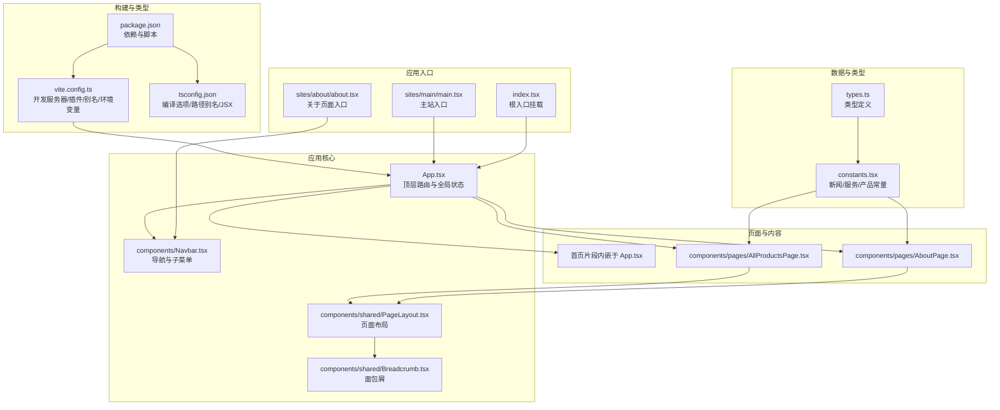
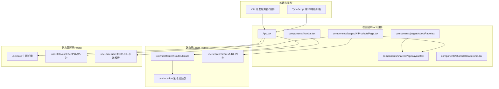
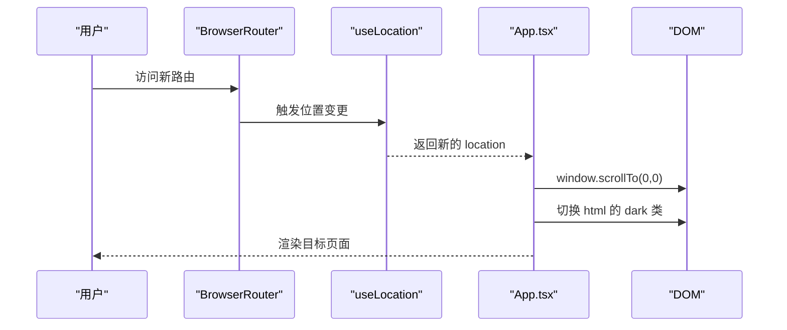
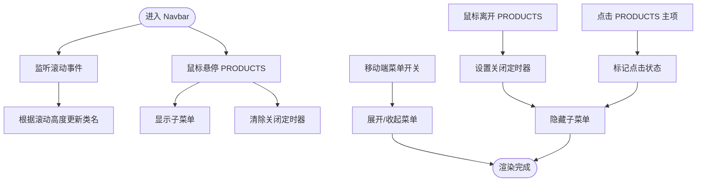
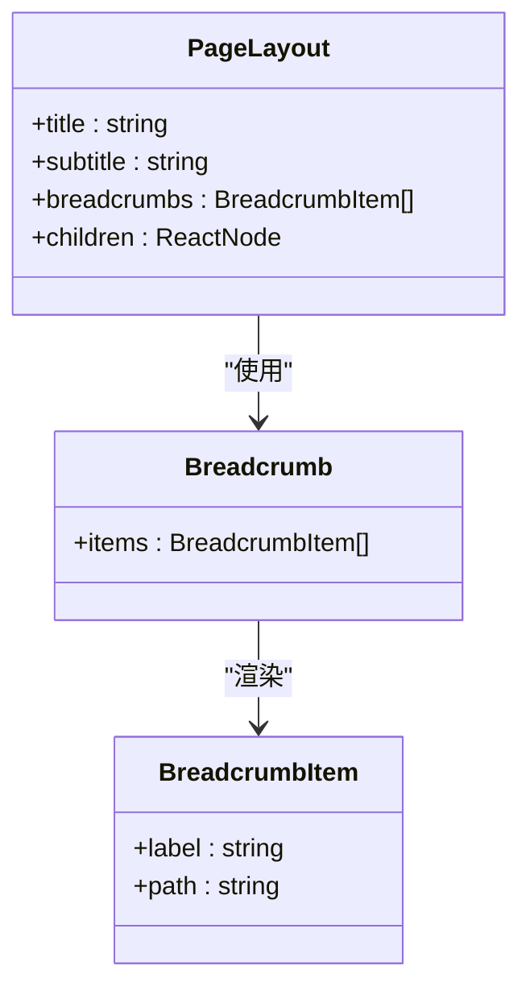
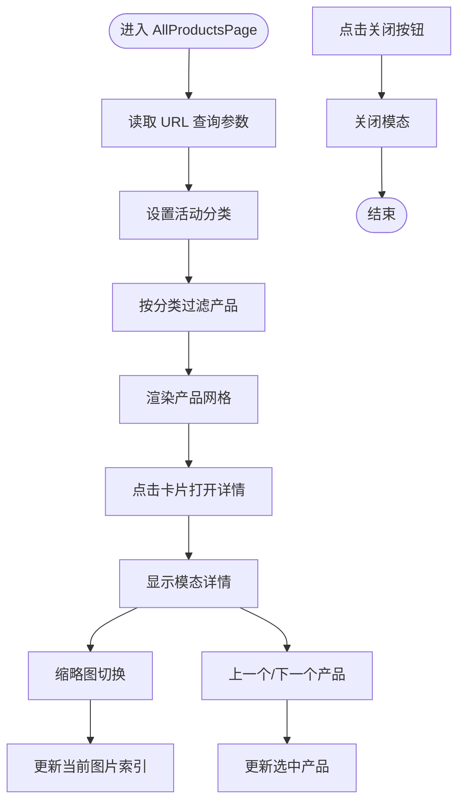
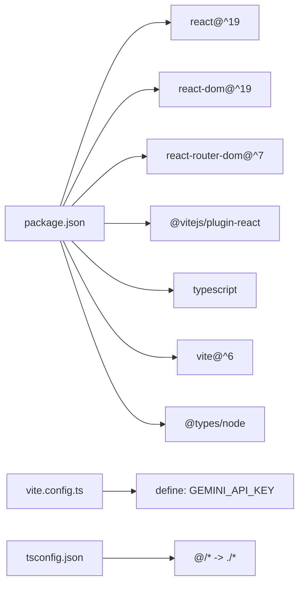
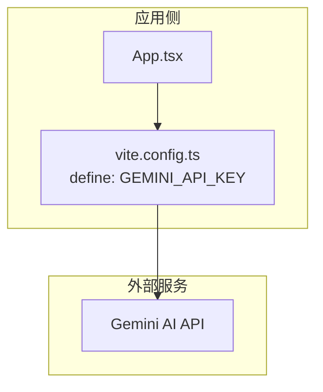

# 整体架构

<cite>
**本文引用的文件**
- [package.json](file://package.json)
- [vite.config.ts](file://vite.config.ts)
- [App.tsx](file://App.tsx)
- [index.tsx](file://index.tsx)
- [tsconfig.json](file://tsconfig.json)
- [components/shared/PageLayout.tsx](file://components/shared/PageLayout.tsx)
- [components/shared/Breadcrumb.tsx](file://components/shared/Breadcrumb.tsx)
- [components/pages/AboutPage.tsx](file://components/pages/AboutPage.tsx)
- [components/pages/AllProductsPage.tsx](file://components/pages/AllProductsPage.tsx)
- [components/Navbar.tsx](file://components/Navbar.tsx)
- [constants.tsx](file://constants.tsx)
- [types.ts](file://types.ts)
- [sites/main/main.tsx](file://sites/main/main.tsx)
- [sites/about/about.tsx](file://sites/about/about.tsx)
- [metadata.json](file://metadata.json)
</cite>

## 目录
1. [引言](#引言)
2. [项目结构](#项目结构)
3. [核心组件](#核心组件)
4. [架构总览](#架构总览)
5. [详细组件分析](#详细组件分析)
6. [依赖关系分析](#依赖关系分析)
7. [性能考虑](#性能考虑)
8. [故障排查指南](#故障排查指南)
9. [结论](#结论)
10. [附录](#附录)

## 引言
本架构文档面向“威宇精密工程”网站，系统性阐述基于 React 19 的单页应用（SPA）整体设计与实现要点。文档聚焦以下方面：
- 组件化架构与路由驱动设计理念
- 分层结构：视图层（React 组件）、路由层（React Router）、状态管理层（Hooks）
- Vite 在开发与生产环境中的角色：热重载、代码分割与优化策略
- TypeScript 类型系统在架构中的安全保障
- 系统边界与外部依赖（如 Gemini AI API）的集成方式
- 性能优化策略与可扩展性设计原则

## 项目结构
该项目采用以功能域为中心的目录组织方式，结合多站点入口与共享组件复用，形成清晰的层次化结构：
- 根级入口与配置：根入口负责挂载顶层 App；Vite 提供构建与开发服务器；TypeScript 编译配置统一路径别名与 JSX 策略
- 页面与共享组件：页面组件位于 components/pages，通用布局与导航位于 components/shared
- 数据与类型：常量数据集中于 constants.tsx，类型定义集中在 types.ts
- 多站点入口：sites 下按业务域拆分入口文件，便于独立部署或模块化扩展

图表来源
- [index.tsx](file://index.tsx#L1-L17)
- [sites/main/main.tsx](file://sites/main/main.tsx#L1-L10)
- [sites/about/about.tsx](file://sites/about/about.tsx#L1-L24)
- [App.tsx](file://App.tsx#L1-L112)
- [components/Navbar.tsx](file://components/Navbar.tsx#L1-L260)
- [components/shared/PageLayout.tsx](file://components/shared/PageLayout.tsx#L1-L41)
- [components/shared/Breadcrumb.tsx](file://components/shared/Breadcrumb.tsx#L1-L51)
- [components/pages/AboutPage.tsx](file://components/pages/AboutPage.tsx#L1-L144)
- [components/pages/AllProductsPage.tsx](file://components/pages/AllProductsPage.tsx#L1-L281)
- [constants.tsx](file://constants.tsx#L1-L167)
- [types.ts](file://types.ts#L1-L30)
- [package.json](file://package.json#L1-L23)
- [vite.config.ts](file://vite.config.ts#L1-L24)
- [tsconfig.json](file://tsconfig.json#L1-L29)

章节来源
- [package.json](file://package.json#L1-L23)
- [vite.config.ts](file://vite.config.ts#L1-L24)
- [tsconfig.json](file://tsconfig.json#L1-L29)

## 核心组件
- 应用根组件 App：集中管理顶层路由、滚动行为、暗色主题切换与全局样式注入；通过 React Router 定义主要路由
- 导航栏 Navbar：响应式导航，支持桌面端下拉子菜单与移动端抽屉菜单，处理滚动样式与交互状态
- 页面布局 PageLayout：提供统一标题、副标题、面包屑与动画过渡的页面容器
- 面包屑 Breadcrumb：根据传入的面包屑项生成层级导航
- 关于页面 AboutPage：使用 PageLayout 展示公司介绍、统计信息、核心价值与认证资质
- 产品页面 AllProductsPage：支持分类筛选、图片画廊、模态详情弹窗与 URL 参数同步
- 常量与类型：constants.tsx 提供新闻、服务、产品数据；types.ts 定义数据结构

章节来源
- [App.tsx](file://App.tsx#L1-L112)
- [components/Navbar.tsx](file://components/Navbar.tsx#L1-L260)
- [components/shared/PageLayout.tsx](file://components/shared/PageLayout.tsx#L1-L41)
- [components/shared/Breadcrumb.tsx](file://components/shared/Breadcrumb.tsx#L1-L51)
- [components/pages/AboutPage.tsx](file://components/pages/AboutPage.tsx#L1-L144)
- [components/pages/AllProductsPage.tsx](file://components/pages/AllProductsPage.tsx#L1-L281)
- [constants.tsx](file://constants.tsx#L1-L167)
- [types.ts](file://types.ts#L1-L30)

## 架构总览
该应用采用“路由驱动”的单页应用（SPA）架构，围绕 React Router 进行页面级路由分发，配合 React Hooks 实现轻量状态管理与副作用处理。构建与开发由 Vite 提供，TypeScript 提供类型安全保障。

图表来源
- [App.tsx](file://App.tsx#L1-L112)
- [components/Navbar.tsx](file://components/Navbar.tsx#L1-L260)
- [components/shared/PageLayout.tsx](file://components/shared/PageLayout.tsx#L1-L41)
- [components/shared/Breadcrumb.tsx](file://components/shared/Breadcrumb.tsx#L1-L51)
- [components/pages/AboutPage.tsx](file://components/pages/AboutPage.tsx#L1-L144)
- [components/pages/AllProductsPage.tsx](file://components/pages/AllProductsPage.tsx#L1-L281)
- [vite.config.ts](file://vite.config.ts#L1-L24)
- [tsconfig.json](file://tsconfig.json#L1-L29)

## 详细组件分析

### 路由与滚动控制（App.tsx）
- 路由定义：顶层使用 BrowserRouter 包裹，Routes 中声明首页与各页面路由
- 滚动控制：通过 useLocation 与 useEffect，在路由变化时滚动至顶部
- 全局状态：主题切换通过 useState 管理，动态为 html 根元素添加/移除 dark 类
- 动画与样式：注入全局动画与平滑滚动样式，提升用户体验

图表来源
- [App.tsx](file://App.tsx#L30-L54)

章节来源
- [App.tsx](file://App.tsx#L1-L112)

### 导航栏与子菜单（components/Navbar.tsx）
- 响应式设计：桌面端使用 hover 控制子菜单显示，移动端使用抽屉菜单
- 子菜单逻辑：通过 useState 管理是否显示子菜单，并使用定时器避免频繁闪烁
- 事件处理：监听滚动事件更新导航样式，清理定时器避免内存泄漏
- 链接与跳转：使用 React Router Link 与原生 a 标签组合，确保锚点与外链正确处理

图表来源
- [components/Navbar.tsx](file://components/Navbar.tsx#L13-L22)
- [components/Navbar.tsx](file://components/Navbar.tsx#L53-L72)
- [components/Navbar.tsx](file://components/Navbar.tsx#L118-L131)

章节来源
- [components/Navbar.tsx](file://components/Navbar.tsx#L1-L260)

### 页面布局与面包屑（components/shared/PageLayout.tsx 与 Breadcrumb.tsx）
- PageLayout：接收标题、副标题、面包屑与子内容，统一容器样式与动画过渡
- Breadcrumb：根据传入的面包屑项数组生成层级导航，首页与当前页样式区分

图表来源
- [components/shared/PageLayout.tsx](file://components/shared/PageLayout.tsx#L9-L14)
- [components/shared/Breadcrumb.tsx](file://components/shared/Breadcrumb.tsx#L4-L11)

章节来源
- [components/shared/PageLayout.tsx](file://components/shared/PageLayout.tsx#L1-L41)
- [components/shared/Breadcrumb.tsx](file://components/shared/Breadcrumb.tsx#L1-L51)

### 关于页面（components/pages/AboutPage.tsx）
- 使用 PageLayout 包裹，展示公司介绍、统计数据、核心价值与认证信息
- 结构清晰，便于后续扩展更多段落与组件

章节来源
- [components/pages/AboutPage.tsx](file://components/pages/AboutPage.tsx#L1-L144)

### 产品页面（components/pages/AllProductsPage.tsx）
- 分类筛选：通过 URL 查询参数与 useSearchParams 同步分类状态
- 图片画廊与模态详情：支持多图缩略预览与左右导航
- 交互细节：键盘/鼠标事件、错误回退占位图、空状态提示

图表来源
- [components/pages/AllProductsPage.tsx](file://components/pages/AllProductsPage.tsx#L9-L23)
- [components/pages/AllProductsPage.tsx](file://components/pages/AllProductsPage.tsx#L48-L82)
- [components/pages/AllProductsPage.tsx](file://components/pages/AllProductsPage.tsx#L159-L275)

章节来源
- [components/pages/AllProductsPage.tsx](file://components/pages/AllProductsPage.tsx#L1-L281)

### 多站点入口与独立挂载
- 根入口 index.tsx：统一挂载 App，适用于主站 SPA
- 站点入口：sites/main/main.tsx 与 sites/about/about.tsx 分别挂载 App 或特定页面组件，便于按需加载与部署

章节来源
- [index.tsx](file://index.tsx#L1-L17)
- [sites/main/main.tsx](file://sites/main/main.tsx#L1-L10)
- [sites/about/about.tsx](file://sites/about/about.tsx#L1-L24)

## 依赖关系分析
- 运行时依赖：React 19 与 React Router Dom 7，提供组件模型与路由能力
- 开发依赖：Vite 6 与 @vitejs/plugin-react，提供快速开发与构建能力
- 类型支持：TypeScript 与 @types/node，保障类型安全与开发体验
- 环境变量：通过 Vite define 注入 API_KEY，用于外部服务集成（如 Gemini AI）

图表来源
- [package.json](file://package.json#L11-L21)
- [vite.config.ts](file://vite.config.ts#L13-L16)
- [tsconfig.json](file://tsconfig.json#L21-L25)

章节来源
- [package.json](file://package.json#L1-L23)
- [vite.config.ts](file://vite.config.ts#L1-L24)
- [tsconfig.json](file://tsconfig.json#L1-L29)

## 性能考虑
- 代码分割与懒加载：建议对大型页面组件（如产品详情页）进行动态导入，减少首屏体积
- 图片优化：产品列表与详情页使用占位图与错误回退，降低无效请求开销
- 路由与滚动：路由切换自动滚动至顶部，避免重复滚动状态带来的视觉抖动
- 构建优化：Vite 默认启用压缩与打包优化；可结合产物分析进一步拆分第三方包
- 类型检查：严格类型约束减少运行时错误，提高稳定性与可维护性

## 故障排查指南
- 根节点缺失：index.tsx 对根元素存在性进行校验，若未找到根节点会抛出错误
- 路由不生效：确认 BrowserRouter 是否包裹 App，Route 路径与组件映射是否正确
- 主题切换异常：检查 App 中对 html 根元素类名的操作是否被其他样式覆盖
- 产品图片加载失败：确认占位图逻辑与 referrerPolicy 配置
- 环境变量未注入：确认 .env 文件与 vite.config.ts 中 define 配置一致

章节来源
- [index.tsx](file://index.tsx#L6-L9)
- [App.tsx](file://App.tsx#L44-L50)
- [components/pages/AllProductsPage.tsx](file://components/pages/AllProductsPage.tsx#L131-L133)
- [vite.config.ts](file://vite.config.ts#L13-L16)

## 结论
本项目以 React 19 为基础，采用组件化与路由驱动的 SPA 架构，结合 Vite 的高效开发体验与 TypeScript 的强类型保障，实现了可扩展、易维护的企业官网。通过共享布局与导航组件、统一的数据与类型定义，以及清晰的多站点入口，项目具备良好的演进空间。建议后续引入动态导入、产物分析与缓存策略，持续优化性能与用户体验。

## 附录

### 系统边界与外部依赖
- 外部依赖：项目通过 Vite define 注入环境变量，可用于集成 Gemini AI API 等外部服务
- 集成方式：在需要调用外部 API 的组件中读取全局定义的 API_KEY，发起请求并处理返回结果
- 安全建议：避免在客户端暴露敏感密钥；建议通过后端代理或服务端渲染接口访问外部 API

图表来源
- [vite.config.ts](file://vite.config.ts#L13-L16)
- [metadata.json](file://metadata.json#L1-L5)

章节来源
- [vite.config.ts](file://vite.config.ts#L1-L24)
- [metadata.json](file://metadata.json#L1-L5)