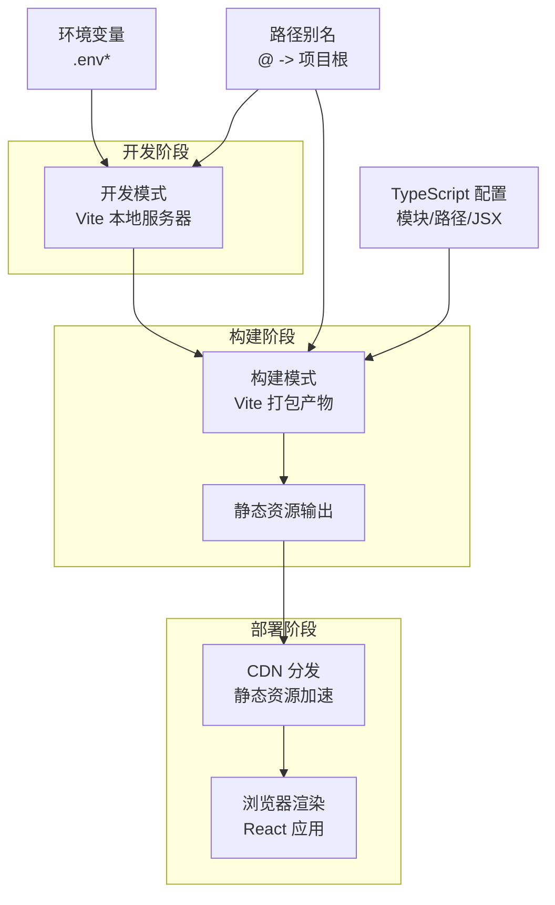
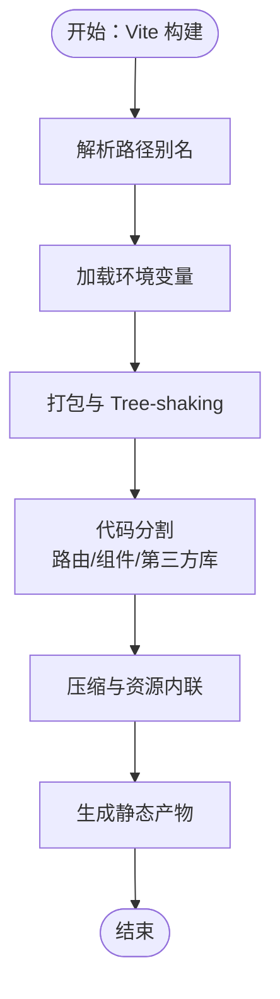
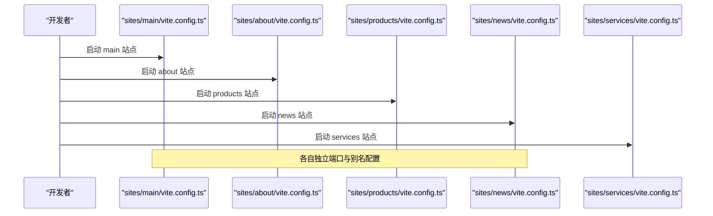
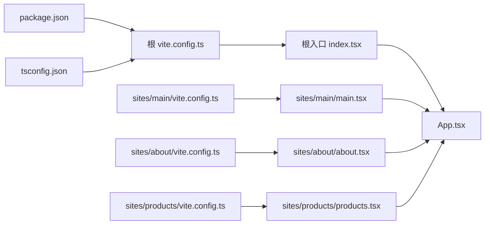

# 构建部署架构

<cite>
**本文引用的文件**
- [package.json](file://package.json)
- [vite.config.ts](file://vite.config.ts)
- [sites/main/vite.config.ts](file://sites/main/vite.config.ts)
- [sites/about/vite.config.ts](file://sites/about/vite.config.ts)
- [sites/news/vite.config.ts](file://sites/news/vite.config.ts)
- [sites/products/vite.config.ts](file://sites/products/vite.config.ts)
- [sites/services/vite.config.ts](file://sites/services/vite.config.ts)
- [tsconfig.json](file://tsconfig.json)
- [index.html](file://index.html)
- [index.tsx](file://index.tsx)
- [App.tsx](file://App.tsx)
- [sites/main/main.tsx](file://sites/main/main.tsx)
- [sites/about/about.tsx](file://sites/about/about.tsx)
- [sites/products/products.tsx](file://sites/products/products.tsx)
- [README.md](file://README.md)
- [start-all-sites.bat](file://start-all-sites.bat)
- [windows_qoder.bat](file://windows_qoder.bat)
</cite>

## 目录
1. [简介](#简介)
2. [项目结构](#项目结构)
3. [核心组件](#核心组件)
4. [架构总览](#架构总览)
5. [详细组件分析](#详细组件分析)
6. [依赖关系分析](#依赖关系分析)
7. [性能考虑](#性能考虑)
8. [故障排查指南](#故障排查指南)
9. [结论](#结论)
10. [附录](#附录)

## 简介
本文件面向威宇精密工程网站的构建与部署，系统化梳理 Vite 构建工具在该多站点项目中的配置与优化策略，覆盖开发服务器、生产构建、代码分割、TypeScript 编译、依赖管理、多站点独立入口与批量启动脚本、环境变量与 CDN 集成、缓存策略以及构建性能优化与调试方法。目标是帮助开发者与运维人员快速理解从源码到生产环境的完整流程，并提供可操作的优化建议。

## 项目结构
该项目采用“单仓库多站点”（Monorepo 风格）组织方式，根目录提供全局 Vite 配置与通用入口，各子站点在 sites 目录下拥有独立入口、HTML 与 Vite 配置，便于独立开发与部署。

```mermaid
graph TB
subgraph "根目录"
Pkg["package.json"]
VConf["vite.config.ts"]
TsC["tsconfig.json"]
Html["index.html"]
RootEntry["index.tsx"]
App["App.tsx"]
end
subgraph "站点：main"
MConf["sites/main/vite.config.ts"]
MHtml["sites/main/index.html"]
MEntry["sites/main/main.tsx"]
end
subgraph "站点：about"
AConf["sites/about/vite.config.ts"]
AEntry["sites/about/about.tsx"]
end
subgraph "站点：products"
PrConf["sites/products/vite.config.ts"]
PrEntry["sites/products/products.tsx"]
end
subgraph "站点：news"
NConf["sites/news/vite.config.ts"]
end
subgraph "站点：services"
SConf["sites/services/vite.config.ts"]
end
Pkg --> VConf
VConf --> RootEntry
RootEntry --> App
Html --> RootEntry
MConf --> MEntry
AConf --> AEntry
PrConf --> PrEntry
NConf --> |"各自独立入口"| NConf
SConf --> |"各自独立入口"| SConf
```

图表来源
- [package.json](file://package.json#L1-L23)
- [vite.config.ts](file://vite.config.ts#L1-L24)
- [tsconfig.json](file://tsconfig.json#L1-L29)
- [index.html](file://index.html#L1-L101)
- [index.tsx](file://index.tsx#L1-L17)
- [App.tsx](file://App.tsx#L1-L112)
- [sites/main/vite.config.ts](file://sites/main/vite.config.ts#L1-L25)
- [sites/main/main.tsx](file://sites/main/main.tsx#L1-L10)
- [sites/about/vite.config.ts](file://sites/about/vite.config.ts#L1-L25)
- [sites/about/about.tsx](file://sites/about/about.tsx#L1-L24)
- [sites/products/vite.config.ts](file://sites/products/vite.config.ts#L1-L25)
- [sites/products/products.tsx](file://sites/products/products.tsx#L1-L24)
- [sites/news/vite.config.ts](file://sites/news/vite.config.ts#L1-L25)
- [sites/services/vite.config.ts](file://sites/services/vite.config.ts#L1-L25)

章节来源
- [package.json](file://package.json#L1-L23)
- [vite.config.ts](file://vite.config.ts#L1-L24)
- [tsconfig.json](file://tsconfig.json#L1-L29)
- [index.html](file://index.html#L1-L101)
- [index.tsx](file://index.tsx#L1-L17)
- [App.tsx](file://App.tsx#L1-L112)
- [sites/main/vite.config.ts](file://sites/main/vite.config.ts#L1-L25)
- [sites/main/main.tsx](file://sites/main/main.tsx#L1-L10)
- [sites/about/vite.config.ts](file://sites/about/vite.config.ts#L1-L25)
- [sites/about/about.tsx](file://sites/about/about.tsx#L1-L24)
- [sites/products/vite.config.ts](file://sites/products/vite.config.ts#L1-L25)
- [sites/products/products.tsx](file://sites/products/products.tsx#L1-L24)
- [sites/news/vite.config.ts](file://sites/news/vite.config.ts#L1-L25)
- [sites/services/vite.config.ts](file://sites/services/vite.config.ts#L1-L25)

## 核心组件
- 构建工具与脚本
  - 使用 Vite 作为开发服务器与打包工具，提供快速热更新与生产构建能力。
  - 根级 package.json 定义了开发、构建与预览脚本，满足本地开发与验证需求。
- TypeScript 编译配置
  - tsconfig.json 指定模块系统、目标语言版本、路径别名、JSX 处理与 bundler 模式，确保与 Vite 的按需打包兼容。
- 开发服务器与环境变量
  - 根配置与各站点配置均通过 loadEnv 加载 .env* 文件，将 API 密钥等敏感信息注入到客户端代码中，便于运行时使用。
- 入口与路由
  - 根入口 index.tsx 渲染 App，App 内部使用 React Router 进行页面级路由；部分站点提供独立入口文件以实现更灵活的部署或资源隔离。
- CDN 与静态资源
  - index.html 引入 Tailwind CSS CDN、Google Fonts 与 Material Icons，减少本地打包体积并提升首屏加载速度。

章节来源
- [package.json](file://package.json#L6-L10)
- [vite.config.ts](file://vite.config.ts#L5-L23)
- [tsconfig.json](file://tsconfig.json#L2-L28)
- [index.html](file://index.html#L8-L11)
- [index.tsx](file://index.tsx#L1-L17)
- [App.tsx](file://App.tsx#L41-L109)

## 架构总览
下图展示了从源码到生产环境的关键流程：开发阶段由 Vite 启动本地服务，读取环境变量与别名配置；构建阶段生成静态产物；部署阶段可结合 CDN 与缓存策略提升访问性能。

图表来源
- [vite.config.ts](file://vite.config.ts#L5-L23)
- [tsconfig.json](file://tsconfig.json#L21-L25)
- [index.html](file://index.html#L8-L11)

## 详细组件分析

### Vite 根配置与优化策略
- 开发服务器
  - 绑定端口与主机，支持局域网访问，便于联调与演示。
  - 通过 define 将环境变量注入到客户端代码，避免硬编码密钥。
  - 路径别名统一指向项目根目录，简化导入路径。
- 生产构建
  - 默认使用 Vite 的 Rollup 打包器，具备良好的 Tree-shaking 与代码分割能力。
  - 建议在生产构建中启用压缩与资源内联策略，结合 CDN 与缓存头进一步优化加载性能。
- 代码分割
  - 利用 React Router 的路由级懒加载与动态导入，实现按需加载页面组件，降低首屏体积。
  - 对第三方库进行外部化（externals），配合 CDN 引入，减少重复下载。

图表来源
- [vite.config.ts](file://vite.config.ts#L5-L23)
- [tsconfig.json](file://tsconfig.json#L21-L25)

章节来源
- [vite.config.ts](file://vite.config.ts#L5-L23)

### 各站点独立入口与配置
- 独立入口点
  - sites/main/main.tsx、sites/about/about.tsx、sites/products/products.tsx 提供独立入口，适合需要独立部署或特殊资源处理的场景。
- 站点配置差异
  - 各站点 vite.config.ts 在 root、server.port 与别名上略有差异，便于并行开发与端口隔离。
  - 共同点：均通过 loadEnv 注入环境变量，统一使用 React 插件与路径别名。

图表来源
- [sites/main/vite.config.ts](file://sites/main/vite.config.ts#L5-L24)
- [sites/about/vite.config.ts](file://sites/about/vite.config.ts#L5-L24)
- [sites/products/vite.config.ts](file://sites/products/vite.config.ts#L5-L24)
- [sites/news/vite.config.ts](file://sites/news/vite.config.ts#L5-L24)
- [sites/services/vite.config.ts](file://sites/services/vite.config.ts#L5-L24)

章节来源
- [sites/main/main.tsx](file://sites/main/main.tsx#L1-L10)
- [sites/about/about.tsx](file://sites/about/about.tsx#L1-L24)
- [sites/products/products.tsx](file://sites/products/products.tsx#L1-L24)
- [sites/main/vite.config.ts](file://sites/main/vite.config.ts#L5-L24)
- [sites/about/vite.config.ts](file://sites/about/vite.config.ts#L5-L24)
- [sites/products/vite.config.ts](file://sites/products/vite.config.ts#L5-L24)
- [sites/news/vite.config.ts](file://sites/news/vite.config.ts#L5-L24)
- [sites/services/vite.config.ts](file://sites/services/vite.config.ts#L5-L24)

### TypeScript 编译配置对构建的影响
- 模块系统与目标版本
  - ESNext 模块与 ES2022 目标，适配现代浏览器与 Vite 的原生 ESM 支持。
- 路径别名与 JSX
  - 通过 paths 与 jsx 设置，确保路径解析与 JSX 转换一致，避免构建期路径错误与类型检查异常。
- bundler 模式
  - moduleResolution/bundler 与 isolatedModules 配合，使 Vite 能正确处理按需打包与增量编译。
- 类字段与装饰器
  - experimentalDecorators 与 useDefineForClassFields 的设置影响类编译输出，需与运行时保持一致。

章节来源
- [tsconfig.json](file://tsconfig.json#L2-L28)

### package.json 脚本与依赖管理
- 脚本命令
  - dev：启动 Vite 开发服务器。
  - build：执行 Vite 生产构建。
  - preview：本地预览构建产物。
- 依赖与开发依赖
  - 运行时依赖包含 React、React DOM 与 React Router DOM。
  - 开发依赖包含 Vite、@vitejs/plugin-react、TypeScript 与 @types/node，保证开发体验与类型安全。

章节来源
- [package.json](file://package.json#L6-L21)

### 多站点部署架构与批量启动
- 独立入口与并行开发
  - 各站点拥有独立入口与配置，可在不同端口并行启动，互不干扰。
- 批量启动脚本
  - start-all-sites.bat 可用于一次性启动多个站点，提高联调效率。
  - windows_qoder.bat 用于特定诊断或辅助任务（如日志采集），可与批量启动脚本配合使用。

章节来源
- [start-all-sites.bat](file://start-all-sites.bat)
- [windows_qoder.bat](file://windows_qoder.bat)

### 环境变量管理、CDN 集成与缓存策略
- 环境变量
  - 通过 loadEnv 从 .env* 文件加载 GEMINI_API_KEY，并在 define 中注入到客户端代码，避免明文暴露。
- CDN 集成
  - index.html 引入 Tailwind CSS、Google Fonts 与 Material Icons CDN，减少本地打包体积，提升首屏性能。
- 缓存策略
  - 建议在生产构建后，为静态资源设置合理的缓存头（如强缓存与版本化命名），并结合 CDN 的边缘缓存与回源策略，平衡新鲜度与性能。

章节来源
- [vite.config.ts](file://vite.config.ts#L6-L16)
- [index.html](file://index.html#L8-L11)

### 构建性能优化技巧与调试方法
- 性能优化
  - 启用代码分割与懒加载，优先加载首屏关键资源。
  - 外部化大体积第三方库，配合 CDN 引入。
  - 使用压缩与资源内联，减少请求数与传输体积。
- 调试方法
  - 使用 Vite 的源码映射与热更新功能定位问题。
  - 在浏览器开发者工具中检查网络面板与性能面板，识别慢请求与内存占用。
  - 结合日志与诊断脚本（如 windows_qoder.bat）收集运行时信息。

章节来源
- [vite.config.ts](file://vite.config.ts#L5-L23)
- [README.md](file://README.md#L16-L20)

## 依赖关系分析
- 组件耦合
  - 各站点入口与 App 组件存在复用关系，但通过独立入口与配置实现低耦合高内聚。
- 外部依赖
  - React 生态与 Vite 插件链路清晰，TypeScript 提供类型保障。
- 环境变量依赖
  - GEMINI_API_KEY 通过 define 注入，确保运行时可用性与安全性。

图表来源
- [index.tsx](file://index.tsx#L1-L17)
- [App.tsx](file://App.tsx#L1-L112)
- [sites/main/main.tsx](file://sites/main/main.tsx#L1-L10)
- [sites/about/about.tsx](file://sites/about/about.tsx#L1-L24)
- [sites/products/products.tsx](file://sites/products/products.tsx#L1-L24)
- [vite.config.ts](file://vite.config.ts#L1-L24)
- [sites/main/vite.config.ts](file://sites/main/vite.config.ts#L1-L25)
- [sites/about/vite.config.ts](file://sites/about/vite.config.ts#L1-L25)
- [sites/products/vite.config.ts](file://sites/products/vite.config.ts#L1-L25)
- [package.json](file://package.json#L1-L23)
- [tsconfig.json](file://tsconfig.json#L1-L29)

章节来源
- [index.tsx](file://index.tsx#L1-L17)
- [App.tsx](file://App.tsx#L1-L112)
- [sites/main/main.tsx](file://sites/main/main.tsx#L1-L10)
- [sites/about/about.tsx](file://sites/about/about.tsx#L1-L24)
- [sites/products/products.tsx](file://sites/products/products.tsx#L1-L24)
- [vite.config.ts](file://vite.config.ts#L1-L24)
- [sites/main/vite.config.ts](file://sites/main/vite.config.ts#L1-L25)
- [sites/about/vite.config.ts](file://sites/about/vite.config.ts#L1-L25)
- [sites/products/vite.config.ts](file://sites/products/vite.config.ts#L1-L25)
- [package.json](file://package.json#L1-L23)
- [tsconfig.json](file://tsconfig.json#L1-L29)

## 性能考虑
- 代码分割与懒加载：利用路由级懒加载与动态导入，降低首屏体积。
- 第三方库外部化：将 React、React DOM 等大库通过 CDN 引入，减少打包体积。
- 构建优化：开启压缩与资源内联，合理设置缓存头与版本化命名。
- 网络优化：结合 CDN 与边缘缓存，缩短用户访问延迟。

## 故障排查指南
- 环境变量未生效
  - 检查 .env* 文件是否存在且命名规范，确认 loadEnv 的加载路径与 define 的注入键名一致。
- 路由或入口异常
  - 核对各站点入口文件与路由配置，确保根入口与独立入口的渲染逻辑一致。
- 构建失败或资源缺失
  - 检查 tsconfig.json 的路径别名与模块解析设置，确保 Vite 能正确解析模块。
- 本地预览问题
  - 使用 preview 命令验证构建产物，结合浏览器开发者工具定位问题。

章节来源
- [vite.config.ts](file://vite.config.ts#L6-L16)
- [tsconfig.json](file://tsconfig.json#L21-L25)
- [README.md](file://README.md#L16-L20)

## 结论
本项目通过 Vite 的现代化构建体系与多站点独立入口设计，实现了高效开发与灵活部署。结合 CDN、缓存与代码分割策略，可在保证开发体验的同时显著提升生产环境的加载性能与稳定性。建议在生产环境中进一步完善缓存策略与监控告警，持续优化用户体验。

## 附录
- 快速开始
  - 安装依赖、设置环境变量、运行开发服务器与构建预览。
- 批量启动
  - 使用 start-all-sites.bat 启动所有站点，便于联调与测试。

章节来源
- [README.md](file://README.md#L16-L20)
- [start-all-sites.bat](file://start-all-sites.bat)