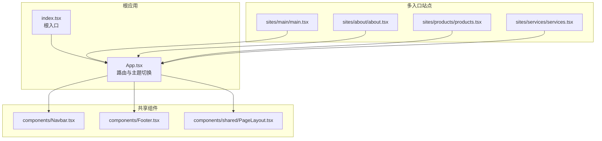
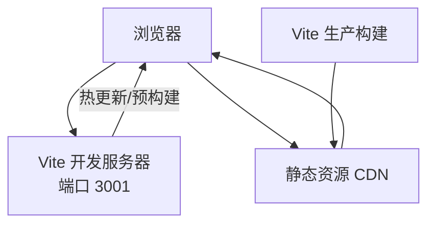
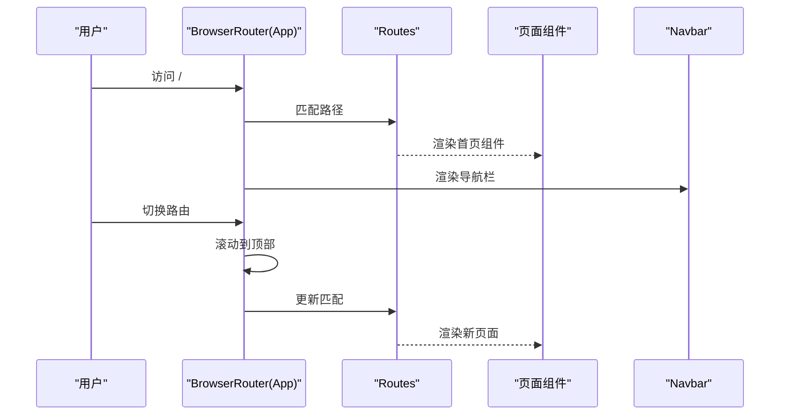
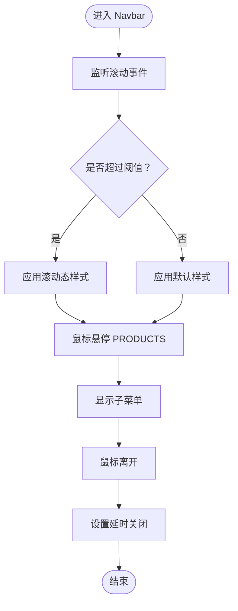
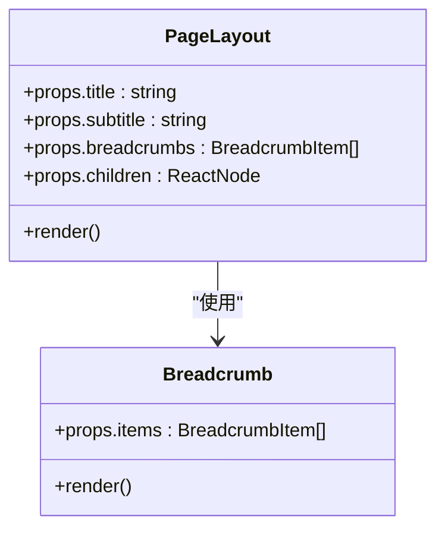
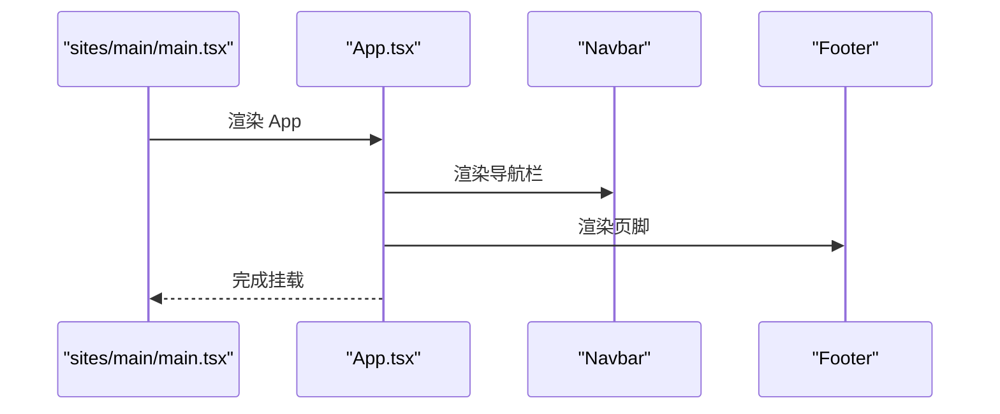
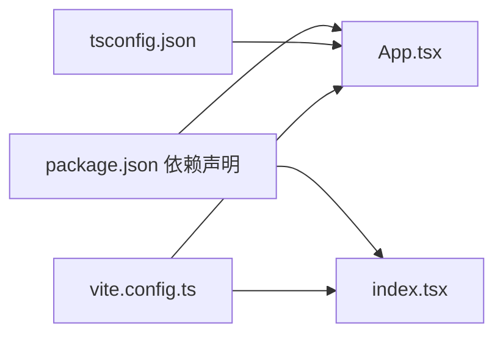
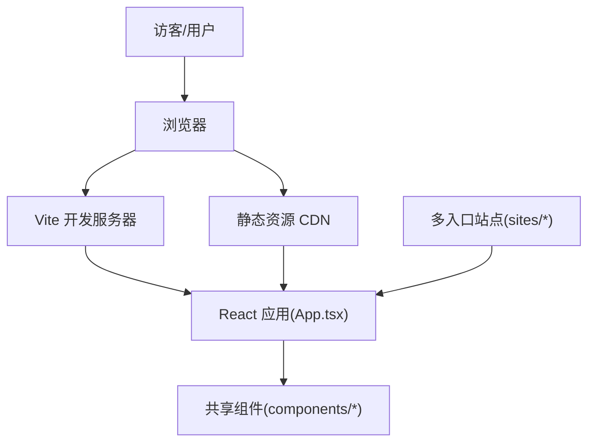

# 架构设计

<cite>
**本文引用的文件**
- [package.json](file://package.json)
- [vite.config.ts](file://vite.config.ts)
- [tsconfig.json](file://tsconfig.json)
- [App.tsx](file://App.tsx)
- [index.tsx](file://index.tsx)
- [sites/main/main.tsx](file://sites/main/main.tsx)
- [sites/about/about.tsx](file://sites/about/about.tsx)
- [sites/products/products.tsx](file://sites/products/products.tsx)
- [sites/services/services.tsx](file://sites/services/services.tsx)
- [components/Navbar.tsx](file://components/Navbar.tsx)
- [components/shared/PageLayout.tsx](file://components/shared/PageLayout.tsx)
- [components/Footer.tsx](file://components/Footer.tsx)
- [README.md](file://README.md)
- [metadata.json](file://metadata.json)
- [v2.code-workspace](file://v2.code-workspace)
</cite>

## 目录
1. [引言](#引言)
2. [项目结构](#项目结构)
3. [核心组件](#核心组件)
4. [架构总览](#架构总览)
5. [详细组件分析](#详细组件分析)
6. [依赖关系分析](#依赖关系分析)
7. [性能考量](#性能考量)
8. [故障排查指南](#故障排查指南)
9. [结论](#结论)
10. [附录](#附录)

## 引言
本架构设计文档面向“威宇精密工程”网站，目标是提供从高层设计到落地实现的完整蓝图。该站点采用现代前端技术栈：React 19、TypeScript、Vite 6，并通过多入口站点（main、about、products、services）实现模块化页面组织。文档涵盖系统边界、组件交互、数据流与集成模式，解释技术选型与权衡，给出基础设施与可扩展性建议，并补充安全性、监控与灾备等横切关注点。

## 项目结构
项目采用“单仓库多入口”的组织方式：
- 根目录包含全局应用入口与通用组件
- sites 目录下按业务域拆分独立入口（main、about、products、services），每个入口拥有独立的 HTML 与入口脚本
- components 目录下存放共享 UI 组件与页面级布局组件
- 构建与开发由 Vite 驱动，TypeScript 提供类型安全

图表来源
- [index.tsx](file://index.tsx#L1-L17)
- [App.tsx](file://App.tsx#L1-L112)
- [sites/main/main.tsx](file://sites/main/main.tsx#L1-L10)
- [sites/about/about.tsx](file://sites/about/about.tsx#L1-L24)
- [sites/products/products.tsx](file://sites/products/products.tsx#L1-L24)
- [sites/services/services.tsx](file://sites/services/services.tsx#L1-L24)
- [components/Navbar.tsx](file://components/Navbar.tsx#L1-L260)
- [components/Footer.tsx](file://components/Footer.tsx#L1-L22)
- [components/shared/PageLayout.tsx](file://components/shared/PageLayout.tsx#L1-L41)

章节来源
- [package.json](file://package.json#L1-L23)
- [vite.config.ts](file://vite.config.ts#L1-L24)
- [tsconfig.json](file://tsconfig.json#L1-L29)
- [index.tsx](file://index.tsx#L1-L17)
- [App.tsx](file://App.tsx#L1-L112)

## 核心组件
- 应用外壳与路由
  - App.tsx 负责全局路由、滚动行为、暗色模式状态与全局样式注入；作为多入口共享的根组件被各站点入口复用。
- 导航栏
  - components/Navbar.tsx 实现响应式导航、二级菜单、移动端抽屉与滚动态样式，提供 ABOUT/PRODUCTS/SERVICE/PROCESS 等链接。
- 页面布局
  - components/shared/PageLayout.tsx 提供标题、副标题、面包屑与内容区域的统一布局容器。
- 页脚
  - components/Footer.tsx 展示公司地址、电话、传真与版权信息。
- 多入口站点
  - sites/main、sites/about、sites/products、sites/services 各自挂载 App 并渲染对应页面内容。

章节来源
- [App.tsx](file://App.tsx#L1-L112)
- [components/Navbar.tsx](file://components/Navbar.tsx#L1-L260)
- [components/shared/PageLayout.tsx](file://components/shared/PageLayout.tsx#L1-L41)
- [components/Footer.tsx](file://components/Footer.tsx#L1-L22)
- [sites/main/main.tsx](file://sites/main/main.tsx#L1-L10)
- [sites/about/about.tsx](file://sites/about/about.tsx#L1-L24)
- [sites/products/products.tsx](file://sites/products/products.tsx#L1-L24)
- [sites/services/services.tsx](file://sites/services/services.tsx#L1-L24)

## 架构总览
系统采用“单体前端 + 多入口站点”的轻量架构，核心特征如下：
- 技术栈：React 19 + TypeScript + Vite 6
- 路由：基于 react-router-dom 的客户端路由
- 样式：Tailwind 类名与暗色模式类切换
- 构建：Vite 提供开发服务器与生产打包
- 入口：根入口 index.tsx 与各业务站点入口复用 App.tsx

图表来源
- [vite.config.ts](file://vite.config.ts#L1-L24)
- [package.json](file://package.json#L1-L23)

## 详细组件分析

### 应用外壳与路由（App.tsx）
职责与流程
- 负责全局路由配置与滚动回到顶部逻辑
- 管理暗色模式状态并通过 DOM 类名切换主题
- 注入全局动画与滚动行为样式
- 作为多入口共享根组件，承载导航栏、主内容区与页脚

图表来源
- [App.tsx](file://App.tsx#L30-L85)

章节来源
- [App.tsx](file://App.tsx#L1-L112)

### 导航栏（components/Navbar.tsx）
职责与流程
- 响应式导航：桌面端悬浮显示子菜单，移动端抽屉展开
- 二级菜单：PRODUCTS 下拉菜单支持悬停延时关闭与点击跳转
- 滚动态样式：根据滚动高度调整导航栏高度与阴影
- 事件清理：组件卸载时清理定时器，避免内存泄漏

图表来源
- [components/Navbar.tsx](file://components/Navbar.tsx#L13-L22)
- [components/Navbar.tsx](file://components/Navbar.tsx#L53-L72)
- [components/Navbar.tsx](file://components/Navbar.tsx#L116-L131)

章节来源
- [components/Navbar.tsx](file://components/Navbar.tsx#L1-L260)

### 页面布局（components/shared/PageLayout.tsx）
职责与流程
- 接收标题、副标题、面包屑与子内容
- 统一外层容器与动画入场效果
- 作为页面级组件的通用包装器

图表来源
- [components/shared/PageLayout.tsx](file://components/shared/PageLayout.tsx#L4-L14)
- [components/shared/PageLayout.tsx](file://components/shared/PageLayout.tsx#L16-L39)

章节来源
- [components/shared/PageLayout.tsx](file://components/shared/PageLayout.tsx#L1-L41)

### 多入口站点（sites/*）
职责与流程
- 各站点入口仅负责挂载 App 并渲染对应页面内容
- 通过共享 App.tsx 实现一致的主题、路由与导航体验
- 适合未来扩展为独立部署单元或按需加载模块

图表来源
- [sites/main/main.tsx](file://sites/main/main.tsx#L1-L10)
- [App.tsx](file://App.tsx#L56-L108)

章节来源
- [sites/main/main.tsx](file://sites/main/main.tsx#L1-L10)
- [sites/about/about.tsx](file://sites/about/about.tsx#L1-L24)
- [sites/products/products.tsx](file://sites/products/products.tsx#L1-L24)
- [sites/services/services.tsx](file://sites/services/services.tsx#L1-L24)

## 依赖关系分析
- 运行时依赖
  - React 19 与 react-router-dom 7 提供 UI 与路由能力
- 开发时依赖
  - Vite 6、@vitejs/plugin-react、TypeScript ~5.8 提供快速开发与类型检查
- 环境变量
  - Vite 在构建时通过 define 将环境变量注入到运行时（如 Gemini API Key）

图表来源
- [package.json](file://package.json#L11-L21)
- [vite.config.ts](file://vite.config.ts#L5-L23)
- [tsconfig.json](file://tsconfig.json#L1-L29)
- [App.tsx](file://App.tsx#L1-L112)
- [index.tsx](file://index.tsx#L1-L17)

章节来源
- [package.json](file://package.json#L1-L23)
- [vite.config.ts](file://vite.config.ts#L1-L24)
- [tsconfig.json](file://tsconfig.json#L1-L29)

## 性能考量
- 构建优化
  - 使用 Vite 的原生 ESM 与按需预构建，减少冷启动时间
  - TypeScript 配置启用 bundler 模块解析与隔离模块，提升打包效率
- 运行时优化
  - 按需渲染与懒加载：页面组件可进一步拆分为动态导入以降低首屏体积
  - 图片与媒体资源：建议在生产环境接入 CDN 与压缩策略
- 路由与滚动
  - 已内置滚动回到顶部，避免重复滚动逻辑带来的性能损耗

章节来源
- [vite.config.ts](file://vite.config.ts#L1-L24)
- [tsconfig.json](file://tsconfig.json#L16-L18)
- [App.tsx](file://App.tsx#L30-L39)

## 故障排查指南
- 开发环境无法启动
  - 确认 Node.js 版本满足要求，执行安装依赖后启动开发服务器
  - 若端口冲突，可在 Vite 配置中调整 server.port
- 路由跳转无效
  - 检查 App.tsx 中 Routes 的 path 与 Link 的 to 是否一致
  - 确保子组件已正确引入并注册
- 暗色模式不生效
  - 检查 App.tsx 中对 documentElement 类名的添加/移除逻辑
- 环境变量未注入
  - 确认 .env.local 中已设置 GEMINI_API_KEY，且 Vite 的 define 配置正确
- 多入口站点空白
  - 检查各站点入口的 root DOM 是否存在，确保 ReactDOM.createRoot 正常挂载

章节来源
- [README.md](file://README.md#L11-L21)
- [vite.config.ts](file://vite.config.ts#L8-L16)
- [App.tsx](file://App.tsx#L42-L54)
- [sites/main/main.tsx](file://sites/main/main.tsx#L5-L9)

## 结论
本项目采用“单体前端 + 多入口站点”的轻量架构，结合 React 19、TypeScript 与 Vite 6，实现了高可维护性的企业官网。通过共享组件与统一路由，既保证了视觉一致性，也为后续扩展（如微前端、按需加载、独立部署）预留空间。建议在生产环境中完善监控、缓存与安全策略，并持续优化首屏性能与可访问性。

## 附录

### 系统上下文图

图表来源
- [App.tsx](file://App.tsx#L1-L112)
- [sites/main/main.tsx](file://sites/main/main.tsx#L1-L10)
- [components/Navbar.tsx](file://components/Navbar.tsx#L1-L260)
- [components/shared/PageLayout.tsx](file://components/shared/PageLayout.tsx#L1-L41)

### 技术栈与版本兼容性
- React 19.2.3
- react-router-dom 7.1.3
- Vite 6.2.0
- TypeScript ~5.8.2
- @vitejs/plugin-react
- Node.js（按 README 要求）

章节来源
- [package.json](file://package.json#L11-L21)
- [README.md](file://README.md#L13-L21)

### Vite 构建工具与配置要点
- 开发服务器：host 0.0.0.0、port 3001，便于局域网调试
- 插件：@vitejs/plugin-react 提供 React HMR 与 JSX 转换
- 环境变量注入：通过 define 将 API Key 注入运行时
- 路径别名：@ 指向项目根目录，简化导入路径

章节来源
- [vite.config.ts](file://vite.config.ts#L5-L23)

### TypeScript 配置要点
- 目标与模块：ES2022 与 ESNext，配合 Vite 的 bundler 解析
- JSX：react-jsx，与 React 19 兼容
- 路径映射：@/* 对应 ./*
- 严格性：skipLibCheck、isolatedModules、noEmit 等提升开发体验与稳定性

章节来源
- [tsconfig.json](file://tsconfig.json#L1-L29)

### VS Code 工作区设置
- v2.code-workspace 为当前工作区配置文件，指向项目根目录
- 建议在工作区设置中启用 TypeScript 与 Vite 相关扩展，以获得更好的开发体验

章节来源
- [v2.code-workspace](file://v2.code-workspace#L1-L8)

### 安全性、监控与灾备（横切关注点）
- 安全性
  - 环境变量注入需谨慎，避免敏感信息泄露；生产环境建议通过安全渠道下发密钥
  - 静态资源建议开启 HTTPS 与安全响应头（CSP、X-Frame-Options 等）
- 监控
  - 建议接入前端埋点与错误上报（如 Sentry 或自研埋点），记录页面性能与异常
- 灾难恢复
  - 构建产物上传至 CDN 并保留多版本回滚能力；静态站点可使用对象存储 + CDN 的低成本方案

[本节为通用实践建议，无需特定文件来源]