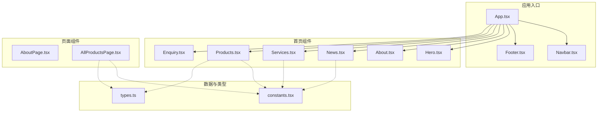
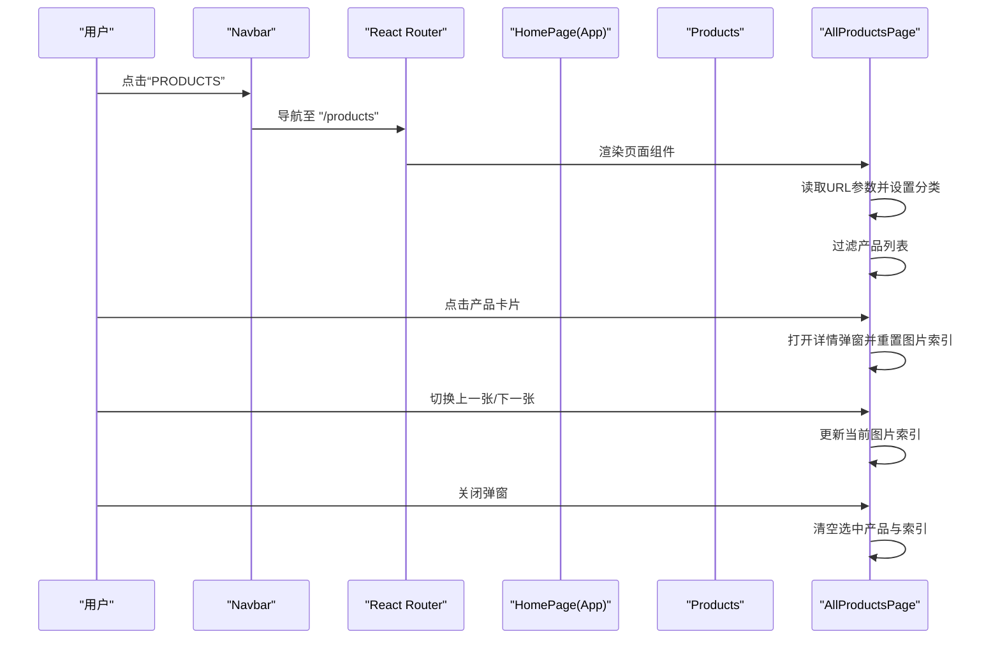
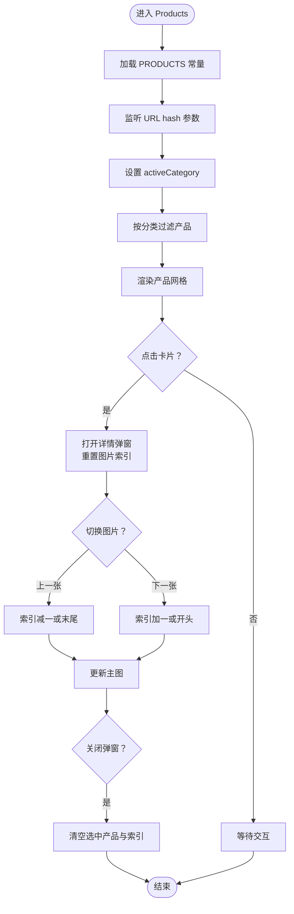
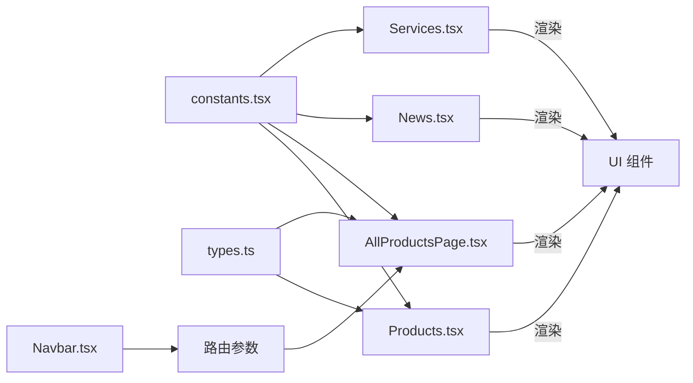

# 业务组件

<cite>
**本文引用的文件**
- [App.tsx](file://App.tsx)
- [constants.tsx](file://constants.tsx)
- [types.ts](file://types.ts)
- [components/Products.tsx](file://components/Products.tsx)
- [components/Services.tsx](file://components/Services.tsx)
- [components/News.tsx](file://components/News.tsx)
- [components/Enquiry.tsx](file://components/Enquiry.tsx)
- [components/About.tsx](file://components/About.tsx)
- [components/Footer.tsx](file://components/Footer.tsx)
- [components/Navbar.tsx](file://components/Navbar.tsx)
- [components/Hero.tsx](file://components/Hero.tsx)
- [components/pages/AboutPage.tsx](file://components/pages/AboutPage.tsx)
- [components/pages/AllProductsPage.tsx](file://components/pages/AllProductsPage.tsx)
- [sites/products/products.tsx](file://sites/products/products.tsx)
</cite>

## 目录
1. [简介](#简介)
2. [项目结构](#项目结构)
3. [核心组件](#核心组件)
4. [架构总览](#架构总览)
5. [组件详细分析](#组件详细分析)
6. [依赖关系分析](#依赖关系分析)
7. [性能考量](#性能考量)
8. [故障排查指南](#故障排查指南)
9. [结论](#结论)
10. [附录](#附录)

## 简介
本文件面向威宇精密工程网站的业务组件，系统性梳理各组件的功能职责、数据流与交互设计，并重点解析以下关键能力：
- Products 产品展示：分类筛选机制、图片轮播与缩略图导航、详情弹窗与多图浏览
- Services 服务介绍：内容管理、网格布局与交互反馈
- News 新闻资讯：数据绑定、动态渲染与时间字段展示
- Enquiry 在线询盘：表单状态管理、必填校验占位与验证码交互
- About 关于我们：品牌故事与统计数据展示
- Footer 页脚：链接与版权信息管理
同时给出组件间协作模式与数据流转机制，帮助开发者与维护者高效理解与扩展系统。

## 项目结构
该站点采用 React + Vite 架构，通过路由组织页面与组件。主应用负责全局路由、滚动行为与主题切换；各业务组件按功能模块拆分，部分页面组件复用共享布局。

图表来源
- [App.tsx](file://App.tsx#L41-L72)
- [components/Navbar.tsx](file://components/Navbar.tsx#L24-L36)
- [components/Footer.tsx](file://components/Footer.tsx#L4-L17)
- [components/Hero.tsx](file://components/Hero.tsx#L36-L62)
- [components/About.tsx](file://components/About.tsx#L5-L68)
- [components/News.tsx](file://components/News.tsx#L5-L54)
- [components/Services.tsx](file://components/Services.tsx#L5-L52)
- [components/Products.tsx](file://components/Products.tsx#L8-L32)
- [components/Enquiry.tsx](file://components/Enquiry.tsx#L4-L22)
- [components/pages/AboutPage.tsx](file://components/pages/AboutPage.tsx#L4-L139)
- [components/pages/AllProductsPage.tsx](file://components/pages/AllProductsPage.tsx#L9-L82)
- [constants.tsx](file://constants.tsx#L4-L48)
- [types.ts](file://types.ts#L2-L29)

章节来源
- [App.tsx](file://App.tsx#L17-L28)
- [components/Navbar.tsx](file://components/Navbar.tsx#L24-L36)
- [components/Footer.tsx](file://components/Footer.tsx#L4-L17)
- [components/Hero.tsx](file://components/Hero.tsx#L36-L62)
- [components/About.tsx](file://components/About.tsx#L5-L68)
- [components/News.tsx](file://components/News.tsx#L5-L54)
- [components/Services.tsx](file://components/Services.tsx#L5-L52)
- [components/Products.tsx](file://components/Products.tsx#L8-L32)
- [components/Enquiry.tsx](file://components/Enquiry.tsx#L4-L22)
- [components/pages/AboutPage.tsx](file://components/pages/AboutPage.tsx#L4-L139)
- [components/pages/AllProductsPage.tsx](file://components/pages/AllProductsPage.tsx#L9-L82)
- [constants.tsx](file://constants.tsx#L4-L48)
- [types.ts](file://types.ts#L2-L29)

## 核心组件
- Products：产品列表与详情弹窗，支持分类筛选、横向滚动、图片轮播与缩略图导航
- Services：服务网格布局，突出主要服务与辅助服务的视觉层次
- News：新闻卡片网格，支持图片或图标展示与时间字段渲染
- Enquiry：在线询盘表单，包含联系人、联系方式、国家选择、描述与验证码
- About：品牌故事与统计数据展示，强调历史与成就
- Footer：页脚信息与版权声明
- Navbar：导航栏与子菜单（含 PRODUCTS 子菜单），支持桌面端与移动端交互
- Hero：横幅背景与标题文案，支持手动切换与移动端指示器
- 页面组件：AboutPage、AllProductsPage 提供独立页面布局与数据绑定

章节来源
- [components/Products.tsx](file://components/Products.tsx#L8-L32)
- [components/Services.tsx](file://components/Services.tsx#L5-L52)
- [components/News.tsx](file://components/News.tsx#L5-L54)
- [components/Enquiry.tsx](file://components/Enquiry.tsx#L4-L22)
- [components/About.tsx](file://components/About.tsx#L5-L68)
- [components/Footer.tsx](file://components/Footer.tsx#L4-L17)
- [components/Navbar.tsx](file://components/Navbar.tsx#L24-L36)
- [components/Hero.tsx](file://components/Hero.tsx#L36-L62)
- [components/pages/AboutPage.tsx](file://components/pages/AboutPage.tsx#L4-L139)
- [components/pages/AllProductsPage.tsx](file://components/pages/AllProductsPage.tsx#L9-L82)

## 架构总览
应用通过路由将首页与页面组件组合，组件之间通过 props 传递数据与回调，状态集中在组件内部或页面级组件中管理。Products 与 AllProductsPage 共享常量与类型定义，形成一致的数据模型与交互体验。

图表来源
- [components/Navbar.tsx](file://components/Navbar.tsx#L24-L36)
- [App.tsx](file://App.tsx#L63-L69)
- [components/pages/AllProductsPage.tsx](file://components/pages/AllProductsPage.tsx#L9-L82)
- [components/Products.tsx](file://components/Products.tsx#L8-L32)

## 组件详细分析

### Products 组件（产品展示）
- 分类筛选机制
  - 支持 all/nameplate/cnc 三类
  - 首页组件通过 URL hash 参数监听与切换分类
  - 页面组件通过 URL 查询参数管理分类状态
- 图片轮播与缩略图
  - 弹窗内支持上一张/下一张导航
  - 多图时显示缩略图，点击切换主图
- 详情展示逻辑
  - 点击产品卡片打开详情弹窗
  - 弹窗内展示 MOQ、材料、尺寸、工艺、内容等字段
  - 错误回退：图片加载失败时使用占位图
- 性能与可用性
  - 横向滚动容器平滑滚动
  - 卡片悬停放大与边框高亮增强交互反馈

图表来源
- [components/Products.tsx](file://components/Products.tsx#L8-L32)
- [components/Products.tsx](file://components/Products.tsx#L55-L89)
- [components/Products.tsx](file://components/Products.tsx#L187-L304)
- [components/pages/AllProductsPage.tsx](file://components/pages/AllProductsPage.tsx#L9-L82)
- [components/pages/AllProductsPage.tsx](file://components/pages/AllProductsPage.tsx#L48-L82)

章节来源
- [components/Products.tsx](file://components/Products.tsx#L8-L32)
- [components/Products.tsx](file://components/Products.tsx#L44-L89)
- [components/Products.tsx](file://components/Products.tsx#L187-L304)
- [components/pages/AllProductsPage.tsx](file://components/pages/AllProductsPage.tsx#L9-L82)
- [components/pages/AllProductsPage.tsx](file://components/pages/AllProductsPage.tsx#L48-L82)
- [constants.tsx](file://constants.tsx#L50-L166)
- [types.ts](file://types.ts#L10-L21)

### Services 组件（服务介绍）
- 内容管理
  - 使用 SERVICES 常量驱动服务列表
  - 大卡片突出 CNC Machining，其余卡片展示辅助服务
- 响应式布局
  - 桌面端使用四列网格，大卡片跨两列
  - 移动端自适应列数，保持间距与层级
- 交互设计
  - 卡片悬停产生阴影与颜色过渡，提升可点击性
  - 图标与文字组合，增强可读性

章节来源
- [components/Services.tsx](file://components/Services.tsx#L5-L52)
- [constants.tsx](file://constants.tsx#L25-L48)

### News 组件（新闻资讯）
- 数据绑定
  - 使用 NEWS_ITEMS 常量渲染新闻卡片
- 动态内容渲染
  - 首张卡片放大并上移，其余卡片悬停上移
  - 图片优先，无图时显示图标与颜色区分
- 时间格式化
  - 日期字段直接渲染字符串，如 “10/25”、“10/12”

章节来源
- [components/News.tsx](file://components/News.tsx#L5-L54)
- [constants.tsx](file://constants.tsx#L4-L23)

### Enquiry 组件（在线询盘）
- 表单验证
  - 多个输入字段标记为必填（公司、称谓、姓、名、电话、邮箱、国家、描述、验证码）
  - 使用 HTML5 表单属性与前端状态管理
- 数据提交
  - 当前为占位提交逻辑，打印表单数据
- 用户体验优化
  - 验证码区域包含刷新按钮与固定值展示
  - 输入框聚焦时的视觉反馈与统一的圆角与阴影

章节来源
- [components/Enquiry.tsx](file://components/Enquiry.tsx#L4-L22)
- [components/Enquiry.tsx](file://components/Enquiry.tsx#L90-L271)

### About 组件（关于我们）
- 内容展示
  - 左侧图片网格与右侧品牌故事文本
  - 右侧包含统计数据与“了解更多”按钮
- 品牌故事呈现
  - 强调成立年份、认证体系与客户数量
  - 使用斜体字体与间距营造阅读节奏

章节来源
- [components/About.tsx](file://components/About.tsx#L5-L68)

### Footer 组件（页脚）
- 链接管理
  - 通过锚点链接定位到页面特定区域（如 #enquiry）
- 版权信息处理
  - 地址、电话、传真与版权信息集中展示

章节来源
- [components/Footer.tsx](file://components/Footer.tsx#L4-L17)
- [components/Navbar.tsx](file://components/Navbar.tsx#L74-L84)

### Navbar 组件（导航）
- 导航与子菜单
  - PRODUCTS 项具备子菜单，支持桌面端悬停与移动端展开
  - 子菜单项包含 ALL、Nameplate、Aluminum CNC 等分类链接
- 交互细节
  - 滚动时导航栏高度与阴影变化
  - 移动端菜单折叠与展开动画
  - 定时器管理子菜单延迟关闭，避免误触

章节来源
- [components/Navbar.tsx](file://components/Navbar.tsx#L24-L36)
- [components/Navbar.tsx](file://components/Navbar.tsx#L115-L153)
- [components/Navbar.tsx](file://components/Navbar.tsx#L167-L254)

### Hero 组件（横幅）
- 图片轮播
  - 支持手动切换，移除了自动轮播
  - 不同幻灯片具有不同效果（镜像、灰度）
- 文案与指示器
  - 桌面端使用卡片导航，移动端使用圆点指示器
  - 文案随当前幻灯片动态变化

章节来源
- [components/Hero.tsx](file://components/Hero.tsx#L36-L62)
- [components/Hero.tsx](file://components/Hero.tsx#L88-L123)

### 页面组件
- AboutPage
  - 使用 PageLayout 包裹，展示公司简介、统计数据、核心价值与认证信息
- AllProductsPage
  - 独立页面中的产品列表与详情弹窗，与首页组件共享数据模型与交互逻辑

章节来源
- [components/pages/AboutPage.tsx](file://components/pages/AboutPage.tsx#L4-L139)
- [components/pages/AllProductsPage.tsx](file://components/pages/AllProductsPage.tsx#L9-L82)

## 依赖关系分析
- 数据依赖
  - Products 与 AllProductsPage 依赖 PRODUCTS 常量与 ProductItem 类型
  - Services 依赖 SERVICES 常量与 ServiceItem 类型
  - News 依赖 NEWS_ITEMS 常量与 NewsItem 类型
- 组件耦合
  - Navbar 与 PRODUCTS 子菜单通过路由参数联动
  - App 负责全局路由与主题切换，降低页面级重复逻辑
- 外部集成
  - 图片资源通过 referrerPolicy 与错误回退策略保证稳定性
  - Material Icons 图标库用于交互元素与装饰

图表来源
- [constants.tsx](file://constants.tsx#L4-L166)
- [types.ts](file://types.ts#L2-L29)
- [components/Products.tsx](file://components/Products.tsx#L8-L32)
- [components/pages/AllProductsPage.tsx](file://components/pages/AllProductsPage.tsx#L9-L82)
- [components/News.tsx](file://components/News.tsx#L5-L54)
- [components/Services.tsx](file://components/Services.tsx#L5-L52)
- [components/Navbar.tsx](file://components/Navbar.tsx#L24-L36)

章节来源
- [constants.tsx](file://constants.tsx#L4-L166)
- [types.ts](file://types.ts#L2-L29)
- [components/Products.tsx](file://components/Products.tsx#L8-L32)
- [components/pages/AllProductsPage.tsx](file://components/pages/AllProductsPage.tsx#L9-L82)
- [components/News.tsx](file://components/News.tsx#L5-L54)
- [components/Services.tsx](file://components/Services.tsx#L5-L52)
- [components/Navbar.tsx](file://components/Navbar.tsx#L24-L36)

## 性能考量
- 图片加载
  - 为图片提供错误回退策略，避免空白或闪烁
  - 缩略图与主图分离，减少首屏压力
- 滚动与动画
  - 横向滚动容器使用平滑滚动与隐藏滚动条，提升体验
  - 卡片与弹窗使用 CSS 过渡与阴影，避免复杂 JS 动画
- 路由与渲染
  - 页面组件独立渲染，避免首页组件重复渲染
  - 通过 URL 参数同步状态，减少本地状态冗余

## 故障排查指南
- 产品图片不显示
  - 检查图片 URL 是否有效，确认错误回退逻辑是否触发
  - 章节来源
    - [components/Products.tsx](file://components/Products.tsx#L149-L151)
    - [components/pages/AllProductsPage.tsx](file://components/pages/AllProductsPage.tsx#L131-L133)
- 产品详情弹窗无法关闭
  - 确认点击遮罩层会触发关闭回调
  - 章节来源
    - [components/Products.tsx](file://components/Products.tsx#L191-L192)
    - [components/pages/AllProductsPage.tsx](file://components/pages/AllProductsPage.tsx#L161-L162)
- 分类筛选无效
  - 首页组件依赖 URL hash，页面组件依赖 URL 查询参数
  - 章节来源
    - [components/Products.tsx](file://components/Products.tsx#L14-L32)
    - [components/pages/AllProductsPage.tsx](file://components/pages/AllProductsPage.tsx#L15-L23)
- 表单提交未生效
  - 当前为占位逻辑，需接入后端接口
  - 章节来源
    - [components/Enquiry.tsx](file://components/Enquiry.tsx#L18-L22)
- 导航菜单异常
  - 检查子菜单的鼠标事件与定时器清理
  - 章节来源
    - [components/Navbar.tsx](file://components/Navbar.tsx#L13-L22)
    - [components/Navbar.tsx](file://components/Navbar.tsx#L115-L153)

## 结论
本项目通过清晰的组件边界与数据模型，实现了产品展示、服务介绍、新闻资讯、在线询盘、品牌故事与页脚等核心业务功能。Products 组件在分类筛选、图片轮播与详情弹窗方面提供了良好的用户体验；Services 与 News 组件分别以网格布局与卡片设计强化了信息传达；Enquiry 组件完成了基础表单结构与交互提示。整体架构简洁、可扩展性强，便于后续迭代与维护。

## 附录
- 数据模型与常量
  - NewsItem、ProductItem、ServiceItem 接口定义
  - NEWS_ITEMS、SERVICES、PRODUCTS 常量
- 页面入口
  - 独立站点入口示例：sites/products/products.tsx

章节来源
- [types.ts](file://types.ts#L2-L29)
- [constants.tsx](file://constants.tsx#L4-L166)
- [sites/products/products.tsx](file://sites/products/products.tsx#L7-L16)