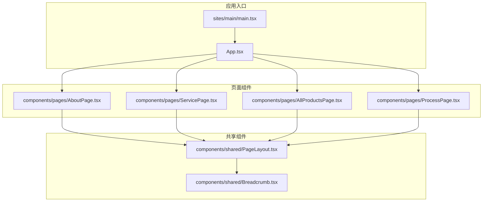
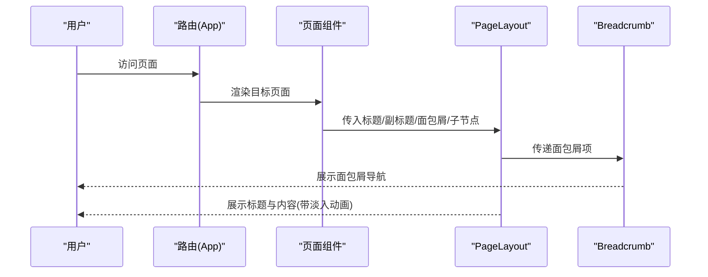
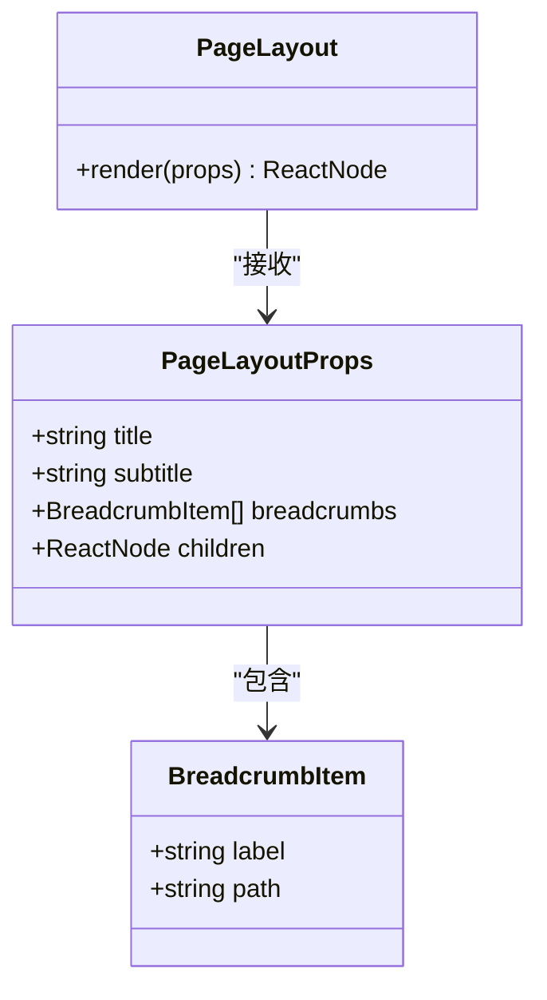
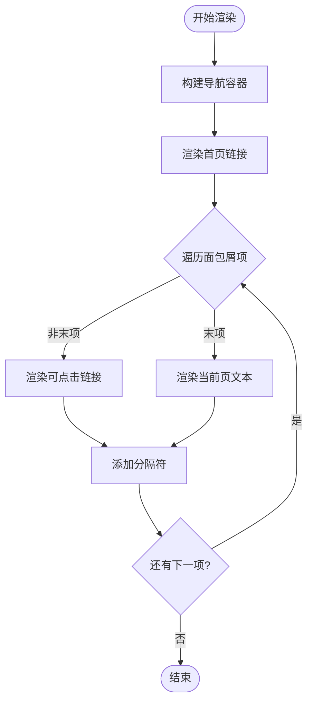
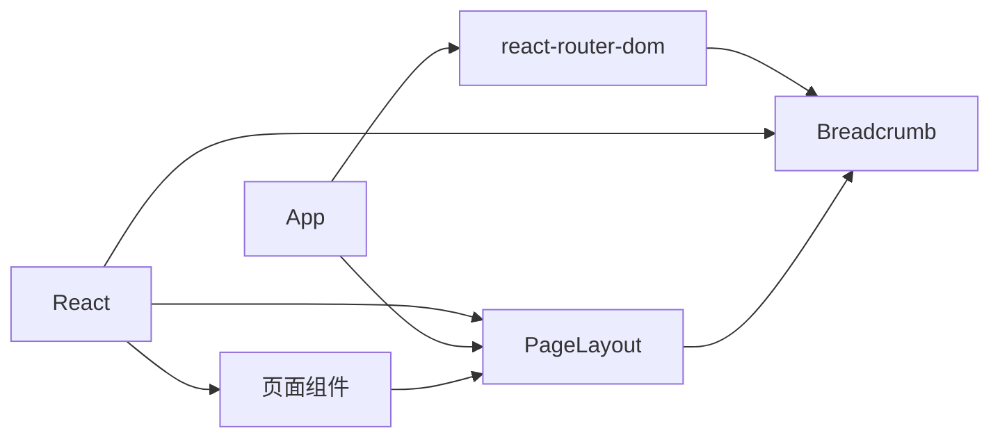

# 共享组件

<cite>
**本文引用的文件**
- [components/shared/PageLayout.tsx](file://components/shared/PageLayout.tsx)
- [components/shared/Breadcrumb.tsx](file://components/shared/Breadcrumb.tsx)
- [components/pages/AboutPage.tsx](file://components/pages/AboutPage.tsx)
- [components/pages/ServicePage.tsx](file://components/pages/ServicePage.tsx)
- [components/pages/AllProductsPage.tsx](file://components/pages/AllProductsPage.tsx)
- [components/pages/ProcessPage.tsx](file://components/pages/ProcessPage.tsx)
- [App.tsx](file://App.tsx)
- [index.html](file://index.html)
- [types.ts](file://types.ts)
- [constants.tsx](file://constants.tsx)
- [sites/main/main.tsx](file://sites/main/main.tsx)
- [package.json](file://package.json)
</cite>

## 目录
1. [简介](#简介)
2. [项目结构](#项目结构)
3. [核心组件](#核心组件)
4. [架构总览](#架构总览)
5. [组件详解](#组件详解)
6. [依赖关系分析](#依赖关系分析)
7. [性能与可访问性](#性能与可访问性)
8. [故障排查指南](#故障排查指南)
9. [结论](#结论)
10. [附录：使用示例与集成方法](#附录使用示例与集成方法)

## 简介
本文件聚焦于威宇精密工程网站中的共享组件，系统梳理 PageLayout 布局组件与 Breadcrumb 面包屑导航组件的设计理念、接口定义、主题适配机制与动画效果实现，并总结其在各页面中的复用策略与最佳实践。文档同时提供可操作的使用示例与集成方法，帮助开发者在不同页面中正确使用这些共享组件，兼顾性能优化与可访问性。

## 项目结构
该仓库采用按“组件”与“页面”分层组织的方式：
- components/shared：存放跨页面复用的共享组件（如 PageLayout、Breadcrumb）
- components/pages：页面级组件，内部组合共享组件与业务内容
- sites/main：应用入口与渲染挂载点
- 样式与主题：通过 Tailwind 配置与全局 CSS 变量实现深浅色主题切换

图表来源
- [sites/main/main.tsx](file://sites/main/main.tsx#L1-L10)
- [App.tsx](file://App.tsx#L41-L109)
- [components/shared/PageLayout.tsx](file://components/shared/PageLayout.tsx#L1-L41)
- [components/shared/Breadcrumb.tsx](file://components/shared/Breadcrumb.tsx#L1-L51)
- [components/pages/AboutPage.tsx](file://components/pages/AboutPage.tsx#L1-L144)
- [components/pages/ServicePage.tsx](file://components/pages/ServicePage.tsx#L1-L182)
- [components/pages/AllProductsPage.tsx](file://components/pages/AllProductsPage.tsx#L1-L281)
- [components/pages/ProcessPage.tsx](file://components/pages/ProcessPage.tsx#L1-L297)

章节来源
- [sites/main/main.tsx](file://sites/main/main.tsx#L1-L10)
- [App.tsx](file://App.tsx#L41-L109)

## 核心组件
- PageLayout：统一页面骨架、标题区、面包屑与内容区域的布局容器，内置淡入动画类名，便于子页面专注内容渲染。
- Breadcrumb：基于 react-router 的导航组件，支持首页链接与当前页高亮，动态生成层级路径，处理点击滚动至顶部。

章节来源
- [components/shared/PageLayout.tsx](file://components/shared/PageLayout.tsx#L9-L14)
- [components/shared/Breadcrumb.tsx](file://components/shared/Breadcrumb.tsx#L9-L11)

## 架构总览
共享组件与页面组件的协作关系如下：
- 页面组件负责准备标题、副标题、面包屑数据与业务内容
- PageLayout 负责整体布局与动画包装
- Breadcrumb 负责导航层级与交互
- App 管理路由、滚动行为与深浅色主题切换

图表来源
- [App.tsx](file://App.tsx#L41-L109)
- [components/shared/PageLayout.tsx](file://components/shared/PageLayout.tsx#L16-L39)
- [components/shared/Breadcrumb.tsx](file://components/shared/Breadcrumb.tsx#L13-L48)

## 组件详解

### PageLayout 布局组件
- 设计理念
  - 作为页面骨架容器，统一标题、副标题、面包屑与内容区域的排版与间距
  - 内置淡入动画类名，确保内容进入时具备平滑过渡体验
  - 使用深浅色主题类名包裹，保证主题一致性
- Props 接口定义
  - title: 字符串，主标题
  - subtitle?: 字符串，副标题（可选）
  - breadcrumbs: BreadcrumbItem[]，面包屑项数组
  - children: ReactNode，页面内容
- 主题适配机制
  - 外层容器使用深浅色背景与文字颜色类名，配合 App 中的深色模式切换逻辑生效
- 动画效果实现
  - 子内容外层包裹带有淡入动画类名的容器，结合全局样式定义的动画关键帧实现入场动画

图表来源
- [components/shared/PageLayout.tsx](file://components/shared/PageLayout.tsx#L4-L14)

章节来源
- [components/shared/PageLayout.tsx](file://components/shared/PageLayout.tsx#L9-L39)

### Breadcrumb 面包屑导航组件
- 实现原理
  - 接收 items 数组，首项固定为首页链接；其余项根据是否为最后一项决定渲染 Link 或纯文本
  - 每个中间项显示斜杠分隔符，末项高亮显示
  - 点击任意链接时触发滚动至顶部的行为
- 层级结构管理
  - 通过 items 的顺序与长度自动推导层级与高亮位置
- 动态路径生成
  - 仅对非末项生成可点击链接，末项直接展示文本
- 用户交互处理
  - 点击链接后滚动至页面顶部，改善阅读体验
- 主题适配
  - 文字颜色与悬停颜色在深浅主题下分别适配

图表来源
- [components/shared/Breadcrumb.tsx](file://components/shared/Breadcrumb.tsx#L13-L48)

章节来源
- [components/shared/Breadcrumb.tsx](file://components/shared/Breadcrumb.tsx#L9-L48)

### 主题适配与深浅色模式
- 深浅色模式切换
  - App 中维护 isDarkMode 状态，切换时向根元素添加或移除 dark 类
  - 全局样式通过 Tailwind darkMode: "class" 配置，使暗色主题类名生效
- 颜色变量与字体配置
  - index.html 中通过 Tailwind 配置扩展颜色与字体族，提供工业风配色与统一字体体系
- 动画与滚动
  - 全局样式定义了平滑滚动与淡入动画的关键帧，PageLayout 与 Breadcrumb 借助类名应用

章节来源
- [App.tsx](file://App.tsx#L42-L54)
- [App.tsx](file://App.tsx#L88-L105)
- [index.html](file://index.html#L13-L42)

## 依赖关系分析
- 组件间依赖
  - PageLayout 依赖 Breadcrumb
  - 各页面组件依赖 PageLayout
  - App 管理路由与主题切换，驱动页面渲染
- 外部依赖
  - react-router-dom 提供 Link 与路由能力
  - Tailwind 提供主题与样式工具类

图表来源
- [package.json](file://package.json#L11-L14)
- [components/shared/PageLayout.tsx](file://components/shared/PageLayout.tsx#L1-L2)
- [components/shared/Breadcrumb.tsx](file://components/shared/Breadcrumb.tsx#L2-L2)
- [App.tsx](file://App.tsx#L3-L3)

章节来源
- [package.json](file://package.json#L11-L14)

## 性能与可访问性
- 性能优化建议
  - 避免在 PageLayout 中进行重型计算，保持纯渲染组件
  - 在 Breadcrumb 中对 items 进行稳定排序与唯一标识，减少不必要的重渲染
  - 对页面内容使用懒加载与图片占位策略（参考产品页的图片错误回退）
- 可访问性考虑
  - 链接具备明确的标题与语义，点击行为清晰
  - 深浅色主题切换不影响键盘与屏幕阅读器可用性
  - 动画应避免对敏感用户的不适，必要时提供“减少动画”偏好设置（可在应用层面扩展）

[本节为通用指导，不直接分析具体文件]

## 故障排查指南
- 面包屑未显示或链接无效
  - 检查传入的 breadcrumbs 是否包含 label 字段
  - 确认末项 label 不应包含 path，否则会渲染为可点击链接
- 深浅色主题不生效
  - 确认 App 中 isDarkMode 切换逻辑已执行，且根元素存在 dark 类
  - 检查 Tailwind darkMode 配置是否为 class 模式
- 页面内容无淡入动画
  - 确认内容外层包裹了具有淡入动画类名的容器
  - 检查全局样式中动画关键帧是否正确注入

章节来源
- [components/shared/Breadcrumb.tsx](file://components/shared/Breadcrumb.tsx#L13-L48)
- [App.tsx](file://App.tsx#L42-L54)
- [App.tsx](file://App.tsx#L88-L105)
- [components/shared/PageLayout.tsx](file://components/shared/PageLayout.tsx#L33-L35)

## 结论
PageLayout 与 Breadcrumb 作为共享组件，提供了统一的页面骨架与导航体验，结合 App 的路由与主题管理，实现了良好的可复用性与一致性。通过明确的 props 接口、主题适配与动画机制，开发者可以在不同页面中快速集成并保持视觉与交互的一致性。

[本节为总结，不直接分析具体文件]

## 附录：使用示例与集成方法
- 在页面组件中引入 PageLayout 并传入标题、副标题、面包屑与内容
  - 示例路径：[AboutPage](file://components/pages/AboutPage.tsx#L9-L14)
  - 示例路径：[ServicePage](file://components/pages/ServicePage.tsx#L78-L83)
  - 示例路径：[AllProductsPage](file://components/pages/AllProductsPage.tsx#L84-L89)
  - 示例路径：[ProcessPage](file://components/pages/ProcessPage.tsx#L131-L136)
- 面包屑数据结构
  - BreadcrumbItem 接口：label 必填，path 可选；末项通常不包含 path
  - 示例路径：[Breadcrumb 接口定义](file://components/shared/Breadcrumb.tsx#L4-L11)
- 主题切换与路由
  - App 中提供深浅色切换按钮与路由配置，页面组件通过 PageLayout 统一接入
  - 示例路径：[App 深浅色切换](file://App.tsx#L52-L85)
  - 示例路径：[App 路由配置](file://App.tsx#L63-L69)
- 数据类型与常量
  - ProductItem、ServiceItem、NewsItem 等类型定义，用于页面数据模型
  - 示例路径：[types.ts](file://types.ts#L2-L29)
  - 示例路径：[PRODUCTS 常量](file://constants.tsx#L50-L166)

章节来源
- [components/pages/AboutPage.tsx](file://components/pages/AboutPage.tsx#L4-L14)
- [components/pages/ServicePage.tsx](file://components/pages/ServicePage.tsx#L4-L83)
- [components/pages/AllProductsPage.tsx](file://components/pages/AllProductsPage.tsx#L9-L89)
- [components/pages/ProcessPage.tsx](file://components/pages/ProcessPage.tsx#L4-L136)
- [components/shared/Breadcrumb.tsx](file://components/shared/Breadcrumb.tsx#L4-L11)
- [App.tsx](file://App.tsx#L52-L85)
- [App.tsx](file://App.tsx#L63-L69)
- [types.ts](file://types.ts#L2-L29)
- [constants.tsx](file://constants.tsx#L50-L166)