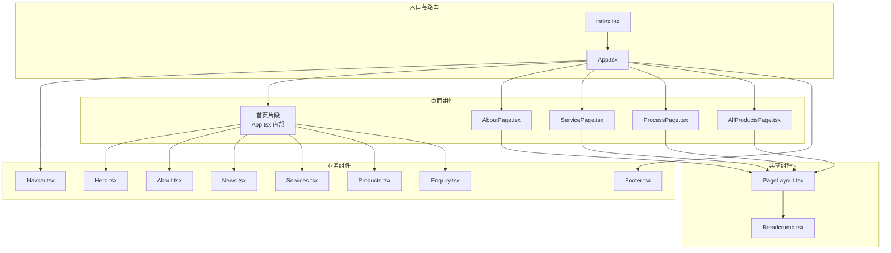
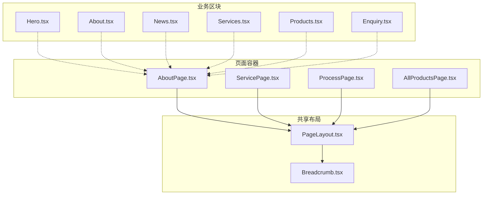
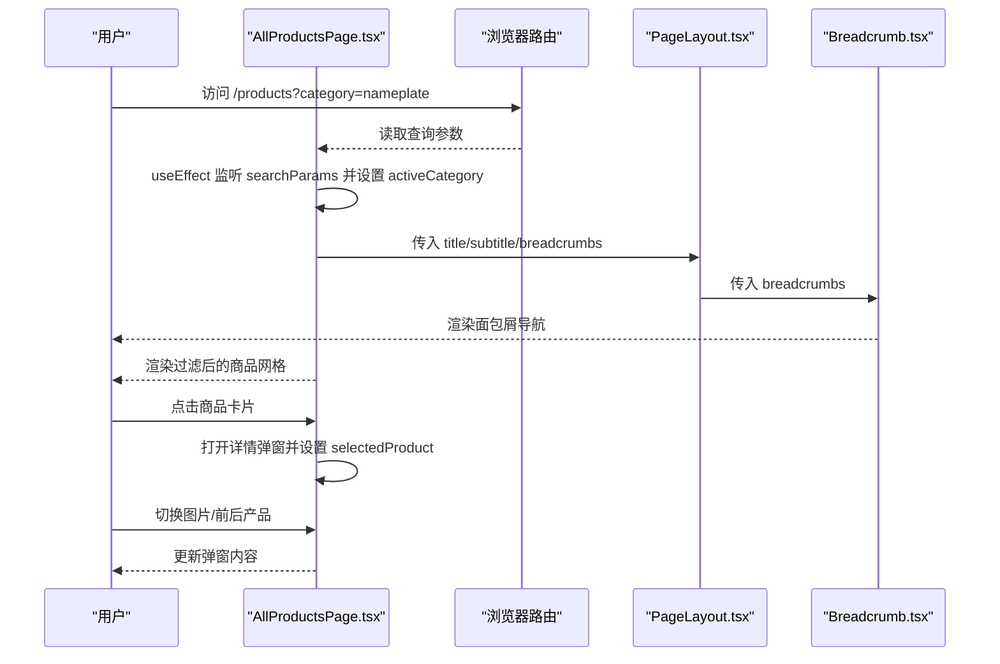
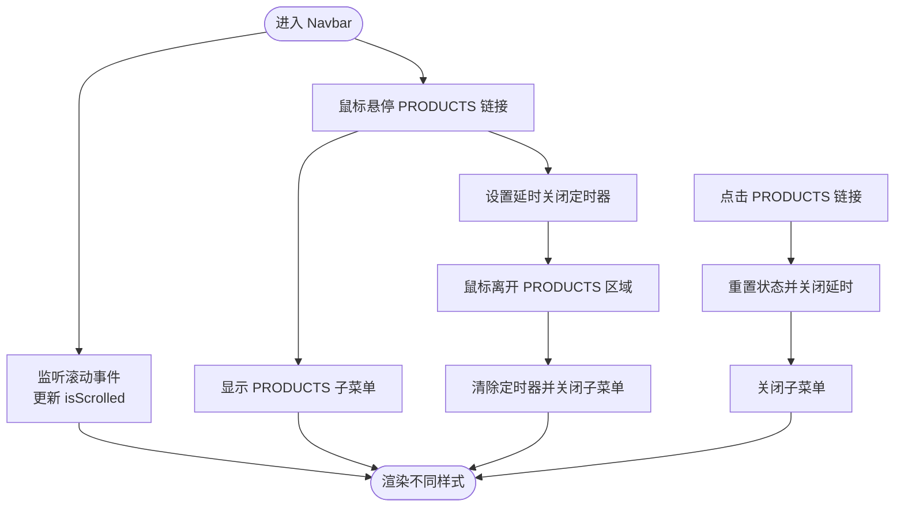
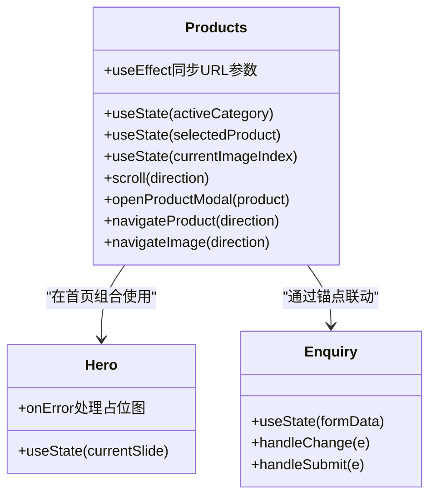
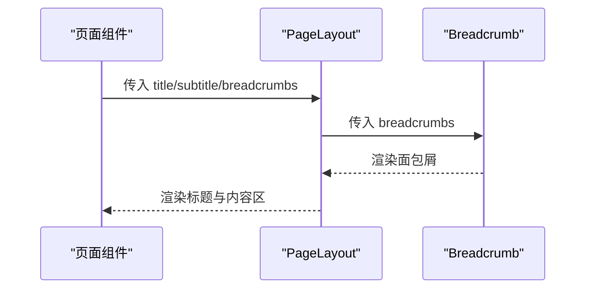
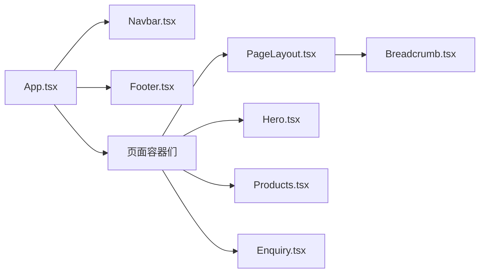

# 组件架构

<cite>
**本文引用的文件**
- [App.tsx](file://App.tsx)
- [index.tsx](file://index.tsx)
- [components/shared/PageLayout.tsx](file://components/shared/PageLayout.tsx)
- [components/shared/Breadcrumb.tsx](file://components/shared/Breadcrumb.tsx)
- [components/pages/AboutPage.tsx](file://components/pages/AboutPage.tsx)
- [components/pages/AllProductsPage.tsx](file://components/pages/AllProductsPage.tsx)
- [components/pages/ProcessPage.tsx](file://components/pages/ProcessPage.tsx)
- [components/pages/ServicePage.tsx](file://components/pages/ServicePage.tsx)
- [components/Navbar.tsx](file://components/Navbar.tsx)
- [components/Footer.tsx](file://components/Footer.tsx)
- [components/Hero.tsx](file://components/Hero.tsx)
- [components/About.tsx](file://components/About.tsx)
- [components/News.tsx](file://components/News.tsx)
- [components/Products.tsx](file://components/Products.tsx)
- [components/Services.tsx](file://components/Services.tsx)
- [components/Enquiry.tsx](file://components/Enquiry.tsx)
</cite>

## 目录
1. [引言](#引言)
2. [项目结构](#项目结构)
3. [核心组件](#核心组件)
4. [架构总览](#架构总览)
5. [详细组件分析](#详细组件分析)
6. [依赖分析](#依赖分析)
7. [性能考虑](#性能考虑)
8. [故障排查指南](#故障排查指南)
9. [结论](#结论)
10. [附录](#附录)

## 引言
本文件面向“威宇精密工程”网站的前端组件架构，系统梳理三层组件体系（共享组件 shared、业务组件 components、页面组件 pages）的设计与实现，重点阐述组件间的依赖关系、数据流与交互模式（props 传递、事件冒泡、状态提升）、复用策略与组合模式，并总结生命周期管理、Hooks 使用模式与状态管理最佳实践。文档同时给出可视化图示与具体路径级示例，帮助开发者快速理解与维护该站点的组件体系。

## 项目结构
项目采用按“层级+功能”混合组织方式：
- 根入口与路由：App.tsx 负责全局路由与主题切换；index.tsx 负责挂载根节点。
- 页面组件：components/pages 下承载各独立页面，统一通过 PageLayout 包裹，形成一致的标题、面包屑与内容区域布局。
- 业务组件：components 下承载首页与页面共用的业务区块，如导航、页脚、英雄轮播、产品展示、新闻、服务、询盘表单等。
- 共享组件：components/shared 下承载跨页面复用的通用 UI，如 PageLayout、Breadcrumb。

图表来源
- [index.tsx](file://index.tsx#L1-L17)
- [App.tsx](file://App.tsx#L1-L112)
- [components/shared/PageLayout.tsx](file://components/shared/PageLayout.tsx#L1-L41)
- [components/shared/Breadcrumb.tsx](file://components/shared/Breadcrumb.tsx#L1-L51)
- [components/pages/AboutPage.tsx](file://components/pages/AboutPage.tsx#L1-L144)
- [components/pages/ServicePage.tsx](file://components/pages/ServicePage.tsx#L1-L182)
- [components/pages/ProcessPage.tsx](file://components/pages/ProcessPage.tsx#L1-L297)
- [components/pages/AllProductsPage.tsx](file://components/pages/AllProductsPage.tsx#L1-L281)
- [components/Navbar.tsx](file://components/Navbar.tsx#L1-L260)
- [components/Footer.tsx](file://components/Footer.tsx#L1-L22)
- [components/Hero.tsx](file://components/Hero.tsx#L1-L132)
- [components/About.tsx](file://components/About.tsx#L1-L73)
- [components/News.tsx](file://components/News.tsx#L1-L58)
- [components/Products.tsx](file://components/Products.tsx#L1-L310)
- [components/Services.tsx](file://components/Services.tsx#L1-L56)
- [components/Enquiry.tsx](file://components/Enquiry.tsx#L1-L279)

章节来源
- [App.tsx](file://App.tsx#L1-L112)
- [index.tsx](file://index.tsx#L1-L17)

## 核心组件
- 入口与路由
  - index.tsx：创建根节点并渲染 App。
  - App.tsx：定义全局路由、滚动到顶部行为、暗色模式状态与切换按钮。
- 导航与页脚
  - Navbar.tsx：响应式导航栏，含二级菜单（ PRODUCTS 子菜单），滚动与悬停状态管理。
  - Footer.tsx：版权信息展示。
- 首页业务区块
  - Hero.tsx：横幅轮播（手动切换），无自动播放。
  - About.tsx：关于板块图文布局。
  - News.tsx：新闻卡片列表。
  - Services.tsx：服务概览网格。
  - Products.tsx：产品横向滚动与详情弹窗。
  - Enquiry.tsx：询盘表单。
- 页面布局与面包屑
  - PageLayout.tsx：统一页内标题、副标题、面包屑与内容区动画过渡。
  - Breadcrumb.tsx：根据传入条目生成面包屑导航。
- 页面
  - AboutPage.tsx、ServicePage.tsx、ProcessPage.tsx、AllProductsPage.tsx：各自页面内容与 PageLayout 组合。

章节来源
- [index.tsx](file://index.tsx#L1-L17)
- [App.tsx](file://App.tsx#L1-L112)
- [components/Navbar.tsx](file://components/Navbar.tsx#L1-L260)
- [components/Footer.tsx](file://components/Footer.tsx#L1-L22)
- [components/Hero.tsx](file://components/Hero.tsx#L1-L132)
- [components/About.tsx](file://components/About.tsx#L1-L73)
- [components/News.tsx](file://components/News.tsx#L1-L58)
- [components/Services.tsx](file://components/Services.tsx#L1-L56)
- [components/Products.tsx](file://components/Products.tsx#L1-L310)
- [components/Enquiry.tsx](file://components/Enquiry.tsx#L1-L279)
- [components/shared/PageLayout.tsx](file://components/shared/PageLayout.tsx#L1-L41)
- [components/shared/Breadcrumb.tsx](file://components/shared/Breadcrumb.tsx#L1-L51)
- [components/pages/AboutPage.tsx](file://components/pages/AboutPage.tsx#L1-L144)
- [components/pages/ServicePage.tsx](file://components/pages/ServicePage.tsx#L1-L182)
- [components/pages/ProcessPage.tsx](file://components/pages/ProcessPage.tsx#L1-L297)
- [components/pages/AllProductsPage.tsx](file://components/pages/AllProductsPage.tsx#L1-L281)

## 架构总览
整体采用“页面容器 + 业务区块 + 共享布局”的分层模式：
- 页面容器负责路由与布局骨架，内部组合多个业务区块或直接渲染页面内容。
- 业务区块承担具体业务逻辑（如产品筛选、图片轮播、表单处理），并在需要时复用共享组件（如 PageLayout、Breadcrumb）。
- 共享组件提供跨页面一致的 UI 与交互基座，确保主题、排版与导航体验统一。

图表来源
- [components/pages/AboutPage.tsx](file://components/pages/AboutPage.tsx#L1-L144)
- [components/pages/ServicePage.tsx](file://components/pages/ServicePage.tsx#L1-L182)
- [components/pages/ProcessPage.tsx](file://components/pages/ProcessPage.tsx#L1-L297)
- [components/pages/AllProductsPage.tsx](file://components/pages/AllProductsPage.tsx#L1-L281)
- [components/shared/PageLayout.tsx](file://components/shared/PageLayout.tsx#L1-L41)
- [components/shared/Breadcrumb.tsx](file://components/shared/Breadcrumb.tsx#L1-L51)
- [components/Hero.tsx](file://components/Hero.tsx#L1-L132)
- [components/About.tsx](file://components/About.tsx#L1-L73)
- [components/News.tsx](file://components/News.tsx#L1-L58)
- [components/Services.tsx](file://components/Services.tsx#L1-L56)
- [components/Products.tsx](file://components/Products.tsx#L1-L310)
- [components/Enquiry.tsx](file://components/Enquiry.tsx#L1-L279)

## 详细组件分析

### 页面容器与布局：AboutPage、ServicePage、ProcessPage、AllProductsPage
- 设计要点
  - 统一使用 PageLayout 包裹，传入标题、副标题与面包屑数组，保证页面一致性。
  - 内容区采用网格、卡片、步骤条等语义化布局，突出核心信息。
- 数据与交互
  - AboutPage：静态内容拼装，无外部状态。
  - ServicePage：服务列表与特性清单，结合 CTA 引导至询盘锚点。
  - ProcessPage：流程步骤与能力展示，强调制造链路与质量控制。
  - AllProductsPage：产品筛选（URL 查询参数）、弹窗详情（图片缩略图、前后切换、MOQ/材质/尺寸/工艺/描述等字段）。
- Props 传递
  - PageLayout 接收 title、subtitle、breadcrumbs、children。
  - Breadcrumb 接收 items 数组，用于渲染导航路径。
- 事件与状态
  - AllProductsPage 内部使用 useState 管理分类、选中产品、当前图片索引；useEffect 同步 URL 参数到分类状态；useSearchParams 控制路由参数变更。
- 复用与组合
  - PageLayout 作为组合基座，子页面仅需关注自身内容结构与数据。

图表来源
- [components/pages/AllProductsPage.tsx](file://components/pages/AllProductsPage.tsx#L1-L281)
- [components/shared/PageLayout.tsx](file://components/shared/PageLayout.tsx#L1-L41)
- [components/shared/Breadcrumb.tsx](file://components/shared/Breadcrumb.tsx#L1-L51)

章节来源
- [components/pages/AboutPage.tsx](file://components/pages/AboutPage.tsx#L1-L144)
- [components/pages/ServicePage.tsx](file://components/pages/ServicePage.tsx#L1-L182)
- [components/pages/ProcessPage.tsx](file://components/pages/ProcessPage.tsx#L1-L297)
- [components/pages/AllProductsPage.tsx](file://components/pages/AllProductsPage.tsx#L1-L281)
- [components/shared/PageLayout.tsx](file://components/shared/PageLayout.tsx#L1-L41)
- [components/shared/Breadcrumb.tsx](file://components/shared/Breadcrumb.tsx#L1-L51)

### 导航与子菜单：Navbar
- 设计要点
  - 桌面端悬浮展开 PRODUCTS 子菜单，移动端折叠为可展开面板。
  - 滚动监听动态调整导航样式，增强可读性。
- 状态与事件
  - useState 管理滚动状态、菜单开关、 PRODUCTS 子菜单显隐、点击状态与延时关闭定时器。
  - 鼠标进入/离开与点击事件协同控制子菜单显示与隐藏。
- 交互细节
  - PRODUCTS 子菜单支持 hover 与 click 两种触发方式，点击后清除延时并重置状态。

图表来源
- [components/Navbar.tsx](file://components/Navbar.tsx#L1-L260)

章节来源
- [components/Navbar.tsx](file://components/Navbar.tsx#L1-L260)

### 首页业务区块：Hero、About、News、Services、Products、Enquiry
- Hero
  - 单组件内维护当前幻灯片索引，支持手动切换，无自动轮播。
- About
  - 左右分栏布局，左侧网格图片，右侧品牌介绍与统计。
- News
  - 新闻卡片网格，支持查看全部链接。
- Services
  - 服务概览网格，突出 CNC Machining。
- Products
  - 分类标签切换，横向滚动容器，点击打开详情弹窗；支持图片缩略图与前后切换。
- Enquiry
  - 完整询盘表单，包含公司、称谓、姓名、电话、邮箱、国家、描述与验证码等字段。

图表来源
- [components/Hero.tsx](file://components/Hero.tsx#L1-L132)
- [components/Products.tsx](file://components/Products.tsx#L1-L310)
- [components/Enquiry.tsx](file://components/Enquiry.tsx#L1-L279)

章节来源
- [components/Hero.tsx](file://components/Hero.tsx#L1-L132)
- [components/About.tsx](file://components/About.tsx#L1-L73)
- [components/News.tsx](file://components/News.tsx#L1-L58)
- [components/Services.tsx](file://components/Services.tsx#L1-L56)
- [components/Products.tsx](file://components/Products.tsx#L1-L310)
- [components/Enquiry.tsx](file://components/Enquiry.tsx#L1-L279)

### 共享组件：PageLayout、Breadcrumb
- PageLayout
  - 接收 title、subtitle、breadcrumbs、children，提供统一的标题区与内容区动画过渡。
- Breadcrumb
  - 接收 items，渲染首页与当前页之间的导航路径，末级不跳转。

图表来源
- [components/shared/PageLayout.tsx](file://components/shared/PageLayout.tsx#L1-L41)
- [components/shared/Breadcrumb.tsx](file://components/shared/Breadcrumb.tsx#L1-L51)

章节来源
- [components/shared/PageLayout.tsx](file://components/shared/PageLayout.tsx#L1-L41)
- [components/shared/Breadcrumb.tsx](file://components/shared/Breadcrumb.tsx#L1-L51)

## 依赖分析
- 组件耦合与内聚
  - 页面容器与业务区块之间以 props 为主，低耦合、高内聚；共享组件仅依赖输入 props，无副作用。
- 直接与间接依赖
  - 页面容器依赖共享布局；业务区块可相互独立，亦可组合使用。
  - Navbar 与路由强相关（Link、to），Products 与路由参数（useSearchParams）强相关。
- 外部依赖与集成点
  - react-router-dom 提供路由与导航；Material Icons 图标库；Tailwind CSS 提供样式。
- 循环依赖
  - 当前结构未见循环依赖，组件树方向清晰。

图表来源
- [App.tsx](file://App.tsx#L1-L112)
- [components/Navbar.tsx](file://components/Navbar.tsx#L1-L260)
- [components/Footer.tsx](file://components/Footer.tsx#L1-L22)
- [components/shared/PageLayout.tsx](file://components/shared/PageLayout.tsx#L1-L41)
- [components/shared/Breadcrumb.tsx](file://components/shared/Breadcrumb.tsx#L1-L51)
- [components/Hero.tsx](file://components/Hero.tsx#L1-L132)
- [components/Products.tsx](file://components/Products.tsx#L1-L310)
- [components/Enquiry.tsx](file://components/Enquiry.tsx#L1-L279)

章节来源
- [App.tsx](file://App.tsx#L1-L112)

## 性能考虑
- 图片加载与降级
  - Hero、Products、News 中对图片加载失败进行兜底处理，避免空白与布局抖动。
- 动画与滚动
  - PageLayout 对内容区添加淡入动画；Products 使用平滑滚动与横向滚动容器，注意在移动端的滚动性能。
- 状态最小化
  - Navbar 的子菜单显隐通过局部状态控制，避免影响其他组件。
- 路由与滚动
  - App.tsx 中的 ScrollToTop 在路由切换时滚动到顶部，减少用户感知的“长列表跳转”带来的不适。

## 故障排查指南
- 路由参数不同步
  - Products 与 AllProductsPage 均存在 URL 参数同步逻辑，若出现分类不同步，检查是否存在重复监听或冲突的事件绑定。
- 子菜单无法关闭
  - Navbar 使用延时关闭定时器，若鼠标频繁进出导致状态异常，确认是否正确清理定时器与重置状态。
- 表单提交无效
  - Enquiry 的表单默认阻止了提交事件，实际应接入后端接口或本地存储；若无处理逻辑，控制台会输出日志。
- 图片加载失败
  - 检查 onError 回调与占位图地址，确保 referrerPolicy 与错误回退逻辑生效。

章节来源
- [components/Navbar.tsx](file://components/Navbar.tsx#L1-L260)
- [components/Products.tsx](file://components/Products.tsx#L1-L310)
- [components/Enquiry.tsx](file://components/Enquiry.tsx#L1-L279)

## 结论
该站点采用清晰的三层组件架构：页面容器负责路由与布局骨架，业务区块聚焦具体功能，共享组件提供一致的 UI 基座。通过 props 传递、事件冒泡与状态提升，实现了页面与区块间的松耦合协作。建议在后续迭代中：
- 将全局状态（如暗色模式、语言）集中管理，减少跨组件 props 下钻。
- 对高频交互（如产品弹窗、导航菜单）引入节流/防抖优化。
- 为共享组件补充类型约束与单元测试，提升可维护性与可测试性。

## 附录
- 组件设计原则
  - 单一职责：每个组件只负责一个明确的功能域。
  - 可测试性：将交互逻辑与渲染分离，便于断言与模拟。
  - 可维护性：保持 props 接口稳定，避免深层嵌套；优先组合而非继承。
- Hooks 使用模式
  - useState：管理组件内部状态（如分类、选中产品、当前图片索引、表单数据）。
  - useEffect：处理副作用（如滚动监听、URL 参数同步、主题类名切换）。
  - useSearchParams：与路由参数联动，驱动页面状态。
- 数据流向与交互模式示例（路径）
  - 页面容器向共享布局传递标题与面包屑：[components/pages/AboutPage.tsx](file://components/pages/AboutPage.tsx#L9-L14) → [components/shared/PageLayout.tsx](file://components/shared/PageLayout.tsx#L16-L38)
  - 面包屑渲染：[components/shared/PageLayout.tsx](file://components/shared/PageLayout.tsx#L18-L36) → [components/shared/Breadcrumb.tsx](file://components/shared/Breadcrumb.tsx#L13-L47)
  - 产品分类与弹窗：[components/pages/AllProductsPage.tsx](file://components/pages/AllProductsPage.tsx#L15-L82) → [components/pages/AllProductsPage.tsx](file://components/pages/AllProductsPage.tsx#L158-L276)
  - 导航子菜单显隐：[components/Navbar.tsx](file://components/Navbar.tsx#L53-L131) → [components/Navbar.tsx](file://components/Navbar.tsx#L128-L153)