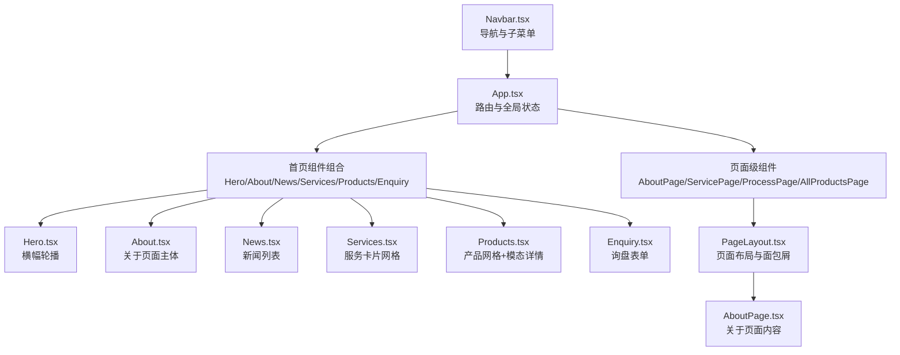
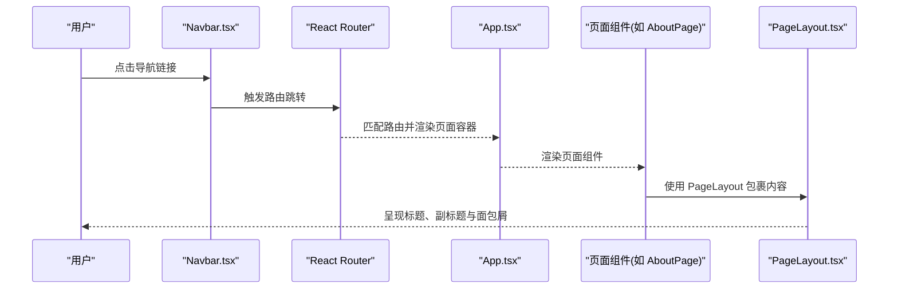
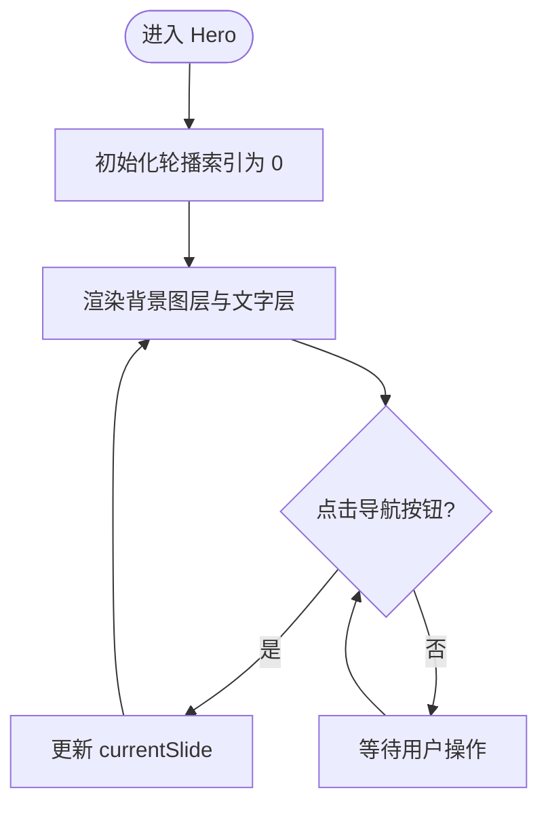
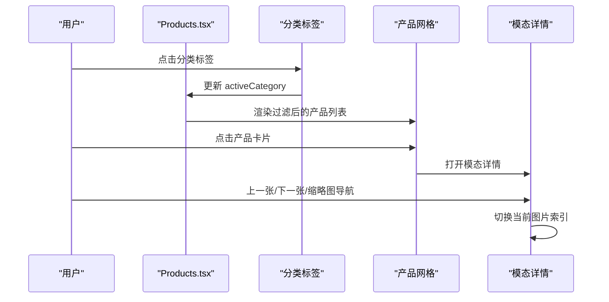
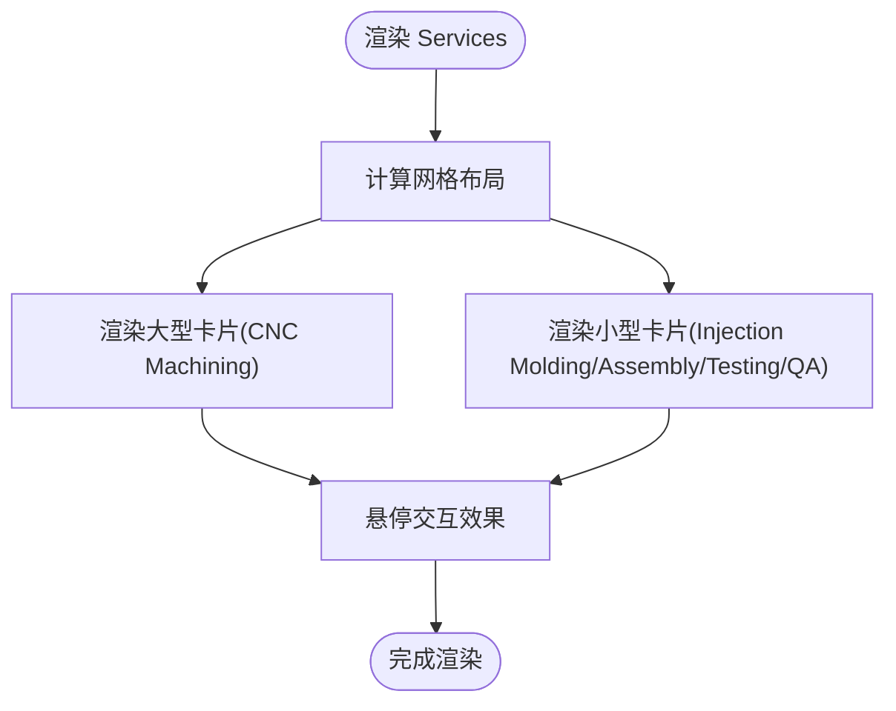
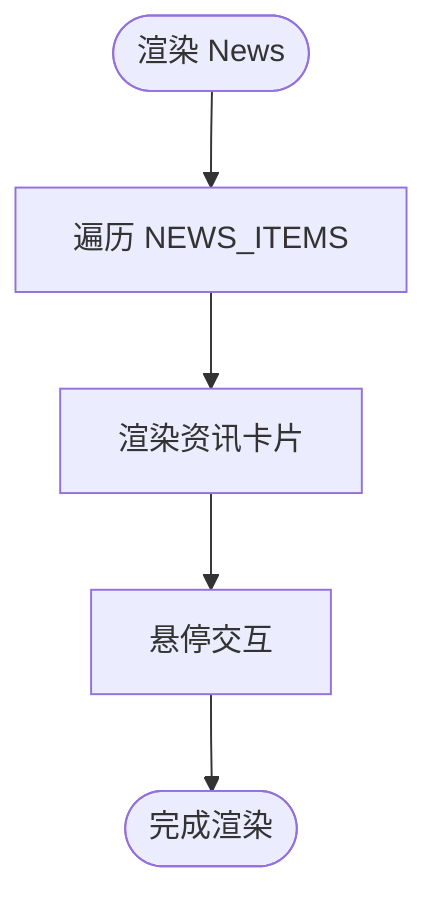
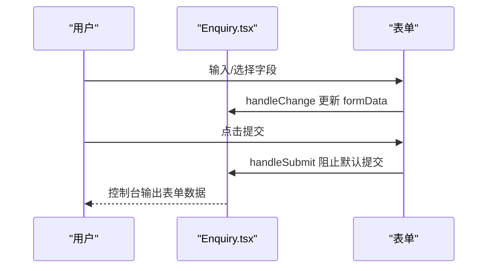
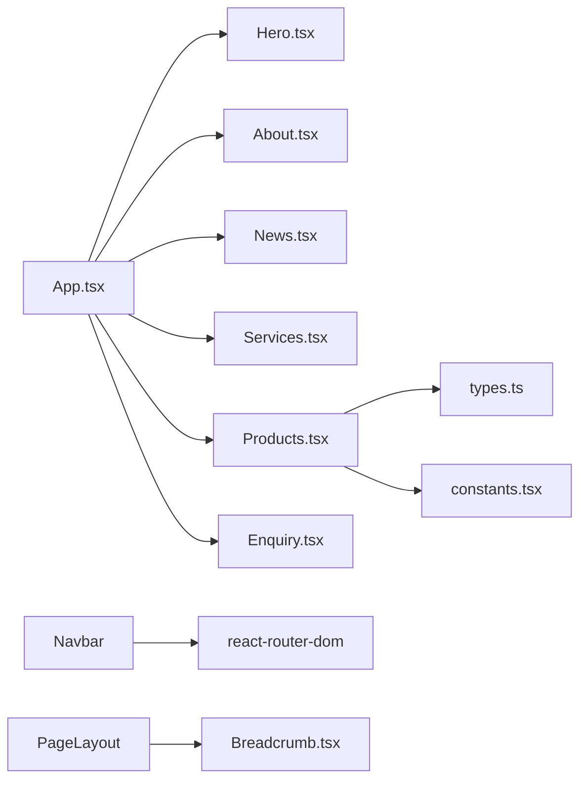

# 业务组件

<cite>
**本文引用的文件**
- [App.tsx](file://App.tsx)
- [Hero.tsx](file://components/Hero.tsx)
- [Products.tsx](file://components/Products.tsx)
- [Services.tsx](file://components/Services.tsx)
- [News.tsx](file://components/News.tsx)
- [Enquiry.tsx](file://components/Enquiry.tsx)
- [About.tsx](file://components/About.tsx)
- [Navbar.tsx](file://components/Navbar.tsx)
- [PageLayout.tsx](file://components/shared/PageLayout.tsx)
- [AboutPage.tsx](file://components/pages/AboutPage.tsx)
- [types.ts](file://types.ts)
- [constants.tsx](file://constants.tsx)
- [package.json](file://package.json)
</cite>

## 目录
1. [简介](#简介)
2. [项目结构](#项目结构)
3. [核心组件](#核心组件)
4. [架构总览](#架构总览)
5. [详细组件分析](#详细组件分析)
6. [依赖关系分析](#依赖关系分析)
7. [性能考量](#性能考量)
8. [故障排查指南](#故障排查指南)
9. [结论](#结论)
10. [附录](#附录)

## 简介
本文件面向威宇精密工程网站的核心业务组件，系统性梳理 Hero、Products、Services、News、Enquiry、About 的设计与实现，重点覆盖：
- Products 组件的产品展示、分类筛选与图片轮播
- Services 组件的服务卡片布局、响应式与交互
- News 组件的资讯展示、内容管理与动态更新机制
- Enquiry 组件的在线询盘表单、数据校验与提交流程
- 各组件的 Props 接口、状态管理与生命周期处理
- 组件间通信、数据传递与事件处理方案
- 性能优化策略、缓存与用户体验改进
- 业务复杂度、数据一致性与服务端集成问题的解决方案

## 项目结构
该站点采用 React + Vite 架构，使用 React Router 进行路由组织，核心页面由 App.tsx 统一装配，业务组件位于 components 目录，页面级组件位于 components/pages，共享组件位于 components/shared。

图表来源
- [App.tsx](file://App.tsx#L17-L28)
- [Navbar.tsx](file://components/Navbar.tsx#L24-L36)
- [Hero.tsx](file://components/Hero.tsx#L36-L128)
- [Products.tsx](file://components/Products.tsx#L91-L306)
- [Services.tsx](file://components/Services.tsx#L6-L52)
- [News.tsx](file://components/News.tsx#L6-L54)
- [Enquiry.tsx](file://components/Enquiry.tsx#L31-L274)
- [PageLayout.tsx](file://components/shared/PageLayout.tsx#L16-L39)
- [AboutPage.tsx](file://components/pages/AboutPage.tsx#L4-L141)

章节来源
- [App.tsx](file://App.tsx#L17-L28)
- [package.json](file://package.json#L11-L21)

## 核心组件
- Hero：全屏横幅背景轮播，支持移动端圆点导航与桌面端卡片导航，具备错误回退图与渐隐过渡。
- Products：产品网格滚动浏览，支持分类筛选（通过 URL hash 参数），点击进入模态详情，内含图片画廊与缩略导航。
- Services：服务卡片网格布局，包含大型卡片与多列组合，响应式布局与悬停交互。
- News：资讯卡片网格，支持图片或图标展示，首条卡片突出显示与悬停提升。
- Enquiry：在线询盘表单，包含联系信息与验证码区域，表单字段与提交处理占位。
- About：关于页面主体，左右分栏图文展示与统计数据区。

章节来源
- [Hero.tsx](file://components/Hero.tsx#L4-L131)
- [Products.tsx](file://components/Products.tsx#L8-L309)
- [Services.tsx](file://components/Services.tsx#L5-L55)
- [News.tsx](file://components/News.tsx#L5-L57)
- [Enquiry.tsx](file://components/Enquiry.tsx#L4-L278)
- [About.tsx](file://components/About.tsx#L4-L72)

## 架构总览
整体采用“页面容器 + 业务组件”的分层设计：
- 页面容器负责路由与滚动行为（App.tsx）
- 导航组件负责菜单与子菜单交互（Navbar.tsx）
- 业务组件各自封装状态与渲染逻辑
- 共享组件提供复用能力（PageLayout.tsx）

图表来源
- [App.tsx](file://App.tsx#L63-L69)
- [Navbar.tsx](file://components/Navbar.tsx#L86-L113)
- [PageLayout.tsx](file://components/shared/PageLayout.tsx#L16-L39)

## 详细组件分析

### Hero 组件
- 设计要点
  - 多图层背景轮播，支持手动切换与移动端圆点导航
  - 文字层动态随轮播变化，配合遮罩与滤镜效果
  - 错误回退图保障图片加载失败场景
- 状态与生命周期
  - 使用 useState 管理当前轮播索引
  - 自动轮播已移除，保留手动切换
- 交互与样式
  - 桌面端三宫格卡片导航，移动端圆点指示器
  - 过渡动画与缩放效果增强视觉层次

图表来源
- [Hero.tsx](file://components/Hero.tsx#L5-L123)

章节来源
- [Hero.tsx](file://components/Hero.tsx#L4-L131)

### Products 组件
- 数据模型与接口
  - 类型定义：ProductItem（id、name、image、images、category、moq、material、size、process、content）
  - 常量数据：PRODUCTS（铭板与CNC两类）
- 分类筛选与 URL 同步
  - 通过 URL hash 参数读取 category 并同步 activeCategory
  - 支持 all/nameplate/cnc 三种分类
- 图片轮播与模态详情
  - 点击产品卡片打开模态详情
  - 支持上一张/下一张与缩略图导航
  - 滚动容器支持平滑横向滚动
- 错误处理
  - 图片加载失败时回退至占位图
- 性能与体验
  - 悬停放大、边框高亮、阴影过渡
  - 动画入场与滚动行为优化

图表来源
- [Products.tsx](file://components/Products.tsx#L9-L32)
- [Products.tsx](file://components/Products.tsx#L101-L115)
- [Products.tsx](file://components/Products.tsx#L136-L166)
- [Products.tsx](file://components/Products.tsx#L188-L304)

章节来源
- [Products.tsx](file://components/Products.tsx#L8-L309)
- [types.ts](file://types.ts#L10-L21)
- [constants.tsx](file://constants.tsx#L50-L166)

### Services 组件
- 布局与交互
  - 1列×4宫格布局，前两列为大卡片，右侧两行为小卡片
  - 悬停时卡片背景与阴影变化，提供交互反馈
- 响应式设计
  - 在不同断点下调整列数与间距，保证在移动端与桌面端均具有良好可读性

图表来源
- [Services.tsx](file://components/Services.tsx#L12-L49)

章节来源
- [Services.tsx](file://components/Services.tsx#L5-L55)

### News 组件
- 内容管理
  - NEWS_ITEMS 提供静态数据源，包含日期、标题、图片或图标
- 动态更新机制
  - 当前实现为静态渲染；若需动态更新，建议引入状态与数据拉取逻辑
- 视觉设计
  - 首条卡片突出显示并轻微上浮，其余卡片悬停提升
  - 缩略图支持灰度与悬停恢复

图表来源
- [News.tsx](file://components/News.tsx#L16-L50)
- [constants.tsx](file://constants.tsx#L4-L23)

章节来源
- [News.tsx](file://components/News.tsx#L5-L57)
- [constants.tsx](file://constants.tsx#L4-L23)

### Enquiry 组件
- 表单结构
  - 公司名称、称谓、姓名、电话、邮箱、Skype、国家、描述、验证码
- 数据绑定与提交
  - 使用受控表单，handleChange 统一更新 formData
  - handleSubmit 阻止默认提交，当前为占位日志输出
- 用户体验
  - 输入框聚焦时的视觉反馈、必填标记、验证码区域与刷新按钮
- 安全与合规
  - 建议在实际部署中增加前端校验与后端接口对接

图表来源
- [Enquiry.tsx](file://components/Enquiry.tsx#L5-L29)
- [Enquiry.tsx](file://components/Enquiry.tsx#L18-L22)

章节来源
- [Enquiry.tsx](file://components/Enquiry.tsx#L4-L278)

### About 组件
- 结构
  - 左侧图片网格（包含“ABOUT US”标识与两张图片），右侧文本与统计数据
- 交互
  - “了解更多”按钮提供悬停放大与箭头旋转效果
- 数据
  - 文本内容为静态文案，图片资源来自 Unsplash

章节来源
- [About.tsx](file://components/About.tsx#L4-L72)

### 页面布局与导航
- PageLayout
  - 提供统一标题、副标题与面包屑渲染，作为页面容器复用
- AboutPage
  - 使用 PageLayout 包裹公司介绍、统计数据、核心价值与认证信息
- Navbar
  - 桌面端悬浮菜单与移动端抽屉菜单，支持 PRODUCTS 子菜单与延迟关闭
  - 通过路由跳转与锚点定位实现页面内导航

章节来源
- [PageLayout.tsx](file://components/shared/PageLayout.tsx#L9-L39)
- [AboutPage.tsx](file://components/pages/AboutPage.tsx#L4-L141)
- [Navbar.tsx](file://components/Navbar.tsx#L24-L153)

## 依赖关系分析
- 组件依赖
  - App.tsx 依赖各业务组件与页面组件
  - Products.tsx 依赖常量数据与类型定义
  - Navbar.tsx 依赖路由 Link 与 Logo
  - PageLayout.tsx 依赖 Breadcrumb
- 外部依赖
  - React、React DOM、React Router
  - Vite、TypeScript

图表来源
- [App.tsx](file://App.tsx#L3-L15)
- [Products.tsx](file://components/Products.tsx#L2-L4)
- [types.ts](file://types.ts#L1-L30)
- [constants.tsx](file://constants.tsx#L1-L3)
- [Navbar.tsx](file://components/Navbar.tsx#L2-L4)
- [PageLayout.tsx](file://components/shared/PageLayout.tsx#L1-L3)

章节来源
- [package.json](file://package.json#L11-L21)

## 性能考量
- 图片加载与回退
  - Hero 与 Products 对图片加载失败进行回退处理，避免空白或报错
- 滚动与动画
  - Products 使用平滑滚动与动画入场，注意在低端设备上的性能影响
- 状态最小化
  - Hero 仅维护轮播索引；Products 维护分类、选中产品与图片索引，避免不必要的重渲染
- 路由与滚动
  - App.tsx 中的 ScrollToTop 在路由切换时重置滚动位置，改善用户体验

优化建议
- 图片懒加载：对非首屏图片采用懒加载策略
- 虚拟滚动：当产品数量增长时考虑虚拟滚动
- 事件节流：对高频事件（如窗口尺寸变化）进行节流
- 缓存策略：对静态常量数据进行本地缓存，减少重复解析

## 故障排查指南
- 图片无法显示
  - 检查 src 是否有效，确认 onError 回退逻辑是否生效
  - 参考路径：Hero.tsx、Products.tsx
- 分类筛选不生效
  - 确认 URL hash 参数格式与值是否正确
  - 参考路径：Products.tsx
- 模态详情无法关闭
  - 检查点击遮罩层的事件冒泡与关闭函数调用
  - 参考路径：Products.tsx
- 表单提交无效
  - 确认 handleSubmit 是否阻止默认行为，当前为占位输出
  - 参考路径：Enquiry.tsx
- 导航菜单异常
  - 检查 Navbar 的鼠标事件与定时器清理
  - 参考路径：Navbar.tsx

章节来源
- [Hero.tsx](file://components/Hero.tsx#L56-L58)
- [Products.tsx](file://components/Products.tsx#L15-L32)
- [Products.tsx](file://components/Products.tsx#L190-L196)
- [Enquiry.tsx](file://components/Enquiry.tsx#L18-L22)
- [Navbar.tsx](file://components/Navbar.tsx#L13-L22)

## 结论
本项目以清晰的组件分层与路由组织实现了企业官网的核心业务模块。各组件职责明确、状态可控，并通过共享布局与导航增强了可维护性。后续可在数据动态化、性能优化与服务端集成方面进一步完善，以满足更复杂的业务需求与更高的用户体验标准。

## 附录

### 组件 Props 与状态清单
- Hero
  - Props：无
  - 状态：currentSlide（number）
- Products
  - Props：无
  - 状态：activeCategory（'all' | 'nameplate' | 'cnc'）、selectedProduct（ProductItem|null）、currentImageIndex（number）
  - 引用：scrollContainerRef（HTMLDivElement）
- Services
  - Props：无
- News
  - Props：无
- Enquiry
  - Props：无
  - 状态：formData（表单字段对象）
- About
  - Props：无

章节来源
- [Hero.tsx](file://components/Hero.tsx#L4-L5)
- [Products.tsx](file://components/Products.tsx#L8-L12)
- [Services.tsx](file://components/Services.tsx#L5-L5)
- [News.tsx](file://components/News.tsx#L5-L5)
- [Enquiry.tsx](file://components/Enquiry.tsx#L4-L16)
- [About.tsx](file://components/About.tsx#L4-L6)

### 数据模型定义
- NewsItem
  - id（string）、date（string）、title（string）、image（string?）、icon（string?）
- ProductItem
  - id（string）、name（string）、image（string）、images（string[]?）、category（'nameplate' | 'cnc'）、moq（string?）、material（string?）、size（string?）、process（string?）、content（string?）
- ServiceItem
  - id（string）、title（string）、description（string?）、icon（string）、isLarge（boolean?）

章节来源
- [types.ts](file://types.ts#L2-L29)