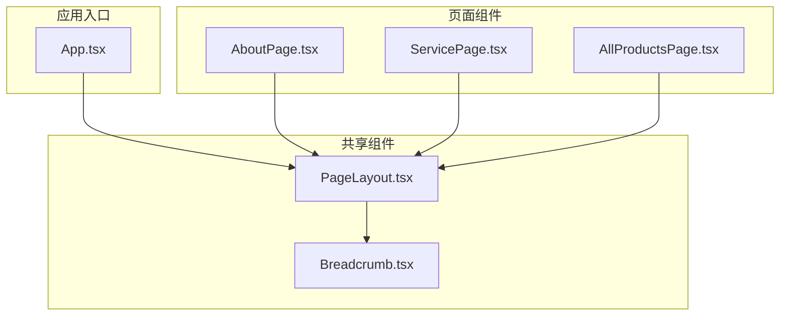
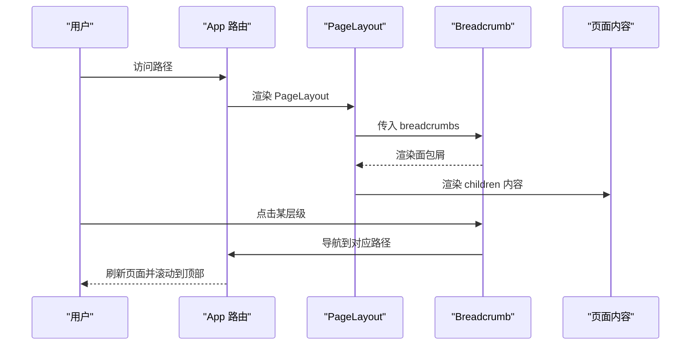
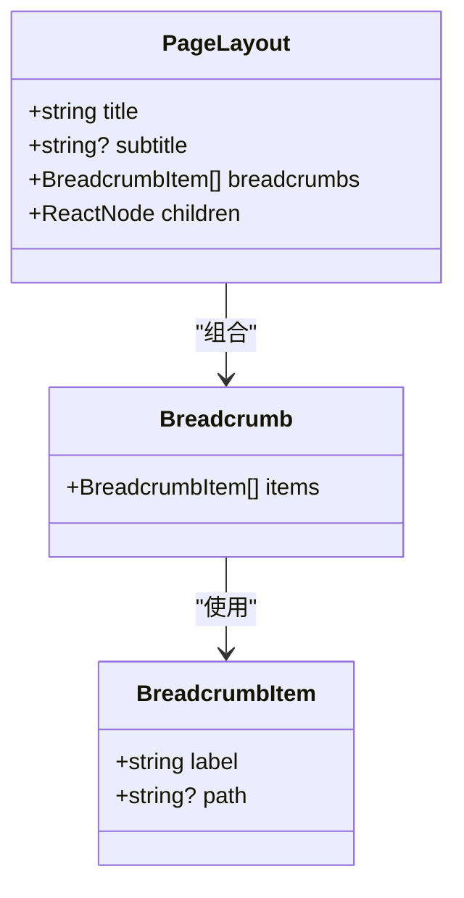
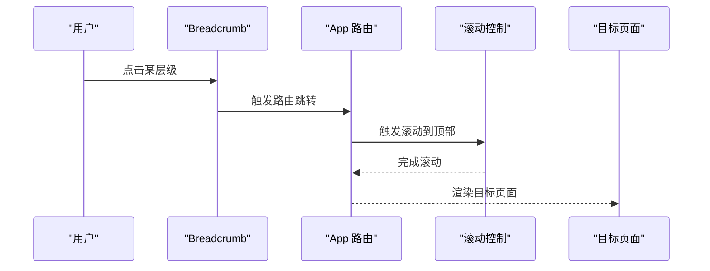
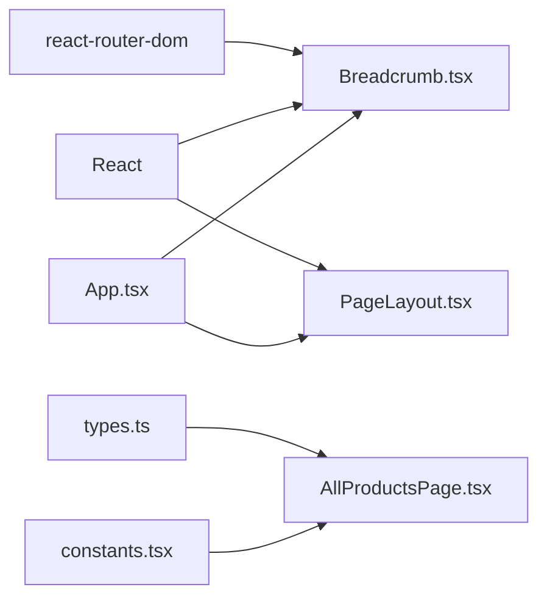

# 共享组件

<cite>
**本文引用的文件列表**
- [components/shared/PageLayout.tsx](file://components/shared/PageLayout.tsx)
- [components/shared/Breadcrumb.tsx](file://components/shared/Breadcrumb.tsx)
- [components/pages/AboutPage.tsx](file://components/pages/AboutPage.tsx)
- [components/pages/ServicePage.tsx](file://components/pages/ServicePage.tsx)
- [components/pages/AllProductsPage.tsx](file://components/pages/AllProductsPage.tsx)
- [App.tsx](file://App.tsx)
- [constants.tsx](file://constants.tsx)
- [types.ts](file://types.ts)
- [package.json](file://package.json)
</cite>

## 目录
1. [简介](#简介)
2. [项目结构](#项目结构)
3. [核心组件](#核心组件)
4. [架构总览](#架构总览)
5. [详细组件分析](#详细组件分析)
6. [依赖关系分析](#依赖关系分析)
7. [性能与可访问性](#性能与可访问性)
8. [故障排查指南](#故障排查指南)
9. [结论](#结论)
10. [附录：使用示例与最佳实践](#附录使用示例与最佳实践)

## 简介
本文件聚焦于威宇精密工程网站中的两个核心共享组件：PageLayout（页面布局）与 Breadcrumb（面包屑导航）。我们将从设计理念、实现细节、Props 接口、状态管理、生命周期钩子、样式定制、主题适配、无障碍访问以及组件间通信与性能优化等方面进行系统化说明，并提供在不同页面中的复用示例与最佳实践。

## 项目结构
该站点采用多页面应用结构，主入口通过路由分发至不同页面组件；共享组件位于 components/shared 下，被各页面组件复用以保证一致的布局与导航体验。

图表来源
- [App.tsx](file://App.tsx#L41-L109)
- [components/shared/PageLayout.tsx](file://components/shared/PageLayout.tsx#L1-L41)
- [components/shared/Breadcrumb.tsx](file://components/shared/Breadcrumb.tsx#L1-L51)
- [components/pages/AboutPage.tsx](file://components/pages/AboutPage.tsx#L1-L144)
- [components/pages/ServicePage.tsx](file://components/pages/ServicePage.tsx#L1-L182)
- [components/pages/AllProductsPage.tsx](file://components/pages/AllProductsPage.tsx#L1-L281)

章节来源
- [App.tsx](file://App.tsx#L1-L112)
- [package.json](file://package.json#L1-L23)

## 核心组件
本节概述两个共享组件的职责与对外接口，便于快速理解与复用。

- PageLayout
  - 职责：统一页面标题、副标题、面包屑与内容区域的布局容器；负责动画入场效果与暗色模式适配。
  - 关键 Props：
    - title: 页面主标题（字符串）
    - subtitle?: 页面副标题（字符串，可选）
    - breadcrumbs: 面包屑项数组（见下节）
    - children: 子节点（ReactNode）

- Breadcrumb
  - 职责：渲染当前页面的导航层级，支持首页与中间层级的链接跳转，末级项保持不可点击状态。
  - 关键 Props：
    - items: 面包屑项数组（每个项包含 label 与可选 path）

章节来源
- [components/shared/PageLayout.tsx](file://components/shared/PageLayout.tsx#L9-L14)
- [components/shared/Breadcrumb.tsx](file://components/shared/Breadcrumb.tsx#L9-L11)

## 架构总览
PageLayout 作为页面容器，内部嵌入 Breadcrumb 并承载页面内容；App.tsx 提供全局路由、滚动控制与暗色模式切换，二者共同构成页面骨架与导航体系。

图表来源
- [App.tsx](file://App.tsx#L30-L39)
- [components/shared/PageLayout.tsx](file://components/shared/PageLayout.tsx#L16-L39)
- [components/shared/Breadcrumb.tsx](file://components/shared/Breadcrumb.tsx#L13-L48)

## 详细组件分析

### PageLayout 组件
- 设计理念
  - 以“容器优先”的思路，将标题、副标题、面包屑与内容区统一在一个语义化的布局容器内，确保页面一致性与可维护性。
  - 通过全局暗色模式类名控制主题切换，避免在组件内直接写死样式。
  - 使用动画类名实现内容进入时的淡入上移动效，提升用户体验。

- 实现要点
  - 布局结构：外层根容器负责最小高度与背景色；面包屑在标题区域上方；标题与副标题居中展示；内容区域包裹动画类名。
  - 响应式设计：标题字号随屏幕尺寸自适应；内容最大宽度与内外边距在移动端与桌面端有差异。
  - 主题适配：根容器使用明/暗两套文本与背景色变量，配合 App 中的暗色模式开关生效。

- Props 接口
  - title: 字符串
  - subtitle?: 字符串
  - breadcrumbs: BreadcrumbItem[]
  - children: ReactNode

- 生命周期与状态
  - 无内部状态，仅接收 props 并渲染。
  - 动画效果通过全局样式类名触发，不依赖组件内部副作用。

- 代码片段路径
  - [PageLayout 容器结构与样式](file://components/shared/PageLayout.tsx#L16-L39)
  - [全局暗色模式类名注入](file://App.tsx#L44-L50)

章节来源
- [components/shared/PageLayout.tsx](file://components/shared/PageLayout.tsx#L1-L41)
- [App.tsx](file://App.tsx#L41-L54)

#### 类图：PageLayout 与 Breadcrumb 的关系

图表来源
- [components/shared/PageLayout.tsx](file://components/shared/PageLayout.tsx#L4-L14)
- [components/shared/Breadcrumb.tsx](file://components/shared/Breadcrumb.tsx#L4-L11)

### Breadcrumb 组件
- 设计理念
  - 以“可点击的前序层级 + 不可点击的当前页”为核心交互模型，强调层级清晰与直达首页的便捷性。
  - 首页始终可点击且自动滚动到顶部，避免用户重复滚动。
  - 末级项以强调色与加粗显示，明确当前所在位置。

- 生成逻辑
  - 首项固定为首页链接，点击后滚动到顶部。
  - 中间项根据是否提供 path 决定是否渲染为链接或纯文本。
  - 末项（当前页）始终为纯文本，不提供跳转。

- 用户交互
  - 首页点击：触发路由跳转并滚动到顶部。
  - 中间项点击：触发路由跳转，不强制滚动（由 App 的滚动控制处理）。
  - 末级项：不可点击，仅作指示。

- Props 接口
  - items: BreadcrumbItem[]

- 代码片段路径
  - [面包屑渲染与交互](file://components/shared/Breadcrumb.tsx#L13-L48)

章节来源
- [components/shared/Breadcrumb.tsx](file://components/shared/Breadcrumb.tsx#L1-L51)

#### 序列图：面包屑点击到页面刷新

图表来源
- [components/shared/Breadcrumb.tsx](file://components/shared/Breadcrumb.tsx#L18-L24)
- [App.tsx](file://App.tsx#L30-L39)

### 在页面中的复用示例
- AboutPage
  - 仅提供当前页标题与面包屑项，内容区域由 PageLayout 承载。
  - 代码片段路径：[AboutPage 使用 PageLayout](file://components/pages/AboutPage.tsx#L9-L14)

- ServicePage
  - 提供标题、副标题与面包屑，内容区域为服务网格与特性列表。
  - 代码片段路径：[ServicePage 使用 PageLayout](file://components/pages/ServicePage.tsx#L78-L83)

- AllProductsPage
  - 使用面包屑与 PageLayout 承载产品筛选、网格与详情弹窗。
  - 代码片段路径：[AllProductsPage 使用 PageLayout](file://components/pages/AllProductsPage.tsx#L84-L89)

章节来源
- [components/pages/AboutPage.tsx](file://components/pages/AboutPage.tsx#L1-L144)
- [components/pages/ServicePage.tsx](file://components/pages/ServicePage.tsx#L1-L182)
- [components/pages/AllProductsPage.tsx](file://components/pages/AllProductsPage.tsx#L1-L281)

## 依赖关系分析
- 组件耦合
  - PageLayout 依赖 Breadcrumb，形成“容器-子组件”关系。
  - Breadcrumb 依赖 react-router-dom 的 Link 进行路由跳转。
  - App 提供全局路由、滚动控制与暗色模式切换，影响所有页面与共享组件的主题表现。

- 外部依赖
  - React 与 react-router-dom 用于组件与路由。
  - TailwindCSS 类名用于样式与主题适配。

图表来源
- [components/shared/Breadcrumb.tsx](file://components/shared/Breadcrumb.tsx#L1-L2)
- [components/shared/PageLayout.tsx](file://components/shared/PageLayout.tsx#L1-L2)
- [App.tsx](file://App.tsx#L1-L11)
- [components/pages/AllProductsPage.tsx](file://components/pages/AllProductsPage.tsx#L1-L6)
- [types.ts](file://types.ts#L1-L30)
- [constants.tsx](file://constants.tsx#L1-L167)
- [package.json](file://package.json#L11-L14)

章节来源
- [package.json](file://package.json#L11-L14)

## 性能与可访问性
- 性能
  - PageLayout 的动画通过全局样式类名实现，避免在组件内引入复杂动画库，降低打包体积与运行开销。
  - Breadcrumb 仅渲染必要元素，末级项不绑定事件，减少不必要的监听器数量。
  - App 的滚动控制在路由变化时触发，避免在每个页面重复实现。

- 可访问性
  - 面包屑使用语义化 nav 与 ol/li 结构，利于屏幕阅读器识别。
  - 链接具备 hover 状态与颜色对比，满足视觉可达性要求。
  - 暗色模式通过根元素类名切换，浏览器可正确继承主题。

章节来源
- [components/shared/Breadcrumb.tsx](file://components/shared/Breadcrumb.tsx#L14-L16)
- [App.tsx](file://App.tsx#L88-L105)

## 故障排查指南
- 面包屑未显示或链接无效
  - 检查传入的 breadcrumbs 是否包含 label；若末级项 path 缺失，将按纯文本显示。
  - 确认 react-router-dom 已安装并正确配置路由。

- 暗色模式不生效
  - 确认 App 中的暗色模式切换逻辑已执行，根元素存在 dark 类名。
  - 检查 TailwindCSS 的暗色模式配置是否启用。

- 页面滚动未回到顶部
  - 确认 App 中的 ScrollToTop 组件已在 Router 内渲染。
  - 检查面包屑首页链接是否调用了滚动到顶部的逻辑。

- 动画未出现
  - 确认全局样式中存在对应的动画类名定义。
  - 检查 PageLayout 的 children 是否正确包裹动画类名。

章节来源
- [components/shared/Breadcrumb.tsx](file://components/shared/Breadcrumb.tsx#L18-L24)
- [App.tsx](file://App.tsx#L30-L39)
- [App.tsx](file://App.tsx#L88-L105)

## 结论
PageLayout 与 Breadcrumb 通过简洁的接口与清晰的职责划分，实现了统一的页面骨架与导航体验。它们与 App 的路由、滚动控制与暗色模式机制协同工作，既保证了开发效率，也兼顾了性能与可访问性。建议在新增页面时遵循现有模式，统一传入 breadcrumbs 与标题信息，确保一致的用户体验。

## 附录：使用示例与最佳实践
- 在页面中使用 PageLayout
  - 准备 breadcrumbs 数组，至少包含当前页项；如需返回首页，可在首项提供 path。
  - 将页面内容作为 children 传入，注意内容区域的样式类名与间距。
  - 示例路径：
    - [AboutPage 使用 PageLayout](file://components/pages/AboutPage.tsx#L9-L14)
    - [ServicePage 使用 PageLayout](file://components/pages/ServicePage.tsx#L78-L83)
    - [AllProductsPage 使用 PageLayout](file://components/pages/AllProductsPage.tsx#L84-L89)

- 自定义面包屑
  - 若需要更复杂的层级，可在 breadcrumbs 中追加多个中间项，每个项提供 label 与 path。
  - 注意末级项不应提供 path，以避免误操作导致跳转。

- 主题与样式定制
  - 通过 App 的暗色模式开关控制根元素类名，组件内的文本与背景色会自动适配。
  - 如需调整标题样式或动画效果，可在全局样式中修改对应类名。

- 状态管理与生命周期
  - PageLayout 无内部状态，适合在任何页面直接复用。
  - 若页面需要基于 URL 参数动态生成面包屑，可在页面组件中计算 breadcrumbs 后传入。

- 数据类型参考
  - 产品数据类型与常量可参考以下文件：
    - [types.ts](file://types.ts#L10-L21)
    - [constants.tsx](file://constants.tsx#L50-L166)

章节来源
- [components/pages/AboutPage.tsx](file://components/pages/AboutPage.tsx#L4-L7)
- [components/pages/ServicePage.tsx](file://components/pages/ServicePage.tsx#L4-L7)
- [components/pages/AllProductsPage.tsx](file://components/pages/AllProductsPage.tsx#L9-L27)
- [types.ts](file://types.ts#L10-L21)
- [constants.tsx](file://constants.tsx#L50-L166)