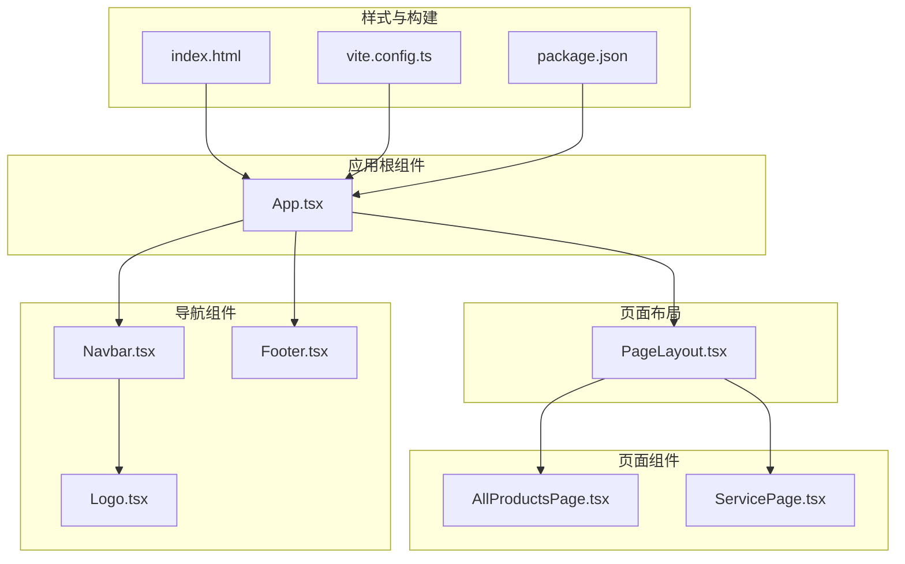
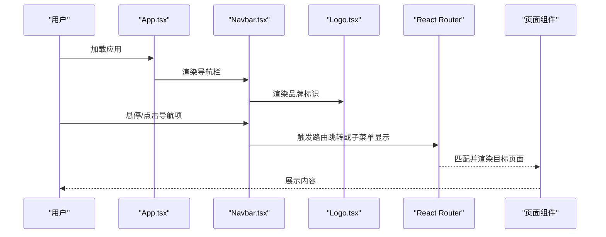
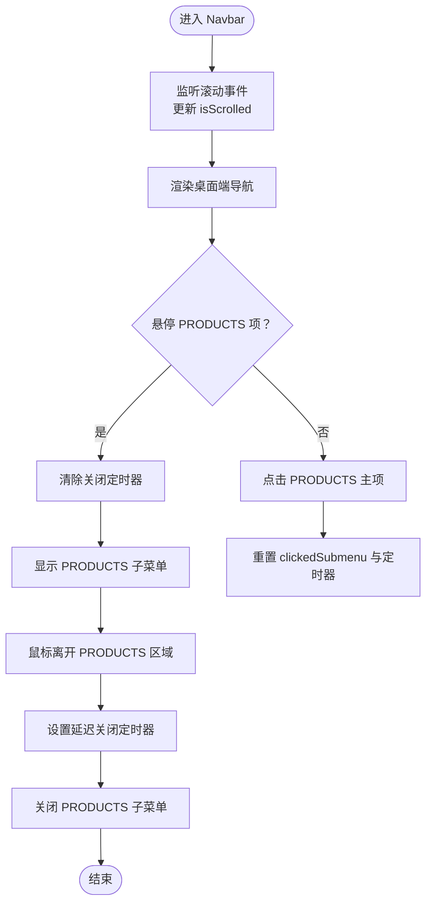
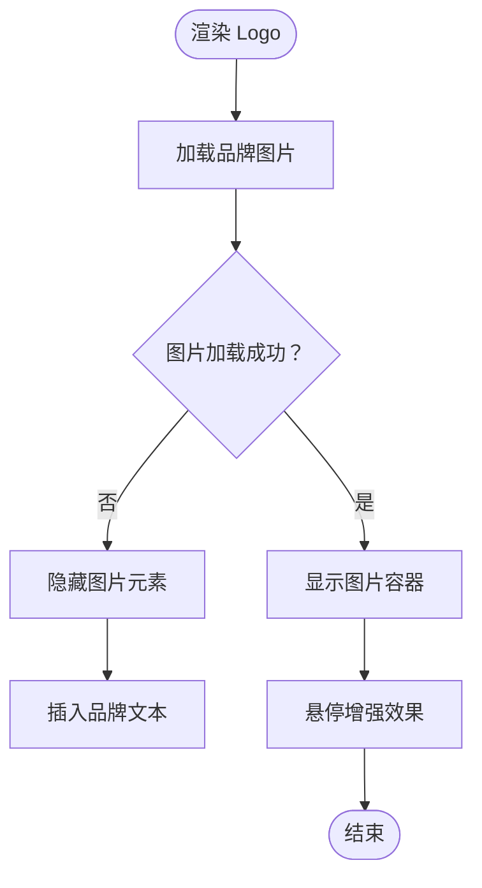
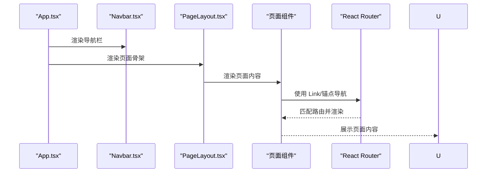
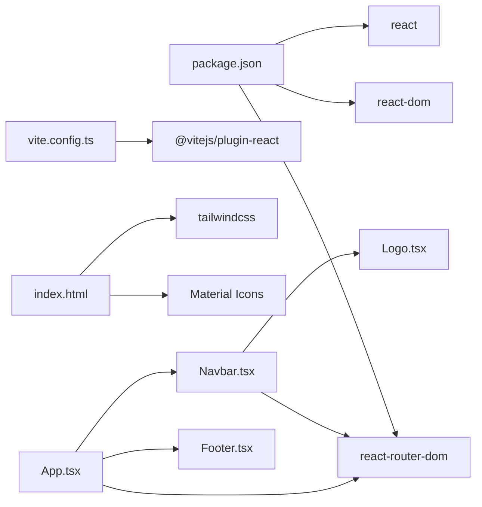

# 导航组件

<cite>
**本文引用的文件**
- [components/Navbar.tsx](file://components/Navbar.tsx)
- [components/Logo.tsx](file://components/Logo.tsx)
- [components/Footer.tsx](file://components/Footer.tsx)
- [App.tsx](file://App.tsx)
- [components/shared/PageLayout.tsx](file://components/shared/PageLayout.tsx)
- [components/pages/AllProductsPage.tsx](file://components/pages/AllProductsPage.tsx)
- [components/pages/ServicePage.tsx](file://components/pages/ServicePage.tsx)
- [index.html](file://index.html)
- [vite.config.ts](file://vite.config.ts)
- [package.json](file://package.json)
</cite>

## 目录
1. [简介](#简介)
2. [项目结构](#项目结构)
3. [核心组件](#核心组件)
4. [架构总览](#架构总览)
5. [组件详细分析](#组件详细分析)
6. [依赖关系分析](#依赖关系分析)
7. [性能考量](#性能考量)
8. [故障排查指南](#故障排查指南)
9. [结论](#结论)
10. [附录](#附录)

## 简介
本文件聚焦于威宇精密工程网站的导航相关组件，系统性解析 Navbar（导航栏）、Logo（品牌标识）与 Footer（页脚）三者的功能实现、设计模式与交互逻辑，并结合路由集成、主题切换、响应式断点与无障碍访问进行深入说明。文档同时提供组件组合使用建议、样式定制与 SEO 最佳实践，帮助开发者在不牺牲可用性的前提下优化性能与可维护性。

## 项目结构
导航组件位于 components 目录中，配合 App 根组件与页面布局组件共同构成前端导航体系：
- 组件层：Navbar、Logo、Footer
- 页面布局：PageLayout 提供统一的页面骨架与面包屑
- 根组件：App 负责路由、滚动控制与全局主题切换
- 全局样式：index.html 中通过 Tailwind 插件与自定义颜色扩展提供主题基础

图表来源
- [App.tsx](file://App.tsx#L41-L109)
- [components/Navbar.tsx](file://components/Navbar.tsx#L6-L259)
- [components/Logo.tsx](file://components/Logo.tsx#L5-L29)
- [components/Footer.tsx](file://components/Footer.tsx#L4-L21)
- [components/shared/PageLayout.tsx](file://components/shared/PageLayout.tsx#L16-L39)
- [components/pages/AllProductsPage.tsx](file://components/pages/AllProductsPage.tsx#L84-L277)
- [components/pages/ServicePage.tsx](file://components/pages/ServicePage.tsx#L78-L177)
- [index.html](file://index.html#L3-L43)
- [vite.config.ts](file://vite.config.ts#L1-L24)
- [package.json](file://package.json#L1-L23)

章节来源
- [App.tsx](file://App.tsx#L41-L109)
- [index.html](file://index.html#L3-L43)

## 核心组件
- Navbar：负责桌面端与移动端导航、子菜单、滚动态样式与路由集成；支持 PRODUCTS 子菜单的悬停/点击交互与移动端展开收起。
- Logo：品牌标识容器，包含图片加载失败回退与悬停效果，作为首页入口链接。
- Footer：展示公司地址、电话、传真与版权信息，采用统一的主题色与间距。

章节来源
- [components/Navbar.tsx](file://components/Navbar.tsx#L6-L259)
- [components/Logo.tsx](file://components/Logo.tsx#L5-L29)
- [components/Footer.tsx](file://components/Footer.tsx#L4-L21)

## 架构总览
导航组件与页面布局、路由的关系如下：

图表来源
- [App.tsx](file://App.tsx#L56-L72)
- [components/Navbar.tsx](file://components/Navbar.tsx#L38-L256)
- [components/Logo.tsx](file://components/Logo.tsx#L7-L26)

## 组件详细分析

### Navbar 组件分析
- 功能要点
  - 滚动态样式：根据滚动距离动态切换背景透明度、高度与阴影，提升视觉层次。
  - 桌面端导航：固定宽度与字距，支持 PRODUCTS 子菜单的悬停显示与延迟关闭，点击后清除定时器避免误关。
  - 移动端菜单：汉堡按钮切换，点击 PRODUCTS 主项时可展开子菜单，点击任意子项自动收起并关闭定时器。
  - 交互细节：鼠标进入/离开 PRODUCTS 项时设置/清理定时器，确保子菜单在指针移动过程中保持打开。
  - 路由集成：使用 Link 进行内部路由跳转，ENQUIRY 使用锚点定位至页面特定区域。
- 状态管理
  - isScrolled：监听滚动事件，控制导航外观。
  - isMenuOpen：控制移动端菜单显隐。
  - showProductsSubmenu：控制 PRODUCTS 子菜单显隐。
  - clickedSubmenu：用于区分点击触发与悬停触发的子菜单状态。
  - closeTimer：定时器管理，避免频繁开关导致的闪烁与抖动。
- 响应式设计
  - 桌面端：隐藏 lg 以上显示，使用较大的字距与字号。
  - 移动端：lg 以下显示汉堡菜单，子菜单以列表形式呈现，支持展开/收起。
- 事件处理
  - 桌面端：onMouseEnter/onMouseLeave 控制 PRODUCTS 子菜单；点击 PRODUCTS 主项时清除定时器并重置状态。
  - 移动端：点击按钮切换子菜单展开状态；点击子项后关闭菜单并重置状态。
- 路由集成
  - 内部路由使用 Link，锚点使用 a 标签，确保平滑滚动与正确跳转。

图表来源
- [components/Navbar.tsx](file://components/Navbar.tsx#L13-L22)
- [components/Navbar.tsx](file://components/Navbar.tsx#L53-L72)
- [components/Navbar.tsx](file://components/Navbar.tsx#L86-L92)
- [components/Navbar.tsx](file://components/Navbar.tsx#L116-L153)
- [components/Navbar.tsx](file://components/Navbar.tsx#L168-L254)

章节来源
- [components/Navbar.tsx](file://components/Navbar.tsx#L6-L259)

### Logo 组件分析
- 功能要点
  - 作为首页入口链接，点击返回根路径。
  - 图片容器采用圆角背景与阴影，悬停时增强亮度与阴影，提升交互反馈。
  - 图片加载失败时自动隐藏图片并插入文本替代，保证品牌信息可见。
- 尺寸适配
  - 图片高度在 md 断点下自适应增大，确保在不同屏幕下的可读性。
- 链接行为
  - 使用 Link 组件，确保 SPA 路由跳转，避免整页刷新。
- 品牌展示
  - 蓝色底色与圆角设计体现工业风格，文字与图标组合形成统一品牌识别。

图表来源
- [components/Logo.tsx](file://components/Logo.tsx#L10-L23)

章节来源
- [components/Logo.tsx](file://components/Logo.tsx#L5-L29)

### Footer 组件分析
- 信息组织
  - 地址、电话、传真集中展示，便于用户联系。
  - 版权信息采用较小字号与字母间距，突出品牌名称。
- 链接管理
  - 当前未包含外部链接，仅展示静态信息。
- 版权展示
  - 使用统一的强调色与字体权重，确保可读性与品牌一致性。

章节来源
- [components/Footer.tsx](file://components/Footer.tsx#L4-L21)

### 组件组合与路由集成
- Navbar 与 App 的组合
  - App 作为根组件，负责路由配置与滚动控制；Navbar 作为页面头部导航，贯穿各页面。
- 页面布局 PageLayout
  - PageLayout 为页面提供统一的标题、副标题与面包屑，Navbar 与 Footer 在 App 中统一渲染，确保导航一致性。
- 页面组件中的导航使用
  - ServicePage 中通过锚点链接 ENQUIRY 区域，验证 Navbar 的 ENQUIRY 锚点与页面定位的协同工作。
  - AllProductsPage 通过 URL 参数与路由参数实现 PRODUCTS 分类筛选，Navbar 的 PRODUCTS 子菜单与该页面的分类切换相辅相成。

图表来源
- [App.tsx](file://App.tsx#L56-L72)
- [components/shared/PageLayout.tsx](file://components/shared/PageLayout.tsx#L16-L39)
- [components/pages/ServicePage.tsx](file://components/pages/ServicePage.tsx#L168-L174)
- [components/pages/AllProductsPage.tsx](file://components/pages/AllProductsPage.tsx#L35-L42)

章节来源
- [App.tsx](file://App.tsx#L41-L109)
- [components/shared/PageLayout.tsx](file://components/shared/PageLayout.tsx#L16-L39)
- [components/pages/ServicePage.tsx](file://components/pages/ServicePage.tsx#L168-L174)
- [components/pages/AllProductsPage.tsx](file://components/pages/AllProductsPage.tsx#L35-L42)

## 依赖关系分析
- 组件间依赖
  - Navbar 依赖 Logo 作为左侧品牌入口。
  - App 负责路由与主题切换，Navbar 与 Footer 在 App 中统一渲染。
- 外部依赖
  - React Router 用于路由跳转与锚点定位。
  - Tailwind CSS 与自定义颜色扩展提供主题与响应式样式。
- 构建与运行
  - Vite 作为开发服务器与打包工具，React 插件提供热更新与类型支持。

图表来源
- [package.json](file://package.json#L11-L21)
- [vite.config.ts](file://vite.config.ts#L1-L24)
- [index.html](file://index.html#L8-L43)
- [App.tsx](file://App.tsx#L4-L11)
- [components/Navbar.tsx](file://components/Navbar.tsx#L3-L4)
- [components/Logo.tsx](file://components/Logo.tsx#L3)

章节来源
- [package.json](file://package.json#L11-L21)
- [vite.config.ts](file://vite.config.ts#L1-L24)
- [index.html](file://index.html#L8-L43)
- [App.tsx](file://App.tsx#L4-L11)

## 性能考量
- 导航性能
  - Navbar 使用滚动事件监听，注意在卸载时清理监听器与定时器，避免内存泄漏。
  - 子菜单的延迟关闭通过定时器实现，减少频繁切换造成的抖动。
- 图片加载
  - Logo 与产品图均提供错误回退策略，降低因资源异常导致的渲染阻塞。
- 路由与滚动
  - App 中的 ScrollToTop 组件在路由切换时重置滚动位置，避免页面跳转后滚动位置异常。
- 主题切换
  - 通过切换 html 的 dark 类名实现主题切换，避免重复渲染与样式闪烁。
- 响应式断点
  - 使用 Tailwind 的 lg 断点控制桌面/移动端显示，确保在不同设备上的良好体验。

章节来源
- [components/Navbar.tsx](file://components/Navbar.tsx#L13-L22)
- [components/Logo.tsx](file://components/Logo.tsx#L15-L23)
- [App.tsx](file://App.tsx#L31-L39)
- [App.tsx](file://App.tsx#L44-L50)

## 故障排查指南
- 滚动事件未清理
  - 现象：页面切换后滚动条无法正常滚动或出现异常。
  - 排查：确认 Navbar 卸载时是否清理了滚动监听与定时器。
- 子菜单无法关闭
  - 现象：悬停 PRODUCTS 后鼠标离开仍保持打开。
  - 排查：检查鼠标离开时是否设置了定时器，以及点击主项时是否清除了定时器。
- 移动端菜单无法展开
  - 现象：点击汉堡按钮无反应。
  - 排查：确认 isMenuOpen 状态是否正确切换，以及点击事件绑定是否生效。
- 图片加载失败
  - 现象：Logo 或产品图显示为空白。
  - 排查：检查 onError 回退逻辑是否执行，备用文本是否正确插入。
- 锚点定位无效
  - 现象：点击 ENQUIRY 无法跳转到指定区域。
  - 排查：确认页面中是否存在对应 id 的目标区域，且锚点链接格式正确。

章节来源
- [components/Navbar.tsx](file://components/Navbar.tsx#L13-L22)
- [components/Navbar.tsx](file://components/Navbar.tsx#L64-L72)
- [components/Navbar.tsx](file://components/Navbar.tsx#L88-L92)
- [components/Logo.tsx](file://components/Logo.tsx#L15-L23)
- [components/pages/ServicePage.tsx](file://components/pages/ServicePage.tsx#L168-L174)

## 结论
Navbar、Logo 与 Footer 三者协同构建了清晰、一致且具备工业风格的品牌导航体系。Navbar 通过滚动态样式与 PRODUCTS 子菜单实现了良好的用户体验；Logo 提供稳定的品牌入口与健壮的图片回退机制；Footer 则承担信息展示与版权声明职责。结合 App 的路由与主题切换能力，整体导航系统在可维护性、性能与可访问性方面均表现良好。建议在后续迭代中进一步完善 Footer 的链接管理与 SEO 元数据，以提升搜索引擎友好性与用户可达性。

## 附录
- 组件组合最佳实践
  - 将 Navbar 与 Footer 固定在 App 根组件中，确保跨页面一致性。
  - 使用 PageLayout 为页面提供统一骨架，减少重复代码。
  - 对于需要锚点跳转的页面，确保目标区域存在对应 id。
- 样式定制与主题切换
  - 通过 Tailwind 自定义颜色扩展与 dark 类名切换实现主题切换。
  - 使用动画与过渡类增强交互反馈，如 fade-in-up 与 hover 效果。
- 响应式断点配置
  - 桌面端使用 lg 断点，移动端使用 lg 以下断点，确保在不同设备上的良好体验。
- SEO 与无障碍
  - 为 Logo 提供 alt 文本与语义化链接，提升可访问性。
  - Footer 中的联系方式建议使用适当的链接格式（如电话、邮件），便于搜索引擎识别。
  - 对于 PRODUCTS 子菜单，建议为每个子项提供明确的 aria-label 或 title，提升可访问性。