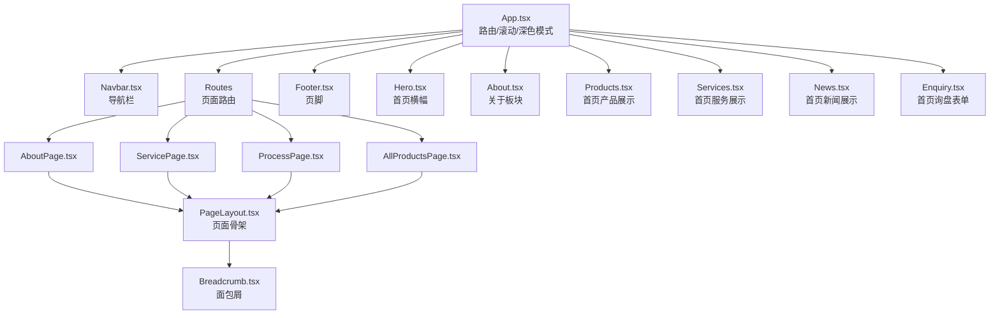
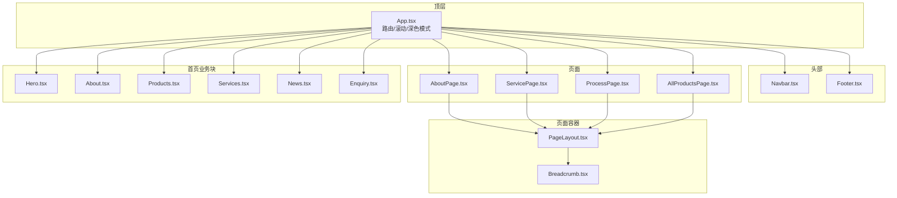
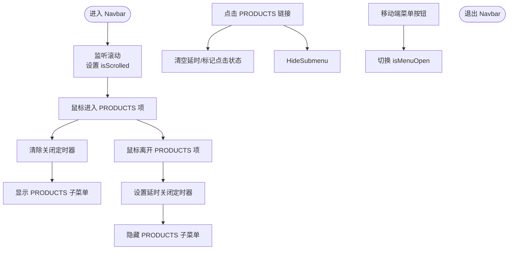
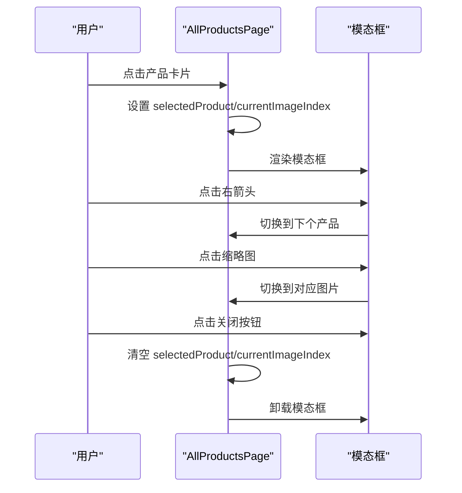
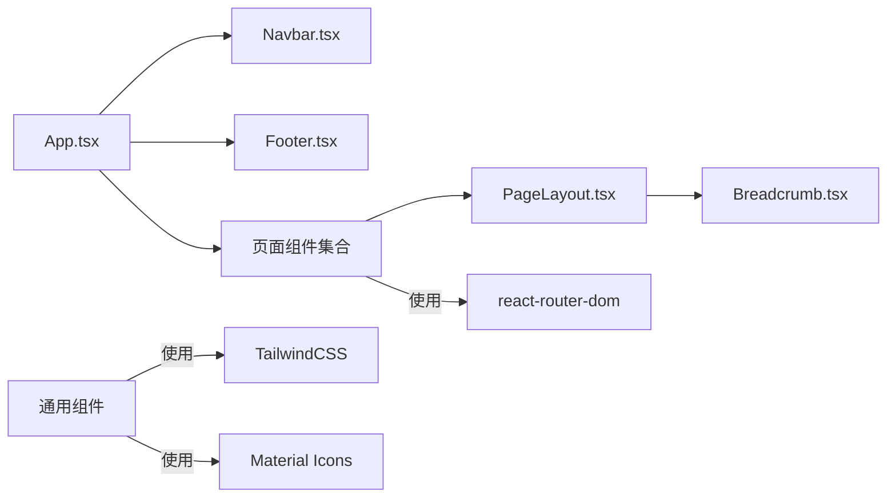

# 组件系统

<cite>
**本文引用的文件**
- [App.tsx](file://App.tsx)
- [components/shared/PageLayout.tsx](file://components/shared/PageLayout.tsx)
- [components/shared/Breadcrumb.tsx](file://components/shared/Breadcrumb.tsx)
- [components/Navbar.tsx](file://components/Navbar.tsx)
- [components/pages/AboutPage.tsx](file://components/pages/AboutPage.tsx)
- [components/pages/AllProductsPage.tsx](file://components/pages/AllProductsPage.tsx)
- [components/pages/ProcessPage.tsx](file://components/pages/ProcessPage.tsx)
- [components/pages/ServicePage.tsx](file://components/pages/ServicePage.tsx)
- [components/Footer.tsx](file://components/Footer.tsx)
- [components/Hero.tsx](file://components/Hero.tsx)
- [components/About.tsx](file://components/About.tsx)
- [components/Products.tsx](file://components/Products.tsx)
- [components/Services.tsx](file://components/Services.tsx)
- [components/News.tsx](file://components/News.tsx)
- [components/Enquiry.tsx](file://components/Enquiry.tsx)
- [constants.tsx](file://constants.tsx)
</cite>

## 目录
1. [简介](#简介)
2. [项目结构](#项目结构)
3. [核心组件](#核心组件)
4. [架构总览](#架构总览)
5. [详细组件分析](#详细组件分析)
6. [依赖关系分析](#依赖关系分析)
7. [性能考量](#性能考量)
8. [故障排查指南](#故障排查指南)
9. [结论](#结论)
10. [附录](#附录)

## 简介
本文件面向威宇精密工程网站的组件系统，系统采用 React + TypeScript 构建，结合 TailwindCSS 实现响应式与深色模式支持。组件体系分为共享组件（如 PageLayout、Breadcrumb）与页面级组件（如 AboutPage、AllProductsPage），并通过路由与全局状态实现统一布局与导航交互。

## 项目结构
- 应用入口与全局状态：App.tsx 提供路由、滚动归位、深色模式切换与全局动画样式注入。
- 共享组件：components/shared 下的 PageLayout 与 Breadcrumb 提供页面骨架与面包屑导航。
- 页面组件：components/pages 下的 AboutPage、ServicePage、ProcessPage、AllProductsPage 等承载具体业务内容。
- 通用业务组件：Navbar、Hero、About、Products、Services、News、Enquiry、Footer 等。
- 数据常量：constants.tsx 提供新闻、服务、产品数据。
- 类型定义：types.ts（未在本文档直接分析，但被各组件引用）。

图表来源
- [App.tsx](file://App.tsx#L41-L109)
- [components/Navbar.tsx](file://components/Navbar.tsx#L6-L260)
- [components/shared/PageLayout.tsx](file://components/shared/PageLayout.tsx#L16-L41)
- [components/shared/Breadcrumb.tsx](file://components/shared/Breadcrumb.tsx#L13-L51)
- [components/pages/AboutPage.tsx](file://components/pages/AboutPage.tsx#L4-L144)
- [components/pages/ServicePage.tsx](file://components/pages/ServicePage.tsx#L4-L182)
- [components/pages/ProcessPage.tsx](file://components/pages/ProcessPage.tsx#L4-L297)
- [components/pages/AllProductsPage.tsx](file://components/pages/AllProductsPage.tsx#L9-L281)
- [components/Footer.tsx](file://components/Footer.tsx#L4-L22)
- [components/Hero.tsx](file://components/Hero.tsx#L4-L132)
- [components/About.tsx](file://components/About.tsx#L4-L73)
- [components/Products.tsx](file://components/Products.tsx#L8-L310)
- [components/Services.tsx](file://components/Services.tsx#L5-L56)
- [components/News.tsx](file://components/News.tsx#L5-L58)
- [components/Enquiry.tsx](file://components/Enquiry.tsx#L4-L279)

章节来源
- [App.tsx](file://App.tsx#L17-L109)
- [components/shared/PageLayout.tsx](file://components/shared/PageLayout.tsx#L16-L41)
- [components/shared/Breadcrumb.tsx](file://components/shared/Breadcrumb.tsx#L13-L51)
- [components/Navbar.tsx](file://components/Navbar.tsx#L6-L260)
- [components/pages/AboutPage.tsx](file://components/pages/AboutPage.tsx#L4-L144)
- [components/pages/AllProductsPage.tsx](file://components/pages/AllProductsPage.tsx#L9-L281)
- [components/pages/ProcessPage.tsx](file://components/pages/ProcessPage.tsx#L4-L297)
- [components/pages/ServicePage.tsx](file://components/pages/ServicePage.tsx#L4-L182)
- [components/Footer.tsx](file://components/Footer.tsx#L4-L22)
- [components/Hero.tsx](file://components/Hero.tsx#L4-L132)
- [components/About.tsx](file://components/About.tsx#L4-L73)
- [components/Products.tsx](file://components/Products.tsx#L8-L310)
- [components/Services.tsx](file://components/Services.tsx#L5-L56)
- [components/News.tsx](file://components/News.tsx#L5-L58)
- [components/Enquiry.tsx](file://components/Enquiry.tsx#L4-L279)
- [constants.tsx](file://constants.tsx#L4-L167)

## 核心组件
- PageLayout：为页面提供统一标题区、副标题区、面包屑与内容区域，并内置进入动画。
- Breadcrumb：根据传入的面包屑条目生成导航链路，首页直达与当前页高亮。
- Navbar：响应式导航，含桌面端悬浮菜单与移动端抽屉菜单，支持 PRODUCTS 子菜单与滚动样式变化。
- 深色模式：通过根节点类名切换实现，配合全局动画样式注入。

章节来源
- [components/shared/PageLayout.tsx](file://components/shared/PageLayout.tsx#L16-L41)
- [components/shared/Breadcrumb.tsx](file://components/shared/Breadcrumb.tsx#L13-L51)
- [components/Navbar.tsx](file://components/Navbar.tsx#L6-L260)
- [App.tsx](file://App.tsx#L42-L105)

## 架构总览
应用采用“页面容器 + 共享布局 + 业务组件”的分层结构。页面组件通过 PageLayout 包裹，内部使用 Breadcrumb 生成路径导航；全局路由在 App 中配置，Navbar 在顶部贯穿所有页面；Footer 固定在底部。深色模式状态由 App 管理并通过 DOM 类名驱动样式切换。

图表来源
- [App.tsx](file://App.tsx#L41-L109)
- [components/Navbar.tsx](file://components/Navbar.tsx#L6-L260)
- [components/shared/PageLayout.tsx](file://components/shared/PageLayout.tsx#L16-L41)
- [components/shared/Breadcrumb.tsx](file://components/shared/Breadcrumb.tsx#L13-L51)
- [components/pages/AboutPage.tsx](file://components/pages/AboutPage.tsx#L4-L144)
- [components/pages/ServicePage.tsx](file://components/pages/ServicePage.tsx#L4-L182)
- [components/pages/ProcessPage.tsx](file://components/pages/ProcessPage.tsx#L4-L297)
- [components/pages/AllProductsPage.tsx](file://components/pages/AllProductsPage.tsx#L9-L281)
- [components/Footer.tsx](file://components/Footer.tsx#L4-L22)
- [components/Hero.tsx](file://components/Hero.tsx#L4-L132)
- [components/About.tsx](file://components/About.tsx#L4-L73)
- [components/Products.tsx](file://components/Products.tsx#L8-L310)
- [components/Services.tsx](file://components/Services.tsx#L5-L56)
- [components/News.tsx](file://components/News.tsx#L5-L58)
- [components/Enquiry.tsx](file://components/Enquiry.tsx#L4-L279)

## 详细组件分析

### PageLayout 组件
- 功能：统一页面骨架，渲染标题、副标题、面包屑与内容区域，内置进入动画。
- 关键属性：
  - title：主标题
  - subtitle：副标题（可选）
  - breadcrumbs：面包屑数组（包含 label 与可选 path）
  - children：页面内容
- 使用方式：页面组件以 PageLayout 包裹，传入对应标题、副标题与面包屑数据。
- 与 Breadcrumb 的协作：PageLayout 内部直接渲染 Breadcrumb 并传递 items。

章节来源
- [components/shared/PageLayout.tsx](file://components/shared/PageLayout.tsx#L16-L41)
- [components/shared/Breadcrumb.tsx](file://components/shared/Breadcrumb.tsx#L13-L51)

### Breadcrumb 组件
- 功能：根据传入的条目数组生成面包屑导航，首页直达、当前页高亮。
- 关键属性：
  - items：数组，每个元素包含 label 与可选 path
- 行为：首页链接点击触发页面滚动至顶部；非末尾项可点击跳转；末尾项以强调文本显示。
- 无障碍：使用语义化 ol/li 结构，链接具备 title 与可访问标签。

章节来源
- [components/shared/Breadcrumb.tsx](file://components/shared/Breadcrumb.tsx#L13-L51)

### Navbar 组件
- 功能：响应式导航栏，支持桌面端悬浮子菜单与移动端抽屉菜单，滚动时样式变化。
- 关键交互：
  - 桌面端 PRODUCTS 项悬停展开子菜单，离开延时关闭；点击 PRODUCTS 链接后清空延时并重置状态。
  - 移动端点击菜单按钮切换抽屉； PRODUCTS 子菜单支持折叠/展开与点击跳转。
  - 滚动超过阈值时改变高度与阴影，增强视觉反馈。
- 状态管理：
  - isScrolled：滚动状态
  - isMenuOpen：移动端菜单开关
  - showProductsSubmenu： PRODUCTS 子菜单显隐
  - clickedSubmenu：是否通过点击 PRODUCTS 触发
  - closeTimer：延时关闭定时器（清理时机在卸载与状态变更时）
- 事件处理：鼠标进入/离开、点击、滚动监听与清理。

图表来源
- [components/Navbar.tsx](file://components/Navbar.tsx#L13-L22)
- [components/Navbar.tsx](file://components/Navbar.tsx#L53-L72)
- [components/Navbar.tsx](file://components/Navbar.tsx#L116-L131)
- [components/Navbar.tsx](file://components/Navbar.tsx#L168-L254)

章节来源
- [components/Navbar.tsx](file://components/Navbar.tsx#L6-L260)

### AboutPage 页面
- 功能：公司介绍页面，使用 PageLayout 包裹，展示公司简介、统计数据、核心价值与认证信息。
- 与 PageLayout 协作：传入标题、副标题与面包屑，内部渲染多段落内容与统计卡片。
- 设计要点：网格布局、卡片悬停效果、图标与强调色搭配。

章节来源
- [components/pages/AboutPage.tsx](file://components/pages/AboutPage.tsx#L4-L144)
- [components/shared/PageLayout.tsx](file://components/shared/PageLayout.tsx#L16-L41)

### ServicePage 页面
- 功能：服务介绍页面，使用 PageLayout 包裹，展示服务列表、特性与为什么选择我们等内容。
- 与 PageLayout 协作：传入标题、副标题与面包屑，内部渲染服务卡片与优势展示。

章节来源
- [components/pages/ServicePage.tsx](file://components/pages/ServicePage.tsx#L4-L182)
- [components/shared/PageLayout.tsx](file://components/shared/PageLayout.tsx#L16-L41)

### ProcessPage 页面
- 功能：制程流程页面，使用 PageLayout 包裹，展示生产步骤、制造能力、品质管控与设备信息。
- 与 PageLayout 协作：传入标题、副标题与面包屑，内部渲染流程卡片、能力矩阵与设备清单。

章节来源
- [components/pages/ProcessPage.tsx](file://components/pages/ProcessPage.tsx#L4-L297)
- [components/shared/PageLayout.tsx](file://components/shared/PageLayout.tsx#L16-L41)

### AllProductsPage 页面
- 功能：产品总览页面，支持分类筛选、产品卡片点击弹出详情模态框、图片画廊与前后切换。
- 关键状态：
  - activeCategory：当前分类（all/nameplate/cnc）
  - selectedProduct：当前选中产品
  - currentImageIndex：模态框内当前图片索引
- 路由参数：通过 URL 查询参数 category 控制分类；支持前后产品与图片切换。
- 交互细节：点击产品卡片打开模态框；点击模态框左右箭头或缩略图切换；点击外部或关闭按钮关闭。

图表来源
- [components/pages/AllProductsPage.tsx](file://components/pages/AllProductsPage.tsx#L48-L82)
- [components/pages/AllProductsPage.tsx](file://components/pages/AllProductsPage.tsx#L159-L275)

章节来源
- [components/pages/AllProductsPage.tsx](file://components/pages/AllProductsPage.tsx#L9-L281)

### Footer 组件
- 功能：固定在页面底部，展示地址、电话、传真与版权信息。
- 样式：使用强调色背景与边框，文字采用紧凑排版。

章节来源
- [components/Footer.tsx](file://components/Footer.tsx#L4-L22)

### Hero 组件
- 功能：首页横幅轮播，支持桌面端卡片导航与移动端圆点指示器。
- 状态：currentSlide 控制当前展示的横幅。
- 交互：点击卡片或圆点切换；图片加载失败回退占位图；部分图片应用灰度与镜像效果。
- 无障碍：移动端指示器提供 aria-label。

章节来源
- [components/Hero.tsx](file://components/Hero.tsx#L4-L132)

### About 组件
- 功能：首页“关于我们”区块，左侧图片网格，右侧内容与统计数据。
- 交互：点击“了解更多”按钮具备悬停放大与箭头动画。

章节来源
- [components/About.tsx](file://components/About.tsx#L4-L73)

### Products 组件
- 功能：首页产品展示，支持横向滚动与分类筛选，点击打开模态框查看产品详情与图片画廊。
- 状态：activeCategory、selectedProduct、currentImageIndex、scrollContainerRef。
- 交互：点击左右箭头滚动；点击产品卡片打开模态框；模态框内支持产品与图片切换。

章节来源
- [components/Products.tsx](file://components/Products.tsx#L8-L310)

### Services 组件
- 功能：首页服务展示，采用网格布局，突出主要服务与辅助服务卡片。
- 交互：悬停时卡片阴影与位移变化，增强可交互提示。

章节来源
- [components/Services.tsx](file://components/Services.tsx#L5-L56)

### News 组件
- 功能：首页最新动态，采用卡片网格布局，首张卡片强调并上浮。
- 交互：悬停时卡片上浮与阴影变化，次级卡片支持灰度到彩色过渡。

章节来源
- [components/News.tsx](file://components/News.tsx#L5-L58)

### Enquiry 组件
- 功能：首页询盘表单，左侧联系方式，右侧表单区域，包含必填字段与验证码区域。
- 交互：表单字段实时更新状态，提交时阻止默认行为并在控制台输出数据。

章节来源
- [components/Enquiry.tsx](file://components/Enquiry.tsx#L4-L279)

## 依赖关系分析
- 组件耦合：
  - PageLayout 依赖 Breadcrumb（内部渲染）
  - 页面组件（AboutPage/ServicePage/ProcessPage/AllProductsPage）依赖 PageLayout
  - App 作为顶层容器，依赖 Navbar、Footer 以及各页面组件
  - Products 与 AllProductsPage 在产品展示与模态框逻辑上存在相似性，但作用域不同（首页 vs 页面）
- 外部依赖：
  - react-router-dom：用于路由与导航（App、Breadcrumb、Navbar、页面组件）
  - TailwindCSS：样式与响应式布局（广泛使用）
  - Material Icons：图标库（大量使用）

图表来源
- [App.tsx](file://App.tsx#L3-L11)
- [components/shared/PageLayout.tsx](file://components/shared/PageLayout.tsx#L1-L1)
- [components/shared/Breadcrumb.tsx](file://components/shared/Breadcrumb.tsx#L1-L2)
- [components/Navbar.tsx](file://components/Navbar.tsx#L1-L4)
- [components/Footer.tsx](file://components/Footer.tsx#L1-L2)
- [components/Hero.tsx](file://components/Hero.tsx#L1-L2)
- [components/About.tsx](file://components/About.tsx#L1-L2)
- [components/Products.tsx](file://components/Products.tsx#L1-L4)
- [components/Services.tsx](file://components/Services.tsx#L1-L3)
- [components/News.tsx](file://components/News.tsx#L1-L3)
- [components/Enquiry.tsx](file://components/Enquiry.tsx#L1-L3)

章节来源
- [App.tsx](file://App.tsx#L3-L11)
- [components/shared/PageLayout.tsx](file://components/shared/PageLayout.tsx#L1-L1)
- [components/shared/Breadcrumb.tsx](file://components/shared/Breadcrumb.tsx#L1-L2)
- [components/Navbar.tsx](file://components/Navbar.tsx#L1-L4)
- [components/Footer.tsx](file://components/Footer.tsx#L1-L2)
- [components/Hero.tsx](file://components/Hero.tsx#L1-L2)
- [components/About.tsx](file://components/About.tsx#L1-L2)
- [components/Products.tsx](file://components/Products.tsx#L1-L4)
- [components/Services.tsx](file://components/Services.tsx#L1-L3)
- [components/News.tsx](file://components/News.tsx#L1-L3)
- [components/Enquiry.tsx](file://components/Enquiry.tsx#L1-L3)

## 性能考量
- 图片懒加载与错误回退：多处组件对图片加载失败进行回退处理，避免阻塞渲染。
- 滚动优化：首页产品模块使用平滑滚动容器与横向滚动，减少重排；模态框内滚动采用最大高度与隐藏滚动条策略。
- 动画与过渡：全局注入淡入动画与组件内 hover/scale 过渡，建议在低端设备上适度减少动画时长或数量。
- 路由与滚动：路由切换时自动滚动至顶部，避免重复滚动导致的视觉不一致。
- 深色模式：通过根节点类名切换，避免频繁重绘；建议在 SSR 场景预设主题以减少闪烁。

[本节为通用指导，无需列出章节来源]

## 故障排查指南
- 面包屑不跳转或高亮异常
  - 检查 Breadcrumb 的 items 数组是否正确传入，末项 label 是否缺失。
  - 确认 Link 组件的 to 与 path 是否匹配。
- 导航菜单无法展开或立即消失
  - 检查 PRODUCTS 子菜单的鼠标进入/离开事件绑定与延时关闭定时器是否正确清理。
  - 确认点击 PRODUCTS 链接后是否清空延时并重置状态。
- 产品模态框无法关闭或切换
  - 检查 selectedProduct 与 currentImageIndex 的状态更新逻辑。
  - 确认模态框外部点击与关闭按钮事件是否正确阻止冒泡。
- 深色模式无效
  - 检查 App 中深色模式状态变更是否正确添加/移除根节点类名。
- 图片加载失败
  - 检查 onError 回退逻辑与占位图 URL。

章节来源
- [components/shared/Breadcrumb.tsx](file://components/shared/Breadcrumb.tsx#L13-L51)
- [components/Navbar.tsx](file://components/Navbar.tsx#L53-L72)
- [components/Navbar.tsx](file://components/Navbar.tsx#L116-L131)
- [components/Navbar.tsx](file://components/Navbar.tsx#L168-L254)
- [components/pages/AllProductsPage.tsx](file://components/pages/AllProductsPage.tsx#L48-L82)
- [components/pages/AllProductsPage.tsx](file://components/pages/AllProductsPage.tsx#L159-L275)
- [App.tsx](file://App.tsx#L42-L54)

## 结论
该组件系统以 PageLayout 为核心页面骨架，结合 Breadcrumb 提供清晰的导航路径；Navbar 支持桌面与移动端的复杂交互；页面组件围绕业务场景进行封装，复用性强。整体采用函数式组件与 Hooks 管理状态，配合 TailwindCSS 实现响应式与主题切换。建议后续在大型页面引入虚拟滚动与图片懒加载策略以进一步优化性能。

[本节为总结性内容，无需列出章节来源]

## 附录

### 组件间通信与状态管理
- 全局状态：深色模式状态由 App 统一管理，通过根节点类名驱动样式。
- 页面内状态：PageLayout 仅负责布局与面包屑；页面组件自行管理业务状态（如产品筛选、模态框状态）。
- 路由状态：Breadcrumb 与 Navbar 通过 react-router-dom 的 Link/路由 API 实现导航；AllProductsPage 通过 URL 查询参数同步分类状态。

章节来源
- [App.tsx](file://App.tsx#L42-L54)
- [components/shared/PageLayout.tsx](file://components/shared/PageLayout.tsx#L16-L41)
- [components/shared/Breadcrumb.tsx](file://components/shared/Breadcrumb.tsx#L13-L51)
- [components/Navbar.tsx](file://components/Navbar.tsx#L6-L260)
- [components/pages/AllProductsPage.tsx](file://components/pages/AllProductsPage.tsx#L9-L281)

### 响应式设计与无障碍访问
- 响应式：组件普遍采用 Tailwind 的断点类，移动端与桌面端布局差异明显；Navbar 在 lg 断点以下切换为抽屉菜单。
- 无障碍：Breadcrumb 使用语义化列表结构；Hero 为移动端指示器提供 aria-label；导航链接具备 hover 状态与键盘可达性。

章节来源
- [components/Navbar.tsx](file://components/Navbar.tsx#L158-L165)
- [components/Hero.tsx](file://components/Hero.tsx#L110-L123)
- [components/shared/Breadcrumb.tsx](file://components/shared/Breadcrumb.tsx#L13-L51)

### 样式定制与主题支持
- 主题：深色模式通过根节点类名切换，影响全局背景、文字与组件边框颜色。
- 动画：全局注入淡入动画类，组件内部使用 hover/scale/transition 实现交互反馈。
- 自定义：建议通过 Tailwind 主题变量或 CSS 自定义属性扩展品牌色与间距。

章节来源
- [App.tsx](file://App.tsx#L42-L105)
- [components/shared/PageLayout.tsx](file://components/shared/PageLayout.tsx#L18-L39)

### 跨浏览器兼容性与性能优化
- 兼容性：使用现代浏览器特性（如 CSS Grid、Flexbox、Backdrop Filter），建议在旧版浏览器提供降级方案。
- 性能：图片回退、滚动容器、动画时长与数量控制；对大型列表考虑虚拟化与懒加载。

[本节为通用指导，无需列出章节来源]