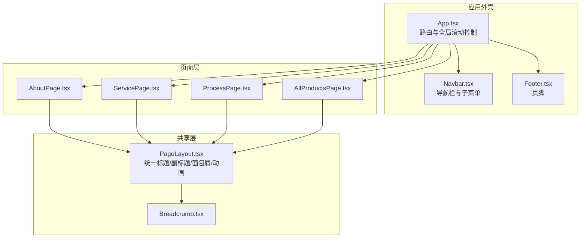
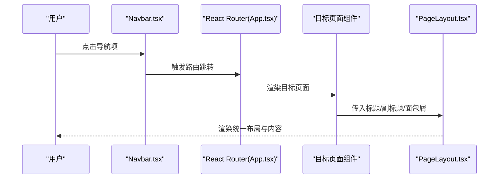
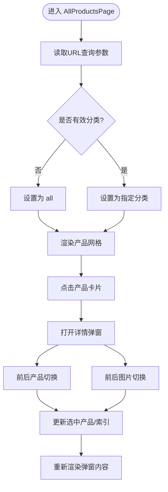
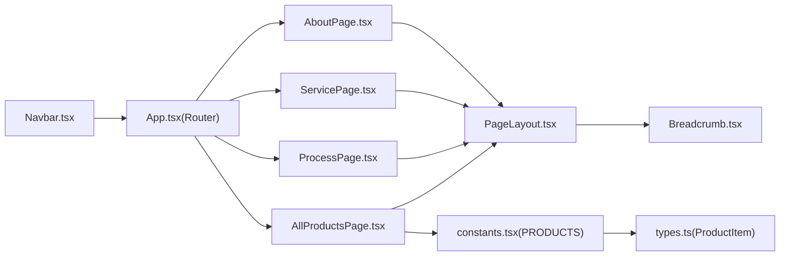

# 页面组件

<cite>
**本文引用的文件**
- [components/pages/AboutPage.tsx](file://components/pages/AboutPage.tsx)
- [components/pages/AllProductsPage.tsx](file://components/pages/AllProductsPage.tsx)
- [components/pages/ProcessPage.tsx](file://components/pages/ProcessPage.tsx)
- [components/pages/ServicePage.tsx](file://components/pages/ServicePage.tsx)
- [components/shared/PageLayout.tsx](file://components/shared/PageLayout.tsx)
- [components/shared/Breadcrumb.tsx](file://components/shared/Breadcrumb.tsx)
- [components/Navbar.tsx](file://components/Navbar.tsx)
- [App.tsx](file://App.tsx)
- [types.ts](file://types.ts)
- [constants.tsx](file://constants.tsx)
- [metadata.json](file://metadata.json)
</cite>

## 目录
1. [简介](#简介)
2. [项目结构](#项目结构)
3. [核心组件](#核心组件)
4. [架构总览](#架构总览)
5. [详细组件分析](#详细组件分析)
6. [依赖关系分析](#依赖关系分析)
7. [性能考量](#性能考量)
8. [故障排查指南](#故障排查指南)
9. [结论](#结论)
10. [附录](#附录)

## 简介
本文件针对威宇精密工程网站的四个页面级组件进行系统化技术文档梳理：AboutPage（关于页面）、AllProductsPage（产品总览页）、ProcessPage（制程页面）、ServicePage（服务页面）。文档覆盖以下维度：
- 页面布局与内容组织、导航集成
- 页面与共享组件的组合使用模式
- 数据获取与状态管理（含URL参数与路由）
- 生命周期管理、副作用处理与性能优化
- SEO、元数据与社交媒体集成建议
- 测试策略、错误边界与降级处理
- 页面级状态管理、数据预取与用户体验优化

## 项目结构
四个页面组件均位于 components/pages 下，采用“页面即组件”的结构；页面通过 PageLayout 统一布局，并由 Breadcrumb 提供面包屑导航。路由在 App 中集中配置，导航栏 Navbar 根据路由状态高亮当前菜单项。

图表来源
- [App.tsx](file://App.tsx#L41-L70)
- [components/Navbar.tsx](file://components/Navbar.tsx#L24-L36)
- [components/pages/AboutPage.tsx](file://components/pages/AboutPage.tsx#L1-L144)
- [components/pages/ServicePage.tsx](file://components/pages/ServicePage.tsx#L1-L182)
- [components/pages/ProcessPage.tsx](file://components/pages/ProcessPage.tsx#L1-L297)
- [components/pages/AllProductsPage.tsx](file://components/pages/AllProductsPage.tsx#L1-L281)
- [components/shared/PageLayout.tsx](file://components/shared/PageLayout.tsx#L1-L41)
- [components/shared/Breadcrumb.tsx](file://components/shared/Breadcrumb.tsx#L1-L51)

章节来源
- [App.tsx](file://App.tsx#L41-L70)
- [components/Navbar.tsx](file://components/Navbar.tsx#L24-L36)
- [components/shared/PageLayout.tsx](file://components/shared/PageLayout.tsx#L16-L38)

## 核心组件
- AboutPage：公司介绍、统计信息、核心价值、认证资质等模块化内容展示。
- AllProductsPage：产品列表筛选（URL查询参数）、产品详情弹窗、图片画廊、前后切换。
- ProcessPage：生产流程步骤、制造能力、品质管控、设备介绍与行动号召。
- ServicePage：服务类别与特性、为什么选择我们、行动号召。
- PageLayout：统一页头标题、副标题、面包屑与动画过渡。
- Breadcrumb：通用面包屑导航，支持首页与当前页高亮。

章节来源
- [components/pages/AboutPage.tsx](file://components/pages/AboutPage.tsx#L4-L141)
- [components/pages/AllProductsPage.tsx](file://components/pages/AllProductsPage.tsx#L9-L278)
- [components/pages/ProcessPage.tsx](file://components/pages/ProcessPage.tsx#L4-L294)
- [components/pages/ServicePage.tsx](file://components/pages/ServicePage.tsx#L4-L179)
- [components/shared/PageLayout.tsx](file://components/shared/PageLayout.tsx#L16-L38)
- [components/shared/Breadcrumb.tsx](file://components/shared/Breadcrumb.tsx#L13-L47)

## 架构总览
页面组件均以函数式组件形式实现，复用 PageLayout 进行统一布局，内部通过语义化区块组织内容。路由采用 React Router，在 App 中集中声明各页面路径。导航栏 Navbar 根据当前路径高亮菜单项，并在 PRODUCTS 菜单项下提供子菜单，支持按分类跳转至产品页。

图表来源
- [App.tsx](file://App.tsx#L63-L69)
- [components/Navbar.tsx](file://components/Navbar.tsx#L24-L36)
- [components/shared/PageLayout.tsx](file://components/shared/PageLayout.tsx#L16-L38)

## 详细组件分析

### AboutPage（关于页面）
- 布局与内容组织
  - 使用 PageLayout 包裹，标题与副标题来自 props，面包屑仅显示当前页。
  - 内容分为：公司简介（图文网格）、统计信息（背景色块）、核心价值（三列卡片）、认证与资质（图标+要点）。
- 导航集成
  - 导航栏中 ABOUT US 关键词对应 /about 路由。
- 数据与状态
  - 无外部数据请求，纯静态内容渲染。
- 性能与体验
  - 图片懒加载未启用，建议在长列表或移动端场景引入懒加载与占位图。
- SEO 与元数据
  - 页面标题与副标题用于 SEO，建议在页面级注入 meta 标签（见附录）。

章节来源
- [components/pages/AboutPage.tsx](file://components/pages/AboutPage.tsx#L4-L141)
- [components/shared/PageLayout.tsx](file://components/shared/PageLayout.tsx#L16-L38)
- [components/Navbar.tsx](file://components/Navbar.tsx#L24-L26)

### AllProductsPage（产品总览页）
- 布局与内容组织
  - 标题区包含“Craftsmanship”装饰与分类筛选按钮组。
  - 产品网格采用响应式栅格，每个产品卡片包含图片与标签，点击打开详情弹窗。
  - 弹窗内含主图、缩略图画廊、前后产品切换、前后图片切换。
- 数据与状态
  - 使用 URL 查询参数读取分类（category），默认 all。
  - 使用本地状态维护当前选中产品、当前图片索引、活动分类。
  - 产品数据来源于常量 PRODUCTS。
- 路由与URL映射
  - 支持 /products 与 /products?category=nameplate 或 /products?category=cnc。
  - 分类变更通过 setSearchParams 更新 URL，保持可分享性。
- 生命周期与副作用
  - 通过 useEffect 监听 searchParams，初始化活动分类。
  - 图片加载失败时回退到占位图。
- 性能与体验
  - 图片加载失败回退策略减少白屏风险。
  - 弹窗使用事件冒泡阻止，避免误触关闭。
  - 建议对图片进行懒加载与尺寸优化，减少首屏压力。

图表来源
- [components/pages/AllProductsPage.tsx](file://components/pages/AllProductsPage.tsx#L10-L82)
- [constants.tsx](file://constants.tsx#L50-L166)

章节来源
- [components/pages/AllProductsPage.tsx](file://components/pages/AllProductsPage.tsx#L9-L278)
- [constants.tsx](file://constants.tsx#L50-L166)
- [types.ts](file://types.ts#L10-L21)

### ProcessPage（制程页面）
- 布局与内容组织
  - 介绍段落、生产流程步骤（网格卡片）、制造能力（图标+列表）、品质管控（三列卡片）、设备介绍（要点列表）、行动号召。
- 导航集成
  - 导航栏 PROCESS 对应 /process 路由。
- 数据与状态
  - 无外部数据请求，纯静态内容渲染。
- 性能与体验
  - 卡片 hover 动画增强交互体验，建议在低端设备上适度降低动画强度。

章节来源
- [components/pages/ProcessPage.tsx](file://components/pages/ProcessPage.tsx#L4-L294)
- [components/Navbar.tsx](file://components/Navbar.tsx#L24-L28)

### ServicePage（服务页面）
- 布局与内容组织
  - 介绍段落、服务网格（图标+标题+描述+特性列表）、为什么选择我们（四列图标+文案）、行动号召。
- 导航集成
  - 导航栏 SERVICE 对应 /service 路由。
- 数据与状态
  - 无外部数据请求，纯静态内容渲染。
- 性能与体验
  - 卡片 hover 动画与缩放提升视觉反馈。

章节来源
- [components/pages/ServicePage.tsx](file://components/pages/ServicePage.tsx#L4-L179)
- [components/Navbar.tsx](file://components/Navbar.tsx#L24-L27)

### PageLayout 与 Breadcrumb（共享组件）
- PageLayout
  - 接收 title、subtitle、breadcrumbs、children，统一渲染页头与动画过渡容器。
- Breadcrumb
  - 渲染面包屑导航，首页固定链接，当前页最后一项高亮不可点击。

章节来源
- [components/shared/PageLayout.tsx](file://components/shared/PageLayout.tsx#L16-L38)
- [components/shared/Breadcrumb.tsx](file://components/shared/Breadcrumb.tsx#L13-L47)

## 依赖关系分析
- 页面组件依赖 PageLayout，PageLayout 依赖 Breadcrumb。
- AllProductsPage 依赖常量 PRODUCTS 与类型 ProductItem。
- 路由与导航：App 负责路由注册，Navbar 根据当前路径高亮菜单项并触发跳转。

图表来源
- [components/pages/AboutPage.tsx](file://components/pages/AboutPage.tsx#L1-L2)
- [components/pages/ServicePage.tsx](file://components/pages/ServicePage.tsx#L1-L2)
- [components/pages/ProcessPage.tsx](file://components/pages/ProcessPage.tsx#L1-L2)
- [components/pages/AllProductsPage.tsx](file://components/pages/AllProductsPage.tsx#L1-L5)
- [components/shared/PageLayout.tsx](file://components/shared/PageLayout.tsx#L1-L3)
- [components/shared/Breadcrumb.tsx](file://components/shared/Breadcrumb.tsx#L1-L2)
- [constants.tsx](file://constants.tsx#L2-L2)
- [types.ts](file://types.ts#L10-L21)
- [App.tsx](file://App.tsx#L63-L69)
- [components/Navbar.tsx](file://components/Navbar.tsx#L24-L36)

章节来源
- [components/pages/AllProductsPage.tsx](file://components/pages/AllProductsPage.tsx#L1-L5)
- [constants.tsx](file://constants.tsx#L2-L2)
- [types.ts](file://types.ts#L10-L21)
- [App.tsx](file://App.tsx#L63-L69)
- [components/Navbar.tsx](file://components/Navbar.tsx#L24-L36)

## 性能考量
- 图片优化
  - 建议对产品图片进行懒加载与尺寸裁剪，减少首屏带宽占用。
  - 图片加载失败回退策略已在 AllProductsPage 实现，建议扩展到 AboutPage 的工厂图片。
- 动画与交互
  - PageLayout 与各卡片的动画在低端设备上可能造成卡顿，建议在媒体查询中降级。
- 路由与滚动
  - App 中已实现路由切换滚动到顶部，避免页面跳转后位置错乱。
- 状态管理
  - AllProductsPage 使用本地状态管理弹窗与图片索引，复杂度低，无需引入全局状态库。
- 预取与缓存
  - 当前为静态数据，无需预取；若后续接入 API，建议在路由守卫或页面入口处进行预取与缓存。

[本节为通用性能建议，不直接分析具体文件]

## 故障排查指南
- 路由跳转无效
  - 检查 App 中路由路径与 Navbar 导航项 href 是否一致。
- 分类筛选无效
  - 检查 URL 查询参数是否正确写入，确认 activeCategory 初始化逻辑。
- 产品弹窗无法关闭
  - 检查事件冒泡阻止与点击区域，确保遮罩层与关闭按钮事件绑定正确。
- 图片加载失败
  - 确认回退占位图 URL 与错误处理逻辑生效。
- 面包屑高亮异常
  - 检查 Breadcrumb 的 items 数组与当前页面路径匹配情况。

章节来源
- [App.tsx](file://App.tsx#L63-L69)
- [components/Navbar.tsx](file://components/Navbar.tsx#L24-L36)
- [components/pages/AllProductsPage.tsx](file://components/pages/AllProductsPage.tsx#L131-L134)
- [components/shared/Breadcrumb.tsx](file://components/shared/Breadcrumb.tsx#L13-L47)

## 结论
四个页面组件遵循统一的 PageLayout 设计，内容结构清晰、导航集成良好。AllProductsPage 在交互与状态管理上较为复杂，但通过本地状态与 URL 参数实现了良好的可分享性与可用性。建议在后续迭代中加强图片优化、动画降级与 SEO 元数据注入，以进一步提升性能与搜索引擎可见性。

[本节为总结性内容，不直接分析具体文件]

## 附录

### 页面级路由与参数传递
- 路由映射
  - /about → AboutPage
  - /service → ServicePage
  - /process → ProcessPage
  - /products → AllProductsPage（支持 ?category=nameplate 或 ?category=cnc）
- 参数传递
  - AllProductsPage 使用 useSearchParams 读取 category，通过 setSearchParams 更新 URL。

章节来源
- [App.tsx](file://App.tsx#L63-L69)
- [components/pages/AllProductsPage.tsx](file://components/pages/AllProductsPage.tsx#L10-L42)
- [components/Navbar.tsx](file://components/Navbar.tsx#L32-L36)

### SEO 优化与元数据管理
- 建议在页面组件中注入页面级 meta 标签（标题、描述、关键词），以提升搜索引擎可见性。
- 可参考站点元数据文件中的描述字段作为页面描述的参考来源。

章节来源
- [metadata.json](file://metadata.json#L1-L5)

### 社交媒体集成方案
- 建议在页面底部或联系区域添加社交分享按钮（如 Facebook、LinkedIn），并配置 Open Graph 元标签（标题、描述、图片）。
- 对于产品详情页，可为每个产品生成独立的 OG 图片与描述，提升分享效果。

[本节为通用建议，不直接分析具体文件]

### 测试策略、错误边界与降级处理
- 单元测试
  - 对页面组件的渲染逻辑、状态切换（如分类筛选、弹窗开关）进行断言。
- 集成测试
  - 路由跳转与面包屑高亮联动测试。
- 错误边界
  - 在 PageLayout 外层包裹错误边界组件，捕获子树渲染异常并降级显示。
- 降级处理
  - 图片加载失败回退占位图；网络异常时显示“加载失败”提示并提供重试按钮。

章节来源
- [components/pages/AllProductsPage.tsx](file://components/pages/AllProductsPage.tsx#L131-L134)

### 页面级状态管理、数据预取与用户体验优化
- 状态管理
  - 采用 React 本地状态即可满足当前需求；若未来扩展为动态数据，建议引入轻量状态库或 Suspense 预取。
- 数据预取
  - 若接入 API，可在路由守卫或页面入口进行预取，结合缓存策略减少重复请求。
- 用户体验
  - 保持路由切换滚动到顶部；为关键交互增加加载指示；在移动端优化触摸目标大小与点击反馈。

章节来源
- [App.tsx](file://App.tsx#L30-L39)
- [components/pages/AllProductsPage.tsx](file://components/pages/AllProductsPage.tsx#L131-L134)