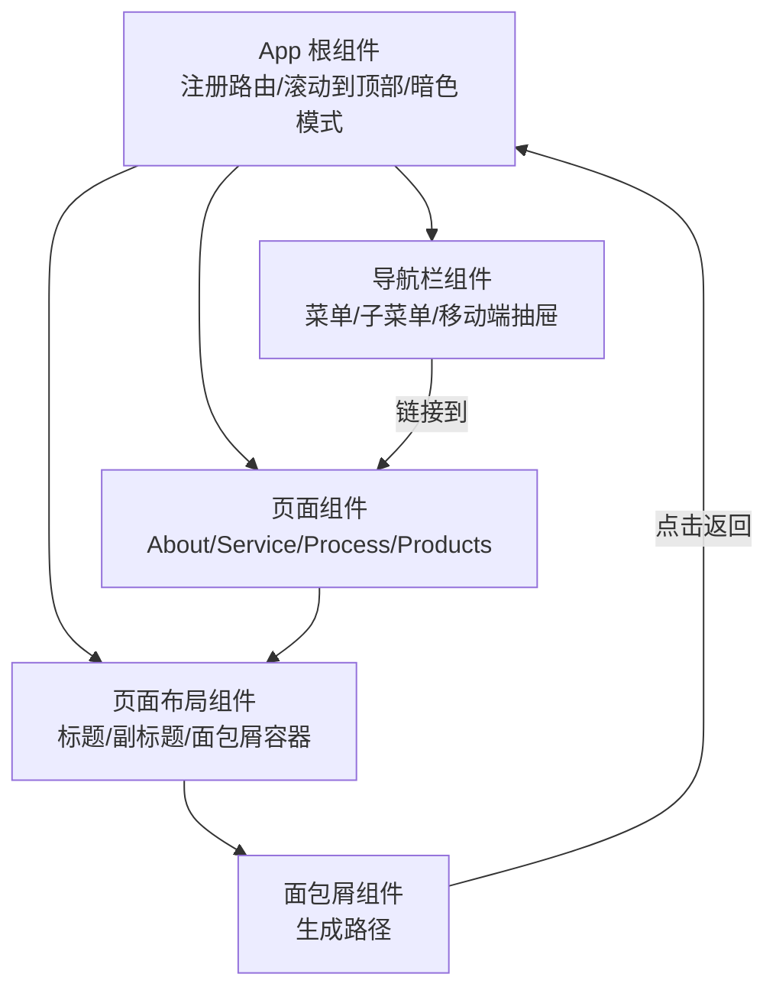
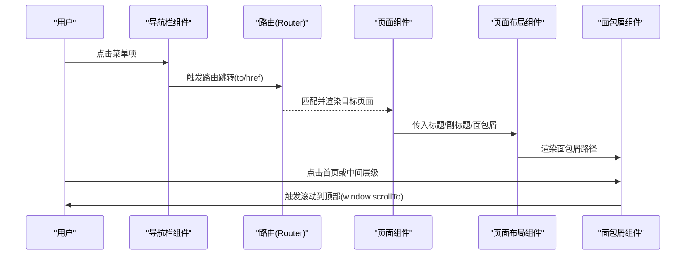
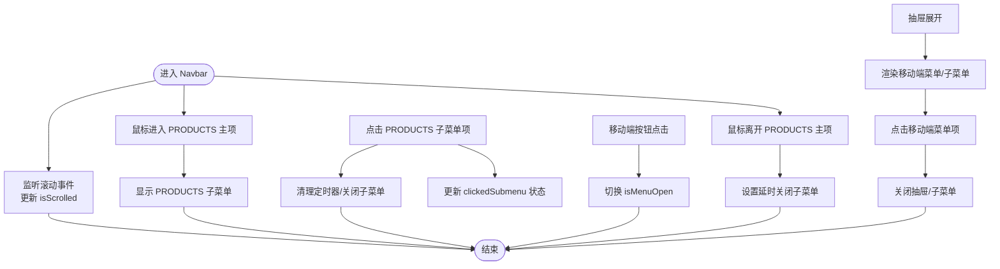
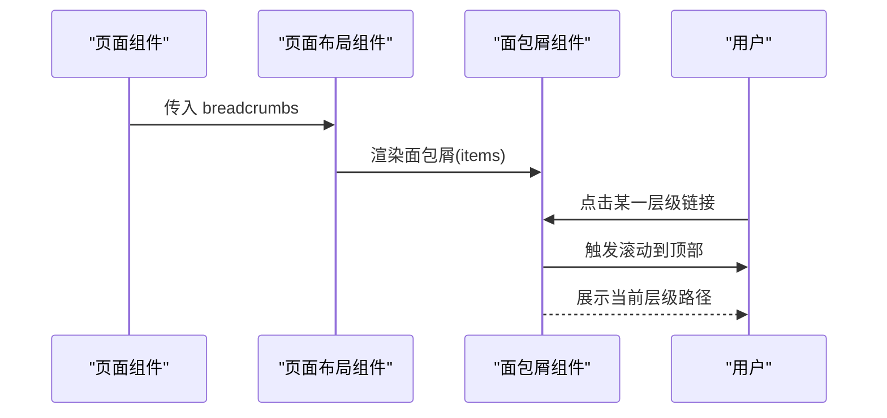
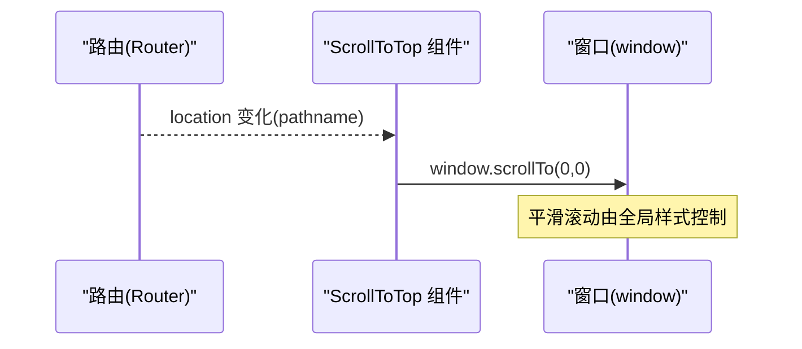
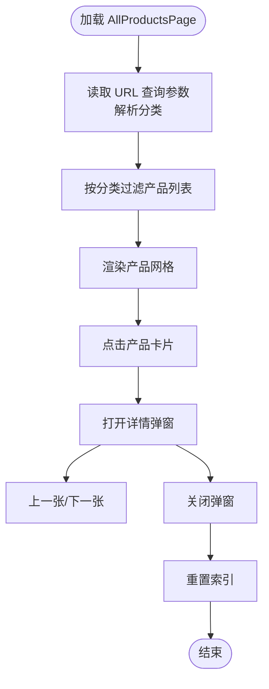
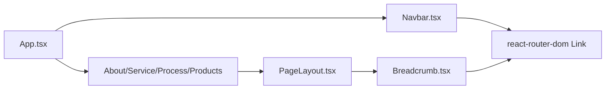

# 导航逻辑

<cite>
**本文引用的文件**
- [App.tsx](file://App.tsx)
- [Navbar.tsx](file://components/Navbar.tsx)
- [Breadcrumb.tsx](file://components/shared/Breadcrumb.tsx)
- [PageLayout.tsx](file://components/shared/PageLayout.tsx)
- [AboutPage.tsx](file://components/pages/AboutPage.tsx)
- [ServicePage.tsx](file://components/pages/ServicePage.tsx)
- [ProcessPage.tsx](file://components/pages/ProcessPage.tsx)
- [AllProductsPage.tsx](file://components/pages/AllProductsPage.tsx)
- [types.ts](file://types.ts)
- [constants.tsx](file://constants.tsx)
- [metadata.json](file://metadata.json)
</cite>

## 目录
1. [简介](#简介)
2. [项目结构](#项目结构)
3. [核心组件](#核心组件)
4. [架构总览](#架构总览)
5. [详细组件分析](#详细组件分析)
6. [依赖分析](#依赖分析)
7. [性能考虑](#性能考虑)
8. [故障排查指南](#故障排查指南)
9. [结论](#结论)
10. [附录：定制化与样式修改指南](#附录：定制化与样式修改指南)

## 简介
本文件系统性梳理威宇精密工程网站的导航逻辑，覆盖以下主题：
- 导航栏组件的实现：菜单项配置、活动状态管理、响应式交互（含桌面悬浮子菜单与移动端抽屉）。
- 面包屑导航的生成逻辑与页面层级维护。
- 滚动到顶部功能的实现机制与用户体验优化。
- 导航状态管理、路由监听与页面标题更新的实现方式。
- 导航组件的定制化选项与样式修改建议。

## 项目结构
该站点采用 React + Vite 架构，路由由 React Router 管理；导航相关代码集中在以下模块：
- 应用根组件负责路由注册、全局滚动行为与暗色模式切换。
- 导航栏组件负责菜单渲染、悬停/点击交互、移动端抽屉与子菜单。
- 页面布局组件负责统一标题、副标题与面包屑容器。
- 面包屑组件负责根据传入的层级项生成导航路径。
- 各页面组件负责声明自身面包屑项与页面内容。

图表来源
- [App.tsx](file://App.tsx#L56-L108)
- [Navbar.tsx](file://components/Navbar.tsx#L38-L256)
- [PageLayout.tsx](file://components/shared/PageLayout.tsx#L16-L38)
- [Breadcrumb.tsx](file://components/shared/Breadcrumb.tsx#L13-L47)

章节来源
- [App.tsx](file://App.tsx#L1-L112)
- [Navbar.tsx](file://components/Navbar.tsx#L1-L260)
- [PageLayout.tsx](file://components/shared/PageLayout.tsx#L1-L41)
- [Breadcrumb.tsx](file://components/shared/Breadcrumb.tsx#L1-L51)

## 核心组件
- 导航栏组件（Navbar）
  - 菜单项配置：包含“关于”“服务”“制程”“产品”“咨询”等入口。
  - 子菜单：产品下拉包含“全部”“铭板”“CNC阳极”三个子项。
  - 响应式交互：桌面端通过鼠标悬停触发子菜单；移动端以抽屉形式展示，支持展开/收起与子菜单跳转。
  - 活动状态管理：通过滚动高度切换导航样式；子菜单显隐受悬停与点击事件控制。
- 页面布局组件（PageLayout）
  - 接收标题、副标题与面包屑数组，统一渲染页面头部与内容区域。
- 面包屑组件（Breadcrumb）
  - 根据传入的层级项动态生成路径，首页始终可点击并触发滚动到顶部。
- 页面组件（About/Service/Process/Products）
  - 各自声明面包屑项，传递给 PageLayout 使用。

章节来源
- [Navbar.tsx](file://components/Navbar.tsx#L24-L36)
- [PageLayout.tsx](file://components/shared/PageLayout.tsx#L9-L14)
- [Breadcrumb.tsx](file://components/shared/Breadcrumb.tsx#L9-L11)
- [AboutPage.tsx](file://components/pages/AboutPage.tsx#L4-L7)
- [ServicePage.tsx](file://components/pages/ServicePage.tsx#L4-L7)
- [ProcessPage.tsx](file://components/pages/ProcessPage.tsx#L4-L7)
- [AllProductsPage.tsx](file://components/pages/AllProductsPage.tsx#L25-L27)

## 架构总览
应用通过根组件集中注册路由与全局行为，导航栏作为顶层 UI 组件贯穿各页面；页面布局与面包屑组件提供一致的层级导航体验；产品页通过 URL 查询参数实现分类筛选与详情弹窗。

图表来源
- [App.tsx](file://App.tsx#L56-L72)
- [Navbar.tsx](file://components/Navbar.tsx#L86-L113)
- [Breadcrumb.tsx](file://components/shared/Breadcrumb.tsx#L18-L24)

## 详细组件分析

### 导航栏组件（Navbar）
- 菜单项配置
  - 固定菜单项与对应路径：关于、服务、制程、产品、咨询。
  - 产品项带子菜单，支持按类别筛选。
- 子菜单逻辑
  - 桌面端：鼠标进入主菜单项时显示子菜单；离开时设置延时关闭，避免误触。
  - 移动端：点击主菜单项展开子菜单，支持直接跳转“查看所有产品”。
- 活动状态管理
  - 滚动超过阈值时改变导航栏样式（高度、阴影、背景模糊度），提升可视性。
  - 子菜单显隐与点击状态通过本地状态控制，并在切换时清理定时器，避免内存泄漏。
- 响应式实现
  - 桌面端：固定高度与悬浮阴影；移动端：抽屉菜单，按钮切换开合。
- 交互细节
  - 产品子菜单项点击后清除子菜单状态与定时器，确保状态一致性。
  - “ENQUIRY”使用锚点链接，点击不触发路由跳转，仅滚动到指定区域。

图表来源
- [Navbar.tsx](file://components/Navbar.tsx#L13-L22)
- [Navbar.tsx](file://components/Navbar.tsx#L53-L72)
- [Navbar.tsx](file://components/Navbar.tsx#L116-L131)
- [Navbar.tsx](file://components/Navbar.tsx#L168-L254)

章节来源
- [Navbar.tsx](file://components/Navbar.tsx#L6-L22)
- [Navbar.tsx](file://components/Navbar.tsx#L24-L36)
- [Navbar.tsx](file://components/Navbar.tsx#L116-L153)
- [Navbar.tsx](file://components/Navbar.tsx#L168-L254)

### 面包屑导航（Breadcrumb）
- 数据结构
  - 接收面包屑项数组，每个项包含标签与可选路径。
- 渲染规则
  - 首页始终可点击，点击后触发滚动到顶部。
  - 中间层级若存在路径则渲染为链接，否则仅显示文本。
  - 最末级始终以强调样式显示，表示当前页面。
- 与页面布局的关系
  - PageLayout 将页面声明的面包屑项传入 Breadcrumb，形成统一的层级导航。

图表来源
- [PageLayout.tsx](file://components/shared/PageLayout.tsx#L19-L19)
- [Breadcrumb.tsx](file://components/shared/Breadcrumb.tsx#L13-L47)

章节来源
- [Breadcrumb.tsx](file://components/shared/Breadcrumb.tsx#L4-L11)
- [Breadcrumb.tsx](file://components/shared/Breadcrumb.tsx#L13-L47)
- [PageLayout.tsx](file://components/shared/PageLayout.tsx#L16-L38)

### 页面布局与标题（PageLayout）
- 统一标题与副标题渲染，增强品牌一致性。
- 面包屑容器位于标题下方，保证层级导航清晰可见。
- 内容区域使用淡入动画，提升页面切换体验。

章节来源
- [PageLayout.tsx](file://components/shared/PageLayout.tsx#L16-L38)

### 页面级面包屑与路由联动（About/Service/Process/Products）
- 各页面组件声明自身面包屑项，如“关于”“服务”“制程”“产品”，用于构建路径。
- 产品页通过 URL 查询参数实现分类筛选，同时保持面包屑不变，维持层级关系稳定。

章节来源
- [AboutPage.tsx](file://components/pages/AboutPage.tsx#L4-L7)
- [ServicePage.tsx](file://components/pages/ServicePage.tsx#L4-L7)
- [ProcessPage.tsx](file://components/pages/ProcessPage.tsx#L4-L7)
- [AllProductsPage.tsx](file://components/pages/AllProductsPage.tsx#L25-L27)

### 滚动到顶部与路由监听（App）
- 路由监听
  - 通过路由钩子监听 location 变化，在每次路由切换时自动滚动到页面顶部。
- 全局滚动行为
  - 在全局样式中启用平滑滚动，提升浏览体验。
- 暗色模式
  - 提供浮动切换按钮，切换根元素的暗色类名，影响整体主题。

图表来源
- [App.tsx](file://App.tsx#L30-L39)
- [App.tsx](file://App.tsx#L88-L105)

章节来源
- [App.tsx](file://App.tsx#L30-L39)
- [App.tsx](file://App.tsx#L56-L72)
- [App.tsx](file://App.tsx#L88-L105)

### 产品页分类筛选与详情弹窗（AllProductsPage）
- 分类筛选
  - 通过 URL 查询参数读取当前分类，支持“全部”“铭板”“CNC阳极”三类。
  - 切换分类时更新查询参数，不影响面包屑层级。
- 详情弹窗
  - 点击产品卡片打开详情弹窗，支持左右导航与图片画廊。
  - 弹窗关闭时重置索引，避免状态残留。

图表来源
- [AllProductsPage.tsx](file://components/pages/AllProductsPage.tsx#L9-L23)
- [AllProductsPage.tsx](file://components/pages/AllProductsPage.tsx#L35-L42)
- [AllProductsPage.tsx](file://components/pages/AllProductsPage.tsx#L159-L275)

章节来源
- [AllProductsPage.tsx](file://components/pages/AllProductsPage.tsx#L1-L281)
- [constants.tsx](file://constants.tsx#L50-L166)
- [types.ts](file://types.ts#L10-L21)

## 依赖分析
- 组件耦合
  - App 作为根组件，依赖 Navbar、路由与页面组件。
  - PageLayout 依赖 Breadcrumb，向其传递面包屑数据。
  - 各页面组件依赖 PageLayout，向其传递标题、副标题与面包屑。
  - Navbar 依赖 Link 与本地状态，负责菜单与子菜单的交互。
- 外部依赖
  - React Router：负责路由注册与监听。
  - Tailwind 类名：主导航栏与页面布局的样式组织。
- 潜在循环依赖
  - 当前结构为单向依赖（App -> Navbar/页面），无循环依赖风险。

图表来源
- [App.tsx](file://App.tsx#L4-L15)
- [PageLayout.tsx](file://components/shared/PageLayout.tsx#L1-L2)
- [Breadcrumb.tsx](file://components/shared/Breadcrumb.tsx#L1-L2)
- [Navbar.tsx](file://components/Navbar.tsx#L3-L4)

章节来源
- [App.tsx](file://App.tsx#L1-L112)
- [PageLayout.tsx](file://components/shared/PageLayout.tsx#L1-L41)
- [Breadcrumb.tsx](file://components/shared/Breadcrumb.tsx#L1-L51)
- [Navbar.tsx](file://components/Navbar.tsx#L1-L260)

## 性能考虑
- 子菜单延时关闭
  - 通过定时器在鼠标离开时延时关闭子菜单，减少频繁显隐带来的重绘压力。
- 滚动监听清理
  - 在组件卸载时清理滚动监听与定时器，避免内存泄漏。
- 平滑滚动
  - 全局启用平滑滚动，减少页面跳转时的视觉突兀感。
- 图片加载降级
  - 产品页图片加载失败时使用占位图，避免空白与布局抖动。

章节来源
- [Navbar.tsx](file://components/Navbar.tsx#L13-L22)
- [AllProductsPage.tsx](file://components/pages/AllProductsPage.tsx#L131-L133)

## 故障排查指南
- 子菜单无法关闭或反复闪烁
  - 检查是否正确清理定时器；确认鼠标离开事件与延时关闭逻辑一致。
- 移动端抽屉无法关闭
  - 确认点击菜单项后调用了关闭抽屉逻辑；检查事件冒泡是否被阻止。
- 面包屑点击无效
  - 确认首页链接与点击回调已绑定；检查路由是否正确注册。
- 路由切换后未滚动到顶部
  - 检查路由监听组件是否挂载；确认 location 变化触发了滚动逻辑。
- 产品详情弹窗无法关闭
  - 确认点击遮罩层与关闭按钮均触发关闭逻辑；检查弹窗状态重置。

章节来源
- [Navbar.tsx](file://components/Navbar.tsx#L64-L72)
- [Breadcrumb.tsx](file://components/shared/Breadcrumb.tsx#L18-L24)
- [App.tsx](file://App.tsx#L30-L39)
- [AllProductsPage.tsx](file://components/pages/AllProductsPage.tsx#L169-L174)

## 结论
该导航体系通过“根组件路由监听 + 导航栏菜单交互 + 页面布局与面包屑”的组合，实现了清晰的层级导航与良好的响应式体验。产品页通过 URL 参数实现分类筛选，既保持了面包屑层级的稳定性，又增强了信息检索能力。建议在后续迭代中进一步抽象导航状态与路由监听逻辑，以提升可复用性与可测试性。

## 附录：定制化与样式修改指南
- 菜单项与子菜单
  - 在导航栏组件中添加/删除菜单项或调整子菜单项，需同步更新路由与页面组件。
  - 修改菜单项名称与路径时，确保与路由表一致。
- 面包屑层级
  - 在页面组件中调整面包屑数组，即可改变路径层级；注意末级项不应带有路径。
- 响应式样式
  - 桌面端与移动端样式通过断点类名控制；如需调整尺寸或间距，请在对应断点下修改类名。
- 暗色模式
  - 通过根元素类名切换影响全局主题；如需扩展主题变量，可在全局样式中新增。
- 产品分类
  - 新增产品分类时，需在页面组件中扩展分类枚举与过滤逻辑，并在常量中补充数据。
- 页面标题与副标题
  - 标题与副标题由页面布局组件统一渲染；如需调整排版或样式，可在布局组件内修改。

章节来源
- [Navbar.tsx](file://components/Navbar.tsx#L24-L36)
- [AllProductsPage.tsx](file://components/pages/AllProductsPage.tsx#L29-L42)
- [constants.tsx](file://constants.tsx#L50-L166)
- [PageLayout.tsx](file://components/shared/PageLayout.tsx#L16-L38)
- [App.tsx](file://App.tsx#L42-L54)