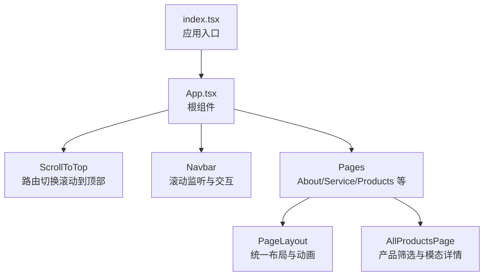
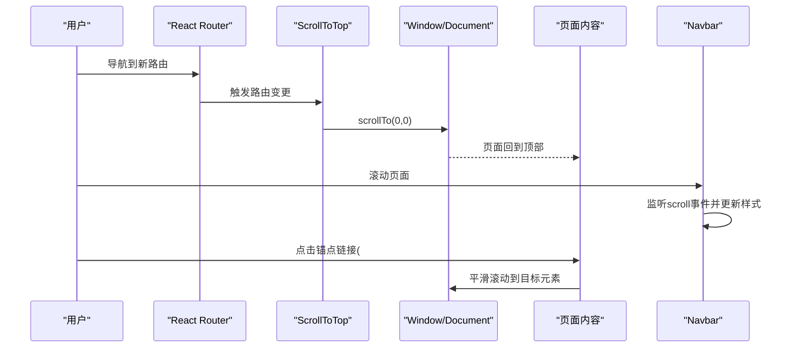
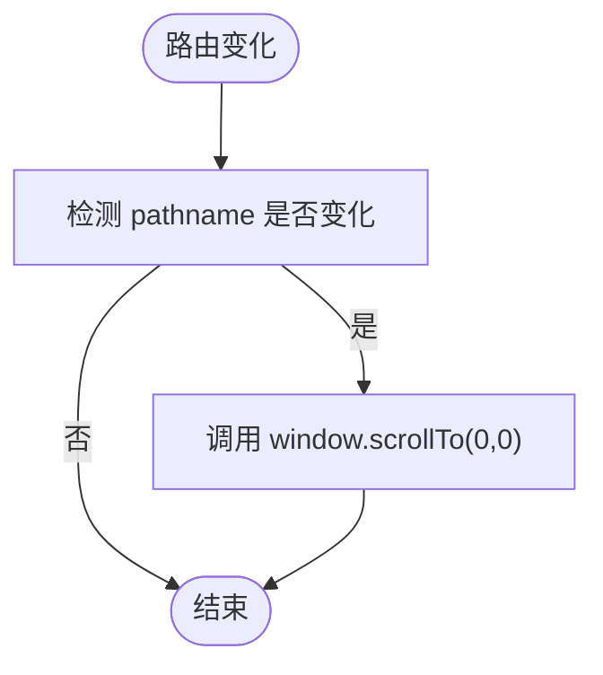
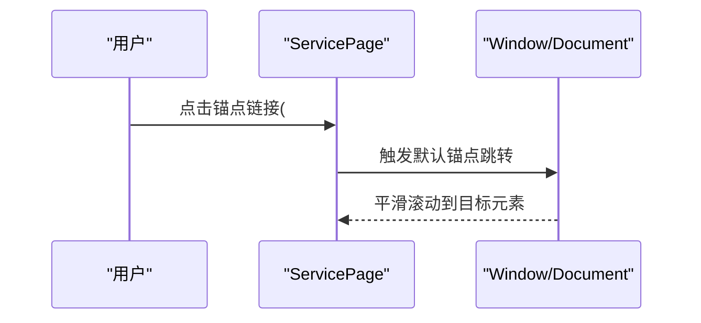
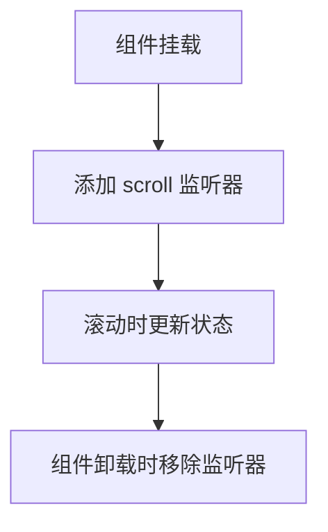
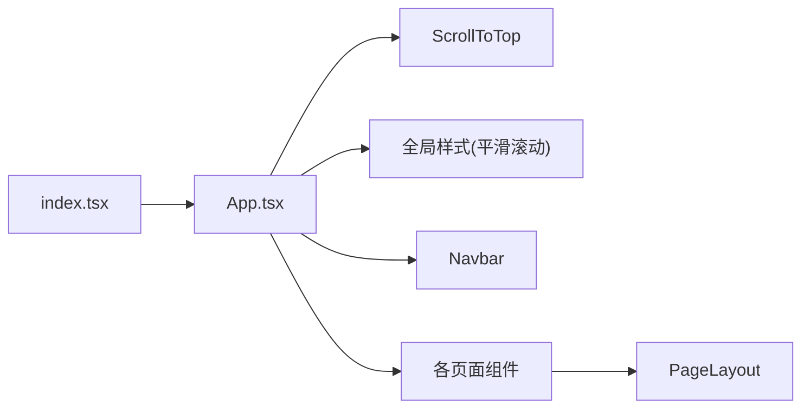

# 滚动行为

<cite>
**本文引用的文件**
- [App.tsx](file://App.tsx)
- [index.tsx](file://index.tsx)
- [Navbar.tsx](file://components/Navbar.tsx)
- [PageLayout.tsx](file://components/shared/PageLayout.tsx)
- [AboutPage.tsx](file://components/pages/AboutPage.tsx)
- [ServicePage.tsx](file://components/pages/ServicePage.tsx)
- [AllProductsPage.tsx](file://components/pages/AllProductsPage.tsx)
- [constants.tsx](file://constants.tsx)
- [types.ts](file://types.ts)
- [vite.config.ts](file://vite.config.ts)
- [package.json](file://package.json)
</cite>

## 目录
1. [引言](#引言)
2. [项目结构](#项目结构)
3. [核心组件](#核心组件)
4. [架构总览](#架构总览)
5. [详细组件分析](#详细组件分析)
6. [依赖关系分析](#依赖关系分析)
7. [性能考虑](#性能考虑)
8. [故障排查指南](#故障排查指南)
9. [结论](#结论)
10. [附录](#附录)

## 引言
本文件围绕威宇精密工程网站的滚动行为进行系统化梳理与说明，重点覆盖以下方面：
- ScrollToTop 组件的实现原理与路由切换时的滚动到顶部机制
- 页面内锚点链接导航与滚动事件监听的实现方案
- 平滑滚动的 CSS 与 JavaScript 控制方式
- 滚动位置记忆与页面定位功能的现状与改进建议
- 性能优化与用户体验提升策略

## 项目结构
该站点采用 React + Vite 架构，使用 React Router 进行前端路由。滚动行为主要由根组件中的 ScrollToTop 组件与全局 CSS 的平滑滚动设置共同实现；页面级内容通过 PageLayout 统一布局，部分页面（如服务页）包含锚点链接用于页面内定位。

图表来源
- [index.tsx](file://index.tsx#L1-L17)
- [App.tsx](file://App.tsx#L1-L112)
- [Navbar.tsx](file://components/Navbar.tsx#L1-L260)
- [PageLayout.tsx](file://components/shared/PageLayout.tsx#L1-L41)
- [AboutPage.tsx](file://components/pages/AboutPage.tsx#L1-L144)
- [ServicePage.tsx](file://components/pages/ServicePage.tsx#L1-L182)
- [AllProductsPage.tsx](file://components/pages/AllProductsPage.tsx#L1-L281)

章节来源
- [index.tsx](file://index.tsx#L1-L17)
- [App.tsx](file://App.tsx#L1-L112)

## 核心组件
- ScrollToTop：在路由变化时自动滚动到页面顶部，确保用户每次进入新页面都从顶部开始浏览。
- 全局平滑滚动：通过全局 CSS 将 html 的 scroll-behavior 设为 smooth，使浏览器默认滚动具备平滑效果。
- 页面内锚点：服务页中使用锚点链接快速定位至“立即咨询”区域，配合全局平滑滚动实现流畅跳转。
- 滚动事件监听：导航栏在滚动时动态改变样式，体现页面滚动状态，但未实现滚动位置记忆或锚点激活状态联动。

章节来源
- [App.tsx](file://App.tsx#L30-L39)
- [App.tsx](file://App.tsx#L88-L105)
- [ServicePage.tsx](file://components/pages/ServicePage.tsx#L168-L175)
- [Navbar.tsx](file://components/Navbar.tsx#L13-L22)

## 架构总览
下图展示滚动行为在应用中的整体流转：路由变化触发 ScrollToTop 执行滚动到顶部；用户点击锚点链接触发页面内定位；全局 CSS 提供平滑滚动基础能力；导航栏监听滚动事件以更新 UI 状态。

图表来源
- [App.tsx](file://App.tsx#L30-L39)
- [App.tsx](file://App.tsx#L88-L105)
- [ServicePage.tsx](file://components/pages/ServicePage.tsx#L168-L175)
- [Navbar.tsx](file://components/Navbar.tsx#L13-L22)

## 详细组件分析

### ScrollToTop 组件
- 实现原理
  - 使用 React Router 的 useLocation 获取当前路由信息
  - 在依赖数组中监听 pathname 变化，当路径变化时执行 window.scrollTo(0, 0)，将滚动条置顶
- 触发机制
  - 每次路由切换都会触发一次滚动到顶部，保证用户在不同页面间切换时的阅读起点一致
- 适用场景
  - 单页应用（SPA）中避免页面切换后仍停留在上一页的滚动位置
- 改进建议
  - 可增加条件判断，仅在跨页面切换时滚动到顶部，避免同页面内的路由参数变化导致不必要的滚动
  - 可结合浏览器历史记录或自定义滚动位置记忆，实现更精细的用户体验

图表来源
- [App.tsx](file://App.tsx#L30-L39)

章节来源
- [App.tsx](file://App.tsx#L30-L39)

### 全局平滑滚动
- CSS 实现
  - 在根组件中注入全局样式，将 html 的 scroll-behavior 设为 smooth，使浏览器默认滚动具备平滑动画
- JavaScript 控制
  - 当前代码未显式在 JS 中调用原生平滑滚动 API（如 element.scrollIntoView({ behavior: 'smooth' })）
  - 锚点链接的平滑跳转依赖于浏览器对锚点链接的默认行为与全局 CSS 的平滑滚动设置
- 适用场景
  - 页面内锚点跳转、路由切换后的滚动到顶部
- 改进建议
  - 对特定滚动场景（如点击导航项）可使用 JavaScript 显式调用平滑滚动 API，以便统一动画时长与缓动曲线
  - 可根据设备性能动态启用/禁用平滑滚动，避免低端设备卡顿

章节来源
- [App.tsx](file://App.tsx#L88-L105)

### 页面内锚点导航与定位
- 锚点链接
  - 服务页中存在锚点链接，指向页面内的某个区域（例如“立即咨询”区域），点击后通过浏览器默认行为跳转
- 定位实现
  - 由于全局设置了平滑滚动，跳转具备平滑动画
- 注意事项
  - 锚点目标元素需存在且可见，否则可能导致跳转无效
  - 若目标区域被动态内容遮挡或高度变化，可能影响定位准确性

图表来源
- [ServicePage.tsx](file://components/pages/ServicePage.tsx#L168-L175)
- [App.tsx](file://App.tsx#L88-L105)

章节来源
- [ServicePage.tsx](file://components/pages/ServicePage.tsx#L168-L175)

### 滚动事件监听与导航栏交互
- 滚动监听
  - 导航栏组件监听 window 的 scroll 事件，根据滚动距离动态切换样式类，实现吸顶与视觉反馈
- 事件清理
  - 在组件卸载时移除监听器，避免内存泄漏
- 与滚动行为的关系
  - 该监听主要用于 UI 交互提示，并不直接参与页面滚动到顶部或锚点定位逻辑

图表来源
- [Navbar.tsx](file://components/Navbar.tsx#L13-L22)

章节来源
- [Navbar.tsx](file://components/Navbar.tsx#L13-L22)

### 页面布局与滚动体验
- PageLayout
  - 统一页面标题、副标题与面包屑的布局容器，内部内容通过统一动画类实现入场动画
  - 与滚动行为无直接耦合，但良好的布局有助于提升滚动阅读体验
- 产品页（AllProductsPage）
  - 包含图片占位与错误回退处理，避免因图片加载失败导致的布局抖动
  - 模态详情中使用了自定义滚动条样式（隐藏滚动条），减少视觉干扰

章节来源
- [PageLayout.tsx](file://components/shared/PageLayout.tsx#L16-L39)
- [AllProductsPage.tsx](file://components/pages/AllProductsPage.tsx#L126-L134)
- [AllProductsPage.tsx](file://components/pages/AllProductsPage.tsx#L190-L228)

## 依赖关系分析
- 应用入口与根组件
  - index.tsx 负责挂载根组件 App.tsx
- 根组件与滚动
  - App.tsx 内部引入 ScrollToTop 与全局样式，负责路由切换时的滚动到顶部与平滑滚动的基础设置
- 页面与布局
  - 各页面组件通过 PageLayout 统一布局，部分页面包含锚点链接
- 交互与滚动
  - Navbar 监听滚动事件，更新 UI 状态，与滚动行为形成互补

图表来源
- [index.tsx](file://index.tsx#L1-L17)
- [App.tsx](file://App.tsx#L1-L112)
- [PageLayout.tsx](file://components/shared/PageLayout.tsx#L1-L41)
- [Navbar.tsx](file://components/Navbar.tsx#L1-L260)

章节来源
- [index.tsx](file://index.tsx#L1-L17)
- [App.tsx](file://App.tsx#L1-L112)

## 性能考虑
- 平滑滚动的开销
  - 全局平滑滚动会为所有滚动操作添加动画，低端设备可能产生卡顿
  - 建议在移动端或低性能设备上按需禁用或降低动画强度
- 事件监听的清理
  - 导航栏的滚动监听在卸载时正确移除，避免内存泄漏
- 图片与布局
  - 产品页对图片加载失败进行了占位处理，减少布局抖动带来的滚动体验问题

## 故障排查指南
- 路由切换后未滚动到顶部
  - 检查 ScrollToTop 是否正确渲染在根组件中
  - 确认依赖数组是否包含 pathname，确保路径变化时触发滚动
- 锚点链接无法跳转或跳转异常
  - 确认目标元素的 id 或 name 属性是否存在且拼写正确
  - 检查是否有动态内容遮挡目标区域
- 滚动监听无效
  - 确认组件挂载与卸载生命周期中监听器的添加与移除是否正确
- 平滑滚动不生效
  - 确认全局 CSS 中 html 的 scroll-behavior 已正确设置
  - 检查是否存在覆盖样式的规则

章节来源
- [App.tsx](file://App.tsx#L30-L39)
- [App.tsx](file://App.tsx#L88-L105)
- [Navbar.tsx](file://components/Navbar.tsx#L13-L22)
- [ServicePage.tsx](file://components/pages/ServicePage.tsx#L168-L175)

## 结论
当前实现通过 ScrollToTop 与全局平滑滚动设置，满足了路由切换时的滚动到顶部与页面内锚点跳转的基本需求。导航栏的滚动监听增强了交互体验，但尚未实现滚动位置记忆与锚点激活状态联动。建议在保持现有基础能力的同时，逐步引入更精细的滚动控制与性能优化策略，以进一步提升用户体验。

## 附录
- 产品数据与类型定义
  - 产品列表与类型定义位于 constants.tsx 与 types.ts，为产品页的筛选与展示提供数据支撑

章节来源
- [constants.tsx](file://constants.tsx#L50-L166)
- [types.ts](file://types.ts#L10-L21)