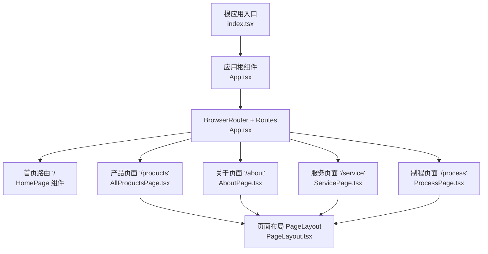
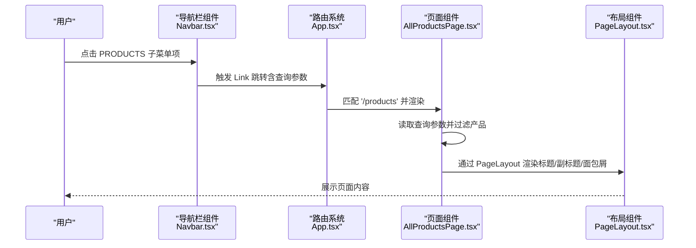
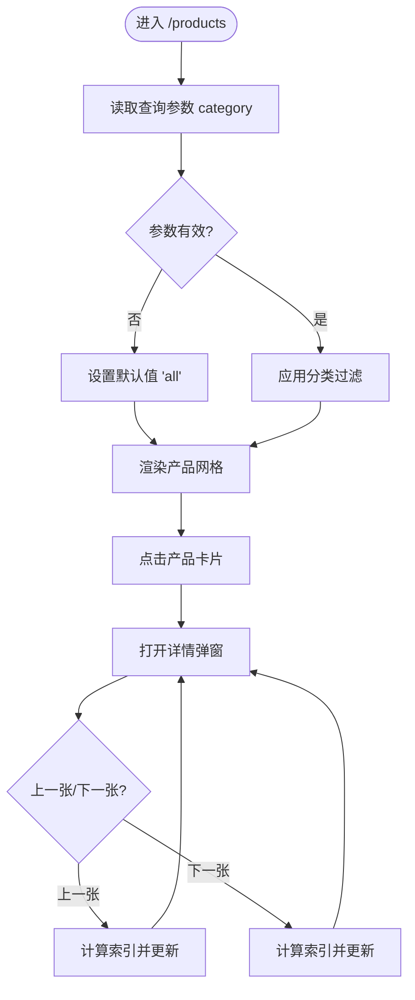
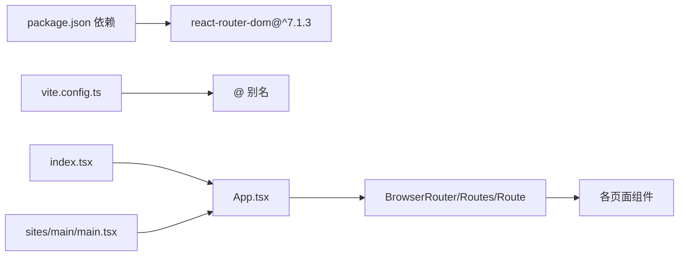

# 路由配置

<cite>
**本文引用的文件**
- [App.tsx](file://App.tsx)
- [index.tsx](file://index.tsx)
- [vite.config.ts](file://vite.config.ts)
- [sites/main/main.tsx](file://sites/main/main.tsx)
- [components/pages/AboutPage.tsx](file://components/pages/AboutPage.tsx)
- [components/pages/ServicePage.tsx](file://components/pages/ServicePage.tsx)
- [components/pages/ProcessPage.tsx](file://components/pages/ProcessPage.tsx)
- [components/pages/AllProductsPage.tsx](file://components/pages/AllProductsPage.tsx)
- [components/shared/PageLayout.tsx](file://components/shared/PageLayout.tsx)
- [components/shared/Breadcrumb.tsx](file://components/shared/Breadcrumb.tsx)
- [components/Navbar.tsx](file://components/Navbar.tsx)
- [constants.tsx](file://constants.tsx)
- [types.ts](file://types.ts)
- [package.json](file://package.json)
</cite>

## 目录
1. [简介](#简介)
2. [项目结构](#项目结构)
3. [核心组件](#核心组件)
4. [架构总览](#架构总览)
5. [详细组件分析](#详细组件分析)
6. [依赖关系分析](#依赖关系分析)
7. [性能考虑](#性能考虑)
8. [故障排查指南](#故障排查指南)
9. [结论](#结论)
10. [附录](#附录)

## 简介
本文件面向威宇精密工程网站的前端路由配置，系统性说明基于 React Router 的路由声明与使用方式，涵盖：
- BrowserRouter 的使用与入口挂载
- 根路径“/”首页路由与静态页面路由（/about、/service、/process、/products）
- 动态路由参数与查询参数传递机制
- 嵌套路由与布局组件的组织方式
- 路由懒加载的可行方案与最佳实践
- 性能优化与常见问题排查建议

## 项目结构
该站点采用单页应用（SPA）架构，使用 Vite 构建工具与 React Router v6 进行路由管理。主应用入口位于根目录，同时存在多站点示例目录（如 sites/main），用于演示不同部署场景或子站点结构。

图表来源
- [App.tsx](file://App.tsx#L56-L70)
- [index.tsx](file://index.tsx#L11-L16)
- [components/pages/AboutPage.tsx](file://components/pages/AboutPage.tsx#L9-L140)
- [components/pages/ServicePage.tsx](file://components/pages/ServicePage.tsx#L78-L178)
- [components/pages/ProcessPage.tsx](file://components/pages/ProcessPage.tsx#L131-L293)
- [components/pages/AllProductsPage.tsx](file://components/pages/AllProductsPage.tsx#L84-L277)
- [components/shared/PageLayout.tsx](file://components/shared/PageLayout.tsx#L16-L39)

章节来源
- [App.tsx](file://App.tsx#L56-L70)
- [index.tsx](file://index.tsx#L11-L16)
- [vite.config.ts](file://vite.config.ts#L1-L24)

## 核心组件
- 应用根组件：负责包裹 Router、注册滚动到顶部副作用、注入全局样式与暗色模式切换按钮。
- 页面组件：各路由对应的具体页面，统一通过 PageLayout 包裹并注入面包屑。
- 导航栏组件：提供主导航链接与移动端菜单，并在 PRODUCTS 子菜单中通过查询参数实现分类筛选。
- 产品页面：使用查询参数进行分类过滤，支持图片画廊与产品详情弹窗导航。

章节来源
- [App.tsx](file://App.tsx#L41-L109)
- [components/shared/PageLayout.tsx](file://components/shared/PageLayout.tsx#L16-L39)
- [components/shared/Breadcrumb.tsx](file://components/shared/Breadcrumb.tsx#L13-L48)
- [components/Navbar.tsx](file://components/Navbar.tsx#L24-L36)

## 架构总览
React Router v6 在本项目中的使用要点：
- 使用 BrowserRouter 作为路由容器，包裹整个应用树。
- 使用 Routes + Route 定义静态路由，每个路由绑定一个页面组件。
- 使用 useLocation 与 useEffect 实现路由变化时的滚动行为控制。
- 使用 useSearchParams 在产品页面中读写查询参数，实现无刷新的分类筛选与状态同步。

图表来源
- [components/Navbar.tsx](file://components/Navbar.tsx#L32-L36)
- [components/Navbar.tsx](file://components/Navbar.tsx#L134-L149)
- [components/pages/AllProductsPage.tsx](file://components/pages/AllProductsPage.tsx#L9-L46)
- [components/shared/PageLayout.tsx](file://components/shared/PageLayout.tsx#L16-L39)

## 详细组件分析

### 根路由与入口挂载
- 入口挂载：index.tsx 中通过 ReactDOM 将 App 渲染到 DOM 根节点。
- 应用容器：App.tsx 使用 BrowserRouter 包裹整个应用，内部包含滚动到顶部副作用、全局样式与暗色模式切换。
- 首页路由：根路径“/”绑定 HomePage 组件，HomePage 内部组合多个业务区块组件。

章节来源
- [index.tsx](file://index.tsx#L11-L16)
- [App.tsx](file://App.tsx#L56-L70)
- [App.tsx](file://App.tsx#L17-L28)

### 静态路由声明
- /about：AboutPage.tsx，使用 PageLayout 注入标题与面包屑。
- /service：ServicePage.tsx，展示服务列表与优势。
- /process：ProcessPage.tsx，展示生产流程与设备能力。
- /products：AllProductsPage.tsx，支持查询参数分类筛选与产品详情弹窗。

章节来源
- [App.tsx](file://App.tsx#L63-L69)
- [components/pages/AboutPage.tsx](file://components/pages/AboutPage.tsx#L9-L140)
- [components/pages/ServicePage.tsx](file://components/pages/ServicePage.tsx#L78-L178)
- [components/pages/ProcessPage.tsx](file://components/pages/ProcessPage.tsx#L131-L293)
- [components/pages/AllProductsPage.tsx](file://components/pages/AllProductsPage.tsx#L84-L277)

### 查询参数与动态路由
- 查询参数读取：AllProductsPage.tsx 使用 useSearchParams 读取并设置 category 参数，实现无刷新筛选。
- 参数类型约束：通过类型别名限定 category 取值范围，确保 URL 参数合法。
- 导航与回退：导航栏 PRODUCTS 子菜单直接拼接查询参数，实现精准跳转；产品详情弹窗支持上一张/下一张导航。

图表来源
- [components/pages/AllProductsPage.tsx](file://components/pages/AllProductsPage.tsx#L9-L46)
- [components/pages/AllProductsPage.tsx](file://components/pages/AllProductsPage.tsx#L48-L82)
- [components/Navbar.tsx](file://components/Navbar.tsx#L32-L36)

章节来源
- [components/pages/AllProductsPage.tsx](file://components/pages/AllProductsPage.tsx#L9-L46)
- [components/pages/AllProductsPage.tsx](file://components/pages/AllProductsPage.tsx#L48-L82)
- [components/Navbar.tsx](file://components/Navbar.tsx#L32-L36)

### 嵌套路由与布局
- 布局组件：PageLayout.tsx 提供统一的标题、副标题与面包屑区域，所有页面共享。
- 面包屑：Breadcrumb.tsx 接收 items 数组，渲染当前页面路径，首页与末级不可点击。
- 导航栏：Navbar.tsx 提供主导航与 PRODUCTS 子菜单，子菜单项通过 Link 携带查询参数实现分类筛选。

章节来源
- [components/shared/PageLayout.tsx](file://components/shared/PageLayout.tsx#L16-L39)
- [components/shared/Breadcrumb.tsx](file://components/shared/Breadcrumb.tsx#L13-L48)
- [components/Navbar.tsx](file://components/Navbar.tsx#L24-L36)

### 路由重定向
- 当前代码未显式声明重定向规则。若需添加，可在 Routes 下新增一个匹配任意路径的兜底路由，并将其 element 设为重定向逻辑（例如使用 useNavigate 或自定义 Redirect 组件）。
- 注意：由于本项目未包含重定向逻辑，此处仅提供概念性说明与实现建议。

### 路由懒加载
- 当前页面组件均为直接导入，未使用 React.lazy 与 Suspense 进行懒加载。
- 懒加载建议：
  - 对大型页面组件（如产品详情页）使用 React.lazy 包裹，并在外层使用 Suspense 提供占位。
  - 结合 React Router v6 的 lazy 配置，按需加载模块，减少首屏体积。
  - 为避免阻塞关键渲染，建议将非首屏访问的页面组件拆分并懒加载。

章节来源
- [package.json](file://package.json#L11-L21)

## 依赖关系分析
- 依赖版本：react-router-dom 版本为 ^7.1.3，对应 React Router v6。
- 构建工具：Vite 配置启用 React 插件与路径别名，开发服务器端口为 3001。
- 入口挂载：index.tsx 与 sites/main/main.tsx 均将 App 作为根组件挂载，后者用于演示多站点部署。

图表来源
- [package.json](file://package.json#L11-L21)
- [vite.config.ts](file://vite.config.ts#L17-L21)
- [index.tsx](file://index.tsx#L11-L16)
- [sites/main/main.tsx](file://sites/main/main.tsx#L5-L9)
- [App.tsx](file://App.tsx#L56-L70)

章节来源
- [package.json](file://package.json#L11-L21)
- [vite.config.ts](file://vite.config.ts#L1-L24)
- [index.tsx](file://index.tsx#L11-L16)
- [sites/main/main.tsx](file://sites/main/main.tsx#L5-L9)

## 性能考虑
- 首屏体积：将大型页面组件懒加载，减少初始包体，提升首屏加载速度。
- 路由切换：保持滚动到顶部的副作用为必要操作，避免不必要的重渲染。
- 图片资源：产品图片在加载失败时提供占位图，减少空白时间。
- 查询参数：使用 useSearchParams 同步 URL 与状态，避免额外请求，提升交互流畅度。
- 路由守卫：如需登录态校验，可在路由层增加受保护页面的前置检查逻辑。

## 故障排查指南
- 路由不生效
  - 检查是否正确包裹 BrowserRouter 与 Routes。
  - 确认路由路径与 Link 的 to 值一致。
- 查询参数无效
  - 确认 AllProductsPage.tsx 中对 useSearchParams 的读取与 setSearchParams 的调用。
  - 检查导航栏 PRODUCTS 子菜单的链接是否包含正确的查询参数。
- 面包屑显示异常
  - 确认 PageLayout 接收的 breadcrumbs 数组格式正确，末级不渲染为链接。
- 滚动行为异常
  - 确认 ScrollToTop 组件在 Router 内部正确挂载，且依赖 location 变化触发滚动。

章节来源
- [App.tsx](file://App.tsx#L30-L39)
- [components/pages/AllProductsPage.tsx](file://components/pages/AllProductsPage.tsx#L9-L46)
- [components/shared/Breadcrumb.tsx](file://components/shared/Breadcrumb.tsx#L13-L48)
- [components/Navbar.tsx](file://components/Navbar.tsx#L32-L36)

## 结论
本项目采用简洁清晰的 React Router v6 路由结构，结合查询参数实现产品分类筛选与无刷新导航。通过 PageLayout 与 Breadcrumb 统一页面布局与导航层级，Navbar 提供直观的主导航与子菜单。建议后续引入懒加载与必要的路由守卫，进一步优化性能与安全性。

## 附录
- 术语说明
  - 静态路由：在编译期确定的固定路径映射。
  - 查询参数：URL 中以“?”开头的键值对集合，用于传递轻量数据。
  - 嵌套路由：在父级布局内渲染子级页面组件，共享布局与面包屑。
  - 懒加载：按需加载模块，减少首屏体积，提升加载性能。