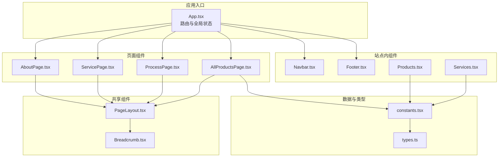
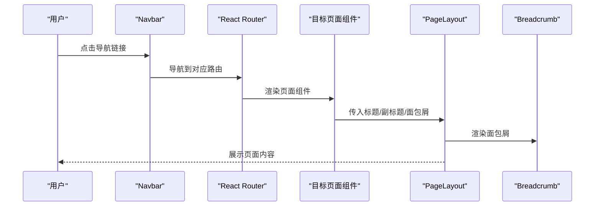
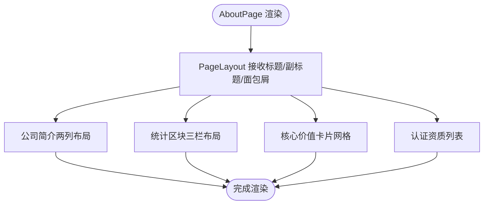
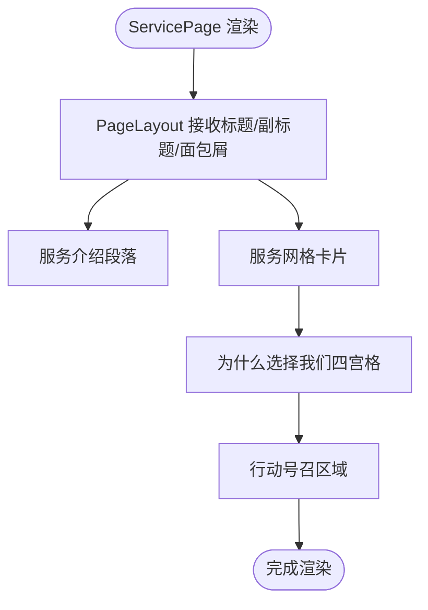
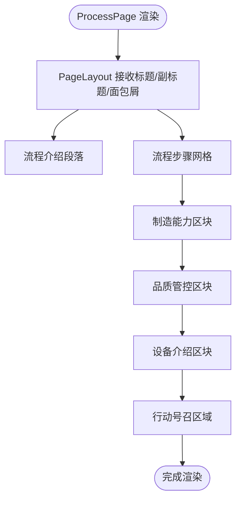
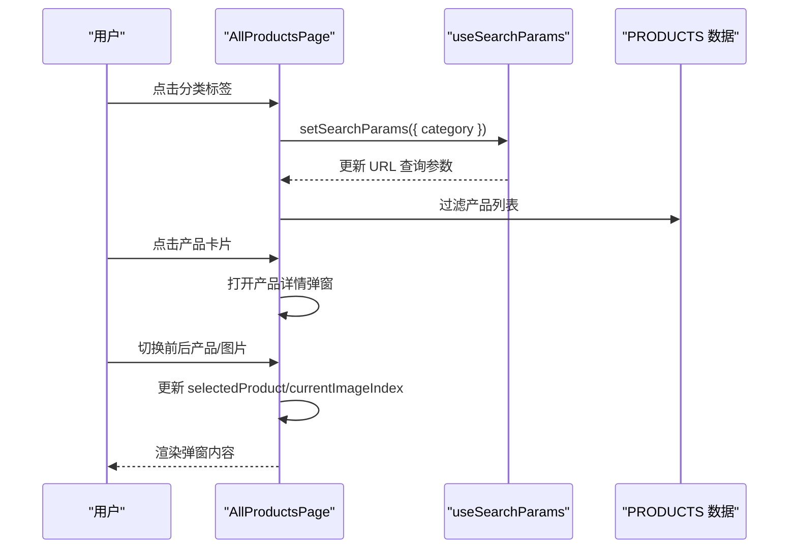
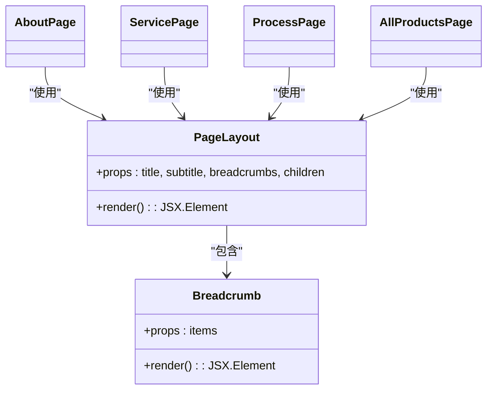
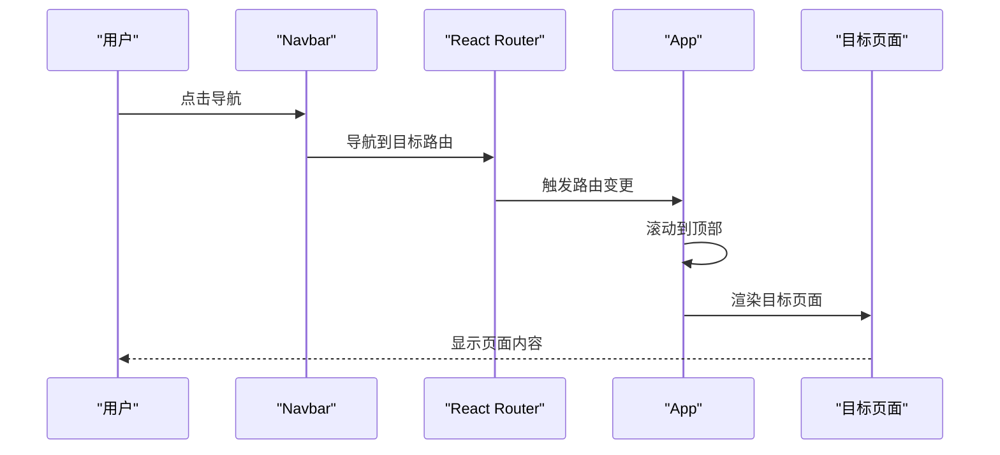
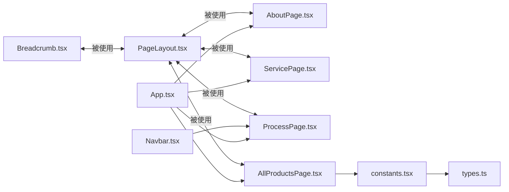

# 页面组件

<cite>
**本文引用的文件列表**
- [App.tsx](file://App.tsx)
- [components/pages/AboutPage.tsx](file://components/pages/AboutPage.tsx)
- [components/pages/ServicePage.tsx](file://components/pages/ServicePage.tsx)
- [components/pages/ProcessPage.tsx](file://components/pages/ProcessPage.tsx)
- [components/pages/AllProductsPage.tsx](file://components/pages/AllProductsPage.tsx)
- [components/shared/PageLayout.tsx](file://components/shared/PageLayout.tsx)
- [components/shared/Breadcrumb.tsx](file://components/shared/Breadcrumb.tsx)
- [components/Navbar.tsx](file://components/Navbar.tsx)
- [components/Footer.tsx](file://components/Footer.tsx)
- [components/Products.tsx](file://components/Products.tsx)
- [components/Services.tsx](file://components/Services.tsx)
- [constants.tsx](file://constants.tsx)
- [types.ts](file://types.ts)
- [package.json](file://package.json)
</cite>

## 目录
1. [简介](#简介)
2. [项目结构](#项目结构)
3. [核心组件](#核心组件)
4. [架构总览](#架构总览)
5. [详细组件分析](#详细组件分析)
6. [依赖关系分析](#依赖关系分析)
7. [性能考量](#性能考量)
8. [故障排查指南](#故障排查指南)
9. [结论](#结论)
10. [附录](#附录)

## 简介
本文件面向威宇精密工程网站的页面组件，系统性梳理 AboutPage、ServicePage、ProcessPage、AllProductsPage 的设计与实现，说明它们如何与共享组件 PageLayout 和 Breadcrumb 组合，页面级状态管理与数据获取方式，页面间导航关系与切换动画效果，以及响应式设计与移动端适配策略，并提供扩展与定制建议。

## 项目结构
页面组件位于 components/pages 下，采用按页面拆分的组织方式；共享组件位于 components/shared 下，提供页面通用布局与面包屑；路由与全局状态由 App.tsx 统一管理；产品与服务数据来自 constants.tsx，类型定义位于 types.ts。

图表来源
- [App.tsx](file://App.tsx#L41-L109)
- [components/pages/AboutPage.tsx](file://components/pages/AboutPage.tsx#L1-L144)
- [components/pages/ServicePage.tsx](file://components/pages/ServicePage.tsx#L1-L182)
- [components/pages/ProcessPage.tsx](file://components/pages/ProcessPage.tsx#L1-L297)
- [components/pages/AllProductsPage.tsx](file://components/pages/AllProductsPage.tsx#L1-L281)
- [components/shared/PageLayout.tsx](file://components/shared/PageLayout.tsx#L1-L41)
- [components/shared/Breadcrumb.tsx](file://components/shared/Breadcrumb.tsx#L1-L51)
- [components/Navbar.tsx](file://components/Navbar.tsx#L1-L260)
- [components/Footer.tsx](file://components/Footer.tsx#L1-L22)
- [components/Products.tsx](file://components/Products.tsx#L1-L310)
- [components/Services.tsx](file://components/Services.tsx#L1-L56)
- [constants.tsx](file://constants.tsx#L1-L167)
- [types.ts](file://types.ts#L1-L30)

章节来源
- [App.tsx](file://App.tsx#L41-L109)
- [components/shared/PageLayout.tsx](file://components/shared/PageLayout.tsx#L1-L41)
- [components/shared/Breadcrumb.tsx](file://components/shared/Breadcrumb.tsx#L1-L51)

## 核心组件
- AboutPage：公司介绍、统计数字、核心价值观、认证资质等模块化内容展示，统一通过 PageLayout 包裹并注入面包屑。
- ServicePage：服务列表网格、优势说明、行动号召区域，强调交互式卡片与过渡动画。
- ProcessPage：生产流程步骤、制造能力、品质管控、设备介绍，采用分步卡片与信息区块布局。
- AllProductsPage：产品分类筛选（URL 查询参数）、产品网格、产品详情弹窗与图片画廊、前后产品切换与缩略图导航。
- PageLayout：页面标题、副标题、面包屑、内容容器与进入动画。
- Breadcrumb：面包屑导航，支持首页与当前页路径高亮。

章节来源
- [components/pages/AboutPage.tsx](file://components/pages/AboutPage.tsx#L4-L141)
- [components/pages/ServicePage.tsx](file://components/pages/ServicePage.tsx#L4-L179)
- [components/pages/ProcessPage.tsx](file://components/pages/ProcessPage.tsx#L4-L294)
- [components/pages/AllProductsPage.tsx](file://components/pages/AllProductsPage.tsx#L9-L278)
- [components/shared/PageLayout.tsx](file://components/shared/PageLayout.tsx#L16-L39)
- [components/shared/Breadcrumb.tsx](file://components/shared/Breadcrumb.tsx#L13-L48)

## 架构总览
页面组件均以函数式组件形式实现，复用 PageLayout 提供一致的标题、副标题与面包屑布局；AllProductsPage 使用 react-router-dom 的 useSearchParams 进行页面级状态管理（分类筛选、模态框打开/关闭、图片索引）；App.tsx 负责路由注册、滚动行为与暗色模式切换；Navbar 提供页面间导航与 PRODUCTS 子菜单联动；Footer 统一版权信息。

图表来源
- [App.tsx](file://App.tsx#L63-L69)
- [components/shared/PageLayout.tsx](file://components/shared/PageLayout.tsx#L16-L39)
- [components/shared/Breadcrumb.tsx](file://components/shared/Breadcrumb.tsx#L13-L48)
- [components/Navbar.tsx](file://components/Navbar.tsx#L24-L36)

## 详细组件分析

### AboutPage 分析
- 设计要点
  - 使用两列布局展示公司简介与工厂照片，右侧带阴影圆角容器。
  - 统计区块采用三栏居中布局，突出“经验年数”“客户项目数”“质量保证”等关键指标。
  - 核心价值与认证资质采用卡片式网格，图标+文案组合，hover 效果增强交互感。
- 数据与状态
  - 面包屑数据在组件内部声明，直接传递给 PageLayout。
  - 无外部状态或数据请求，纯静态内容渲染。
- 响应式与交互
  - 使用 Tailwind 响应式断点控制网格列数与字体大小，移动端紧凑排版。
  - 卡片 hover 放大与阴影变化，提升视觉反馈。
- 可扩展性
  - 可引入图片懒加载、视频嵌入、动态数据源替换静态文本。

图表来源
- [components/pages/AboutPage.tsx](file://components/pages/AboutPage.tsx#L9-L139)
- [components/shared/PageLayout.tsx](file://components/shared/PageLayout.tsx#L16-L39)

章节来源
- [components/pages/AboutPage.tsx](file://components/pages/AboutPage.tsx#L4-L141)
- [components/shared/PageLayout.tsx](file://components/shared/PageLayout.tsx#L16-L39)

### ServicePage 分析
- 设计要点
  - 服务列表采用 2/3 列栅格，卡片包含图标、标题、描述与特性清单，hover 放大与阴影提升交互体验。
  - “为什么选择我们”四宫格强调品牌优势，图标+简短文案。
  - 行动号召区域背景强调，引导至咨询入口。
- 数据与状态
  - 服务数据在组件内部声明，通过映射生成卡片列表。
  - 面包屑数据在组件内部声明，传递给 PageLayout。
- 响应式与交互
  - 栅格随屏幕宽度自适应，移动端紧凑排版。
  - 卡片 hover 动画平滑，过渡时间统一。
- 可扩展性
  - 可接入后端 API 获取服务列表，增加服务详情页路由。

图表来源
- [components/pages/ServicePage.tsx](file://components/pages/ServicePage.tsx#L78-L177)
- [components/shared/PageLayout.tsx](file://components/shared/PageLayout.tsx#L16-L39)

章节来源
- [components/pages/ServicePage.tsx](file://components/pages/ServicePage.tsx#L4-L179)
- [components/shared/PageLayout.tsx](file://components/shared/PageLayout.tsx#L16-L39)

### ProcessPage 分析
- 设计要点
  - 流程步骤采用 2/4 列栅格，每步包含序号、图标、标题、描述与细节列表。
  - 制造能力与品质管控采用区块布局，强调专业性与可靠性。
  - 设备介绍采用图标+条目列表，突出先进设备与自动化。
  - 行动号召区域鼓励进一步沟通。
- 数据与状态
  - 流程与能力数据在组件内部声明，通过映射生成视图。
  - 面包屑数据在组件内部声明，传递给 PageLayout。
- 响应式与交互
  - 栅格随屏幕宽度自适应，移动端紧凑排版。
  - 卡片 hover 动画平滑，过渡时间统一。
- 可扩展性
  - 可接入后端 API 获取流程与设备数据，增加流程视频或3D模型展示。

图表来源
- [components/pages/ProcessPage.tsx](file://components/pages/ProcessPage.tsx#L131-L292)
- [components/shared/PageLayout.tsx](file://components/shared/PageLayout.tsx#L16-L39)

章节来源
- [components/pages/ProcessPage.tsx](file://components/pages/ProcessPage.tsx#L4-L294)
- [components/shared/PageLayout.tsx](file://components/shared/PageLayout.tsx#L16-L39)

### AllProductsPage 分析
- 设计要点
  - 顶部标题与分类标签区，分类标签通过 URL 查询参数同步，支持 all/nameplate/cnc 三种。
  - 产品网格采用 2/3/4 列栅格，点击卡片打开产品详情弹窗。
  - 弹窗包含主图、缩略图画廊、前后产品切换、MOQ/Material/Size/Process/Content 等字段。
- 状态管理
  - 使用 useSearchParams 读取/写入 category 参数，驱动分类过滤。
  - 使用 useState 管理 activeCategory、selectedProduct、currentImageIndex。
  - 通过 navigateProduct/navigateImage 实现产品与图片的循环切换。
- 数据与类型
  - 产品数据来源于 constants.tsx 的 PRODUCTS，类型定义见 types.ts。
- 响应式与交互
  - 栅格随屏幕宽度自适应，移动端紧凑排版。
  - 弹窗遮罩层与缩略图导航，支持键盘与手势操作。
- 可扩展性
  - 可接入后端 API 替换常量数据，增加搜索、排序、收藏等功能。

图表来源
- [components/pages/AllProductsPage.tsx](file://components/pages/AllProductsPage.tsx#L9-L278)
- [constants.tsx](file://constants.tsx#L50-L166)
- [types.ts](file://types.ts#L10-L21)

章节来源
- [components/pages/AllProductsPage.tsx](file://components/pages/AllProductsPage.tsx#L9-L278)
- [components/shared/PageLayout.tsx](file://components/shared/PageLayout.tsx#L16-L39)
- [constants.tsx](file://constants.tsx#L50-L166)
- [types.ts](file://types.ts#L10-L21)

### PageLayout 与 Breadcrumb 组合
- PageLayout 负责：
  - 渲染面包屑导航。
  - 居中标题与副标题。
  - 包裹子组件并应用进入动画。
- Breadcrumb 负责：
  - 首页链接与当前页高亮。
  - 支持可选路径跳转与最后一页纯文本展示。
- 组合方式：
  - 各页面组件仅需传入标题、副标题与面包屑数组，即可获得一致的页面骨架。

图表来源
- [components/shared/PageLayout.tsx](file://components/shared/PageLayout.tsx#L9-L39)
- [components/shared/Breadcrumb.tsx](file://components/shared/Breadcrumb.tsx#L9-L48)
- [components/pages/AboutPage.tsx](file://components/pages/AboutPage.tsx#L9-L14)
- [components/pages/ServicePage.tsx](file://components/pages/ServicePage.tsx#L79-L83)
- [components/pages/ProcessPage.tsx](file://components/pages/ProcessPage.tsx#L132-L136)
- [components/pages/AllProductsPage.tsx](file://components/pages/AllProductsPage.tsx#L85-L89)

章节来源
- [components/shared/PageLayout.tsx](file://components/shared/PageLayout.tsx#L16-L39)
- [components/shared/Breadcrumb.tsx](file://components/shared/Breadcrumb.tsx#L13-L48)

### 页面间导航与切换动画
- 导航关系
  - App.tsx 注册四个页面路由：/、/about、/service、/process、/products。
  - Navbar 提供导航链接，其中 PRODUCTS 具备下拉子菜单，支持按分类跳转。
- 切换动画
  - App.tsx 内置滚动到顶部逻辑，确保每次路由切换时页面回到顶部。
  - PageLayout 对内容容器应用进入动画类，实现淡入上移效果。
  - Navbar 在移动端与桌面端分别提供菜单展开/收起与子菜单悬停/点击行为。
- 暗色模式
  - App.tsx 提供全局暗色模式开关，切换时为根元素添加/移除 dark 类。

图表来源
- [App.tsx](file://App.tsx#L30-L39)
- [App.tsx](file://App.tsx#L57-L108)
- [components/Navbar.tsx](file://components/Navbar.tsx#L24-L36)

章节来源
- [App.tsx](file://App.tsx#L63-L69)
- [components/Navbar.tsx](file://components/Navbar.tsx#L24-L36)

### 响应式设计与移动端适配
- 断点与布局
  - 使用 Tailwind 响应式断点控制标题字号、网格列数、卡片间距与按钮尺寸。
  - 移动端采用单列或两列布局，减少横向滚动与拥挤。
- 交互优化
  - Navbar 在移动端提供抽屉式菜单，支持 PRODUCTS 子菜单折叠/展开。
  - AllProductsPage 的产品网格与弹窗在移动端保持可读性与可用性。
- 图片与占位
  - 图片加载失败时自动回退到占位图，避免空白影响体验。
- 动画与滚动
  - 全局启用平滑滚动与页面进入动画，提升过渡体验。

章节来源
- [components/pages/AboutPage.tsx](file://components/pages/AboutPage.tsx#L18-L41)
- [components/pages/ServicePage.tsx](file://components/pages/ServicePage.tsx#L94-L117)
- [components/pages/ProcessPage.tsx](file://components/pages/ProcessPage.tsx#L149-L176)
- [components/pages/AllProductsPage.tsx](file://components/pages/AllProductsPage.tsx#L117-L148)
- [components/Navbar.tsx](file://components/Navbar.tsx#L168-L254)

## 依赖关系分析
- 组件依赖
  - 页面组件依赖 PageLayout 与 Breadcrumb，形成统一布局。
  - AllProductsPage 依赖 constants.tsx 中的产品数据与 types.ts 中的类型定义。
  - Navbar 依赖路由与 PRODUCTS 子菜单，与 App 路由配合。
- 外部依赖
  - React 19、React Router DOM 7、Vite 6、TypeScript 5。
- 潜在耦合
  - PageLayout 与 Breadcrumb 与具体页面内容解耦，利于扩展。
  - AllProductsPage 的状态管理集中在组件内，便于独立测试与维护。

图表来源
- [components/shared/PageLayout.tsx](file://components/shared/PageLayout.tsx#L1-L41)
- [components/shared/Breadcrumb.tsx](file://components/shared/Breadcrumb.tsx#L1-L51)
- [components/pages/AboutPage.tsx](file://components/pages/AboutPage.tsx#L1-L2)
- [components/pages/ServicePage.tsx](file://components/pages/ServicePage.tsx#L1-L2)
- [components/pages/ProcessPage.tsx](file://components/pages/ProcessPage.tsx#L1-L2)
- [components/pages/AllProductsPage.tsx](file://components/pages/AllProductsPage.tsx#L1-L5)
- [constants.tsx](file://constants.tsx#L1-L167)
- [types.ts](file://types.ts#L1-L30)
- [components/Navbar.tsx](file://components/Navbar.tsx#L1-L260)
- [App.tsx](file://App.tsx#L1-L112)

章节来源
- [package.json](file://package.json#L11-L21)
- [components/pages/AllProductsPage.tsx](file://components/pages/AllProductsPage.tsx#L1-L5)
- [constants.tsx](file://constants.tsx#L1-L167)
- [types.ts](file://types.ts#L1-L30)

## 性能考量
- 图片加载
  - 为图片提供错误回退策略，避免因资源异常导致页面空白。
- 状态更新
  - AllProductsPage 的状态更新集中在组件内部，避免跨层级复杂通信。
- 动画与滚动
  - 全局平滑滚动与页面进入动画提升体验，但需注意在低端设备上的性能表现。
- 路由切换
  - 每次路由切换滚动到顶部，避免历史滚动位置影响新页面阅读。

## 故障排查指南
- 面包屑不显示或路径错误
  - 检查各页面是否正确传入 breadcrumbs 数组，确认标签与路径匹配。
- 产品分类筛选无效
  - 检查 URL 查询参数是否为 all/nameplate/cnc，确保 useSearchParams 正确解析。
- 产品详情弹窗无法关闭
  - 确认点击遮罩层与关闭按钮事件绑定正常，且未阻止冒泡。
- 图片加载失败
  - 检查图片 URL 是否有效，确认错误回调中的占位图逻辑生效。
- 导航菜单异常
  - 检查 Navbar 的鼠标事件与定时器清理逻辑，避免菜单无法关闭。

章节来源
- [components/shared/Breadcrumb.tsx](file://components/shared/Breadcrumb.tsx#L13-L48)
- [components/pages/AllProductsPage.tsx](file://components/pages/AllProductsPage.tsx#L15-L23)
- [components/pages/AllProductsPage.tsx](file://components/pages/AllProductsPage.tsx#L53-L56)
- [components/pages/AllProductsPage.tsx](file://components/pages/AllProductsPage.tsx#L131-L134)
- [components/Navbar.tsx](file://components/Navbar.tsx#L13-L22)

## 结论
上述页面组件通过 PageLayout 与 Breadcrumb 提供一致的布局与导航体验，结合 React Router 的路由机制与状态管理，实现了清晰的页面间导航与流畅的切换动画。AllProductsPage 在页面级状态管理与弹窗交互方面提供了良好的参考实现。整体代码结构清晰、职责分离明确，具备良好的可扩展性与可维护性。

## 附录
- 扩展与定制建议
  - 数据层：将静态数据迁移至后端 API，支持动态内容与多语言。
  - 交互层：为卡片与按钮增加无障碍属性，提升可访问性。
  - 性能层：对图片与弹窗内容进行懒加载与虚拟化处理，优化长列表性能。
  - 主题层：完善暗色模式下的色彩体系与对比度，提供用户偏好持久化。
  - SEO 层：为页面组件增加 meta 标签与结构化数据，提升搜索引擎可见性。