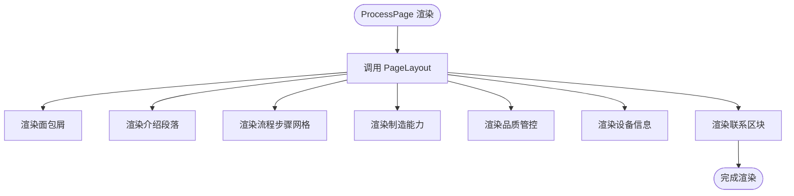

# 页面路由系统

<cite>
**本文档引用的文件**
- [App.tsx](file://App.tsx)
- [index.tsx](file://index.tsx)
- [vite.config.ts](file://vite.config.ts)
- [components/shared/PageLayout.tsx](file://components/shared/PageLayout.tsx)
- [components/shared/Breadcrumb.tsx](file://components/shared/Breadcrumb.tsx)
- [components/pages/AboutPage.tsx](file://components/pages/AboutPage.tsx)
- [components/pages/ServicePage.tsx](file://components/pages/ServicePage.tsx)
- [components/pages/ProcessPage.tsx](file://components/pages/ProcessPage.tsx)
- [components/pages/AllProductsPage.tsx](file://components/pages/AllProductsPage.tsx)
- [components/Navbar.tsx](file://components/Navbar.tsx)
- [constants.tsx](file://constants.tsx)
- [types.ts](file://types.ts)
- [metadata.json](file://metadata.json)
- [package.json](file://package.json)
- [sites/main/vite.config.ts](file://sites/main/vite.config.ts)
- [sites/about/index.html](file://sites/about/index.html)
- [sites/products/index.html](file://sites/products/index.html)
</cite>

## 目录
1. [简介](#简介)
2. [项目结构](#项目结构)
3. [核心组件](#核心组件)
4. [架构总览](#架构总览)
5. [详细组件分析](#详细组件分析)
6. [依赖关系分析](#依赖关系分析)
7. [性能考虑](#性能考虑)
8. [故障排除指南](#故障排除指南)
9. [结论](#结论)
10. [附录](#附录)

## 简介
本文件针对威宇精密工程网站的页面路由系统进行深入解析，涵盖路由配置、页面组件设计与导航逻辑实现。重点说明以下内容：
- React Router 的使用方式与路由声明
- 路由参数传递（如产品分类查询参数）与页面间导航
- 具体页面组件：AboutPage、ServicePage、ProcessPage、AllProductsPage 的实现要点
- 路由守卫、懒加载与代码分割的实现方案建议
- 面包屑导航、页面标题管理与SEO优化策略
- 响应式导航与移动端适配
- 路由错误处理与404页面实现

## 项目结构
该仓库采用多站点单体架构，主站点位于根目录，同时在 sites 目录下提供独立站点配置。路由系统集中在根应用入口中统一管理。

图表来源
- [App.tsx](file://App.tsx#L57-L69)
- [components/shared/PageLayout.tsx](file://components/shared/PageLayout.tsx#L16-L38)
- [components/shared/Breadcrumb.tsx](file://components/shared/Breadcrumb.tsx#L13-L47)
- [components/Navbar.tsx](file://components/Navbar.tsx#L24-L36)

章节来源
- [App.tsx](file://App.tsx#L41-L109)
- [vite.config.ts](file://vite.config.ts#L1-L24)
- [sites/main/vite.config.ts](file://sites/main/vite.config.ts#L1-L25)

## 核心组件
- 应用入口与路由声明：在根应用中集中声明路由，包含首页、关于、服务、制程、产品等路径。
- 页面布局与面包屑：通过 PageLayout 统一标题、副标题与面包屑渲染；Breadcrumb 提供层级导航。
- 导航栏：负责桌面端与移动端的导航交互，支持产品子菜单与查询参数传递。
- 产品数据与类型：常量与类型定义集中于 constants.tsx 与 types.ts，为产品页面提供数据支撑。

章节来源
- [App.tsx](file://App.tsx#L57-L69)
- [components/shared/PageLayout.tsx](file://components/shared/PageLayout.tsx#L16-L38)
- [components/shared/Breadcrumb.tsx](file://components/shared/Breadcrumb.tsx#L13-L47)
- [components/Navbar.tsx](file://components/Navbar.tsx#L24-L36)
- [constants.tsx](file://constants.tsx#L50-L166)
- [types.ts](file://types.ts#L10-L21)

## 架构总览
整体架构围绕 React Router 的 BrowserRouter、Routes 与 Route 组件展开，配合自定义的滚动复位、全局暗色模式切换与页面布局组件，形成统一的导航与内容呈现体系。

图表来源
- [App.tsx](file://App.tsx#L57-L109)
- [components/shared/PageLayout.tsx](file://components/shared/PageLayout.tsx#L16-L38)
- [components/shared/Breadcrumb.tsx](file://components/shared/Breadcrumb.tsx#L13-L47)
- [components/Navbar.tsx](file://components/Navbar.tsx#L38-L256)

## 详细组件分析

### 路由配置与导航逻辑
- 路由声明：在 App.tsx 中使用 BrowserRouter 包裹，Routes 内部声明各路径与对应页面组件。
- 滚动复位：通过自定义 ScrollToTop 组件在 location 变化时自动滚动至顶部。
- 导航栏：Navbar 统一管理导航链接，其中“产品”菜单支持子菜单并通过查询参数传递分类信息。

图表来源
- [App.tsx](file://App.tsx#L31-L39)
- [components/Navbar.tsx](file://components/Navbar.tsx#L86-L113)

章节来源
- [App.tsx](file://App.tsx#L57-L69)
- [components/Navbar.tsx](file://components/Navbar.tsx#L24-L36)

### AboutPage 页面实现
- 页面布局：使用 PageLayout 统一标题、副标题与面包屑渲染。
- 内容结构：包含公司简介、统计数据、核心价值、认证资质等模块。
- 设计风格：采用网格布局与卡片组件，强调视觉层次与可读性。

图表来源
- [components/pages/AboutPage.tsx](file://components/pages/AboutPage.tsx#L9-L140)

章节来源
- [components/pages/AboutPage.tsx](file://components/pages/AboutPage.tsx#L4-L141)

### ServicePage 页面实现
- 页面布局：使用 PageLayout 统一标题、副标题与面包屑渲染。
- 服务展示：以网格形式展示多项服务，包含图标、标题、描述与特性列表。
- CTA 区域：提供联系咨询的行动号召按钮。

图表来源
- [components/pages/ServicePage.tsx](file://components/pages/ServicePage.tsx#L78-L178)

章节来源
- [components/pages/ServicePage.tsx](file://components/pages/ServicePage.tsx#L4-L179)

### ProcessPage 页面实现
- 页面布局：使用 PageLayout 统一标题、副标题与面包屑渲染。
- 流程展示：以步骤卡片形式展示生产流程，每个步骤包含图标、标题、描述与细节列表。
- 能力与质量：展示制造能力、品质管控与设备信息。
- CTA 区域：提供进一步了解的行动号召。

图表来源
- [components/pages/ProcessPage.tsx](file://components/pages/ProcessPage.tsx#L131-L293)

章节来源
- [components/pages/ProcessPage.tsx](file://components/pages/ProcessPage.tsx#L4-L294)

### AllProductsPage 页面实现
- 查询参数与分类过滤：通过 useSearchParams 读取 URL 查询参数，支持 all、nameplate、cnc 三种分类。
- 分类切换：handleCategoryChange 更新 URL 查询参数并刷新筛选结果。
- 产品网格：按分类显示产品卡片，点击打开详情模态框。
- 详情模态框：支持图片画廊、前后产品切换、缩略图导航与产品信息展示。
- 错误处理：图片加载失败时回退到占位图。

图表来源
- [components/pages/AllProductsPage.tsx](file://components/pages/AllProductsPage.tsx#L9-L82)
- [components/pages/AllProductsPage.tsx](file://components/pages/AllProductsPage.tsx#L158-L276)

章节来源
- [components/pages/AllProductsPage.tsx](file://components/pages/AllProductsPage.tsx#L9-L82)
- [components/pages/AllProductsPage.tsx](file://components/pages/AllProductsPage.tsx#L158-L276)
- [constants.tsx](file://constants.tsx#L50-L166)
- [types.ts](file://types.ts#L10-L21)

### 面包屑导航与页面标题管理
- 面包屑：Breadcrumb 组件接收 items 数组，首页始终显示，末级不作为链接。
- 页面标题：PageLayout 接收 title 与 subtitle，用于页面头部展示。
- SEO 策略：站点 HTML 文件中包含基础 meta 信息与 Tailwind 配置，可在页面组件中进一步扩展。

图表来源
- [components/shared/Breadcrumb.tsx](file://components/shared/Breadcrumb.tsx#L13-L47)
- [components/shared/PageLayout.tsx](file://components/shared/PageLayout.tsx#L16-L38)
- [sites/about/index.html](file://sites/about/index.html#L7)
- [sites/products/index.html](file://sites/products/index.html#L7)

章节来源
- [components/shared/Breadcrumb.tsx](file://components/shared/Breadcrumb.tsx#L13-L47)
- [components/shared/PageLayout.tsx](file://components/shared/PageLayout.tsx#L16-L38)
- [sites/about/index.html](file://sites/about/index.html#L7)
- [sites/products/index.html](file://sites/products/index.html#L7)

### 响应式导航与移动端适配
- 桌面端：固定高度与背景，悬停效果与子菜单悬浮展示。
- 移动端：汉堡菜单切换，产品子菜单支持展开/收起与点击跳转。
- 交互细节：使用定时器避免鼠标离开时的闪烁，确保良好的用户体验。

图表来源
- [components/Navbar.tsx](file://components/Navbar.tsx#L38-L256)

章节来源
- [components/Navbar.tsx](file://components/Navbar.tsx#L38-L256)

## 依赖关系分析
- 运行时依赖：React、React DOM、React Router DOM。
- 构建工具：Vite + @vitejs/plugin-react。
- 类型定义：TypeScript。
- 多站点配置：根目录与 sites 目录分别提供不同的 Vite 配置与入口。

图表来源
- [package.json](file://package.json#L11-L21)
- [vite.config.ts](file://vite.config.ts#L1-L24)
- [sites/main/vite.config.ts](file://sites/main/vite.config.ts#L1-L25)

章节来源
- [package.json](file://package.json#L11-L21)
- [vite.config.ts](file://vite.config.ts#L1-L24)
- [sites/main/vite.config.ts](file://sites/main/vite.config.ts#L1-L25)

## 性能考虑
- 滚动行为：全局设置平滑滚动，提升用户体验。
- 动画与过渡：使用 CSS 动画与过渡，避免过度重绘。
- 图片加载：产品图片加载失败时回退到占位图，减少错误影响。
- 代码分割：建议对大型页面组件进行动态导入，结合 React.lazy 与 Suspense 实现按需加载。
- 路由守卫：可通过在导航栏或路由层添加条件判断实现登录/权限控制，必要时在路由层增加拦截逻辑。

## 故障排除指南
- 根元素未找到：检查 index.html 中的挂载节点是否存在且唯一。
- 路由不生效：确认 BrowserRouter 已包裹应用根节点，且 Routes 中路径与组件映射正确。
- 面包屑不显示：检查 PageLayout 的 breadcrumbs 参数是否传入有效数组。
- 产品图片加载失败：确认图片 URL 可访问，或使用错误回退逻辑。
- 移动端菜单无法关闭：检查定时器清理逻辑，确保在组件卸载时清除定时器。

章节来源
- [index.tsx](file://index.tsx#L6-L16)
- [App.tsx](file://App.tsx#L57-L69)
- [components/shared/PageLayout.tsx](file://components/shared/PageLayout.tsx#L16-L38)
- [components/pages/AllProductsPage.tsx](file://components/pages/AllProductsPage.tsx#L131-L133)
- [components/Navbar.tsx](file://components/Navbar.tsx#L13-L22)

## 结论
该路由系统以 React Router 为核心，结合自定义布局与导航组件，实现了清晰的页面组织与良好的用户体验。通过查询参数与分类过滤，AllProductsPage 支持灵活的产品浏览；面包屑与页面标题管理提升了导航与SEO表现。建议后续引入路由守卫、懒加载与代码分割，以进一步增强安全性与性能。

## 附录
- 多站点配置：sites 目录下的独立站点可复用根应用逻辑，便于扩展与维护。
- SEO 元数据：可在页面组件中注入更丰富的 meta 信息，提升搜索引擎可见性。
- 404 页面：可在 Routes 中添加通配符路由，渲染统一的 404 页面组件。