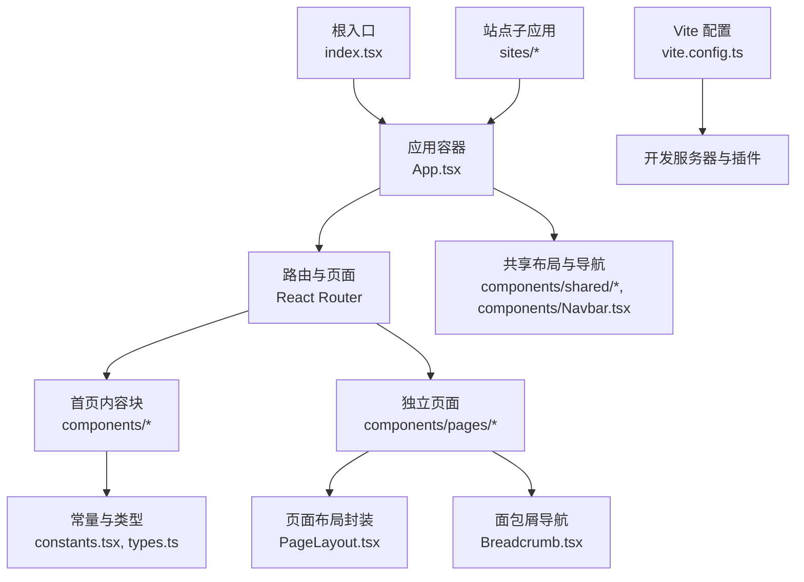
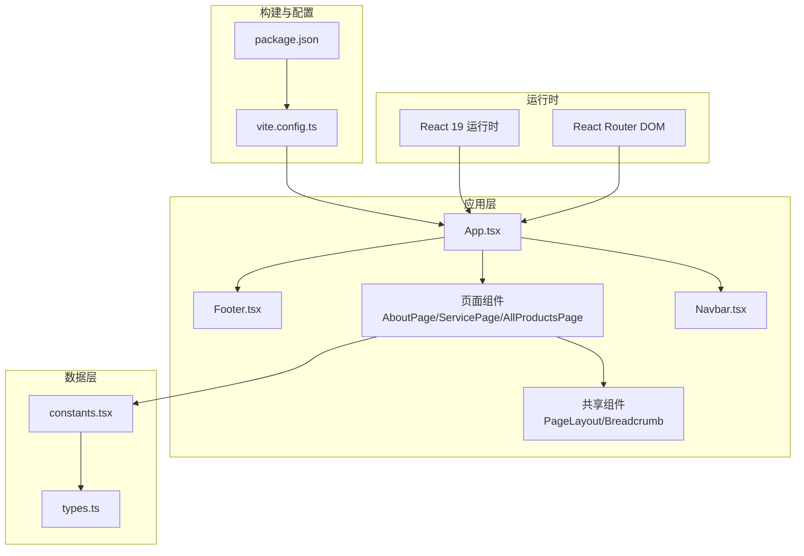
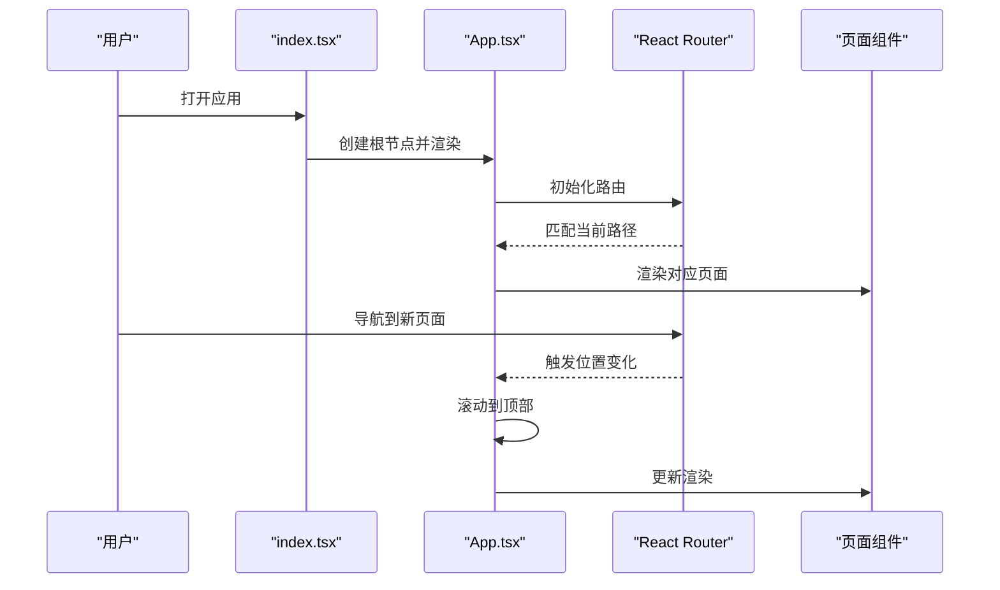
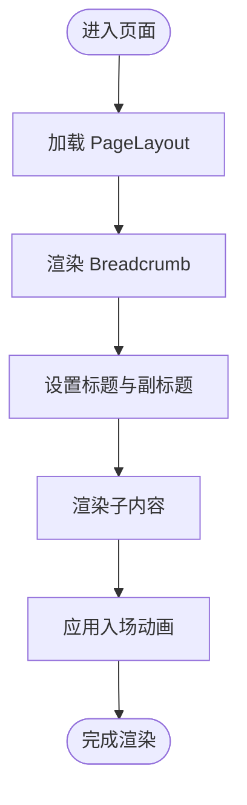
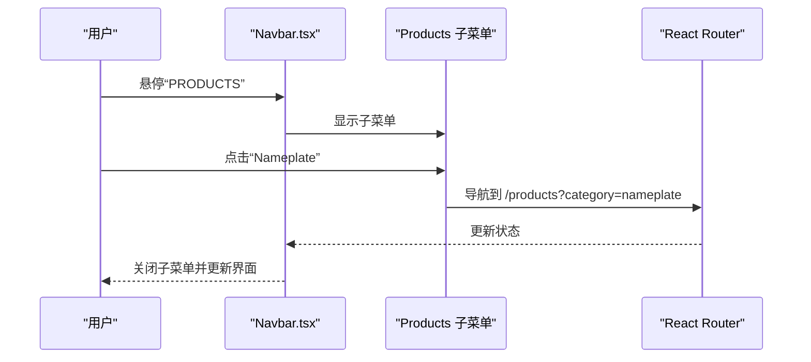
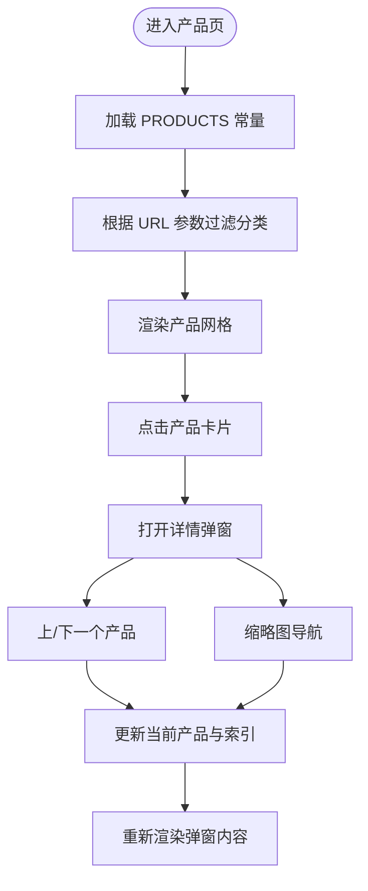
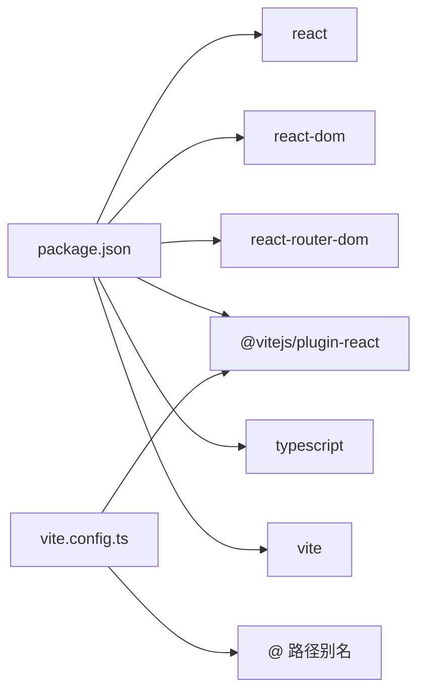

# 项目概述

<cite>
**本文档引用的文件**
- [README.md](file://README.md)
- [package.json](file://package.json)
- [App.tsx](file://App.tsx)
- [index.tsx](file://index.tsx)
- [vite.config.ts](file://vite.config.ts)
- [components/shared/PageLayout.tsx](file://components/shared/PageLayout.tsx)
- [components/shared/Breadcrumb.tsx](file://components/shared/Breadcrumb.tsx)
- [components/pages/AboutPage.tsx](file://components/pages/AboutPage.tsx)
- [components/pages/ServicePage.tsx](file://components/pages/ServicePage.tsx)
- [components/pages/AllProductsPage.tsx](file://components/pages/AllProductsPage.tsx)
- [components/Navbar.tsx](file://components/Navbar.tsx)
- [components/Enquiry.tsx](file://components/Enquiry.tsx)
- [components/Footer.tsx](file://components/Footer.tsx)
- [components/Hero.tsx](file://components/Hero.tsx)
- [components/About.tsx](file://components/About.tsx)
- [components/News.tsx](file://components/News.tsx)
- [components/Products.tsx](file://components/Products.tsx)
- [components/Services.tsx](file://components/Services.tsx)
- [constants.tsx](file://constants.tsx)
- [types.ts](file://types.ts)
- [sites/main/main.tsx](file://sites/main/main.tsx)
- [sites/about/about.tsx](file://sites/about/about.tsx)
</cite>

## 目录
1. [引言](#引言)
2. [项目结构](#项目结构)
3. [核心组件](#核心组件)
4. [架构总览](#架构总览)
5. [详细组件分析](#详细组件分析)
6. [依赖关系分析](#依赖关系分析)
7. [性能考虑](#性能考虑)
8. [故障排除指南](#故障排除指南)
9. [结论](#结论)
10. [附录](#附录)

## 引言
本项目是面向“威宇精密工程”的现代化企业官网，基于 React 19 构建，采用 Vite 作为开发与构建工具，结合 Tailwind CSS 实现响应式设计与深色模式支持。该网站专注于展示精密制造能力与服务，包括公司介绍、服务项目、产品展示（铭板与CNC加工）、新闻动态与客户询盘等模块，旨在通过清晰的信息架构与优秀的交互体验，向潜在客户呈现企业的专业实力与品质承诺。

项目目标：
- 提供直观的企业官网，突出精密制造与工程解决方案的专业形象
- 支持多语言信息（中英双语元素）与国际化布局
- 实现高性能、可维护、可扩展的前端架构
- 通过路由与组件化设计，提升开发效率与用户体验

## 项目结构
项目采用按功能域划分的目录组织方式，核心入口位于根目录，页面组件与共享组件分别置于 components/pages 与 components/shared，站点级子应用位于 sites 目录，常量与类型定义集中在 constants.tsx 与 types.ts。

图表来源
- [index.tsx](file://index.tsx#L1-L17)
- [App.tsx](file://App.tsx#L41-L109)
- [vite.config.ts](file://vite.config.ts#L1-L24)
- [components/shared/PageLayout.tsx](file://components/shared/PageLayout.tsx#L16-L39)
- [components/shared/Breadcrumb.tsx](file://components/shared/Breadcrumb.tsx#L13-L48)
- [components/Navbar.tsx](file://components/Navbar.tsx#L38-L156)
- [constants.tsx](file://constants.tsx#L1-L167)
- [types.ts](file://types.ts#L1-L30)
- [sites/main/main.tsx](file://sites/main/main.tsx#L1-L10)
- [sites/about/about.tsx](file://sites/about/about.tsx#L1-L24)

章节来源
- [package.json](file://package.json#L1-L23)
- [vite.config.ts](file://vite.config.ts#L1-L24)
- [index.tsx](file://index.tsx#L1-L17)
- [App.tsx](file://App.tsx#L41-L109)

## 核心组件
- 应用容器与路由：App.tsx 定义全局状态（深色模式）、滚动行为、路由与页面结构，统一挂载导航、主内容区与页脚。
- 页面布局与导航：PageLayout.tsx 封装标题、副标题、面包屑与动画过渡；Breadcrumb.tsx 提供层级导航；Navbar.tsx 实现响应式导航栏与二级菜单。
- 页面内容：AboutPage.tsx、ServicePage.tsx、AllProductsPage.tsx 分别承载公司介绍、服务展示与产品列表与详情弹窗。
- 常量与类型：constants.tsx 提供新闻、服务与产品数据；types.ts 定义数据结构。
- 子应用：sites/main/main.tsx 与 sites/about/about.tsx 作为独立站点入口，便于部署与维护。

章节来源
- [App.tsx](file://App.tsx#L41-L109)
- [components/shared/PageLayout.tsx](file://components/shared/PageLayout.tsx#L16-L39)
- [components/shared/Breadcrumb.tsx](file://components/shared/Breadcrumb.tsx#L13-L48)
- [components/Navbar.tsx](file://components/Navbar.tsx#L38-L156)
- [components/pages/AboutPage.tsx](file://components/pages/AboutPage.tsx#L4-L141)
- [components/pages/ServicePage.tsx](file://components/pages/ServicePage.tsx#L4-L179)
- [components/pages/AllProductsPage.tsx](file://components/pages/AllProductsPage.tsx#L9-L280)
- [constants.tsx](file://constants.tsx#L1-L167)
- [types.ts](file://types.ts#L1-L30)
- [sites/main/main.tsx](file://sites/main/main.tsx#L1-L10)
- [sites/about/about.tsx](file://sites/about/about.tsx#L1-L24)

## 架构总览
系统采用单页应用（SPA）架构，以 React Router 进行客户端路由分发，App.tsx 作为根组件负责全局状态与主题切换。页面组件通过共享布局与导航组合，形成统一的品牌视觉与交互体验。Vite 提供开发服务器与构建打包能力，支持环境变量注入与路径别名。

图表来源
- [App.tsx](file://App.tsx#L41-L109)
- [components/Navbar.tsx](file://components/Navbar.tsx#L38-L156)
- [components/shared/PageLayout.tsx](file://components/shared/PageLayout.tsx#L16-L39)
- [components/shared/Breadcrumb.tsx](file://components/shared/Breadcrumb.tsx#L13-L48)
- [components/pages/AboutPage.tsx](file://components/pages/AboutPage.tsx#L4-L141)
- [components/pages/ServicePage.tsx](file://components/pages/ServicePage.tsx#L4-L179)
- [components/pages/AllProductsPage.tsx](file://components/pages/AllProductsPage.tsx#L9-L280)
- [constants.tsx](file://constants.tsx#L1-L167)
- [types.ts](file://types.ts#L1-L30)
- [vite.config.ts](file://vite.config.ts#L1-L24)
- [package.json](file://package.json#L1-L23)

## 详细组件分析

### 应用容器与路由（App.tsx）
- 全局状态：深色模式开关，通过类名切换影响主题。
- 路由结构：根路径渲染首页内容块，其他路径映射至独立页面组件。
- 交互增强：滚动到顶部组件确保页面切换时的视觉一致性；全局样式定义平滑滚动与入场动画。
- 挂载点：通过 ReactDOM 在 index.tsx 中挂载至 #root。

图表来源
- [index.tsx](file://index.tsx#L1-L17)
- [App.tsx](file://App.tsx#L30-L39)
- [App.tsx](file://App.tsx#L63-L69)

章节来源
- [App.tsx](file://App.tsx#L41-L109)
- [index.tsx](file://index.tsx#L1-L17)

### 页面布局与导航（PageLayout.tsx 与 Breadcrumb.tsx）
- PageLayout.tsx：提供统一的标题、副标题、面包屑与内容区域动画过渡，适配深色模式。
- Breadcrumb.tsx：根据传入的面包屑数组生成层级导航，首页与当前页样式区分。

图表来源
- [components/shared/PageLayout.tsx](file://components/shared/PageLayout.tsx#L16-L39)
- [components/shared/Breadcrumb.tsx](file://components/shared/Breadcrumb.tsx#L13-L48)

章节来源
- [components/shared/PageLayout.tsx](file://components/shared/PageLayout.tsx#L16-L39)
- [components/shared/Breadcrumb.tsx](file://components/shared/Breadcrumb.tsx#L13-L48)

### 导航栏（Navbar.tsx）
- 功能特性：响应式设计、滚动状态、桌面端悬浮二级菜单、移动端抽屉菜单。
- 交互细节：鼠标悬停显示子菜单、离开延时关闭、移动端展开/收起、点击后自动关闭。
- 产品子菜单：支持按类别筛选（全部、铭板、CNC），并保持与产品页 URL 同步。

图表来源
- [components/Navbar.tsx](file://components/Navbar.tsx#L38-L156)

章节来源
- [components/Navbar.tsx](file://components/Navbar.tsx#L38-L156)

### 公司介绍页（AboutPage.tsx）
- 内容结构：公司简介、统计数据、核心价值观、认证资质等模块化展示。
- 设计风格：图文结合、统计卡片、图标化展示，强调专业与信任感。

章节来源
- [components/pages/AboutPage.tsx](file://components/pages/AboutPage.tsx#L4-L141)

### 服务页（ServicePage.tsx）
- 内容结构：服务介绍、服务网格展示、优势说明与行动号召。
- 展示方式：卡片式布局，图标+特性列表，突出服务的专业性与覆盖面。

章节来源
- [components/pages/ServicePage.tsx](file://components/pages/ServicePage.tsx#L4-L179)

### 产品页（AllProductsPage.tsx）
- 功能特性：分类筛选（全部/铭板/CNC）、产品网格展示、图片画廊、详情弹窗、前后翻页与缩略图导航。
- 数据来源：constants.tsx 的 PRODUCTS 列表，types.ts 的 ProductItem 类型。
- 用户体验：平滑过渡动画、错误占位图回退、键盘友好与无障碍优化建议。

图表来源
- [components/pages/AllProductsPage.tsx](file://components/pages/AllProductsPage.tsx#L9-L83)
- [constants.tsx](file://constants.tsx#L50-L166)
- [types.ts](file://types.ts#L10-L21)

章节来源
- [components/pages/AllProductsPage.tsx](file://components/pages/AllProductsPage.tsx#L9-L280)
- [constants.tsx](file://constants.tsx#L50-L166)
- [types.ts](file://types.ts#L10-L21)

### 常量与类型（constants.tsx 与 types.ts）
- 常量：NEWS_ITEMS（新闻）、SERVICES（服务）、PRODUCTS（产品）三类数据，支撑页面内容渲染。
- 类型：NewsItem、ProductItem、ServiceItem，明确字段与可选属性，便于 TypeScript 推断与校验。

章节来源
- [constants.tsx](file://constants.tsx#L1-L167)
- [types.ts](file://types.ts#L1-L30)

### 子应用入口（sites/main/main.tsx 与 sites/about/about.tsx）
- sites/main/main.tsx：标准应用入口，复用 App.tsx。
- sites/about/about.tsx：精简入口，仅渲染导航、公司内容与页脚，适合特定场景部署。

章节来源
- [sites/main/main.tsx](file://sites/main/main.tsx#L1-L10)
- [sites/about/about.tsx](file://sites/about/about.tsx#L1-L24)

## 依赖关系分析
- 运行时依赖：React 19、React DOM 19、React Router DOM 7。
- 开发依赖：@vitejs/plugin-react、TypeScript、Vite。
- 构建与运行：Vite 提供开发服务器、热更新与打包能力；package.json 定义脚本与版本。

图表来源
- [package.json](file://package.json#L11-L21)
- [vite.config.ts](file://vite.config.ts#L17-L21)

章节来源
- [package.json](file://package.json#L1-L23)
- [vite.config.ts](file://vite.config.ts#L1-L24)

## 性能考虑
- 组件懒加载：对大型页面或图片资源可采用动态导入减少首屏负载。
- 图片优化：使用现代格式与合适的尺寸，提供占位图回退策略。
- 路由预取：对高频访问页面进行预取，降低首次切换延迟。
- 样式与动画：合理使用 CSS 动画与过渡，避免过度重排与重绘。
- 构建优化：启用压缩与 Tree Shaking，拆分第三方库与业务代码。

## 故障排除指南
- 根节点未找到：检查 index.tsx 中的 #root 是否存在且唯一。
- 路由不生效：确认 App.tsx 中路由配置与页面组件导出是否正确。
- 深色模式无效：检查 App.tsx 中类名切换逻辑与全局样式是否加载。
- 图片加载失败：查看 AllProductsPage.tsx 中的错误回退逻辑与占位图链接。
- 子应用入口异常：确认 sites/* 下入口文件与 App.tsx 的挂载关系。

章节来源
- [index.tsx](file://index.tsx#L6-L9)
- [App.tsx](file://App.tsx#L42-L54)
- [components/pages/AllProductsPage.tsx](file://components/pages/AllProductsPage.tsx#L129-L134)

## 结论
本项目以 React 19 为核心，结合 Vite 与 Tailwind CSS，构建了面向精密制造行业的现代化企业官网。通过模块化的页面组件、统一的布局与导航体系，以及清晰的数据模型与类型约束，实现了良好的可维护性与扩展性。未来可在性能优化、SEO 增强与国际化方面进一步完善，以更好地服务于全球客户。

## 附录
- 术语说明：深色模式、面包屑导航、产品弹窗、分类筛选、路由守卫（可选）。
- 常见用例示例：在产品页按类别筛选、在导航栏切换深色模式、在产品详情中切换图片与前后产品、在服务页跳转至询盘区域。